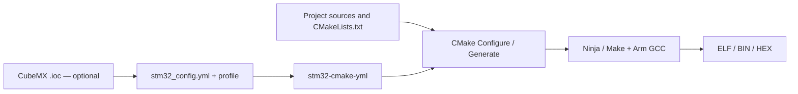

# stm32-cmake-yml

[Русский](README.md) · **English** · [Documentation](docs/en/index.md) · [Getting started](docs/en/getting-started.md)

**Describe your STM32 project in YAML while keeping the flexibility of CMake.**
`stm32-cmake-yml` is a set of CMake scripts that reads `stm32_config.yml` and
configures the MCU, sources, drivers, libraries, flags and output artifacts.
The main backend uses [stm32-cmake](https://github.com/ObKo/stm32-cmake).
A separate Arduino Core STM32 backend uses CMake wrappers supplied by your project.

`Builds (Checks)` shows built configurations and QEMU/Renode execution checks from
the last successful Firmware CI run on main. [Reading the counter](docs/en/status.md) ·
[Test scope and procedure](docs/en/firmware-testing.md).
Markdown-only changes run the fast Docs check without rebuilding firmware.

## Why use it?

In a conventional CMake project, MCU settings, driver discovery and component
integration are expressed through commands and conditions often repeated across
projects. This framework collects common build logic in reusable scripts and
exposes its settings through YAML. You can review the firmware's components,
compare board revisions and switch profiles without copying the entire build setup.

Read selected settings from a CubeMX `.ioc` file or specify them manually.
Profiles override selected settings, such as the MCU, definitions or linker script;
they can also represent different configurations of the same board.

YAML **does not replace the entire build system**. Your root `CMakeLists.txt`
includes the framework, and included `CMakeLists.txt` files remain yours to edit.
Use them to add sources, create libraries and targets, declare dependencies or
add custom commands. A directory listed in `sources` needs its own `CMakeLists.txt`;
files are not automatically collected recursively.

## Where it fits

- **Prototypes and learning:** start from an example and select your MCU and components.
- **CubeMX and CMSIS/HAL/LL projects:** use generated code while explicitly controlling what gets built.
- **Multiple configurations:** share sources across board revisions or feature profiles.
- **Arduino Core STM32:** connect Core, variant and libraries through project-owned CMake wrappers.
- **Bare metal:** disable CMSIS and HAL/LL and supply startup code, vectors, required flags and memory layout yourself. With CMSIS enabled, stm32-cmake handles part of that setup.

## Getting started

You need **CMake 3.19+**, **Arm GCC**, **Mike Farah yq v4**, and a build generator
(Ninja or Make). Python is needed for CRC calculation; select drivers and libraries
for your project. VS Code with CMake Tools is convenient but optional.

1. Choose a [demo project](https://github.com/ViacheslavMezentsev/demo-stm32-cmake) or [connect the framework](docs/en/getting-started.md) to your own.
2. Describe sources, MCU/IOC and components in `stm32_config.yml`; add profiles as needed.
3. Configure, then build. Run Configure again after YAML changes; see [development](docs/en/development.md) for cache behavior.

## Boundaries

YAML covers the supported options; arbitrary build logic stays in CMake.
Reading `.ioc` does not run CubeMX or generate peripheral initialization code.
MCU support depends on the backend, toolchain and libraries. Successful
configuration alone does not establish that firmware works on a board.

In 0.9.2, avoid `_` in profile names: flattening the YAML tree into CMake variable
names introduces ambiguity. Overrides and cached values also have defined
precedence. Check [semantics](docs/en/reference/0.9.2/semantics.md) and
[errata](docs/en/errata/index.md) before adapting an unusual configuration.
[Test status](docs/en/status.md) distinguishes configuration, building and simulation.

## Documentation and skills

[Documentation map](docs/en/index.md) · [Scenarios](docs/en/scenarios.md) ·
[Reference 0.9.2](docs/en/reference/0.9.2/index.md) · [Manual (Russian)](docs/user_manual.md) ·
[Troubleshooting](docs/en/troubleshooting.md) · [Roadmap](TODO.md)

The `skills/` directory contains instructions for AI agents. Provide a skill to
your assistant through the mechanism your tool supports; skills are not required to build.

| Skill | Purpose |
| --- | --- |
| [stm32-config-manager](skills/stm32-config-manager/SKILL.md) | Configure YAML, profiles and options using the reference and errata. |
| [stm32-simple-sources](skills/stm32-simple-sources/SKILL.md) | Add C/C++/ASM files and directories to the main target, including CubeMX Core. |
| [stm32-module-creator](skills/stm32-module-creator/SKILL.md) | Create separate libraries with explicit dependencies and flags. |
| [stm32-build-helper](skills/stm32-build-helper/SKILL.md) | Diagnose failures by phase: Configure, Compile, Link, Post-build and Run. |

## Related projects by the same author

- [demo-stm32-cmake](https://github.com/ViacheslavMezentsev/demo-stm32-cmake) — examples for several STM32 families, YAML configurations and VS Code settings.
- [stm32-flasher](https://github.com/ViacheslavMezentsev/stm32-flasher) — Windows STM32 flashing through ST-Link/J-Link, with backend selection and result reports.
- [stm32-gdbtest](https://github.com/ViacheslavMezentsev/stm32-gdbtest) — reusable testing infrastructure for firmware on real STM32 hardware through GDB-Python and SWD; test scenarios run on the host PC.
- [stm32-hwtest-blackpill](https://github.com/ViacheslavMezentsev/stm32-hwtest-blackpill) — firmware, hardware test setups and stm32-gdbtest scenarios for BlackPill, BluePill and other boards.

[Changelog](CHANGELOG.md) · [MIT License](LICENSE)
