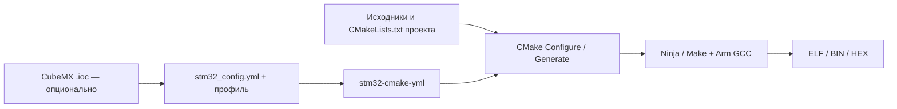

# stm32-cmake-yml

**Русский** · [English](README.en.md) · [Документация](docs/ru/index.md) · [Начало работы](docs/ru/getting-started.md)

**Опишите состав STM32-проекта в YAML, сохранив свободу CMake.**
`stm32-cmake-yml` — набор CMake-скриптов, который читает `stm32_config.yml`
и настраивает сборку: MCU, исходники, драйверы, библиотеки, флаги и артефакты.
Основной backend опирается на [stm32-cmake](https://github.com/ObKo/stm32-cmake);
для Arduino Core STM32 предусмотрен отдельный backend с CMake-обёртками проекта.

`Builds (Checks)` — число собранных конфигураций и проверок их исполнения в QEMU/Renode
из последнего успешного Firmware CI на main. [Как читать счётчик](docs/ru/status.md) ·
[Что и как проверяется](docs/ru/firmware-testing.md).
При изменении только Markdown CI запускает быструю проверку Docs, без сборки прошивок.

## Зачем это нужно

В обычном CMake-проекте настройки MCU, поиск драйверов и подключение компонентов
описываются командами и условиями, которые часто повторяются между проектами.
Здесь типовые решения уже собраны в скриптах, а их параметры вынесены в YAML.
Проще увидеть состав прошивки, сравнить ревизии платы и переключить профиль,
не копируя всю логику сборки.

Можно взять часть настроек из CubeMX `.ioc` или задать их вручную. Профили
меняют выбранные параметры — например MCU, определения или скрипт линкера —
и подходят также для разных вариантов одной и той же платы.

YAML **не подменяет всю систему сборки**. Корневой `CMakeLists.txt` подключает
фреймворк; включаемые `CMakeLists.txt` остаются вашим кодом. В них можно добавлять
исходники, создавать библиотеки и цели, задавать зависимости и дополнительные
команды. Для папок в `sources` нужен собственный `CMakeLists.txt`; автоматического
рекурсивного включения всех файлов нет.

## Где применять

- **Прототипы и учебные проекты:** начать с готового примера, выбрать MCU и нужные компоненты.
- **Проекты с CubeMX и CMSIS/HAL/LL:** использовать сгенерированный код и явно управлять составом сборки.
- **Несколько конфигураций:** общие исходники, профили ревизий платы или наборов функций.
- **Arduino Core STM32:** подключать Core, variant и библиотеки через CMake-обёртки своего проекта.
- **Bare metal:** отключить CMSIS и HAL/LL и самостоятельно предоставить startup, таблицу векторов, нужные флаги и разметку памяти. При включённом CMSIS часть этой работы выполняет stm32-cmake.

## С чего начать

Нужны **CMake 3.19+**, **Arm GCC**, **Mike Farah yq v4** и генератор сборки
(Ninja или Make). Python нужен для расчёта CRC; драйверы и библиотеки выбираются
под проект. VS Code с CMake Tools удобен, но не обязателен.

1. Выберите близкий [демо-проект](https://github.com/ViacheslavMezentsev/demo-stm32-cmake) или [подключите фреймворк](docs/ru/getting-started.md) к своему.
2. Опишите исходники, MCU/IOC и компоненты в `stm32_config.yml`; при необходимости добавьте профили.
3. Выполните Configure, затем сборку. После изменения YAML повторите Configure; особенности кэша описаны в [режимах разработки](docs/ru/development.md).

## Границы подхода

YAML описывает поддерживаемые опции, а произвольная логика остаётся в CMake.
Чтение `.ioc` не запускает CubeMX и не генерирует код инициализации периферии.
Поддержка MCU зависит от backend, toolchain и библиотек; успешная конфигурация
не гарантирует работу прошивки на плате.

В версии 0.9.2 не используйте `_` в именах профилей: дерево YAML преобразуется
в плоские имена CMake, что создаёт неоднозначность. Переопределения и кэш имеют
свой порядок применения. Перед переносом нетиповой конфигурации загляните
в [семантику](docs/ru/reference/0.9.2/semantics.md) и [errata](docs/ru/errata/index.md).
[Статус проверок](docs/ru/status.md) отдельно описывает Configure, сборку и симуляцию.

## Документация и навыки

[Карта документации](docs/ru/index.md) · [Сценарии](docs/ru/scenarios.md) ·
[Справочник 0.9.2](docs/ru/reference/0.9.2/index.md) · [Руководство](docs/user_manual.md) ·
[Диагностика](docs/ru/troubleshooting.md) · [Дорожная карта](TODO.md)

В `skills/` находятся инструкции для ИИ-агентов. Их можно передать ассистенту
способом, поддерживаемым вашим инструментом; они не нужны для обычной сборки.

| Навык | Для чего |
| --- | --- |
| [stm32-config-manager](skills/stm32-config-manager/SKILL.md) | Настройка YAML, профилей и опций с учётом reference и errata. |
| [stm32-simple-sources](skills/stm32-simple-sources/SKILL.md) | Подключение C/C++/ASM-файлов и папок к основной цели, в том числе CubeMX Core. |
| [stm32-module-creator](skills/stm32-module-creator/SKILL.md) | Создание отдельных библиотек с явными зависимостями и флагами. |
| [stm32-build-helper](skills/stm32-build-helper/SKILL.md) | Разбор ошибок по стадиям: Configure, Compile, Link, Post-build и Run. |

## Дружественные проекты автора

- [demo-stm32-cmake](https://github.com/ViacheslavMezentsev/demo-stm32-cmake) — примеры для разных семейств STM32, YAML-конфигурации и настройки VS Code.
- [stm32-flasher](https://github.com/ViacheslavMezentsev/stm32-flasher) — прошивка STM32 в Windows через ST-Link/J-Link с выбором backend и отчётом о результате.
- [stm32-gdbtest](https://github.com/ViacheslavMezentsev/stm32-gdbtest) — подключаемый модуль проверки работающей прошивки на реальном STM32 через GDB-Python и SWD; тестовые сценарии выполняются на ПК.
- [stm32-hwtest-blackpill](https://github.com/ViacheslavMezentsev/stm32-hwtest-blackpill) — прошивки, аппаратный стенд и сценарии применения stm32-gdbtest на BlackPill, BluePill и других платах.

[История изменений](CHANGELOG.md) · [MIT License](LICENSE)
