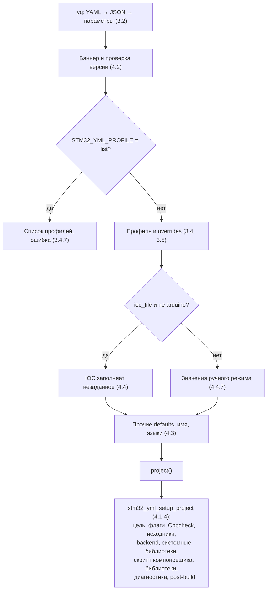

# ТЕХНИЧЕСКОЕ ЗАДАНИЕ

## Фреймворк сборки STM32-проектов по YAML-описанию stm32-cmake-yml (CMake)

| Реквизит | Значение |
| :--- | :--- |
| **Документ** | TECHNICAL_SPECIFICATION.md |
| **Ревизия** | 1.1 (черновик для согласования) |
| **Дата формирования** | 26.09.2026 |
| **Метод формирования** | Обратная разработка по исходным файлам версии 0.9.2 (коммит `f8ef5200fc7a4a96d6f3fe9111afb8f8825474b0` от 19.09.2026: `stm32_yml.cmake`, `cmake/`, `scripts/`) с приведением к целевой версии 0.9.3 по решениям заказчика. Справочник, errata, тесты и CI (`main` @ `7246a2c`) — вспомогательные источники, созданные позже версии 0.9.2 |
| **Целевая версия** | 0.9.3 (выпуск с небольшими исправлениями; проверка в CI GitHub и GitLab) |
| **Целевая платформа** | CMake ≥ 3.19 (проверяются 3.19.8 и 3.28.3), Arm GCC (проверяются xPack 13.3.1-1.1, 14.2.1-1.1, 15.2.1-1.1), Ninja/Make, Mike Farah yq v4 (проверяется 4.44.3), Python 3 (для CRC), backend stm32-cmake (ObKo) или Arduino Core STM32 (проверяется 2.12.0); хост — Linux и Windows; CI — GitHub Actions, GitLab CI |
| **Связанные документы** | README.md; `docs/ru/reference/0.9.2/*` (справочник опций `CFG-*`); `docs/ru/reference/0.9.2/semantics.md`; `docs/ru/errata/*`; `docs/ru/testing.md`; `docs/ru/firmware-testing.md`; `docs/ru/firmware-plan.md`; CHANGELOG.md; TODO.md |
| **Связанные файлы кода** | `stm32_yml.cmake`, `cmake/stm32_yml_*.cmake` (10 модулей), `scripts/stm32_crc.py` |

### История ревизий

| Ревизия | Дата | Описание |
| :---: | :---: | :--- |
| 1.0 | 26.09.2026 | Первая редакция. Требования восстановлены по исходному коду 0.9.2 (`main` @ `7246a2c`), справочнику и errata; описаны уровни тестирования и привязка существующих тестов к требованиям. Сформированы открытые вопросы по неоднозначному поведению. |
| 1.1 | 26.09.2026 | Учтены ответы заказчика на вопросы 10.2.1–10.2.15. Базой признаны исходные файлы версии 0.9.2 (`f8ef520`), целью документа — версия 0.9.3. Введены: правило перечислимых значений с предупреждением, зависимость Configure от YAML/IOC/файла профилей, чтение из внешнего файла только `profiles:`, значения ручного режима для неполного IOC, проверка формата размеров памяти во всех режимах, принудительный `STM32_HW_DEFAULT`, провал сборки при сбое CRC, применение ключей только из профиля без обходов, рекомендация очистки кэша для 0.9.2, критерии приёмки для GitHub и GitLab. Закрыты вопросы 10.2.1–10.2.7, 10.2.10–10.2.15; 10.2.8, 10.2.9 оставлены на изучение до выпуска 0.9.3; добавлены 10.2.16, 10.2.17. |

### Изменения ревизии 1.1

Обозначения: **нов.** — новое требование, **изм.** — изменённый текст при сохранении номера, **искл.** — исключённое требование. Изменённые и новые пункты в тексте помечены `(р.1.1)`.

| Пункты | Тип | Суть |
| :--- | :---: | :--- |
| Реквизиты, 1.3.1, 1.3.2, 1.3.4, 1.6.3 | изм./нов. | База — исходные файлы 0.9.2 (`f8ef520`); цель — 0.9.3; смысл маркеров |
| 2.1.3 | изм. | Рабочий цикл с очисткой кэша для 0.9.2 |
| 3.2.7, 3.4.7–3.4.9, 3.6.3, 3.6.5 | изм. | Неизвестные ключи; внешний файл профилей; ключи только из профиля; повторный Configure; зависимости Configure |
| 3.4.11, 3.6.6 | нов. | Комбинация встроенных и внешних профилей; рекомендация очистки кэша для 0.9.2 |
| 3.7 | нов. | Перечислимые значения: предупреждение и фактическое значение |
| 4.2.3, 4.4.6, 4.8.3, 4.8.6, 4.9.4, 4.10.2, 4.11.4 | изм. | Версия конфигурации — рекомендуемая; неполный IOC; перечисления; external FreeRTOS и обёртка Arduino — на изучение; формат размеров |
| 4.1.6, 4.6.7, 4.11.8 | нов. | `toolchain_backend` по умолчанию; пустой `sources` допустим; проверка размеров при любом скрипте |
| 4.14.2, 4.15.6, 4.15.7, 4.16.1, 4.16.2 | изм. | Неизвестные артефакты и `crc_algorithm` — предупреждение; сбой CRC — провал сборки |
| 4.15.8 | нов. | Ограничение CRC для семейства H5 |
| 7.7, 7.8 | нов. | Обратная совместимость формата YAML; значения перечислений новых версий |
| 8.1.1, 8.5.2, 8.6.1 | изм. | L6 вне приёмки; CI GitHub или GitLab; критерии приёмки |
| 8.5.6 | нов. | Эквивалентность проверок в GitHub Actions и GitLab CI |
| 8.7 | изм./нов. | TC-06, TC-27, TC-38, TC-42, TC-43 изменены; TC-46 … TC-53 |
| 9, 10 | изм. | Матрица; вопросы закрыты, 10.2.8 и 10.2.9 открыты, добавлены 10.2.16, 10.2.17 |
| Приложения A, B, E | изм. | Значения по умолчанию, константы; приложение E — перечень доработок для 0.9.3 |

---

## Содержание

1. Введение
2. Общее описание
3. Модель конфигурации
4. Функциональные требования: жизненный цикл и API
5. Требования к интерфейсам
6. Нефункциональные требования
7. Совместимость и эволюция
8. Верификация
9. Матрица прослеживаемости
10. Допущения и открытые вопросы
- Приложение A. Сводка YAML-опций и условных значений по умолчанию
- Приложение B. Сводка констант
- Приложение C. Порядок обработки конфигурации (информативно)
- Приложение D. Соглашение о ссылках на ТЗ из кода и тестов
- Приложение E. Доработки для версии 0.9.3, известные отклонения и расхождения документации с кодом
- Приложение F. Тестовое окружение и уровни проверок (информативно)

---

## 1. Введение

### 1.1. Назначение документа

1.1.1. Документ определяет требования к фреймворку stm32-cmake-yml: набору CMake-скриптов, который читает YAML-описание STM32-проекта и настраивает по нему цель сборки CMake — MCU, исходники, драйверы, библиотеки, флаги, скрипт компоновщика и артефакты.

1.1.2. Документ является основой для реализации, тестирования и приёмки: каждое требование имеет уникальный номер, на который ссылаются комментарии в коде, тестовые сценарии и матрица прослеживаемости (раздел 9). Документ устраняет неоднозначность ожидаемого поведения при тестировании: если поведение не описано здесь или в справочнике, оно не является частью контракта.

### 1.2. Область применения

1.2.1. Требования применимы к публичным точкам входа фреймворка (`stm32_yml.cmake`), его модулям `cmake/stm32_yml_*.cmake`, скрипту `scripts/stm32_crc.py` и к набору проверок в `tests/` и `ci/`.

1.2.2. Документ задаёт требования на уровне системы и групп опций. Точная семантика каждой YAML-опции (тип, значение по умолчанию, особые значения) определяется карточками справочника 0.9.2 с постоянными идентификаторами `CFG-*`; ТЗ ссылается на них и не дублирует их текст. При расхождении ТЗ и карточки действует правило п. 1.3.3.

1.2.3. Вне области документа: реализация stm32-cmake, Arduino Core STM32, STM32Cube, toolchain-файлы, пользовательские CMake-обёртки Arduino, генерация кода CubeMX, корректность прошивки на плате.

### 1.3. Метод формирования

1.3.1. Исходной считается версия 0.9.2 — файлы фреймворка в коммите `f8ef520` («обновлено до версии 0.9.2»). Документация, справочник, errata и тесты созданы позже; тесты частично предполагают разумное ожидаемое поведение, поэтому используются как вспомогательный источник, а не как эталон. Документ задаёт требования к версии 0.9.3: поведение 0.9.2, которое сохраняется, и согласованные изменения. `(р.1.1)`

1.3.2. Требование, выполняемое в 0.9.2, имеет маркер `[R]`. Требование к изменению поведения в 0.9.3 имеет маркер `[U]` или `[N]` и пометку ⚠ в матрице; доработка и её состояние перечислены в приложении E. Где ожидаемое поведение не установлено, сформулирован открытый вопрос (раздел 10). `(р.1.1)`

1.3.3. В случае расхождения между этим документом, справочником и кодом расхождение считается дефектом одного из них и разрешается пересмотром ревизии документа и, при необходимости, записью errata.

1.3.4. Ревизия 1.1 опирается на ответы заказчика на вопросы 10.2.1–10.2.15 ревизии 1.0 (раздел 10). `(р.1.1)`

### 1.4. Термины и сокращения

| Термин | Определение |
| :--- | :--- |
| Фреймворк | stm32-cmake-yml: `stm32_yml.cmake` и модули `cmake/stm32_yml_*.cmake`. |
| Проект-потребитель | CMake-проект прошивки, подключающий фреймворк (обычно как git-сабмодуль). |
| Конфигурация | Файл YAML (по умолчанию `stm32_config.yml`) с параметрами проекта. |
| Параметр | Переменная CMake, полученная из ключа конфигурации (с учётом уплощения, п. 3.2.2). |
| Эффективное значение | Значение параметра после применения всех источников по приоритету (п. 3.1.2). |
| IOC | Файл проекта STM32CubeMX (`.ioc`), из которого читаются отдельные параметры. |
| Профиль | Именованный набор параметров в секции `profiles:` или во внешнем файле профилей. |
| Override | Cache-переменная `STM32_YML_OVERRIDE_<param>`, задающая скалярное значение параметра поверх профиля. |
| Backend | Способ подключения платформенных компонентов: `stm32-cmake` (CMSIS, HAL/LL, FreeRTOS из STM32Cube) или `arduino` (Arduino Core STM32 через обёртки проекта). |
| Bare metal | Режим stm32-cmake backend с `use_cmsis: false` и `use_hal: false`: startup, векторы и разметку памяти предоставляет пользователь. |
| Шаблон `.ld.in` | Шаблон скрипта компоновщика с подстановками `@HEAP_SIZE@`, `@STACK_SIZE@`, `@USE_READONLY@`. |
| Configure / Generate | Стадии CMake: исполнение скриптов и формирование файлов генератора. |
| Build / Post-build | Компиляция и компоновка; команды после компоновки (bin, hex, lss, CRC). |
| Сценарий | Конфигурационный тест из `tests/cases.json` (имя `configure.<name>`). |
| Пара инструментов | Сочетание версии GCC и версии CMake из `ci/dependencies.lock.json`. |
| `CFG-*` | Постоянный идентификатор карточки опции в справочнике 0.9.2. |
| `E00N` | Постоянный идентификатор записи errata. |

### 1.5. Связанные документы и нормативные ссылки

1.5.1. Справочник опций 0.9.2 (`docs/ru/reference/0.9.2/`), включая страницу семантики (`semantics.md`) и машиночитаемый индекс `docs/reference-index.json`.

1.5.2. Errata 0.9.2 (`docs/ru/errata/`), записи E001–E008.

1.5.3. stm32-cmake (ObKo): toolchain-файл `stm32_gcc.cmake`, пакеты CMSIS, HAL, FreeRTOS; закреплённая ревизия — в `ci/dependencies.lock.json`.

1.5.4. Mike Farah yq v4 — преобразование YAML в JSON.

1.5.5. Алгоритм CRC-32 аппаратного блока STM32 в конфигурации по умолчанию при вводе слов (п. 4.15.3).

### 1.6. Соглашения документа

1.6.1. Модальность: **ДОЛЖНА / ДОЛЖЕН** — обязательное требование; **СЛЕДУЕТ** — рекомендуемое; **МОЖЕТ** — допустимое.

1.6.2. Нумерация: каждый пункт имеет номер вида `X.Y.Z` (в разделе 7 — `X.Y`). Номер требования не переиспользуется и не сдвигается; исключённое требование остаётся в тексте с пометкой «(исключено)». Тест-кейсы нумеруются `TC-NN`, вопросы — в пространстве подраздела 10.2, приложения — латинскими буквами.

1.6.3. Маркеры происхождения в конце требований:

| Маркер | Значение |
| :---: | :--- |
| **[R]** | Восстановлено из кода 0.9.2 (`f8ef520`); поведение сохраняется в 0.9.3. |
| **[N]** | Новое требование: новая функция 0.9.3 либо требование к тестированию и сопровождению, не закреплённое кодом. |
| **[U]** | Изменение или исправление поведения 0.9.2 в версии 0.9.3 (в том числе по errata) либо явная фиксация при неоднозначности. |

`(р.1.1)`

1.6.4. Разделы 1–2 и приложения — информативные; разделы 3–8 — нормативные.

1.6.5. Ссылки на пункты ТЗ из кода и тестов оформляются по приложению D.

1.6.6. Правила ведения документа:

- ревизия имеет номер `M.m` и статус («черновик для согласования», «на согласовании», «утверждено»); минорная часть растёт с каждым циклом согласования, мажорная — при утверждении или смене архитектуры фреймворка;
- каждая ревизия добавляет строку в историю ревизий и, начиная с 1.1, блок «Изменения ревизии X.Y» (новейший сверху) с таблицей изменённых пунктов;
- новые и изменённые пункты ревизии помечаются в конце `(р.X.Y)`;
- ревизия обновляет всё, на что влияет: вопросы (раздел 10), тест-кейсы (раздел 8), матрицу (раздел 9), приложения A, B и E;
- решённые вопросы не удаляются: меняются статус, решение и ссылки на пункты, где решение записано нормативно;
- изменение поведения фреймворка сопровождается изменением ТЗ, карточки `CFG-*`, при необходимости errata и регрессионным сценарием (п. 7.4).

---

## 2. Общее описание

### 2.1. Контекст

2.1.1. Фреймворк подключается в CMake-проект прошивки STM32. Корневой `CMakeLists.txt` проекта выбирает toolchain, подключает `stm32_yml.cmake` и вызывает две функции фреймворка — до и после `project()`. Всё остальное фреймворк выполняет по YAML-конфигурации.

2.1.2. YAML не заменяет систему сборки: произвольная логика, собственные библиотеки и цели остаются в `CMakeLists.txt` проекта и подключаемых каталогов. Фреймворк не выполняет рекурсивного включения файлов: каталоги в `sources` подключаются только при наличии собственного `CMakeLists.txt`.

2.1.3. Типовой рабочий цикл: пользователь изменяет YAML, выполняет Configure, затем сборку. Для 0.9.2 после изменения YAML выполняется удаление кэша и перенастройка (в VS Code — «CMake: Delete Cache and Reconfigure», п. 3.6.6); в 0.9.3 Configure запускается автоматически при сборке (п. 3.6.5). Для нескольких вариантов платы используются профили, выбираемые при Configure. `(р.1.1)`

### 2.2. Функции фреймворка

2.2.1. Чтение YAML-конфигурации и формирование параметров CMake.

2.2.2. Проверка версии конфигурации относительно версии фреймворка.

2.2.3. Применение профилей и точечных overrides.

2.2.4. Чтение параметров из IOC-файла CubeMX.

2.2.5. Определение имени проекта и языков для `project()`.

2.2.6. Создание исполняемой цели, применение флагов, определений и include-путей, раздельно для C и C++.

2.2.7. Подключение исходных файлов и каталогов-модулей.

2.2.8. Подключение CMSIS, HAL/LL и FreeRTOS из STM32Cube (backend stm32-cmake) либо ядра и библиотек Arduino через обёртки проекта (backend arduino).

2.2.9. Подключение системных библиотек (newlib-nano, NoSys, Semihosting) и пользовательских библиотек.

2.2.10. Выбор или генерация скрипта компоновщика.

2.2.11. Диагностика конфигурации и статический анализ Cppcheck.

2.2.12. Генерация артефактов после сборки и внедрение CRC-32 в образ.

### 2.3. Роли и потребители

| Роль | Взаимодействие |
| :--- | :--- |
| Разработчик прошивки | Пишет `stm32_config.yml` и `CMakeLists.txt`, выбирает профиль, выполняет Configure и сборку |
| IDE (VS Code + CMake Tools) | Передаёт `-D`-параметры, выполняет Configure, в том числе повторный с общим кэшем |
| Проект-потребитель (`CMakeLists.txt`) | Вызывает API фреймворка, выбирает toolchain, добавляет собственные цели |
| stm32-cmake | Toolchain, база MCU, пакеты CMSIS/HAL/FreeRTOS, функции генерации bin/hex/size |
| Arduino Core STM32 и обёртки проекта | Цели ядра, variant и библиотек при backend arduino |
| CI проекта-потребителя | Сборка набора профилей, overrides |
| Сопровождающий фреймворка | Изменения кода, справочника, errata, тестов |
| CI фреймворка (GitHub Actions) | Проверка окружения, Configure-сценарии, сборка и запуск прошивок в QEMU/Renode, проверка документации |
| ИИ-агенты | Используют навыки `skills/*` и справочник для настройки конфигурации |

### 2.4. Границы

2.4.1. Фреймворк не запускает CubeMX, не генерирует код инициализации периферии и тактирования и не читает из IOC исходники и clock tree.

2.4.2. Фреймворк не скачивает зависимости (STM32Cube, stm32-cmake, Arduino Core, yq, toolchain) и не выбирает toolchain: toolchain задаётся проектом до `project()`.

2.4.3. Успешный Configure не гарантирует успешную компиляцию, компоновку и работоспособность прошивки; поддержка конкретного MCU определяется backend, toolchain и версиями библиотек.

2.4.4. Фреймворк не содержит JSON Schema конфигурации и общей проверки неизвестных ключей и значений перечислений (п. 3.2.7).

### 2.5. Ограничения платформы

2.5.1. Минимальная версия CMake — 3.19 (`string(JSON)`); зависимости МОГУТ требовать более новую (например, обёртки EEPROM и IWatchdog в Arduino Core 2.12.0 требуют 3.21; `C_STANDARD 17` поддерживается с CMake 3.21).

2.5.2. Арифметика CMake `math(EXPR)` целочисленная: дробные размеры памяти не поддерживаются (E003).

2.5.3. Строки флагов разбиваются по пробелам; shell-экранирование, пробелы внутри значения флага и `;` не поддерживаются.

2.5.4. Отсутствие `-D` при повторном Configure не удаляет запись кэша (свойство CMake).

---

## 3. Модель конфигурации

### 3.1. Источники значений и приоритет

3.1.1. Фреймворк ДОЛЖЕН формировать эффективные значения параметров из пяти источников: (а) встроенные значения по умолчанию; (б) IOC-файл; (в) базовая YAML-конфигурация; (г) выбранный профиль; (д) точечные overrides. `[R]`

3.1.2. Приоритет источников (от низшего к высшему): значения по умолчанию → IOC → YAML → профиль → override. `[R]`

3.1.3. Профиль и overrides ДОЛЖНЫ применяться к параметрам сразу после чтения YAML, до обработки IOC; IOC и значения по умолчанию заполняют только параметры, оставшиеся неопределёнными или пустыми. Наблюдаемый результат ДОЛЖЕН совпадать с приоритетом п. 3.1.2. Причина порядка: профиль может выбрать другой `ioc_file` и `mcu`. `[R]`

3.1.4. Значения по умолчанию условны: зависят от backend, наличия IOC и включённых функций. Единого набора значений по умолчанию нет; условные значения перечислены в приложении A и карточках `CFG-*`. `[R]`

3.1.5. Файл конфигурации задаётся cache-переменной `PROJECT_CONFIG_FILE` (по умолчанию `stm32_config.yml`) относительно корня проекта (`CMAKE_SOURCE_DIR`). `[R]`

### 3.2. Преобразование YAML в параметры

3.2.1. YAML ДОЛЖЕН преобразовываться в JSON утилитой Mike Farah yq v4 и разбираться средствами CMake; поддерживается синтаксис YAML в объёме yq. `[R]`

3.2.2. Ключ верхнего уровня ДОЛЖЕН становиться переменной CMake с тем же именем. Вложенные объекты ДОЛЖНЫ уплощаться соединением имён через `_`: `arduino: {core_path: X}` → `arduino_core_path`. `[R]`

3.2.3. Массив ДОЛЖЕН становиться списком CMake с сохранением порядка элементов. Контракт поддерживает списки простых значений; объекты внутри массивов не уплощаются. `[R]`

3.2.4. Булево значение ДОЛЖНО приводиться к `TRUE`/`FALSE`; числа и строки передаются текстом; `null` и `key:` дают пустое значение. `[R]`

3.2.5. Отсутствующий ключ НЕ ДОЛЖЕН создавать переменную. `[R]`

3.2.6. Все разобранные параметры, включая не известные фреймворку, ДОЛЖНЫ быть доступны в области `CMakeLists.txt`, вызвавшего `stm32_yml_prepare_project_data` (п. 4.1.2). Причина: проект может использовать собственные ключи YAML. `[R]`

3.2.7. Ключ, не описанный в справочнике, ДОЛЖЕН экспортироваться (п. 3.2.6) и игнорироваться фреймворком без предупреждения: проект может использовать собственные ключи, а конфигурация более новой версии — ключи, неизвестные старой (п. 7.8). Проверки типов значений нет. Неизвестные значения перечислимых ключей обрабатываются по п. 3.7. Успешный Configure не подтверждает отсутствие опечаток в именах ключей. `[U]` `(р.1.1)`

3.2.8. Совпадение уплощённого имени вложенного ключа с плоским ключом не обнаруживается; такие конфигурации вне контракта. `[R]`

3.2.9. Скаляры (имена MCU, пути, размеры) СЛЕДУЕТ писать без кавычек; кавычки нужны только там, где этого требует синтаксис YAML или сохранение строкового типа. `[R]`

### 3.3. Отсутствующие, пустые и ложные значения

3.3.1. Отсутствующий ключ, `key:` и `key: null` ДОЛЖНЫ трактоваться как «не задано»: применяется значение следующего по приоритету источника. `[R]`

3.3.2. Значения `false` и `0` ДОЛЖНЫ сохраняться и НЕ ДОЛЖНЫ заменяться значениями по умолчанию. `[R]`

3.3.3. Пустой список `[]` ДОЛЖЕН давать пустой список CMake. Означает ли он очистку или выбор значения по умолчанию, определяет опция: для `compile_definitions*`, `sources`, `include_directories`, `build_artifacts`, `custom_libraries` — очистка; для `languages`, `cppcheck_args`, `cppcheck_ignores` — значение по умолчанию (приложение A). `[R]`

3.3.4. Значение `auto` имеет специальный смысл только у опций, которые его обрабатывают (`project_name`, `cubefw_package`, `linker_script`, `flash_size`). `[R]`

### 3.4. Профили

3.4.1. Профиль ДОЛЖЕН задаваться именованным блоком в секции `profiles:` основной конфигурации либо во внешнем файле, указанном `profiles_file` (путь от корня проекта). `[R]`

3.4.2. Профиль ДОЛЖЕН выбираться cache-переменной `STM32_YML_PROFILE`; пустое значение означает базовую конфигурацию. `[R]`

3.4.3. Ключ профиля без суффикса ДОЛЖЕН заменять значение одноимённого параметра. `[R]`

3.4.4. Ключ `<param>_append` ДОЛЖЕН дополнять список `<param>` после применения всех замен того же профиля: при наличии в профиле и `X`, и `X_append` результат — список профиля, дополненный элементами `X_append`. Механизм применим к любому параметру и не проверяет тип. `[R]`

3.4.5. Имя профиля ДОЛЖНО состоять из латинских букв и цифр. Символ `_` недопустим (E005): имена ключей профиля уплощаются через `_`. Regex-метасимволы в имени не поддерживаются. `[R]`

3.4.6. Если выбранный профиль не найден, фреймворк ДОЛЖЕН выдать предупреждение и продолжить с базовой конфигурацией (вопрос 10.2.3). `[R]`

3.4.7. Значение `STM32_YML_PROFILE=list` ДОЛЖНО выводить имена всех доступных профилей, в том числе из `profiles_file`, и завершать Configure ошибкой с подсказкой выбрать профиль. В 0.9.2 внешний файл при `list` не читается (E002). `[U]` `(р.1.1)`

3.4.8. Из внешнего файла профилей ДОЛЖНА использоваться только секция `profiles:`; остальные ключи файла ДОЛЖНЫ игнорироваться и НЕ ДОЛЖНЫ влиять на базовые параметры, в том числе на базовое значение списка при `_append`. Внешний файл — особый источник профилей, а не механизм включения конфигураций (`include:`). Отсутствие файла — предупреждение. В 0.9.2 ключ верхнего уровня внешнего файла подменяет базовое значение для `_append` (приложение E). `[U]` `(р.1.1)`

3.4.9. Любой ключ профиля без суффикса `_append`, в том числе отсутствующий в корне YAML, ДОЛЖЕН перезаписывать параметр так же, как заданный в корне, без предварительного объявления ключа в корне. В 0.9.2 это не выполняется для `compile_options_c`, `compile_options_cxx`, `compile_definitions_c`, `compile_definitions_cxx` и может не выполняться для других ключей вне явного списка экспорта (E008). `[U]` `(р.1.1)`

3.4.10. Применение каждого ключа профиля ДОЛЖНО отражаться в журнале Configure строками `[профиль]` (замена) и `[профиль +]` (дополнение). `[R]`

3.4.11. Набор доступных профилей при одновременном наличии встроенной секции `profiles:` и `profiles_file` определяется решением вопроса 10.2.16. В 0.9.2 при заданном `profiles_file` доступны только профили внешнего файла; одноимённый встроенный профиль не учитывается. `[R]` `(р.1.1)`

### 3.5. Точечные overrides

3.5.1. Каждая cache-переменная `STM32_YML_OVERRIDE_<param>` с непустым значением ДОЛЖНА присваивать это значение параметру `<param>` поверх профиля. `[R]`

3.5.2. Override задаёт скалярное значение; для вложенного параметра используется уплощённое имя (`STM32_YML_OVERRIDE_arduino_mcu_target`). Задание списков через override вне контракта. `[R]`

3.5.3. Пустой override ДОЛЖЕН игнорироваться и НЕ является командой очистки или нулевым значением. `[R]`

3.5.4. Применённые overrides ДОЛЖНЫ перечисляться в журнале Configure строками `[override]` и итоговым числом. `[R]`

### 3.6. Кэш и повторный Configure

3.6.1. Входные управляющие параметры (`PROJECT_CONFIG_FILE`, `STM32_YML_PROFILE`, `STM32_YML_OVERRIDE_*`) ДОЛЖНЫ быть cache-переменными и сохраняться между Configure. Удаление override выполняется `-U<имя>`, возврат к базовой конфигурации — `-DSTM32_YML_PROFILE=`. `[R]`

3.6.2. Производные записи кэша `MCU`, `HEAP_SIZE`, `STACK_SIZE` ДОЛЖНЫ обновляться вычисленной конфигурацией при каждом Configure (`HEAP_SIZE`, `STACK_SIZE` — при генерации скрипта из шаблона) и НЕ ДОЛЖНЫ иметь приоритета над ней. Прямые `-DMCU`, `-DHEAP_SIZE`, `-DSTACK_SIZE` не являются способом переопределения; для этого служат overrides. `[U]`

3.6.3. Повторный Configure в той же build-папке после смены профиля, overrides или YAML ДОЛЖЕН давать ту же конфигурацию цели, что Configure в чистой папке: исходники, определения, MCU, размеры памяти, системные библиотеки, артефакты, параметры Cppcheck и библиотеки, без остатков предыдущего выбора. Причина: в 0.9.3 Configure перезапускается при сборке автоматически, с сохранением кэша (п. 3.6.5). В 0.9.2 не выполняется для `MCU`, `HEAP_SIZE`, `STACK_SIZE` (E001). `[U]` `(р.1.1)`

3.6.4. Смена toolchain или компилятора в существующей build-папке вне контракта: требуется новая папка. `[R]`

3.6.5. Файл конфигурации, IOC-файл и файл профилей ДОЛЖНЫ регистрироваться как зависимости Configure (`CMAKE_CONFIGURE_DEPENDS`): их изменение ДОЛЖНО приводить к автоматическому повторному Configure при следующей сборке. В 0.9.2 зависимости не регистрируются, и сборка без Configure изменений не подхватывает. `[N]` `(р.1.1)`

3.6.6. Для версии 0.9.2 после изменения YAML, IOC или файла профилей пользователь ДОЛЖЕН выполнять удаление кэша и перенастройку: в VS Code — команда «CMake: Delete Cache and Reconfigure», в командной строке — новая или очищенная build-папка. Для 0.9.3 это рекомендуемый способ диагностики и обязательный шаг при смене toolchain (п. 3.6.4). Рекомендация ДОЛЖНА быть отражена в пользовательской документации. `[N]` `(р.1.1)`

### 3.7. Перечислимые значения `(р.1.1)`

3.7.1. Неизвестное непустое значение перечислимого ключа (таблица п. 3.7.3) ДОЛЖНО вызывать предупреждение с именем ключа, заданным значением и фактически применяемым значением; Configure продолжается. `[U]` `(р.1.1)`

3.7.2. Кроме предупреждения, фреймворк НЕ ДОЛЖЕН иначе реагировать на неизвестное значение: применяется поведение из таблицы п. 3.7.3. Причина: значение может появиться в новой версии, а у пользователя — старая версия фреймворка (п. 7.8). `[U]` `(р.1.1)`

3.7.3. Перечислимые ключи версии 0.9.3:

| Ключ | Известные значения | Неизвестное значение → применяется |
| :--- | :--- | :--- |
| `toolchain_backend` | `stm32-cmake`, `arduino` | `stm32-cmake` |
| `system_library` | `NoSys`, `Semihosting` | ничего не подключается |
| `cmsis_rtos_api` | `none`, `v1`, `v2` | `none` (без обёртки) |
| `build_artifacts` (элемент) | `bin`, `hex`, `map`, `lss` | элемент пропускается |
| `crc_algorithm` | `STM32_HW_DEFAULT` | `STM32_HW_DEFAULT` |
| `freertos_version` | `cube`, `external` | по решению вопроса 10.2.8 (в 0.9.2 — как `external`) |

`[U]` `(р.1.1)`

3.7.4. Отсутствующее или пустое значение перечислимого ключа не считается неизвестным: применяется значение по умолчанию без предупреждения. `[R]` `(р.1.1)`

---

## 4. Функциональные требования: жизненный цикл и API

### 4.1. Подключение и порядок вызова

4.1.1. Фреймворк ДОЛЖЕН подключаться командой `include(stm32_yml)` при наличии каталога фреймворка в `CMAKE_MODULE_PATH`; подключение загружает все модули и устанавливает `STM32_CMAKE_YML_VERSION`. `[R]`

4.1.2. Проект ДОЛЖЕН вызывать API строго в порядке: (а) выбор toolchain (`CMAKE_TOOLCHAIN_FILE`); (б) `stm32_yml_prepare_project_data(<OUT_NAME> <OUT_LANGUAGES>)`; (в) `project(${<OUT_NAME>} LANGUAGES ${<OUT_LANGUAGES>})`; (г) `stm32_yml_setup_project(<TARGET>)`. Минимальный `CMakeLists.txt` приведён в приложении C. `[R]`

4.1.3. `stm32_yml_prepare_project_data` ДОЛЖНА только читать конфигурацию и готовить параметры; она НЕ ДОЛЖНА вызывать `project()` и создавать цели. `[R]`

4.1.4. `stm32_yml_setup_project` ДОЛЖНА создать исполняемую цель с переданным именем и выполнить настройку в порядке: базовые опции и define MCU → флаги и include-пути → Cppcheck → опции компоновки и map → исходники → backend (CMSIS/HAL/FreeRTOS или Arduino) → системные библиотеки → скрипт компоновщика → пользовательские библиотеки → диагностика → post-build. `[R]`

4.1.5. Функции фреймворка, не перечисленные в п. 4.1.2, являются внутренними; проект НЕ СЛЕДУЕТ вызывать их напрямую. `[N]`

4.1.6. Отсутствующий или пустой `toolchain_backend` ДОЛЖЕН означать `stm32-cmake`: до версии 0.9.1 этот backend был единственным, и такие конфигурации работают без изменений. Неизвестное значение — по п. 3.7. `[R]` `(р.1.1)`

### 4.2. Чтение конфигурации и проверка версии

4.2.1. При отсутствии yq, отсутствии файла конфигурации или ошибке его преобразования Configure ДОЛЖЕН завершаться ошибкой с указанием причины и пути. `[R]`

4.2.2. После чтения конфигурации ДОЛЖЕН выводиться баннер с версией фреймворка. `[R]`

4.2.3. `stm32_cmake_yml_version` — рекомендуемый параметр. При `stm32_cmake_yml_version_check` (по умолчанию `true`) фреймворк ДОЛЖЕН сравнить его с версией фреймворка по правилам `VERSION_*` CMake и вывести результат: совпадение — сообщение; конфигурация новее или старше — предупреждение; отсутствующая или пустая версия — предупреждение, называющее параметр рекомендуемым. Во всех случаях Configure продолжается. В 0.9.2 текст предупреждения называет параметр «обязательным». `[U]` `(р.1.1)`

4.2.4. Сравнение версии ДОЛЖНО выполняться до применения профиля и overrides; изменение `stm32_cmake_yml_version` и `stm32_cmake_yml_version_check` через профиль или override на диагностику не влияет. Эти ключи СЛЕДУЕТ задавать в корне YAML. `[R]`

4.2.5. При `stm32_cmake_yml_version_check: false` сравнение не выполняется; баннер версии фреймворка сохраняется. `[R]`

### 4.3. Подготовка данных проекта

4.3.1. После проверки версии ДОЛЖНЫ применяться профиль и overrides (п. 3.4, 3.5), затем IOC (п. 4.4) либо значения ручного режима, затем прочие значения по умолчанию. `[R]`

4.3.2. Имя проекта: `project_name: auto` (по умолчанию в ручном режиме) ДОЛЖНО давать имя корневого каталога проекта; иное значение используется как есть. `[R]`

4.3.3. Языки: при отсутствии или пустом `languages` ДОЛЖЕН возвращаться список `C CXX ASM`, иначе — значение из конфигурации. `[R]`

4.3.4. Стандарты `c_standard` и `cpp_standard` ДОЛЖНЫ передаваться в `CMAKE_C_STANDARD` и `CMAKE_CXX_STANDARD` без значений по умолчанию со стороны фреймворка. `[R]`

4.3.5. Значение `MCU` ДОЛЖНО записываться в кэш по п. 3.6.2. `[R]`

4.3.6. Функция ДОЛЖНА вернуть в вызывающую область имя проекта, языки и все параметры (п. 3.2.6). `[R]`

### 4.4. Интеграция IOC

4.4.1. При непустом `ioc_file` и backend stm32-cmake фреймворк ДОЛЖЕН прочитать IOC (путь от корня проекта); отсутствие файла — ошибка Configure. При backend arduino `ioc_file` ДОЛЖЕН игнорироваться. `[R]`

4.4.2. Из IOC ДОЛЖНЫ извлекаться: MCU (`ProjectManager.DeviceId` без завершающего `x`), имя проекта, размеры heap и stack (из шестнадцатеричных значений), версия пакета STM32Cube (с приоритетом `CustomerFirmwarePackage` при нестандартном расположении пакета), признак локальной копии драйверов, признак FreeRTOS и версия CMSIS-RTOS API. `[R]`

4.4.3. Значения из IOC ДОЛЖНЫ применяться только к параметрам, не заданным в YAML, профиле и overrides (п. 3.1.3). При IOC `use_cmsis` и `use_hal` по умолчанию `true`; `cubefw_package` по умолчанию `auto` при локальной копии драйверов, иначе версия из IOC. `[R]`

4.4.4. Если IOC включает FreeRTOS и `use_freertos` не задан, FreeRTOS ДОЛЖЕН включаться; явное `false` в YAML, профиле или override подавляет включение. При включении по умолчанию `freertos_version: cube`, `cmsis_rtos_api` — из IOC, `freertos_components` — порт по семейству MCU и `Heap::4` (таблица в приложении A). `[R]`

4.4.5. Фреймворк ДОЛЖЕН выводить итоговую таблицу параметров IOC-режима с меткой источника каждого значения: `[yml]`, `[ioc]` или `[auto]`. `[R]`

4.4.6. Если IOC не содержит имени проекта, размера heap или stack и они не заданы в YAML, профиле и overrides, ДОЛЖНЫ применяться значения ручного режима: `project_name: auto`, `heap_size: 512`, `stack_size: 1024` (п. 4.4.7). В 0.9.2 значение остаётся пустым. `[U]` `(р.1.1)`

4.4.7. Ручной режим (без `ioc_file`): значения по умолчанию `project_name: auto`, `heap_size: 512`, `stack_size: 1024`; для stm32-cmake backend также `use_cmsis: true`, `use_hal: true`, `use_freertos: false`. `[R]`

### 4.5. Цель, флаги и определения

4.5.1. При backend stm32-cmake фреймворк ДОЛЖЕН определить семейство и тип MCU средствами stm32-cmake и добавить определение `STM32<тип>` (например `STM32F411xE`). При backend arduino определения чипа задаёт пользователь. `[R]`

4.5.2. Флаги `compile_options`, `compile_options_c`, `compile_options_cxx`, `link_options` ДОЛЖНЫ нормализоваться: элементы разбиваются по пробелам; токену без ведущего `-` добавляется `-` (кроме генераторных выражений `$<...>`); токен-значение после опции с отдельным аргументом (`--param`, `-include`, `-isystem`, `-Xlinker`, `-u`, `-T`, `-specs`, `-D`, `-I`, `-L` и др., приложение B) передаётся без изменений. `[R]`

4.5.3. Определения `compile_definitions*` ДОЛЖНЫ разбиваться по пробелам без добавления дефиса; указываются в форме `NAME` или `NAME=value`. `[R]`

4.5.4. Общие флаги, определения и `include_directories` ДОЛЖНЫ применяться к цели как `PRIVATE` для всех языков; `*_c` и `*_cxx` — только к C и только к C++ соответственно (через `$<COMPILE_LANGUAGE:...>`). `[R]`

4.5.5. Пустой `compile_definitions` ДОЛЖЕН убирать только пользовательские определения; автоматические определения (MCU, `USE_HAL_DRIVER`, `USE_FULL_LL_DRIVER`) сохраняются. `[R]`

4.5.6. Каждый элемент `linker_directives` ДОЛЖЕН передаваться компоновщику как `LINKER:<элемент>` без нормализации. `[R]`

4.5.7. При наличии `map` в `build_artifacts` ДОЛЖЕН добавляться флаг компоновщика `-Map=<цель>.map`. `[R]`

4.5.8. `verbose_build` (по умолчанию `false`) ДОЛЖЕН устанавливать `CMAKE_VERBOSE_MAKEFILE` в `ON` или `OFF` при каждом Configure. `[R]`

### 4.6. Исходники и модули

4.6.1. Элементы `sources` ДОЛЖНЫ разрешаться относительно текущего каталога исходников (обычно корня проекта); допускаются пути вне дерева проекта (`../shared`). `[R]`

4.6.2. Существующий файл ДОЛЖЕН добавляться к исходникам цели. `[R]`

4.6.3. Каталог ДОЛЖЕН подключаться через `add_subdirectory` и обязан содержать `CMakeLists.txt`; его отсутствие — ошибка Configure. Для каталога вне дерева проекта ДОЛЖНА назначаться уникальная бинарная директория, построенная из относительного пути. `[R]`

4.6.4. Отсутствующий путь ДОЛЖЕН давать предупреждение и пропускаться. `[R]`

4.6.5. Цели, созданные в подключённом каталоге, НЕ ДОЛЖНЫ автоматически связываться с исполняемой целью: связь задаётся `link_libraries` или кодом проекта. Ссылка на несуществующую цель с `::` приводит к ошибке Generate. `[R]`

4.6.6. При stm32-cmake backend с `use_cmsis` или `use_hal` файлы `system_stm32<семейство>xx.c` и `startup_stm32<тип>*.s` из `sources` ДОЛЖНЫ перехватываться и подставляться вместо файлов пакета CMSIS (с учётом `mcu_core`), а не добавляться к цели повторно. `[R]`

4.6.7. Пустой или отсутствующий `sources` ДОЛЖЕН допускаться без ошибки: исходники могут подключаться каталогами-модулями, `custom_libraries` или кодом проекта. `[R]` `(р.1.1)`

### 4.7. Backend stm32-cmake: STM32Cube, CMSIS, HAL/LL

4.7.1. Пакет STM32Cube ДОЛЖЕН определяться, если включены CMSIS, HAL или FreeRTOS из Cube. `cubefw_package: auto` ДОЛЖЕН выбирать локальные драйверы `Drivers/CMSIS` и `Drivers/STM32<семейство>xx_HAL_Driver` проекта, а при их отсутствии — последнюю по версии папку `STM32Cube_FW_<семейство>_V*` в `$ENV{CMAKE_USER_HOME}/STM32Cube/Repository`. Значение `Vx.y.z` ДОЛЖНО выбирать указанную версию из того же репозитория. `[R]`

4.7.2. Если пакет не найден, Configure ДОЛЖЕН завершаться ошибкой с указанием семейства и пути. Автоматической загрузки пакета нет. `[R]`

4.7.3. При `use_cmsis: true` ДОЛЖЕН подключаться пакет CMSIS семейства (и ядра `mcu_core`, если задано), а цель CMSIS устройства ДОЛЖНА связываться с исполняемой целью (п. 4.11). `[R]`

4.7.4. `use_hal: true` ДОЛЖЕН требовать `use_cmsis: true`; иначе — ошибка Configure. `[R]`

4.7.5. При `use_hal: true` и непустом `hal_components` ДОЛЖНЫ подключаться цели `HAL::STM32::<семейство>[::<ядро>]::<компонент>` и определение `USE_HAL_DRIVER`; при наличии компонента `LL_*` — также `USE_FULL_LL_DRIVER`. Пустой `hal_components` не подключает драйверы и не означает «все драйверы». `[R]`

4.7.6. При `use_hal: true` фреймворк ДОЛЖЕН проверить наличие `stm32<семейство>xx_hal_conf.h` непосредственно в одном из `include_directories` цели; отсутствие — ошибка Configure с подсказкой. Проверка выполняется и при пустом `hal_components`. `[R]`

4.7.7. Bare metal (`use_cmsis: false`, `use_hal: false`, без FreeRTOS из Cube) НЕ ДОЛЖЕН требовать наличия STM32Cube и НЕ ДОЛЖЕН добавлять зависимостей CMSIS/HAL/FreeRTOS; startup, таблицу векторов, флаги CPU/ABI и скрипт компоновщика предоставляет пользователь. `[R]`

### 4.8. FreeRTOS

4.8.1. При `use_freertos: true` (только backend stm32-cmake) `freertos_components` ДОЛЖЕН содержать ровно один порт `ARM_*`; отсутствие порта или несколько портов — ошибка Configure. `[R]`

4.8.2. При `freertos_version: cube` (по умолчанию при включении) ДОЛЖНЫ подключаться цели `FreeRTOS::STM32::<семейство>[::<ядро>]::<компонент>` для порта и остальных компонентов. `[R]`

4.8.3. `cmsis_rtos_api: v1` и `v2` ДОЛЖНЫ подключать обёртки `CMSIS::STM32::<семейство>::RTOS` и `::RTOS_V2`; `none` обёртку не подключает; неизвестное значение — по п. 3.7. `[U]` `(р.1.1)`

4.8.4. Недоступность пакета FreeRTOS ДОЛЖНА приводить к ошибке Configure (обязательная зависимость). `[R]`

4.8.5. При `use_freertos: false` список компонентов НЕ ДОЛЖЕН проверяться, даже если он некорректен. `[R]`

4.8.6. Режим `freertos_version: external` (внешняя поставка FreeRTOS, префикс целей `FreeRTOS::`) предназначен для подключения старых проектов с собственной копией FreeRTOS и ДОЛЖЕН подключать цели внешнего FreeRTOS из `FREERTOS_PATH`. В 0.9.2 режим не работает: Generate завершается ошибкой отсутствующей цели `FreeRTOS::ARM_CM4F` (E007). Поведение 0.9.3 уточняется по результатам изучения до выпуска (вопрос 10.2.8). `[U]` `(р.1.1)`

### 4.9. Backend Arduino

4.9.1. При `toolchain_backend: arduino` фреймворк ДОЛЖЕН требовать `arduino.core_path` (путь от корня к Arduino_Core_STM32) и существование каталога; иначе — ошибка Configure. Путь ДОЛЖЕН экспортироваться в кэш как абсолютный `ARDUINO_CORE_DIR`. `[R]`

4.9.2. `arduino.mcu_target` ДОЛЖЕН экспортироваться в кэш `MCU_TARGET`; если он не задан, сохраняется уже существующий `MCU_TARGET`, а при его отсутствии выдаётся предупреждение. `[R]`

4.9.3. Фреймворк ДОЛЖЕН создать интерфейсную цель `Arduino::Definitions` с общими `compile_definitions`, общими и языковыми `compile_options` (языковые определения `compile_definitions_c/cxx` в неё не входят). `[R]`

4.9.4. Обёртка ядра ДОЛЖНА подключаться из `arduino.core_cmake_dir` (по умолчанию `Arduino/Core`) через `add_subdirectory`; отсутствие `CMakeLists.txt` — предупреждение. Поведение 0.9.3 уточняется по результатам изучения до выпуска (вопрос 10.2.9). `arduino.use_core_main`, если задан, экспортируется в кэш `USE_CORE_MAIN`. `[R]` `(р.1.1)`

4.9.5. Каждая библиотека `arduino.libraries` ДОЛЖНА подключаться из `<core_path>/libraries/<имя>` при наличии `CMakeLists.txt`, каждая `arduino.custom_libraries` — из пути от корня проекта; отсутствие каталога или `CMakeLists.txt` — предупреждение и пропуск. Бинарные каталоги пользовательских библиотек ДОЛЖНЫ строиться из полного относительного пути, чтобы одноимённые каталоги не конфликтовали. `[R]`

4.9.6. Цели ядра и библиотек Arduino НЕ ДОЛЖНЫ автоматически связываться с исполняемой целью; связь задаётся `link_libraries`. `[R]`

4.9.7. При backend arduino НЕ ДОЛЖНЫ вызываться CMSIS/HAL/FreeRTOS stm32-cmake, перехват startup/system (п. 4.6.6) и проверка RAM (п. 4.13.4). `[R]`

### 4.10. Системные библиотеки и параметры компоновки

4.10.1. `use_newlib_nano: true` ДОЛЖЕН связывать цель с `STM32::Nano`. `[R]`

4.10.2. `system_library: NoSys` и `Semihosting` ДОЛЖНЫ связывать цель с `STM32::NoSys` и `STM32::Semihosting`; пустое значение ничего не добавляет; неизвестное — по п. 3.7. Если toolchain не определил `STM32::Semihosting`, фреймворк ДОЛЖЕН определить её сам (`-lrdimon`, `--specs=rdimon.specs`). `[U]` `(р.1.1)`

4.10.3. `link_options` применяются как `PRIVATE`-опции драйвера компоновки после нормализации (п. 4.5.2). `[R]`

### 4.11. Скрипт компоновщика

4.11.1. Поиск скрипта и шаблона ДОЛЖЕН выполняться сначала в `linker_script_dir` (если задан, от корня проекта), затем в корне проекта. `[R]`

4.11.2. `linker_script: auto` (по умолчанию) ДОЛЖЕН искать шаблон `STM32<суффикс>_FLASH.ld.in` в порядке суффиксов: точный тип MCU (`G474RE`), корпус заменён на `X` (`G474XE`), два последних символа `XX`, затем `xx`. `[R]`

4.11.3. Найденный шаблон ДОЛЖЕН генерироваться в `<build>/STM32<тип>_FLASH.ld` с подстановкой `HEAP_SIZE`, `STACK_SIZE` (в байтах) и `USE_READONLY` (`(READONLY)` при GCC ≥ 11.0, иначе пусто) и подключаться к цели. `[R]`

4.11.4. Размеры `heap_size` и `stack_size` ДОЛЖНЫ приниматься только как целое неотрицательное число байт или целое число с суффиксом `K` или `M` в верхнем регистре (`0`, `1536`, `2K`, `1M`). Иной формат, в том числе дробный (`1.5K`, E003) и суффикс в нижнем регистре (`1k`), — ошибка Configure с примерами только допустимых значений. В 0.9.2 текст ошибки приводит недопустимый пример `1.5K`. `[U]` `(р.1.1)`

4.11.5. Без шаблона при backend stm32-cmake ДОЛЖЕН использоваться скрипт, формируемый целью CMSIS stm32-cmake (при `use_cmsis`); размеры памяти из YAML в него не передаются. При backend arduino отсутствие шаблона — ошибка Configure. `[R]`

4.11.6. Явный `linker_script: <путь>` ДОЛЖЕН подключаться без изменений; если файл не найден в папках поиска, Configure ДОЛЖЕН завершаться ошибкой с перечислением папок. `[R]`

4.11.7. Путь итогового скрипта ДОЛЖЕН быть доступен диагностике и CRC (п. 4.13.4, 4.15.4). `[R]`

4.11.8. Формат п. 4.11.4 ДОЛЖЕН проверяться при каждом Configure, если значение задано, независимо от того, используется ли шаблон `.ld.in`. В 0.9.2 формат проверяется только при генерации скрипта из шаблона. `[U]` `(р.1.1)`

### 4.12. Пользовательские библиотеки

4.12.1. Каждый элемент `custom_libraries` ДОЛЖЕН разрешаться от корня проекта; существующий файл связывается с целью как `PRIVATE`, отсутствующий — предупреждение и пропуск. Пути с пробелами ДОЛЖНЫ сохраняться одним аргументом. `[R]`

4.12.2. Элементы `link_libraries` ДОЛЖНЫ передаваться в `target_link_libraries(PRIVATE)` без проверки существования; порядок — после `custom_libraries`. `[R]`

### 4.13. Диагностика и контроль качества

4.13.1. `log_target_properties: true` ДОЛЖЕН выводить при Configure свойства цели (опции и определения компиляции, include-пути, опции компоновки, библиотеки) и интерфейсной цели `STM32::<семейство>`, если она существует. `[R]`

4.13.2. `cppcheck_enable: true` ДОЛЖЕН искать `cppcheck` и при наличии задавать свойства цели `C_CPPCHECK` и `CXX_CPPCHECK`; при отсутствии утилиты — предупреждение без анализа. `[R]`

4.13.3. Непустой `cppcheck_args` ДОЛЖЕН заменять встроенные аргументы (приложение B); каждый элемент `cppcheck_ignores` ДОЛЖЕН давать аргумент `--suppress=*:*<элемент>/*`. Пустые списки восстанавливают значения по умолчанию. `[R]`

4.13.4. `validate_linker_script: true` (по умолчанию) при backend stm32-cmake ДОЛЖЕН сравнивать сумму распознанных RAM-областей (`rw`, не с нулевого адреса) итогового скрипта с объёмом RAM MCU по базе stm32-cmake и выводить соотношение. Несовпадение — не ошибка; отсутствие распознанных областей — предупреждение. При backend arduino проверка пропускается с сообщением. `[R]`

### 4.14. Артефакты после сборки

4.14.1. Для каждой цели ДОЛЖНА добавляться команда вывода размера образа (функция toolchain). `[R]`

4.14.2. Элементы `build_artifacts`: `bin` и `hex` ДОЛЖНЫ добавлять преобразование ELF функциями toolchain, `lss` — листинг `objdump -h -S` в `<цель>.lss`, `map` — по п. 4.5.7. Неизвестный элемент — по п. 3.7 (в 0.9.2 пропускается без предупреждения); пустой список не отключает основную цель. `[U]` `(р.1.1)`

4.14.3. Команды артефактов ДОЛЖНЫ объявляться на стадии Configure/Generate и выполняться после компоновки; повторный Configure с другим списком НЕ ДОЛЖЕН оставлять команды прежнего выбора. `[R]`

### 4.15. Внедрение CRC

4.15.1. `crc_enable: true` (значения `true`, `on`, `1`, `yes` без учёта регистра) ДОЛЖЕН добавлять post-build последовательность: (а) `objcopy -O binary --gap-fill 0xFF` без секции CRC и служебных секций `.ARM.attributes`, `.comment`, `.debug_*`; (б) расчёт CRC скриптом `scripts/stm32_crc.py`; (в) запись результата в секцию `crc_section_name` (по умолчанию `.checksum`) ELF через `objcopy --update-section`. `[R]`

4.15.2. Секцию CRC размером 4 байта ДОЛЖЕН предоставлять скрипт компоновщика; фреймворк её не создаёт и не проверяет, а выводит напоминание при Configure. `[R]`

4.15.3. CRC ДОЛЖНА вычисляться как CRC-32 аппаратного блока STM32 по умолчанию: полином `0x04C11DB7`, начальное значение `0xFFFFFFFF`, 32-битные слова little-endian, без отражений и финального XOR; неполное последнее слово дополняется `0xFF`. Результат записывается 4 байтами little-endian. Контрольные векторы — приложение B. `[R]`

4.15.4. Предельный размер промежуточного образа ДОЛЖЕН определяться `flash_size` (по умолчанию `auto`): при `auto` — объём Flash MCU по базе stm32-cmake, при backend arduino — строка `FLASH … LENGTH` скрипта компоновщика. Если размер определить нельзя (Arduino), CRC отключается с предупреждением. `[R]`

4.15.5. Отсутствие Python 3, `objcopy` или скрипта расчёта ДОЛЖНО отключать CRC с предупреждением при Configure; сборка выполняется без CRC. `[R]`

4.15.6. `crc_algorithm` ДОЛЖЕН поддерживать только `STM32_HW_DEFAULT`; иное значение — предупреждение по п. 3.7, и применяется `STM32_HW_DEFAULT`. Применяемый алгоритм (п. 4.15.3) ДОЛЖЕН быть описан в документации (карточка `CFG-CRC-ALGORITHM`). В 0.9.2 иное значение выводится в журнал как выбранное, хотя не применяется (E004). `[U]` `(р.1.1)`

4.15.7. Сбой расчёта CRC при сборке (нет входного файла, промежуточный образ больше предела, ошибка Python) ДОЛЖЕН завершать шаг post-build ненулевым кодом с диагностикой причины, то есть приводить к провалу сборки; запись нулевой заглушки не допускается. В 0.9.2 скрипт выводит `[CRC WARNING]`, записывает `0x00000000` и возвращает 0 (E006). `[U]` `(р.1.1)`

4.15.8. Для семейства STM32H5 промежуточный образ по п. 4.15.1(а) в 0.9.2 раздувается заполнением `--gap-fill` из-за секций вне Flash и превышает предел; заглушка E006 оставлена как технический долг ради сборки таких проектов. Если формирование образа для H5 не будет исправлено в 0.9.3 (вопрос 10.2.17), сборка H5-проекта с `crc_enable: true` завершается ошибкой по п. 4.15.7; ограничение и обход (`crc_enable: false`) ДОЛЖНЫ быть описаны в документации и CHANGELOG. `[N]` `(р.1.1)`

### 4.16. Классы диагностических сообщений

4.16.1. Ошибкой Configure (`FATAL_ERROR`) ДОЛЖНЫ завершаться ситуации, при которых сборка заведомо невозможна или неоднозначна: нет yq, файла конфигурации, IOC, пакета STM32Cube, каталога Arduino Core, явного скрипта компоновщика, `hal_conf.h`; неверный формат размера памяти; HAL без CMSIS; ноль или несколько портов FreeRTOS; каталог в `sources` без `CMakeLists.txt`; Arduino без шаблона скрипта; `STM32_YML_PROFILE=list`. На стадии post-build ошибкой ДОЛЖЕН завершаться сбой расчёта CRC (п. 4.15.7). `[U]` `(р.1.1)`

4.16.2. Предупреждением (`WARNING`) с продолжением ДОЛЖНЫ сопровождаться: несовпадение или отсутствие версии конфигурации; неизвестный профиль; отсутствующий файл профилей; отсутствующие элементы `sources`, `custom_libraries`, библиотеки и обёртки Arduino; отсутствие `mcu_target`; отсутствие Cppcheck; нераспознанные RAM-области; отключение CRC из-за отсутствия prerequisites; неизвестное значение перечислимого ключа (п. 3.7). `[U]` `(р.1.1)`

4.16.3. Каждое сообщение об ошибке или предупреждение ДОЛЖНО называть параметр или путь, к которому оно относится. `[R]`

4.16.4. Классы сообщений п. 4.16.1–4.16.2 являются частью контракта: перевод предупреждения в ошибку и наоборот — изменение поведения по п. 7.4. `[N]`

---

## 5. Требования к интерфейсам

### 5.1. Проект-потребитель

5.1.1. Проект ДОЛЖЕН предоставить корневой `CMakeLists.txt` с `cmake_minimum_required(VERSION 3.19)` или выше, выбором toolchain до `project()` и вызовами API по п. 4.1.2. `[R]`

5.1.2. Проект ДОЛЖЕН предоставить файл конфигурации и файлы, на которые она ссылается: исходники, каталоги с `CMakeLists.txt`, IOC, скрипт или шаблон компоновщика, `hal_conf.h` при HAL, файл профилей. `[R]`

5.1.3. Подключение фреймворка к существующему проекту НЕ ДОЛЖНО требовать изменений в проекте при обновлении фреймворка в пределах 0.9.x, кроме случаев, описанных в CHANGELOG (п. 7.2). `[R]`

### 5.2. Toolchain и stm32-cmake

5.2.1. При backend stm32-cmake toolchain ДОЛЖЕН предоставлять функции stm32-cmake: `stm32_get_chip_info`, `stm32_get_memory_info`, `stm32_add_linker_script`, `stm32_print_size_of_target`, `stm32_generate_binary_file`, `stm32_generate_hex_file`, а также пакеты CMSIS, HAL, FreeRTOS и цели `STM32::Nano`, `STM32::NoSys`. `[R]`

5.2.2. При backend arduino toolchain проекта ДОЛЖЕН предоставлять функции вывода размера и генерации bin/hex с теми же именами, если используются соответствующие артефакты, и цели системных библиотек, если они выбраны. `[R]`

5.2.3. Имена MCU, семейств и компонентов HAL/FreeRTOS определяются базой stm32-cmake; фреймворк их не проверяет. `[R]`

### 5.3. yq

5.3.1. Фреймворк ДОЛЖЕН находить исполняемый файл `yq` в `PATH` и вызывать его как `yq -o=json . <файл>`. Требуется реализация Mike Farah yq v4; Python-пакет `yq` с другим интерфейсом не поддерживается. `[R]`

### 5.4. STM32Cube

5.4.1. Репозиторий пакетов ДОЛЖЕН располагаться в `$ENV{CMAKE_USER_HOME}/STM32Cube/Repository` с папками `STM32Cube_FW_<семейство>_V<x.y.z>`; локальная альтернатива — каталог `Drivers/` проекта (п. 4.7.1). `[R]`

### 5.5. Arduino Core STM32 и обёртки проекта

5.5.1. Фреймворк ДОЛЖЕН передавать обёрткам через кэш: `ARDUINO_CORE_DIR` (абсолютный путь ядра), `MCU_TARGET`, `USE_CORE_MAIN`; и цель `Arduino::Definitions` (п. 4.9.3). `[R]`

5.5.2. Обёртки ядра и библиотек (`CMakeLists.txt`) предоставляет проект; фреймворк не собирает ядро целиком и не выбирает variant. `[R]`

### 5.6. Утилиты post-build и скрипт CRC

5.6.1. Для CRC требуются Python 3 (`find_package(Python3)`), `CMAKE_OBJCOPY` и `scripts/stm32_crc.py` в составе фреймворка; для `lss` — `CMAKE_OBJDUMP`. `[R]`

5.6.2. Интерфейс скрипта: `stm32_crc.py <вход.bin> <выход.bin> [предел_байт]`; выход — файл из 4 байт CRC little-endian; сообщение `[STM32 CRC32] Calculated: 0x…` при успехе, `[CRC WARNING]` при сбое (п. 4.15.7). `[R]`

### 5.7. Cppcheck

5.7.1. Фреймворк ДОЛЖЕН находить `cppcheck` через `find_program` (`CPPCHECK_EXECUTABLE`); анализ выполняется CMake при компиляции исходников цели, а не при Configure. `[R]`

### 5.8. Внешние управляющие параметры

| Параметр | Вид | Назначение |
| :--- | :--- | :--- |
| `PROJECT_CONFIG_FILE` | CACHE STRING | Путь к конфигурации от корня (п. 3.1.5) |
| `STM32_YML_PROFILE` | CACHE STRING | Профиль; пусто — база; `list` — список (п. 3.4.2, 3.4.7) |
| `STM32_YML_OVERRIDE_<param>` | CACHE STRING | Скалярный override (п. 3.5) |
| `CMAKE_USER_HOME` | окружение | База репозитория STM32Cube (п. 5.4.1) |
| `CMAKE_TOOLCHAIN_FILE`, `STM32_TOOLCHAIN_PATH` | CMake / окружение | Toolchain проекта, не параметры фреймворка |
| `FREERTOS_PATH` | CMake / окружение | Путь внешнего FreeRTOS (п. 4.8.6) |
| `MCU`, `HEAP_SIZE`, `STACK_SIZE` | CACHE (производные) | Выходы; не входы (п. 3.6.2) |
| `ARDUINO_CORE_DIR`, `MCU_TARGET`, `USE_CORE_MAIN` | CACHE (производные) | Выходы для обёрток Arduino (п. 5.5.1) |

5.8.1. Параметры, перечисленные в таблице, ДОЛЖНЫ иметь указанный вид и назначение; иные cache-переменные фреймворка — внутренние. `[R]`

### 5.9. Шаблон скрипта компоновщика

5.9.1. Шаблон `.ld.in` МОЖЕТ использовать подстановки `@HEAP_SIZE@`, `@STACK_SIZE@`, `@USE_READONLY@` (подстановка `configure_file(@ONLY)`); после генерации в скрипте НЕ ДОЛЖНО оставаться неразрешённых подстановок `@…@`. `[R]`

---

## 6. Нефункциональные требования

### 6.1. Совместимость инструментов

6.1.1. Фреймворк ДОЛЖЕН работать с CMake 3.19 и новее и проверяться как минимум на минимальной (3.19.8) и опорной (3.28.3) версиях. `[R]`

6.1.2. Фреймворк ДОЛЖЕН проверяться как минимум на трёх версиях Arm GCC из lock-файла (сейчас 13.3.1, 14.2.1, 15.2.1). Поведение, зависящее от версии GCC, ограничено `USE_READONLY` (п. 4.11.3). `[R]`

6.1.3. Фреймворк ДОЛЖЕН работать с генераторами Ninja и Make; автоматические проверки выполняются на Ninja. `[R]`

### 6.2. Переносимость хоста

6.2.1. Фреймворк ДОЛЖЕН работать на Linux и Windows; пути из IOC с разделителями `\` ДОЛЖНЫ нормализоваться. Автоматические проверки выполняются на Linux; Windows проверяется демонстрацией (TC-44). `[R]`

### 6.3. Воспроизводимость и изоляция

6.3.1. Configure НЕ ДОЛЖЕН обращаться к сети и НЕ ДОЛЖЕН изменять файлы в дереве исходников проекта; генерируемые файлы (скрипт компоновщика, промежуточные bin CRC) размещаются в каталоге сборки. `[R]`

6.3.2. Одинаковые входы (конфигурация, профиль, overrides, версии инструментов и зависимостей) ДОЛЖНЫ давать одинаковый граф сборки и одинаковые команды компиляции. `[R]`

### 6.4. Диагностируемость

6.4.1. Журнал Configure ДОЛЖЕН позволять определить: версию фреймворка и конфигурации, выбранный профиль и применённые overrides, источник основных параметров в IOC-режиме, выбранный пакет STM32Cube, скрипт компоновщика, подключённые компоненты и нормализованные размеры памяти. `[R]`

6.4.2. Сообщения Configure выводятся на русском языке, сообщения post-build и скрипта CRC — на английском; идентификаторы параметров — в исходном написании. `[R]`

### 6.5. Быстродействие

6.5.1. Configure фреймворка НЕ ДОЛЖЕН выполнять компиляцию и компоновку; дополнительные внешние процессы при Configure ограничены вызовом yq (по одному на файл конфигурации и файл профилей). `[R]`

### 6.6. Сопровождаемость

6.6.1. Каждая поддерживаемая YAML-опция ДОЛЖНА иметь карточку `CFG-*` на русском и английском языках и запись в `docs/reference-index.json` со ссылками на тесты; идентификаторы `CFG-*` и `E*` не переиспользуются. `[R]`

6.6.2. Каждое известное отклонение ДОЛЖНО иметь запись errata с воспроизведением, ожиданием, обходом и статусом; исправленные записи не удаляются. `[R]`

6.6.3. Модули фреймворка ДОЛЖНЫ быть разделены по функциям (конфигурация, профили, исходники, фреймворки, компоновщик, диагностика, качество кода, post-build, Arduino, утилиты). `[R]`

---

## 7. Совместимость и эволюция

7.1. Версия конфигурации `stm32_cmake_yml_version` ДОЛЖНА указывать версию, под которую написан YAML; она не выбирает версию кода. Несовпадение — предупреждение (п. 4.2.3). `[R]`

7.2. Изменения в пределах 0.9.x ДОЛЖНЫ быть обратно совместимыми для конфигураций, использующих поддерживаемый контракт; исключения (исправление дефекта, меняющее наблюдаемое поведение) ДОЛЖНЫ описываться в CHANGELOG с указанием обхода. Пример — E001: прямые `-DMCU`, `-DHEAP_SIZE`, `-DSTACK_SIZE` перестали иметь приоритет. `[R]`

7.3. Справочник фиксирует проверенную реализацию коммитом базы; изменение поведения после базы ДОЛЖНО отражаться в карточках, errata и индексе, без переписывания истории 0.9.2. `[R]`

7.4. Изменение наблюдаемого поведения фреймворка ДОЛЖНО сопровождаться: (а) регрессионным сценарием, добавленным до или вместе с изменением; (б) обновлением карточки `CFG-*` и индекса; (в) записью CHANGELOG; (г) обновлением ТЗ новой ревизией. `[N]`

7.5. Исправление известного отклонения, для которого существует тест ожидаемого отказа (`*-known-failure`, E008-регрессия), ДОЛЖНО одновременно заменить его положительной проверкой. `[R]`

7.6. Публичные точки входа (п. 4.1.2) и способ подключения (сабмодуль, `CMAKE_MODULE_PATH`, `include(stm32_yml)`) ДОЛЖНЫ сохраняться; добавление тестов и документации не должно требовать перестройки существующих проектов. `[R]`

7.7. Новая версия фреймворка ДОЛЖНА по возможности принимать конфигурации предыдущих версий без изменений: существующие ключи не переименовываются и не меняют смысла, а отсутствующий новый ключ означает поведение предыдущей версии (например, `toolchain_backend`, п. 4.1.6). Нарушение совместимости допускается только с записью в CHANGELOG и обходом (п. 7.2). `[N]` `(р.1.1)`

7.8. Конфигурация, написанная для более новой версии, в старой версии ДОЛЖНА обрабатываться по п. 3.2.7 и 3.7: незнакомые ключи игнорируются, незнакомые значения перечислений вызывают предупреждение. `[N]` `(р.1.1)`

---

## 8. Верификация

### 8.1. Уровни проверки

8.1.1. Проверка фреймворка ДОЛЖНА выполняться на уровнях, каждый из которых подтверждает только своё утверждение:

| Уровень | Что подтверждает | Чего не подтверждает | Средство |
| :---: | :--- | :--- | :--- |
| L0 | Окружение: версии инструментов, контрольные суммы зависимостей, Configure минимального проекта | Поведение фреймворка | `ci/docker/verify.py`, workflow Environment |
| L1 | Документация: ссылки, двуязычные карточки, errata, привязка к тестам, счётчики | Корректность текста | `ci/check_reference.py`, workflow Docs |
| L2 | Логика вспомогательных скриптов CI (runner, CRC, бейджи) | Фреймворк | `unittest` (`tests/test_firmware*.py`, `ci/emulation/test_check.py`) |
| L3 | Configure/Generate: параметры, свойства целей, команды, диагностика | Компиляцию, компоновку, CRC | `tests/cases.json`, `tests/run_case.py`, CTest, workflow Configure |
| L4 | Сборка прошивок: ELF/BIN/HEX/MAP/LSS, раскладка, CRC | Исполнение | `ci/firmware_matrix.py build`, workflow Firmware |
| L5 | Исполнение в QEMU и Renode: startup, память, C++, метаданные, CRC в прошивке, коды выхода | Периферию и тактирование F1 | `ci/firmware_matrix.py run` |
| L6 | Работа на реальной плате | Не входит в приёмку фреймворка | отдельные проекты stm32-gdbtest, stm32-hwtest-blackpill |

`[N]` `(р.1.1)`

8.1.2. Результат уровня НЕ ДОЛЖЕН выдаваться за подтверждение более высокого уровня: успешный Configure не доказывает компоновку, успешная сборка — исполнение, запуск на модели — работу периферии. `[N]`

### 8.2. Тестовое окружение

8.2.1. Автоматические проверки L0, L3–L5 ДОЛЖНЫ выполняться в Docker-образах с зафиксированными версиями: базовый образ по digest, toolchain, CMake, Ninja, yq, stm32-cmake, пакеты STM32Cube, Arduino Core, ETL (`ci/dependencies.lock.json`), QEMU и Renode (`ci/emulation/versions.lock.json`); архивы проверяются по SHA-256 до распаковки. `[R]`

8.2.2. Проверки ДОЛЖНЫ выполняться без доступа к сети (`--network none`), с рабочей копией фреймворка, подключённой только для чтения. `[R]`

8.2.3. Матрица L3 и L4 ДОЛЖНА охватывать все пары «версия GCC × версия CMake» из lock-файла (сейчас 3 × 2 = 6); сбой одной пары не прекращает проверку остальных, но даёт общий отрицательный результат. `[R]`

8.2.4. Обновление версии инструмента или зависимости ДОЛЖНО выполняться одновременно в lock-файле и контрольных суммах с последующей пересборкой и проверкой образа (L0). `[R]`

### 8.3. Конфигурационные сценарии (L3)

8.3.1. Каждый сценарий ДОЛЖЕН начинаться со свежего каталога сборки; многошаговый сценарий намеренно повторяет Configure в одном каталоге и проверяет каждый шаг. `[R]`

8.3.2. Положительный сценарий ДОЛЖЕН требовать: успешного завершения CMake; наличия `build.ninja`, `CMakeCache.txt`, `compile_commands.json`; совпадения наблюдаемых параметров, свойств целей, исходников, команд компиляции и post-build с ожидаемыми значениями манифеста. `[R]`

8.3.3. Отрицательный сценарий ДОЛЖЕН требовать и ненулевого результата, и конкретного текста диагностики: отказ по иной причине не засчитывается. `[R]`

8.3.4. Сценарий, воспроизводящий известное отклонение, ДОЛЖЕН иметь в имени суффикс `known-failure` или явную ссылку на errata; его успех означает воспроизведение дефекта, а не работоспособность функции. `[R]`

8.3.5. Сценарии ДОЛЖНЫ проверять наблюдаемый результат (кэш, свойства, файлы генератора), а не копировать логику фреймворка. Имена сценариев уникальны. `[R]`

8.3.6. Для каждого шага ДОЛЖНЫ сохраняться журнал Configure и снимки кэша, файлов генератора, базы команд, скриптов компоновщика и свойств; CI публикует их артефактом не менее 14 дней, в том числе при сбое. `[R]`

### 8.4. Прошивочные тесты (L4, L5)

8.4.1. Прошивочные тесты ДОЛЖНЫ собирать профили тестовой прошивки (`tests/firmware/semihosting`) фреймворком из текущей рабочей копии и проверять непустые ELF/BIN/HEX/MAP/LSS, формат ELF32 ARM, согласованность reset-вектора и точки входа, размещение загружаемых сегментов в пределах FLASH/RAM. `[R]`

8.4.2. Каждый профиль ДОЛЖЕН иметь наблюдаемый контракт исполнения: маркер `TEST_RESULT=PASS|FAIL`, код выхода semihosting, предел времени (обычный запуск 15 с, намеренное зависание 2 с). Отсутствующий или противоречивый маркер, неверный код, авария или зависание до метаданных — провал. `[R]`

8.4.3. Отрицательные профили (намеренная ошибка, зависание, повреждённая копия ELF) ДОЛЖНЫ отличаться от ошибки инфраструктуры и засчитываться как успешная проверка своего контракта. `[R]`

8.4.4. Прошивка ДОЛЖНА выводить метаданные сборки (профиль, версии CMake, GCC, фреймворка, ревизия Git); runner сверяет их с манифестом сборки и эталоном. `[R]`

8.4.5. CRC образа ДОЛЖНА проверяться независимым расчётом на хосте и расчётом внутри прошивки; повреждённая копия ELF ДОЛЖНА отвергаться. `[R]`

8.4.6. Модель симулятора ДОЛЖНА явно указываться в отчёте; отсутствие подходящей модели не считается пройденным тестом (статусы build-only, runnable, blocked). `[R]`

### 8.5. Порядок проверки изменений

8.5.1. Изменение ДОЛЖНО проходить: рабочая ветка → локальные проверки затронутых уровней → push → CI → слияние в `main`. `[R]`

8.5.2. CI (GitHub Actions или GitLab CI) ДОЛЖЕН запускать: L1 — на каждый push; L3 — на каждый push, кроме изменений только Markdown; L0 — при изменении `ci/`; L4–L5 — при изменении `stm32_yml.cmake`, `cmake/`, `scripts/`, `ci/`, `tests/firmware/`. `[U]` `(р.1.1)`

8.5.3. Новое или изменённое поведение ДОЛЖНО покрываться сценарием L3; поведение, влияющее на образ (компоновка, startup, CRC, библиотеки), СЛЕДУЕТ дополнительно покрывать профилем L4–L5. `[N]`

8.5.4. Каждый новый сценарий или профиль ДОЛЖЕН быть отнесён к тест-кейсу этого раздела и, через матрицу, к требованиям; сценарий, не относящийся ни к одному требованию, указывает на пробел ТЗ. `[N]`

8.5.5. Счётчики объёма проверок в документации и бейджах ДОЛЖНЫ вычисляться из манифестов и отчётов (а не вестись вручную) и проверяться на L1. `[R]`

8.5.6. Проверки в GitHub Actions и GitLab CI ДОЛЖНЫ выполняться одинаково: те же Docker-образы, lock-файлы, скрипты `ci/` и манифесты тестов; различаются только описания конвейеров. Состав и результаты проверок для одного коммита ДОЛЖНЫ совпадать. `[N]` `(р.1.1)`

### 8.6. Критерии приёмки версии

8.6.1. Версия фреймворка ДОЛЖНА приниматься на ветке, готовящейся к выпуску, при одновременном выполнении: (а) локальная сборка образов и проверки L0–L5 успешны; (б) аналогичные удалённые проверки в CI (GitHub или GitLab) для той же ветки успешны; (в) Configure-сценарии L3 проходят во всех выбранных окружениях (парах инструментов), а для выбранного набора семейств по конфигурациям собраны прошивки (L4) и выполнены базовые проверки загрузки в QEMU и Renode (L5); (г) все существующие тест-кейсы раздела 8.7 пройдены; (д) для каждого открытого errata есть запись и, где применимо, регрессия; (е) CHANGELOG, справочник и ТЗ соответствуют коду версии; (ж) открытые вопросы раздела 10, затрагивающие изменённое поведение, закрыты. Аппаратные проверки L6 в приёмку не входят. `[N]` `(р.1.1)`

8.6.2. Тест-кейсы, помеченные «(предлагается)», в критерий 8.6.1(б) не входят до их реализации; реализация фиксируется новой ревизией ТЗ. `[N]`

### 8.7. Методы и тест-кейсы

| Обозначение | Метод |
| :---: | :--- |
| A | Анализ исходного кода |
| T | Автоматический тест (уровни L0–L5) |
| I | Инспекция кода, документации и журналов |
| D | Демонстрация вручную (хост Windows, реальная плата) |

Имена в скобках — сценарии `tests/cases.json` (префикс `configure.` опущен) или профили прошивочной матрицы.

| TC | Сценарий | Ожидаемый результат |
| :---: | :--- | :--- |
| TC-01 | L0: образ окружения без сети; версии и контрольные суммы; Configure минимального C/C++/ASM-проекта на 6 парах | Все проверки проходят; Ninja-файлы созданы |
| TC-02 | L1: `check_reference.py` | Ссылки и якоря существуют; карточки RU/EN согласованы; тесты из индекса существуют; счётчики совпадают с манифестом |
| TC-03 | L2: unit-тесты скриптов CI (`test_firmware*.py`, `test_check.py`) | Все тесты проходят |
| TC-04 | Значения по умолчанию (defaults-blackpill, bluepill, empty-and-null-defaults) | MCU, heap 512, stack 1024, стандарты, CMSIS/HAL-цели, `crc_enable=FALSE`; null и `key:` получают значения по умолчанию |
| TC-05 | Ошибки чтения (missing-config, malformed-yaml) | Configure завершается ошибкой с диагностикой файла |
| TC-06 | Версия конфигурации (version-equal, -missing, -empty, -older, -newer, -disabled, -before-profile, -before-override) | Сообщение или предупреждение по п. 4.2.3; Configure успешен; профиль и override на сравнение не влияют; для 0.9.3 текст называет версию рекомендуемой `(р.1.1)` |
| TC-07 | Замена и дополнение списков профиля (profile-append, profile-replace-and-append, baremetal-empty-list, baremetal-empty-append, baremetal-clear-then-append) | Итоговые списки по п. 3.4.3–3.4.4 |
| TC-08 | Внешний файл профилей (external-profile, external-list-profiles, reconfigure-external-profile-reset) | Профиль применяется; `list` видит внешние профили; сброс без остатков |
| TC-09 | Список и неизвестный профиль (list-profiles, unknown-profile-warning) | `list`: имена и ошибка; неизвестный — предупреждение и базовая конфигурация |
| TC-10 | Overrides (override-over-profile, override-false-and-zero, reconfigure-override-cache, reconfigure-empty-override) | Override выше профиля; `false`/`0` сохраняются; `-U` удаляет; пустой игнорируется |
| TC-11 | IOC и приоритеты (ioc-bluepill-defaults, yaml-over-ioc, profile-over-ioc, override-over-yaml-profile-ioc, ioc-baremetal-zero, missing-ioc) | Значения IOC только для незаданных параметров; метки источника; отсутствующий IOC — ошибка |
| TC-12 | Повторный Configure (reconfigure-profile-lists, reconfigure-memory, reconfigure-mcu, reconfigure-profile-name-boundaries) | Результат совпадает с чистым Configure; MCU, HEAP_SIZE, STACK_SIZE обновлены; профили `Rev`/`RevB` изолированы |
| TC-13 | Флаги языков (проверка `language_flags` в defaults-blackpill, source-directory-target) | Нормализованные флаги; `*_c` только в C-командах, `*_cxx` только в C++ |
| TC-14 | Исходники (source-directory-target, source-missing-warning, source-directory-requires-cmake) | Файлы и каталоги подключены; отсутствующий файл — предупреждение; каталог без CMakeLists — ошибка |
| TC-15 | Модули (module-explicit-link, module-not-auto-linked, module-missing-target) | Связь только явная; неизвестный ALIAS — ошибка Generate |
| TC-16 | Bare metal (baremetal-no-cube, stm32f0-bare) | Нет зависимостей CMSIS/HAL/FreeRTOS; Cube не требуется |
| TC-17 | Семейства CMSIS/HAL (stm32f0-cmsis-hal, stm32f0-ll-profile, stm32f3-cmsis-hal, stm32f7-cmsis-hal, stm32g4-cmsis-hal) | Импортированные цели и флаги ядра; `USE_FULL_LL_DRIVER` при LL |
| TC-18 | HAL без CMSIS и `hal_conf.h` (hal-requires-cmsis, diagnostics-missing-hal-conf) | Ошибки Configure с диагностикой |
| TC-19 | FreeRTOS из Cube (freertos-defaults, freertos-gcs-v2, freertos-demo-heap2, freertos-v1, freertos-disabled) | Цели порта и компонентов; обёртки v1/v2/none; выключенный не проверяет список |
| TC-20 | Ошибки FreeRTOS (freertos-no-port, freertos-multiple-ports, freertos-missing-component, freertos-required-package) | Ошибка Configure с диагностикой |
| TC-21 | FreeRTOS из IOC (freertos-ioc-f4-v2, -f1-v1, -profile-precedence, -yaml-precedence, -empty-fallback, -override-disable, -reconfigure; stm32f0/f3/f7/g4-ioc-freertos) | Порт по семейству и Heap::4; YAML, профиль, override приоритетнее; `false` подавляет |
| TC-22 | External FreeRTOS (freertos-external-cmake-known-failure, freertos-external-env-known-failure) | Воспроизведение E007: отказ Generate с отсутствующей целью `FreeRTOS::ARM_CM4F` |
| TC-23 | Системные библиотеки (system-nosys-nano, system-semihost-nano, system-disabled, system-link-options, system-reconfigure) | Цели и specs в LINK_FLAGS; директивы через LINKER; нет остатков после смены |
| TC-24 | Скрипт компоновщика (linker-template, explicit-linker, missing-linker, invalid-memory-size) | Шаблон сгенерирован с HEAP/STACK/READONLY и без `@`; явный подключён; отсутствующий и неверный размер — ошибка |
| TC-25 | Диагностика (diagnostics-toggle, diagnostics-unrecognized-ram) | Переключение вывода свойств и проверки RAM; несовпадение RAM не ошибка; нераспознанная RAM — предупреждение |
| TC-26 | Cppcheck (cppcheck-defaults, -custom, -empty-fallback, -unavailable, -reconfigure) | Значения C/CXX_CPPCHECK; пустые списки — по умолчанию; нет утилиты — предупреждение |
| TC-27 | Артефакты (artifacts-defaults, -all, -map-only, -empty, -unknown, -reconfigure) | Команды bin/hex/lss, флаг map; неизвестный пропускается (в 0.9.3 — с предупреждением по п. 3.7); нет остатков `(р.1.1)` |
| TC-28 | Команда CRC (crc-command-generation) | Post-build команды с секцией и пределом Flash присутствуют/отсутствуют по `crc_enable` |
| TC-29 | Пользовательские библиотеки (custom-library-relative, -missing, -append, -named, -reconfigure) | Порядок LINK_LIBRARIES; путь с пробелом; отсутствующий — предупреждение |
| TC-30 | Arduino: ядро (arduino-defaults, arduino-profile, arduino-missing-core) | `Arduino::Definitions`, кэш-выходы; отсутствующее ядро — ошибка |
| TC-31 | Arduino: библиотеки ядра (arduino-library-linked, -unlinked, -missing, -no-wrapper, -reconfigure) | Подключение без автолинковки; предупреждения при отсутствии |
| TC-32 | Arduino: пользовательские обёртки (arduino-custom-chain, -unlinked, -missing, -no-wrapper, -reconfigure) | Разные бинарные каталоги одноимённых обёрток; транзитивные определения |
| TC-33 | L4: сборка 12 профилей на 6 парах | Непустые артефакты; проверки ELF и раскладки проходят |
| TC-34 | L5: success, failure, hang в QEMU и Renode | PASS/0; FAIL/1; таймаут 2 с без маркера |
| TC-35 | L5: начальное состояние памяти и метаданные | `.data = 0x12345678`, `.bss = 0`, конструктор `0xC0DEC0DE`; метаданные совпадают с манифестом |
| TC-36 | L4–L5: CRC образа и повреждённый ELF | Хост и прошивка дают одинаковую CRC; повреждённая копия отвергается |
| TC-37 | L4–L5: режимы сборки (bare, bareTemplate, cmsis, cmsisTemplate) | Собственный startup и startup CMSIS; явный и шаблонный скрипт; PASS |
| TC-38 | L4–L5: библиотеки (cmsisLibrary, cmsisEtl) и регрессия E008 (`profile_only_regression`) | PASS; обход E008 работает; копия без корневых ключей воспроизводит отсутствие флагов. После исправления E008 в 0.9.3 регрессия заменяется положительной проверкой (п. 7.5, TC-51) `(р.1.1)` |
| TC-39 | L4–L5: arduinoString | PASS |
| TC-40 | L4–L5: freertosQueue, freertosTasks | PASS; обмен задач через очереди по SysTick |
| TC-41 | (предлагается) `verbose_build`, `log_target_properties` и `mcu_core` | `CMAKE_VERBOSE_MAKEFILE` ON/OFF; вывод свойств; цели с суффиксом ядра для многоядерного MCU |
| TC-42 | (предлагается) Отсутствие yq; неизвестный ключ YAML; отсутствующий и неизвестный `toolchain_backend` | Ошибка с диагностикой; ключ экспортирован без предупреждения; `stm32-cmake` без предупреждения / с предупреждением `(р.1.1)` |
| TC-43 | (предлагается) Скрипт CRC напрямую: векторы приложения B; отсутствующий вход; вход больше предела | Совпадение векторов; при сбое — ненулевой код, диагностика, заглушка не записывается `(р.1.1)` |
| TC-44 | (предлагается, D) Configure и сборка демо-проекта на Windows с IOC, содержащим путь `CustomerFirmwarePackage` с `\` | Успешная сборка; путь нормализован; выбран пакет из IOC |
| TC-45 | (предлагается) `cubefw_package`: локальные `Drivers/`, явная версия, отсутствующий репозиторий | Выбор по п. 4.7.1; ошибка по п. 4.7.2 |
| TC-46 | (предлагается) Неизвестные значения `system_library`, `cmsis_rtos_api`, элемента `build_artifacts`, `crc_algorithm`; пустые значения тех же ключей | Предупреждение с ключом, значением и фактическим значением по таблице п. 3.7.3; для пустых — без предупреждения; Configure успешен `(р.1.1)` |
| TC-47 | (предлагается) После Configure изменить YAML, затем IOC, затем файл профилей и выполнить сборку | Configure перезапускается автоматически; результат совпадает с Configure в чистой папке `(р.1.1)` |
| TC-48 | (предлагается) `profiles_file` с ключами верхнего уровня (в том числе базой для `_append`) и встроенной секцией `profiles:` | Ключи вне `profiles:` не влияют на результат; набор профилей по решению вопроса 10.2.16 `(р.1.1)` |
| TC-49 | (предлагается) IOC без `ProjectName`, `HeapSize`, `StackSize` | `auto` (имя каталога), 512, 1024 `(р.1.1)` |
| TC-50 | (предлагается) Размеры `1k`, `1.5K`, `-1`, `0x200` при шаблоне и при явном скрипте; `0`, `1536`, `2K`, `1M` | Ошибка Configure в обоих режимах; допустимые значения приняты `(р.1.1)` |
| TC-51 | (предлагается) Профиль задаёт `compile_options_c`, `compile_options_cxx`, `compile_definitions_c`, `compile_definitions_cxx` и собственный ключ без объявления в корне | Значения применены к командам C/C++; собственный ключ доступен в `CMakeLists.txt` `(р.1.1)` |
| TC-52 | (предлагается, L4) Сборка с `crc_enable: true` и заниженным `flash_size` | Сборка завершается ошибкой шага CRC `(р.1.1)` |
| TC-53 | (предлагается, I/T) Проверки выпуска в GitHub Actions и GitLab CI на одном коммите | Совпадают состав уровней, число сценариев, сборок и запусков, итог `(р.1.1)` |

---

## 9. Матрица прослеживаемости

Условные обозначения файлов: **YML** — `stm32_yml.cmake`; **CFG** — `cmake/stm32_yml_config.cmake`; **UTL** — `cmake/stm32_yml_utils.cmake`; **PRF** — `cmake/stm32_yml_profiles.cmake`; **SRC** — `cmake/stm32_yml_sources.cmake`; **FWK** — `cmake/stm32_yml_frameworks.cmake`; **LNK** — `cmake/stm32_yml_linker.cmake`; **DIA** — `cmake/stm32_yml_diagnostics.cmake`; **CQ** — `cmake/stm32_yml_code_quality.cmake`; **PB** — `cmake/stm32_yml_postbuild.cmake`; **ARD** — `cmake/stm32_yml_arduino.cmake`; **CRC** — `scripts/stm32_crc.py`; **CI** — `ci/`, `tests/`, `.github/workflows/`; **DOC** — `docs/`, CHANGELOG.md.

Пометка **⚠** — в 0.9.2 требование не выполняется или выполняется иначе; доработка для 0.9.3 (приложение E). `(р.1.1)`

### 9.1. Модель конфигурации (раздел 3)

| Требования | Реализация | Проверка |
| :--- | :--- | :--- |
| 3.1.1–3.1.3 | CFG: `stm32_yml_prepare_project_data`; PRF: `stm32_yml_apply_profile` | TC-10, TC-11 |
| 3.1.4 | CFG, YML, модули: `stm32_yml_ensure_default_value` | TC-04, I |
| 3.1.5 | CFG: `PROJECT_CONFIG_FILE` | TC-04, TC-05 |
| 3.2.1–3.2.5 | UTL: `stm32_yml_parse_config`, `_stm32_yml_parse_json_node` | TC-04, TC-05, TC-30 |
| 3.2.6 | UTL: `YAML_PARSED_KEYS`; CFG: проброс в `PARENT_SCOPE` | TC-30, I |
| 3.2.7 | UTL: экспорт без проверки; перечисления — п. 3.7 | TC-42, TC-46 |
| 3.2.8 | UTL | A |
| 3.2.9 | DOC: семантика | TC-04, I |
| 3.3.1–3.3.4 | UTL: `stm32_yml_ensure_default_value`; CFG; CQ | TC-04, TC-07, TC-10, TC-26, TC-27 |
| 3.4.1–3.4.5 | PRF: `stm32_yml_apply_profile` | TC-07, TC-08, TC-12 |
| 3.4.6 | PRF: предупреждение о неизвестном профиле | TC-09 |
| 3.4.7 ⚠ | PRF: `stm32_yml_list_profiles` (исправлено в `858013a`); CFG | TC-08, TC-09 |
| 3.4.8 ⚠ | PRF: только `profiles:` из `profiles_file` | TC-08, TC-48 |
| 3.4.9 ⚠ | CFG, PRF: экспорт всех ключей профиля (E008) | TC-38, TC-51 |
| 3.4.10 | PRF: журнал | TC-07, I |
| 3.4.11 | PRF (по решению вопроса 10.2.16) | TC-48 |
| 3.5.1–3.5.4 | PRF: цикл по `STM32_YML_OVERRIDE_*` | TC-10, TC-11 |
| 3.6.1 | CFG, PRF: cache-переменные | TC-10, TC-12 |
| 3.6.2 ⚠ | CFG: `MCU … FORCE`; LNK: `HEAP_SIZE`, `STACK_SIZE … FORCE` (исправлено в `858013a`) | TC-12 |
| 3.6.3 ⚠ | Все модули | TC-12, TC-23, TC-26, TC-27, TC-29, TC-31, TC-32 |
| 3.6.4 | — (свойство CMake) | A, I |
| 3.6.5 ⚠ | CFG: `CMAKE_CONFIGURE_DEPENDS` для YAML, IOC, `profiles_file` | TC-47 |
| 3.6.6 | DOC: getting-started, development | I |
| 3.7.1–3.7.3 ⚠ | YML, CFG, FWK, PB: проверка перечислимых ключей | TC-42, TC-46 |
| 3.7.4 | UTL: `stm32_yml_ensure_default_value` | TC-04, TC-46 |

### 9.2. Функциональные требования (раздел 4)

| Требования | Реализация | Проверка |
| :--- | :--- | :--- |
| 4.1.1–4.1.3 | YML: `include`; CFG: `stm32_yml_prepare_project_data` | TC-01, TC-04 |
| 4.1.4 | YML: `stm32_yml_setup_project` | TC-04, I |
| 4.1.5 | DOC: getting-started | I |
| 4.1.6 | YML: `toolchain_backend` по умолчанию | TC-04, TC-42 |
| 4.2.1 | UTL: `stm32_yml_parse_config` | TC-05, TC-42 |
| 4.2.2, 4.2.4, 4.2.5 | CFG: баннер и сравнение версий | TC-06 |
| 4.2.3 ⚠ | CFG: текст предупреждения | TC-06 |
| 4.3.1 | CFG | TC-11 |
| 4.3.2, 4.3.3 | CFG: `LOCAL_PROJECT_NAME`, `LOCAL_LANGUAGES` | TC-04, TC-11 |
| 4.3.4 | CFG: `CMAKE_C_STANDARD`, `CMAKE_CXX_STANDARD` | TC-04 |
| 4.3.5 | CFG: `MCU` | TC-12 |
| 4.3.6 | CFG: `PARENT_SCOPE` | TC-04, TC-30 |
| 4.4.1–4.4.5 | UTL: `stm32_yml_parse_ioc_file`; CFG: IOC-ветка | TC-11, TC-21 |
| 4.4.6 ⚠ | CFG: значения ручного режима при неполном IOC | TC-49 |
| 4.4.7 | CFG: ручной режим | TC-04 |
| 4.5.1 | YML: `stm32_get_chip_info` | TC-04, TC-17 |
| 4.5.2, 4.5.3 | UTL: `stm32_yml_normalize_flags` | TC-13 |
| 4.5.4, 4.5.5 | YML: `target_compile_*` | TC-04, TC-13 |
| 4.5.6, 4.5.7 | YML: `target_link_options` | TC-23, TC-27 |
| 4.5.8 | YML: `CMAKE_VERBOSE_MAKEFILE` | TC-41 |
| 4.6.1–4.6.5 | SRC: `stm32_yml_setup_sources` | TC-14, TC-15 |
| 4.6.7 | SRC | TC-14, A |
| 4.6.6 | SRC: перехват startup/system | TC-37, A |
| 4.7.1, 4.7.2 | FWK; UTL: `stm32_yml_find_latest_stm32_cube_fw` | TC-17, TC-45 |
| 4.7.3–4.7.5 | FWK: CMSIS, HAL/LL | TC-04, TC-17, TC-18 |
| 4.7.6 | DIA: проверка `hal_conf.h` | TC-18 |
| 4.7.7 | FWK, LNK | TC-16, TC-37 |
| 4.8.1, 4.8.2, 4.8.4, 4.8.5 | FWK: FreeRTOS | TC-19, TC-20, TC-21, TC-40 |
| 4.8.3 ⚠ | FWK: обёртки CMSIS-RTOS, предупреждение по п. 3.7 | TC-19, TC-46 |
| 4.8.6 ⚠ | FWK: `find_package(FreeRTOS …)` (E007) | TC-22 |
| 4.9.1–4.9.7 | ARD: `stm32_yml_setup_arduino`; YML | TC-30, TC-31, TC-32, TC-39 |
| 4.10.1, 4.10.3 | FWK: `stm32_yml_setup_system_libraries` | TC-23 |
| 4.10.2 ⚠ | FWK; UTL: fallback `STM32::Semihosting`; предупреждение по п. 3.7 | TC-23, TC-46 |
| 4.11.1–4.11.3 | LNK: `stm32_yml_setup_linker_script` | TC-24, TC-37 |
| 4.11.4 ⚠ | UTL: `stm32_yml_normalize_memory` (текст ошибки) | TC-24, TC-50 |
| 4.11.5–4.11.7 | LNK | TC-24, TC-30 |
| 4.11.8 ⚠ | CFG или LNK: проверка размеров вне ветки шаблона | TC-50 |
| 4.12.1, 4.12.2 | YML: `custom_libraries`, `link_libraries` | TC-29 |
| 4.13.1 | DIA: `log_target_properties` | TC-25 |
| 4.13.2, 4.13.3 | CQ: `stm32_yml_setup_code_quality` | TC-26 |
| 4.13.4 | DIA: проверка RAM | TC-25 |
| 4.14.1, 4.14.3 | PB; UTL: `stm32_yml_generate_lss_file` | TC-27, TC-33 |
| 4.14.2 ⚠ | PB: предупреждение о неизвестном элементе | TC-27, TC-46 |
| 4.15.1–4.15.5 | PB; CRC | TC-28, TC-36, TC-43 |
| 4.15.6 ⚠ | PB, DOC: принудительный `STM32_HW_DEFAULT` (E004) | TC-46 |
| 4.15.7 ⚠ | CRC: ненулевой код вместо `graceful_exit` (E006) | TC-43, TC-52 |
| 4.15.8 | DOC, CHANGELOG; CRC | TC-52, I |
| 4.16.1, 4.16.2 ⚠ | Все модули: `message(FATAL_ERROR/WARNING)`; CRC | TC-05, TC-09, TC-14, TC-18, TC-20, TC-24, TC-30, TC-46, TC-52 |
| 4.16.3 | Все модули | I |
| 4.16.4 | DOC, CI | I |

### 9.3. Интерфейсы, нефункциональные требования, эволюция и верификация (разделы 5–8)

| Требования | Реализация | Проверка |
| :--- | :--- | :--- |
| 5.1.1–5.1.3 | DOC: getting-started; CI: `tests/fixtures/project/CMakeLists.txt` | TC-01, TC-04 |
| 5.2.1–5.2.3 | YML, LNK, PB, DIA, FWK | TC-04, TC-30, TC-33 |
| 5.3.1 | UTL | TC-01, TC-42 |
| 5.4.1 | FWK | TC-17, TC-45 |
| 5.5.1, 5.5.2 | ARD | TC-30, TC-32 |
| 5.6.1, 5.6.2 | PB; CRC | TC-28, TC-36, TC-43 |
| 5.7.1 | CQ | TC-26 |
| 5.8.1 | CFG, PRF, ARD, LNK | TC-10, TC-12, TC-30 |
| 5.9.1 | LNK: `configure_file(@ONLY)` | TC-24 |
| 6.1.1–6.1.3 | CI: матрица 6 пар | TC-01, TC-33 |
| 6.2.1 | UTL: нормализация пути IOC | TC-44 |
| 6.3.1, 6.3.2 | Все модули; CI: `--network none`, read-only mount | TC-01, TC-12, I |
| 6.4.1, 6.4.2 | Все модули: журнал | TC-11, I |
| 6.5.1 | UTL: вызов yq | A |
| 6.6.1–6.6.3 | DOC: справочник, индекс, errata; CI: `check_reference.py` | TC-02, I |
| 7.1 | CFG | TC-06 |
| 7.2, 7.3 | DOC: CHANGELOG, справочник | TC-02, I |
| 7.4, 7.5 | DOC: maintenance; CI | I |
| 7.6 | YML, DOC | TC-01, I |
| 7.7, 7.8 | CFG, UTL; DOC: CHANGELOG | TC-42, TC-46, I |
| 8.1.1, 8.1.2 | CI, DOC: status, testing | I |
| 8.2.1–8.2.4 | CI: Dockerfile, lock-файлы, `run_configure_tests.py`, `firmware_matrix.py` | TC-01 |
| 8.3.1–8.3.6 | CI: `tests/run_case.py`, `tests/cases.json`, workflow Configure | TC-03, I |
| 8.4.1–8.4.6 | CI: `build_firmware_smoke.py`, `firmware_matrix.py`, `run_qemu_smoke.py`, `run_renode_smoke.py`, `firmware_crc.py` | TC-03, TC-33, TC-34, TC-35, TC-36 |
| 8.5.1–8.5.5 | CI: workflows, `workflow_badges.py`, `firmware_badge.py`; DOC: maintenance | TC-02, I |
| 8.5.6 | CI: `.github/workflows/`, конвейер GitLab CI | TC-53 |
| 8.6.1, 8.6.2 | Процесс выпуска | I |

---

## 10. Допущения и открытые вопросы

### 10.1. Допущения

10.1.1. Базой ТЗ приняты исходные файлы версии 0.9.2 (`f8ef520`). В `main` @ `7246a2c` код фреймворка отличается от них только коммитом `858013a` (исправления E001 и E002), который рассматривается как часть доработок 0.9.3; остальные коммиты касаются тестов, CI и документации. Релизные теги в репозитории отсутствуют. `(р.1.1)`

10.1.2. Проект-потребитель использует toolchain stm32-cmake или совместимый, предоставляющий функции и цели п. 5.2.1 (для Arduino — п. 5.2.2).

10.1.3. Зависимости (STM32Cube, stm32-cmake, Arduino Core, yq, toolchain) устанавливает пользователь; совместимость проверяется только для версий из lock-файлов (приложение F).

10.1.4. Семантика отдельных опций, не противоречащая ТЗ, определяется карточками справочника 0.9.2 (п. 1.2.2).

10.1.5. Тестовая прошивка исполняется в QEMU на машине `netduino2` (Cortex-M3/F205) и в Renode на модели `f103-smoke`; это подтверждает путь запуска и содержимое образа, а не периферию STM32F1.

### 10.2. Вопросы и решения

| № | Вопрос | Статус | Решение / комментарий | Пункты |
| :---: | :--- | :---: | :--- | :--- |
| 10.2.1 | Что считать версией, к которой относится ТЗ: исходную 0.9.2 (`f8ef520`) или текущий `main` с исправлениями E001/E002? Планируется ли тег `v0.9.2` или выпуск исправлений как 0.9.3? | Закрыт | Исходными считаются только файлы версии 0.9.2 (`f8ef520`); документация и тесты созданы позже и частично предполагают разумное поведение. Выпускается 0.9.3 с небольшими исправлениями, проверкой в GitLab CI и этим ТЗ. Внешний файл профилей должен применяться, в том числе в `list`; для 0.9.2 после изменения YAML — удаление кэша и перенастройка `(р.1.1)` | 1.3.1, 3.4.7, 3.4.8, 3.6.2, 3.6.6 |
| 10.2.2 | Нужна ли проверка неизвестных ключей и значений перечислений? | Закрыт | Неизвестные ключи игнорируются. Для перечислимых ключей — предупреждение и фактическое значение, иной реакции нет: значения могут появиться в новых версиях. `toolchain_backend` по умолчанию `stm32-cmake`, неизвестный — предупреждение и `stm32-cmake`. По возможности сохранять обратную совместимость формата YAML `(р.1.1)` | 3.2.7, 3.7, 4.1.6, 7.7, 7.8 |
| 10.2.3 | Неизвестный профиль — предупреждение (как сейчас) или ошибка? | Закрыт | Предупреждение `(р.1.1)` | 3.4.6, TC-09 |
| 10.2.4 | Допустимы ли во внешнем `profiles_file` ключи вне `profiles:`? | Закрыт | Используется только `profiles:`, остальное игнорируется: это особый случай, а не `include:` (опция `include:` возможна в 0.10.x). Уточнение к ревизии 1.0: пробный запуск кода 0.9.2 показал, что ключи верхнего уровня внешнего файла не подменяют базовые параметры напрямую, но подменяют базу для `_append` (приложение E) `(р.1.1)` | 3.4.8, TC-48 |
| 10.2.5 | Регистрировать ли YAML, IOC и файл профилей как зависимости Configure? | Закрыт | Да `(р.1.1)` | 3.6.5, TC-47 |
| 10.2.6 | Является ли `stm32_cmake_yml_version` обязательной? | Закрыт | Рекомендуемая; предупреждение сохраняется, текст исправляется `(р.1.1)` | 4.2.3, TC-06 |
| 10.2.7 | Неполный IOC без имени проекта или размеров heap/stack | Закрыт | Применять значения ручного режима: `auto`, 512, 1024 `(р.1.1)` | 4.4.6, TC-49 |
| 10.2.8 | External FreeRTOS (E007): поддерживать режим или явно отклонять? | Открыт | Изучить до выпуска 0.9.3. Назначение режима — подключение старых проектов с собственным FreeRTOS. Варианты: не передавать `STM32<семейство>` в `find_package(FreeRTOS)` при `external`; либо явно отклонять режим при Configure `(р.1.1)` | 3.7.3, 4.8.6, TC-22 |
| 10.2.9 | Отсутствие обёртки ядра Arduino — предупреждение или ошибка? | Открыт | Изучить до выпуска 0.9.3. Сценарии CI используют синтетическую обёртку `tests/fixtures/project/Arduino/Core/CMakeLists.txt`; сценария без обёртки ядра нет, поведение сборки без неё не проверено `(р.1.1)` | 4.9.4, TC-30 |
| 10.2.10 | Формат и регистр суффиксов размеров памяти | Закрыт | Только целые числа и суффиксы `K`, `M` в верхнем регистре, как в 0.9.2; проверять всегда `(р.1.1)` | 4.11.4, 4.11.8, TC-50 |
| 10.2.11 | `crc_algorithm` (E004) | Закрыт | Принудительно `STM32_HW_DEFAULT`; иное значение — предупреждение с фактическим значением; алгоритм описывается в документации `(р.1.1)` | 4.15.6, TC-46 |
| 10.2.12 | Сбой расчёта CRC (E006) | Закрыт | Провал сборки, если проблема H5 не будет решена в 0.9.3; заглушка была техническим долгом из-за H5 `(р.1.1)` | 4.15.7, 4.15.8, TC-43, TC-52 |
| 10.2.13 | Параметры только из профиля (E008) | Закрыт | Ключ профиля без `_append` перезаписывает параметр без обходов, в том числе без объявления в корне `(р.1.1)` | 3.4.9, TC-51 |
| 10.2.14 | Отсутствующий элемент `sources` — предупреждение или ошибка? | Закрыт | Оставить как в 0.9.2: предупреждение; пустой `sources` допустим, исходники могут подключаться модулями и `custom_libraries` `(р.1.1)` | 4.6.4, 4.6.7, TC-14 |
| 10.2.15 | Входят ли аппаратные проверки L6 в приёмку? | Закрыт | Нет, это отдельные проекты. Приёмка — локальные проверки и аналогичные удалённые (GitHub или GitLab) на ветке выпуска: Configure во всех выбранных окружениях, прошивки для набора семейств и базовая проверка загрузки в QEMU/Renode `(р.1.1)` | 8.1.1, 8.6.1 |
| 10.2.16 | При одновременном наличии встроенной секции `profiles:` и `profiles_file` какие профили доступны: только внешние (как в 0.9.2), объединение с заменой одноимённых профилей внешними или ошибка? | Открыт | В 0.9.2 (пробный запуск) доступны только профили внешнего файла; встроенный профиль сообщается как «не найден», одноимённый встроенный не учитывается. Предложение: сохранить «только внешние» и предупреждать о наличии встроенных `(р.1.1)` | 3.4.11, TC-48 |
| 10.2.17 | Как формировать промежуточный образ для CRC на STM32H5, чтобы он не раздувался заполнением между Flash и областями вне Flash? Варианты: исключать секции с адресами вне Flash; вырезать диапазон Flash по скрипту компоновщика; считать CRC по загружаемым сегментам ELF | Открыт | До решения сборка H5 с `crc_enable: true` завершается ошибкой (п. 4.15.8) `(р.1.1)` | 4.15.7, 4.15.8, TC-52 |

### 10.3. Примечания на будущее (информативно)

10.3.1. JSON Schema конфигурации позволила бы проверять ключи и типы в редакторе и при Configure одним механизмом с индексом `docs/reference-index.json`; связано с вопросом 10.2.2.

10.3.2. План прошивочных тестов (`docs/ru/firmware-plan.md`) предусматривает группы «Ядра и ABI» (M0, M4F, M7) и «Периферия» (GPIO, SysTick, UART); при их реализации тест-кейсы добавляются новой ревизией ТЗ.

10.3.3. Автоматическая проверка на Windows (TC-44) может быть добавлена в CI отдельным runner.

10.3.4. Опция включения фрагментов конфигурации (`include: file.yml`) с правилами слияния — кандидат для версии 0.10.x; `profiles_file` её не заменяет (п. 3.4.8). `(р.1.1)`

---

## Приложение A. Сводка YAML-опций и условных значений по умолчанию

Полная семантика — в карточках справочника 0.9.2; здесь — только значение по умолчанию и пункт ТЗ.

| YAML | CFG | Значение по умолчанию | `[]` / пусто | Пункт |
| :--- | :--- | :--- | :--- | :---: |
| `stm32_cmake_yml_version` | `CFG-STM32-CMAKE-YML-VERSION` | — (предупреждение) | предупреждение | 4.2.3 |
| `stm32_cmake_yml_version_check` | `CFG-STM32-CMAKE-YML-VERSION-CHECK` | `true` | `true` | 4.2.3 |
| `toolchain_backend` | `CFG-TOOLCHAIN-BACKEND` | `stm32-cmake`; неизвестное — предупреждение и `stm32-cmake` `(р.1.1)` | `stm32-cmake` | 4.1.6 |
| `ioc_file` | `CFG-IOC-FILE` | — (ручной режим) | ручной режим | 4.4.1 |
| `project_name` | `CFG-PROJECT-NAME` | `auto`; при IOC — из IOC, при его отсутствии в IOC — `auto` `(р.1.1)` | как отсутствие | 4.3.2 |
| `mcu` | `CFG-MCU` | из IOC; иначе обязателен | как отсутствие | 4.5.1 |
| `mcu_core` | `CFG-MCU-CORE` | пусто | пусто | 4.7.3 |
| `languages` | `CFG-LANGUAGES` | `C CXX ASM` | значение по умолчанию | 4.3.3 |
| `c_standard`, `cpp_standard` | `CFG-C-STANDARD`, `CFG-CPP-STANDARD` | не задаётся | не задаётся | 4.3.4 |
| `compile_options[_c/_cxx]` | `CFG-COMPILE-OPTIONS*` | `[]` | очистка | 4.5.2 |
| `compile_definitions[_c/_cxx]` | `CFG-COMPILE-DEFINITIONS*` | `[]` | очистка пользовательских | 4.5.3 |
| `include_directories` | `CFG-INCLUDE-DIRECTORIES` | `[]` | очистка | 4.5.4 |
| `sources` | `CFG-SOURCES` | `[]` | очистка | 4.6.1 |
| `use_cmsis`, `use_hal` | `CFG-USE-CMSIS`, `CFG-USE-HAL` | `true` (stm32-cmake) | `true` | 4.7.3 |
| `cubefw_package` | `CFG-CUBEFW-PACKAGE` | из IOC / `auto` | `auto` | 4.7.1 |
| `hal_components` | `CFG-HAL-COMPONENTS` | `[]` | без драйверов | 4.7.5 |
| `use_freertos` | `CFG-USE-FREERTOS` | из IOC / `false` | из IOC / `false` | 4.8.1 |
| `freertos_version` | `CFG-FREERTOS-VERSION` | `cube` при включении | `cube` | 4.8.2 |
| `freertos_components` | `CFG-FREERTOS-COMPONENTS` | по IOC: F1/F2/L1 — `ARM_CM3`; F3/F4/G4/L4 — `ARM_CM4F`; F0/G0/L0 — `ARM_CM0`; F7/H7 — `ARM_CM7`; иначе `ARM_CM4F`; плюс `Heap::4`. Вручную — `[]` | как отсутствие | 4.4.4 |
| `cmsis_rtos_api` | `CFG-CMSIS-RTOS-API` | из IOC / без обёртки; неизвестное — предупреждение `(р.1.1)` | без обёртки | 4.8.3 |
| `heap_size`, `stack_size` | `CFG-HEAP-SIZE`, `CFG-STACK-SIZE` | из IOC, при отсутствии в IOC и вручную — 512 и 1024 `(р.1.1)` | как отсутствие | 4.11.4 |
| `linker_script` | `CFG-LINKER-SCRIPT` | `auto` | `auto` | 4.11.2 |
| `linker_script_dir` | `CFG-LINKER-SCRIPT-DIR` | только корень | только корень | 4.11.1 |
| `link_options` | `CFG-LINK-OPTIONS` | `[]` | очистка | 4.10.3 |
| `linker_directives` | `CFG-LINKER-DIRECTIVES` | `[]` | очистка | 4.5.6 |
| `use_newlib_nano` | `CFG-USE-NEWLIB-NANO` | `false` | `false` | 4.10.1 |
| `system_library` | `CFG-SYSTEM-LIBRARY` | нет; неизвестное — предупреждение `(р.1.1)` | нет | 4.10.2 |
| `custom_libraries` | `CFG-CUSTOM-LIBRARIES` | `[]` | очистка | 4.12.1 |
| `link_libraries` | `CFG-LINK-LIBRARIES` | `[]` | очистка | 4.12.2 |
| `profiles`, `profiles_file` | `CFG-PROFILES`, `CFG-PROFILES-FILE` | нет; из файла — только `profiles:` `(р.1.1)` | нет | 3.4.8 |
| `arduino.*` (6 ключей) | `CFG-ARDUINO-*` | `core_path` обязателен; `core_cmake_dir: Arduino/Core` | см. карточки | 4.9.1 |
| `build_artifacts` | `CFG-BUILD-ARTIFACTS` | `[]`; неизвестный элемент — предупреждение `(р.1.1)` | только ELF и размер | 4.14.2 |
| `crc_enable` | `CFG-CRC-ENABLE` | `false` | `false` | 4.15.1 |
| `crc_section_name` | `CFG-CRC-SECTION-NAME` | `.checksum` при CRC | `.checksum` | 4.15.1 |
| `crc_algorithm` | `CFG-CRC-ALGORITHM` | `STM32_HW_DEFAULT` при CRC; иное — предупреждение и `STM32_HW_DEFAULT` `(р.1.1)` | то же | 4.15.6 |
| `flash_size` | `CFG-FLASH-SIZE` | `auto` | `auto` | 4.15.4 |
| `validate_linker_script` | `CFG-VALIDATE-LINKER-SCRIPT` | `true` | `true` | 4.13.4 |
| `log_target_properties` | `CFG-LOG-TARGET-PROPERTIES` | `false` | `false` | 4.13.1 |
| `verbose_build` | `CFG-VERBOSE-BUILD` | `false` | `false` | 4.5.8 |
| `cppcheck_enable` | `CFG-CPPCHECK-ENABLE` | `false` | `false` | 4.13.2 |
| `cppcheck_args` | `CFG-CPPCHECK-ARGS` | встроенные (приложение B) | значение по умолчанию | 4.13.3 |
| `cppcheck_ignores` | `CFG-CPPCHECK-IGNORES` | `STM32Cube/Repository`, `Drivers`, `Middlewares` | значение по умолчанию | 4.13.3 |

---

## Приложение B. Сводка констант

| Константа | Значение | Пункт |
| :--- | :--- | :---: |
| `STM32_CMAKE_YML_VERSION` | `0.9.2` (база), `0.9.3` (цель) `(р.1.1)` | 4.1.1 |
| Минимальная версия CMake | 3.19 | 2.5.1, 6.1.1 |
| Файл конфигурации по умолчанию | `stm32_config.yml` | 3.1.5 |
| Порядок приоритета | defaults → IOC → YAML → профиль → override | 3.1.2 |
| Суффикс дополнения в профиле | `_append` | 3.4.4 |
| Префикс override | `STM32_YML_OVERRIDE_` | 3.5.1 |
| Heap / stack ручного режима и неполного IOC | 512 / 1024 байт `(р.1.1)` | 4.4.6, 4.4.7 |
| Языки по умолчанию | `C CXX ASM` | 4.3.3 |
| Формат размеров heap/stack | `^[0-9]+[KM]?$` `(р.1.1)` | 4.11.4 |
| Зависимости Configure | файл конфигурации, IOC, `profiles_file` `(р.1.1)` | 3.6.5 |
| Порядок суффиксов шаблона `.ld.in` | точный, корпус `X`, `XX`, `xx` | 4.11.2 |
| Каталог шаблона по умолчанию | корень проекта | 4.11.1 |
| `USE_READONLY` | `(READONLY)` при GCC ≥ 11.0 | 4.11.3 |
| Опции с отдельным аргументом | `--param`, `-include`, `-imacros`, `-isystem`, `-iquote`, `-idirafter`, `-x`, `-Xlinker`, `-Xpreprocessor`, `-Xassembler`, `-u`, `-T`, `-MT`, `-MF`, `-MQ`, `-aux-info`, `-specs`, `-D`, `-U`, `-I`, `-L` | 4.5.2 |
| Репозиторий Cube | `$ENV{CMAKE_USER_HOME}/STM32Cube/Repository` | 4.7.1 |
| Каталог обёртки ядра Arduino | `Arduino/Core` | 4.9.4 |
| Секция CRC по умолчанию | `.checksum` (4 байта) | 4.15.1 |
| CRC-32 STM32 | poly `0x04C11DB7`, init `0xFFFFFFFF`, слова LE, без отражений и XOR, дополнение `0xFF` | 4.15.3 |
| Контрольные векторы CRC (слова) | `0x12345678` → `0xDF8A8A2B`; `0x00000000` → `0xC704DD7B`; `0x12345678, 0x9ABCDEF0` → `0x7D24A31B`; байты `01 02 03` → `0xEE3E0B31` (дополнено до `01 02 03 FF`) | 4.15.3 |
| Исключаемые секции при расчёте CRC | `.ARM.attributes`, `.comment`, `.debug_*`, секция CRC | 4.15.1 |
| Аргументы Cppcheck по умолчанию | `--enable=warning,performance,portability,style`, `--inline-suppr`, `--suppress=missingInclude`, `--suppress=unmatchedSuppression` | 4.13.3 |
| Пары инструментов CI | 3 GCC × 2 CMake = 6 | 8.2.3 |
| Пределы времени прошивочных тестов | 15 с обычный, 2 с зависание | 8.4.2 |
| Хранение артефактов CI | 14 дней | 8.3.6 |

Контрольные векторы вычислены функцией `stm32_crc32` из `scripts/stm32_crc.py` (проверено запуском при подготовке ТЗ); первые три совпадают с векторами прошивочных тестов.

---

## Приложение C. Порядок обработки конфигурации (информативно)

Минимальный `CMakeLists.txt` проекта:

```cmake
cmake_minimum_required(VERSION 3.19)
set(CMAKE_TOOLCHAIN_FILE "${CMAKE_CURRENT_SOURCE_DIR}/modules/stm32-cmake/cmake/stm32_gcc.cmake")
list(APPEND CMAKE_MODULE_PATH "${CMAKE_CURRENT_SOURCE_DIR}/modules/stm32-cmake-yml")
include(stm32_yml)

stm32_yml_prepare_project_data(PROJECT_NAME PROJECT_LANGUAGES)
project(${PROJECT_NAME} LANGUAGES ${PROJECT_LANGUAGES})
stm32_yml_setup_project(${PROJECT_NAME})
```

Стадии Configure:



---

## Приложение D. Соглашение о ссылках на ТЗ из кода и тестов

D.1. Ссылка на требование в CMake или Python оформляется однострочным комментарием рядом с реализацией: `# ТЗ 4.11.2`. Для нескольких требований — перечисление через запятую: `# ТЗ 3.4.3, 3.4.4`.

D.2. В `tests/cases.json` СЛЕДУЕТ добавить к сценарию необязательное поле `"spec": ["TC-07", "3.4.4"]`; runner его игнорирует, а проверка документации (L1) МОЖЕТ сверять его с разделом 9.

D.3. Пример:

```cmake
# ТЗ 3.4.4: _append применяется после всех замен того же профиля.
foreach(_key IN LISTS _profile_keys)
    if(NOT _key MATCHES "_append$")
        continue()
    endif()
    ...
endforeach()
```

D.4. При исключении требования его номер сохраняется с пометкой «(исключено)» (п. 1.6.2); комментарий в коде удаляется вместе с реализацией.

D.5. Идентификаторы `CFG-*`, `E00N`, `TC-NN` и номера пунктов ТЗ независимы; карточка `CFG-*` МОЖЕТ ссылаться на пункт ТЗ, но не заменяет его.

---

## Приложение E. Доработки для версии 0.9.3, известные отклонения и расхождения документации с кодом

Перечень доработок кода и документации, необходимых для выполнения требований версии 0.9.3 (пункты с пометкой ⚠ в разделе 9). Состояние указано на `main` @ `7246a2c`. `(р.1.1)`

### E.1. Доработки кода

| Пункты ТЗ | Требуется в 0.9.3 | Состояние | Источник |
| :--- | :--- | :--- | :--- |
| 3.6.2, 3.6.3 | Производные `MCU`, `HEAP_SIZE`, `STACK_SIZE` следуют конфигурации при повторном Configure | Исправлено в `858013a`, слито в `main` | E001 |
| 3.4.7 | `list` читает `profiles_file` | Исправлено в `858013a`, слито в `main` | E002 |
| 3.4.8 | Из `profiles_file` только `profiles:`; база для `_append` не подменяется | Не реализовано. Пробный запуск кода 0.9.2 (CMake 4.4.3, yq 4.44.3, вне матрицы CI): при `defs: [A]` в основном файле и `defs: [EXT_TOP]` в корне внешнего файла профиль с `defs_append: [B]` дал `EXT_TOP;B` вместо `A;B` | Найдено при подготовке ревизии 1.1 |
| 3.4.9 | Ключи только из профиля применяются без объявления в корне | Не реализовано | E008 |
| 3.6.5 | `CMAKE_CONFIGURE_DEPENDS` для YAML, IOC, `profiles_file` | Не реализовано | Вопрос 10.2.5 |
| 3.7, 4.1.6, 4.8.3, 4.10.2, 4.14.2, 4.15.6 | Предупреждение и фактическое значение для неизвестных значений перечислений | Не реализовано: значения обрабатываются молча | Вопросы 10.2.2, 10.2.11; E004 |
| 4.2.3 | Текст предупреждения: версия конфигурации рекомендуемая | Сообщение называет её «обязательным параметром» и перечисляет «что нового в 0.9» | Вопрос 10.2.6 |
| 4.4.6 | Значения ручного режима при неполном IOC | Значения остаются пустыми | Вопрос 10.2.7 |
| 4.11.4, 4.11.8 | Проверка формата размеров всегда; текст ошибки без `1.5K` | Проверка только при шаблоне; текст содержит `1.5K`; комментарий `stm32_yml_normalize_memory` упоминает `k` | Вопрос 10.2.10; E003 |
| 4.15.7, 4.15.8 | Сбой CRC — провал сборки; ограничение H5 описано | `graceful_exit` пишет `0x00000000`, код 0 | E006; вопросы 10.2.12, 10.2.17 |
| 4.8.6 | External FreeRTOS | Ошибка Generate | E007; вопрос 10.2.8 (изучение) |
| 4.9.4 | Обёртка ядра Arduino | Предупреждение при отсутствии | Вопрос 10.2.9 (изучение) |
| 4.7.6 | Подсказка о `hal_conf.h` | Сообщение ссылается на `project_config.yml` вместо `stm32_config.yml` | Код DIA |

### E.2. Доработки документации

| Пункты ТЗ | Требуется | Состояние |
| :--- | :--- | :--- |
| 3.6.6 | Рекомендация удалять кэш и перенастраивать после изменения YAML в 0.9.2 | Описан рабочий процесс автора в `development.md`; явного правила для 0.9.2 нет |
| 3.7.3, 4.15.6 | Таблица перечислимых ключей; описание алгоритма CRC в карточке `CFG-CRC-ALGORITHM` | Алгоритм описан; правило предупреждений отсутствует |
| 4.15.8 | Ограничение CRC для H5 и обход | Не описано |
| 3.1.2 | Порядок приоритета и фактический порядок применения | Семантика и комментарий PRF описывают «IOC → YAML», фактически IOC применяется после профиля к незаданным параметрам; результат совпадает. Сохранить формулировку п. 3.1.3 |
| 8.2.1 | Состав образов | `docs/ru/testing.md` называет QEMU и Renode «запланированными для следующего этапа», хотя они используются образом эмуляции (`ci/emulation`) |
| 8.5.6 | Конвейер GitLab CI | Отсутствует в репозитории |
| Все | Карточки `CFG-*`, errata и индекс — к версии 0.9.3 | Описывают базу `f8ef520` |

### E.3. Записи errata и их статус в ТЗ

| ID | Требование ТЗ | Решение |
| :---: | :---: | :--- |
| E001 | 3.6.2, 3.6.3 | Исправление входит в 0.9.3; для 0.9.2 — п. 3.6.6 |
| E002 | 3.4.7 | Исправление входит в 0.9.3 |
| E003 | 4.11.4 | По замыслу; исправить только текст ошибки |
| E004 | 4.15.6 | Предупреждение и принудительный `STM32_HW_DEFAULT` |
| E005 | 3.4.5 | По замыслу |
| E006 | 4.15.7 | Провал сборки |
| E007 | 4.8.6 | Изучение до выпуска 0.9.3 |
| E008 | 3.4.9 | Исправление для всех ключей профиля |

---

## Приложение F. Тестовое окружение и уровни проверок (информативно)

### F.1. Закреплённые версии

| Компонент | Версии |
| :--- | :--- |
| Платформа | Linux amd64, Ubuntu 24.04 (digest в Dockerfile) |
| Arm GCC (xPack) | 13.3.1-1.1, 14.2.1-1.1 (по умолчанию), 15.2.1-1.1 |
| CMake | 3.19.8 (минимум), 3.28.3 (опорная) |
| Ninja / yq | 1.12.1 / 4.44.3 |
| STM32Cube | F0 1.11.6, F1 1.8.7, F3 1.11.5, F4 1.28.3, F7 1.17.3, G4 1.6.3 |
| Arduino Core STM32 / ETL | 2.12.0 / 20.47.1 |
| QEMU / Renode | 11.0.0 (`netduino2`, `netduinoplus2`) / 1.16.1 |

### F.2. Объём проверок на `7246a2c`

| Уровень | Объём |
| :--- | :--- |
| L3 | 115 сценариев × 6 пар = 690 запусков; 15 многошаговых, 18 с ожидаемой ошибкой |
| L4 | 12 профилей × 6 пар = 72 сборки |
| L5 | 78 запусков QEMU и 78 запусков Renode (включая повреждённый ELF на каждую пару) |

### F.3. Команды локального запуска

```sh
docker build --platform linux/amd64 -f ci/docker/Dockerfile -t stm32-yml-ci:local .
docker run --rm --network none stm32-yml-ci:local                                   # L0
python3 ci/check_reference.py                                                       # L1
python3 -m unittest discover -s tests -p "test_firmware*.py"                        # L2
mkdir -p build/configure-tests
docker run --rm --network none --user "$(id -u):$(id -g)" \
  --mount "type=bind,source=$PWD,target=/workspace,readonly" \
  --mount "type=bind,source=$PWD/build/configure-tests,target=/results" \
  stm32-yml-ci:local python3 /workspace/ci/run_configure_tests.py --output /results  # L3
```

Команды L4–L5 — в `docs/ru/firmware-testing.md`, раздел «Локальный запуск».
