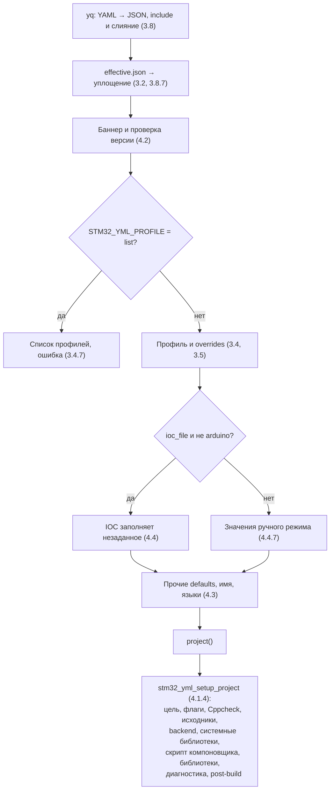

# ТЕХНИЧЕСКОЕ ЗАДАНИЕ

## Фреймворк сборки STM32-проектов по YAML-описанию stm32-cmake-yml (CMake)

| Реквизит | Значение |
| :--- | :--- |
| **Документ** | TECHNICAL_SPECIFICATION.md |
| **Ревизия** | 2.11 (требования к 0.10.0, черновик для согласования) |
| **Дата формирования** | 02.10.2026 |
| **Метод формирования** | Обратная разработка по исходным файлам версии 0.9.2 (коммит `f8ef5200fc7a4a96d6f3fe9111afb8f8825474b0` от 19.09.2026: `stm32_yml.cmake`, `cmake/`, `scripts/`) с приведением к целевой версии 0.9.3 по решениям заказчика; с ревизии 2.0 — требования к 0.10.0 по решениям заказчика и результатам прототипа (п. 10.3.6) `(р.2.0)`. Справочник, errata, тесты и CI (`main` @ `7246a2c`) — вспомогательные источники, созданные позже версии 0.9.2 |
| **Целевая версия** | 0.10.0: CMake ≥ 3.21, режимы backend Arduino `wrappers` и `native`; состав версии — раздел 10 и приложение G `(р.2.0)`. Предыдущая: 0.9.3, выпущена 27.09.2026 (тег `v0.9.3`) |
| **Целевая платформа** | CMake ≥ 3.21 (проверяются 3.21.7 и 3.28.3; до перехода матрицы CI — 3.19.8, приложение G) `(р.2.0)`, Arm GCC (проверяются xPack 13.3.1-1.1, 14.2.1-1.1, 15.2.1-1.1), Ninja/Make, Mike Farah yq v4 (проверяется 4.44.3), Python 3 (для CRC), backend stm32-cmake (ObKo) или Arduino Core STM32 (проверяется 2.12.0); хост — Linux и Windows; CI — GitHub Actions `(р.1.4)` |
| **Связанные документы** | README.md; анализ использования stm32-cmake (ревизия `ecc5acc`, закреплена в `ci/dependencies.lock.json`) и его перепроверка по исходникам; `docs/ru/reference/0.9.2/*` (справочник опций `CFG-*`); `docs/ru/reference/0.9.2/semantics.md`; `docs/ru/errata/*`; `docs/ru/testing.md`; `docs/ru/firmware-testing.md`; `docs/ru/firmware-plan.md`; `docs/ru/emulation.md`; CHANGELOG.md и CHANGELOG.en.md; TODO.md |
| **Связанные файлы кода** | `stm32_yml.cmake`, `cmake/stm32_yml_*.cmake` (17 модулей, включая подключение и слияние конфигураций `stm32_yml_include.cmake` `(р.2.7)`), `scripts/stm32_crc.py` |

### История ревизий

| Ревизия | Дата | Описание |
| :---: | :---: | :--- |
| 1.0 | 26.09.2026 | Первая редакция. Требования восстановлены по исходному коду 0.9.2 (`main` @ `7246a2c`), справочнику и errata; описаны уровни тестирования и привязка существующих тестов к требованиям. Сформированы открытые вопросы по неоднозначному поведению. |
| 1.1 | 26.09.2026 | Учтены ответы заказчика на вопросы 10.2.1–10.2.15. Базой признаны исходные файлы версии 0.9.2 (`f8ef520`), целью документа — версия 0.9.3. Введены: правило перечислимых значений с предупреждением, зависимость Configure от YAML/IOC/файла профилей, чтение из внешнего файла только `profiles:`, значения ручного режима для неполного IOC, проверка формата размеров памяти во всех режимах, принудительный `STM32_HW_DEFAULT`, провал сборки при сбое CRC, применение ключей только из профиля без обходов, рекомендация очистки кэша для 0.9.2, критерии приёмки для GitHub и GitLab. Закрыты вопросы 10.2.1–10.2.7, 10.2.10–10.2.15; 10.2.8, 10.2.9 оставлены на изучение до выпуска 0.9.3; добавлены 10.2.16, 10.2.17. |
| 1.2 | 26.09.2026 | Учтены результаты анализа использования stm32-cmake, перепроверенного по исходникам закреплённой ревизии `ecc5acc`, и решения заказчика о включении доработок в 0.9.3. Добавлены: исправление external FreeRTOS (E007) с проверкой на дереве Cube и FreeRTOS-Kernel; выбор и проверка `mcu_core` для H7; таблица портов FreeRTOS для новых семейств; ранняя проверка компонентов HAL/FreeRTOS; уточнённая проверка RAM; предупреждение о неприменённых heap/stack; проверка секции CRC на Configure; артефакт `srec`. Описана предвыпускная проверка H7 и H5. Закрыт вопрос 10.2.8, добавлен 10.2.18. |
| 1.3 | 26.09.2026 | Закрыт вопрос 10.2.18: в lock-файл и образ CI добавлены STM32CubeH7 1.13.0, STM32CubeH5 1.7.0 и FreeRTOS-Kernel 11.3.1, MCU сценариев подтверждены базой stm32-cmake `ecc5acc`. В приложение E внесены результаты пробного Configure версии 0.9.2 на H7 и H5. Добавлен вопрос 10.2.19 о GitLab CI в приёмке 0.9.3. |
| 1.4 | 26.09.2026 | Закрыт вопрос 10.2.19: версия 0.9.3 принимается по GitHub Actions, конвейер GitLab CI и TC-53 переносятся на следующую версию. Для вопросов 10.2.9 и 10.2.17 записаны направления изучения: подключение `CMakeLists.txt` из `Arduino_Core_STM32/cores` и `libraries` и сборка прошивки с CRC для `STM32H503C8`. |
| 1.5 | 26.09.2026 | Закрыты вопросы 10.2.9 и 10.2.17. Промежуточный образ CRC формируется из секций ELF с адресом загрузки в регионе `FLASH` (п. 4.15.9); ограничение H5 снято; добавлены TC-63, TC-64 и повторение локальных проверок перед выпуском (п. 8.8.7). Прямое подключение `CMakeLists.txt` Arduino Core и переход на CMake ≥ 3.21 перенесены в 0.10.x; результаты прототипа записаны в п. 10.3.5. |
| 1.6 | 26.09.2026 | Записаны результаты доработок 0.9.3 (ветка `claude/release-0.9.3`, коммиты `4cd3404`…`97682e3`) и решения заказчика. Закрыт вопрос 10.2.16: при `profiles_file` доступны только внешние профили, о встроенных выводится предупреждение. Имена `lss`/`map` остаются как в 0.9.2; BIN строится из секций FLASH, как образ CRC; добавлено предупреждение о символе `_sstack` (п. 4.11.10). Прошивки H7 и H5 запускаются в Renode на минимальных моделях, QEMU для них не применим. Реализованные тест-кейсы переведены из «(предлагается)», добавлены TC-65, TC-66; приложения E и F обновлены. |
| 1.7 | 27.09.2026 | Завершающие доработки 0.9.3 по решению заказчика: баннер версии «stm32-cmake-yml версия: …» (п. 4.2.2), автоматическая проверка TC-52 в сборщике прошивок, правило очистки кэша для 0.9.2 в документации (п. 3.6.6), исправлен комментарий о `STM32::Semihosting` и описаны FloatPrint/FloatScan (п. 4.10.2, 4.10.4). Предложения для 0.10.x записаны в TODO.md, в ТЗ не вносятся. |
| 1.8 | 27.09.2026 | По решению заказчика матрица прошивок расширяется на семейства F0, F4, G4, F7 с полным набором профилей; цели добавляются по одной с полной локальной проверкой (п. 8.8.8, TC-67). Добавлены цели F0 `STM32F030R8T6`, F4 `STM32F411CEU6`, `STM32F401CCU6`, G4 `STM32G431CBU6`, `STM32G474CEU6` и F7 `STM32F746ZGT6`. В режиме `external` к цели порта добавляется `portasm.c`, если stm32-cmake его не подключил (п. 4.8.6; найдено на `ARM_CM0` FreeRTOS-Kernel 11). |
| 1.9 | 27.09.2026 | Подготовка выпуска 0.9.3: история изменений ведётся на русском и английском (CHANGELOG.md, CHANGELOG.en.md) в едином формате; эмуляторы по семействам, их особенности, уровни проверок и расположение тестов описаны в документации; статусы errata E001, E002, E004, E006–E008 — «исправлено в 0.9.3»; приложение E приведено к состоянию выпуска. Требования не менялись. |
| 1.10 | 30.09.2026 | Порядок разработки после выпуска 0.9.3: ветки сливаются в `main` перемоткой без PR, коммиты в `main` подписаны (п. 8.5.1); полная матрица прошивок в CI запускается вручную на границах этапов и на тегах выпуска (п. 8.5.2). Исправлена запись вопроса 10.2.16: в разделе 10.2 он отмечен закрытым (решение ревизии 1.6), в блоке изменений ревизии 1.6 — строка изменения вместо копии вопроса. Требования к фреймворку не менялись. |
| 2.0 | 30.09.2026 | Требования к версии 0.10.0 по решениям заказчика: минимальная версия CMake 3.21; два независимых режима backend Arduino — `wrappers` (обёртки проекта с новыми целями `Arduino::Options` и `Arduino::Platform`) и `native` (данные и цели CMake Arduino Core без функций с побочными эффектами); выбор платы и источника CMSIS. Решения подтверждены прототипом (п. 10.3.6). Закрыты вопросы 10.2.20, 10.2.21; открыты вопросы 10.2.22–10.2.28 по остальному составу 0.10.0. Добавлены TC-68 … TC-73 (предлагаются) и приложение G. |
| 2.1 | 30.09.2026 | Закрыты вопросы 10.2.22 и 10.2.23 по решению заказчика и прототипу (п. 10.3.7): постоянные коды всех сообщений фреймворка, каталог текстов RU/EN, выбор языка, коды в выводе по ключу, файлы сообщений Configure и сборки в формате JSON Lines для тестов и поддержки. Добавлены п. 4.16.5–4.16.14, TC-74 … TC-77 (предлагаются). |
| 2.2 | 30.09.2026 | Закрыт вопрос 10.2.24 по решению заказчика, исследованию сборочных систем и прототипу (п. 10.3.8): каталоги сборки внешних каталогов — `_deps/<путь без ведущих ..>` с хэшем только при совпадении; все артефакты — по итоговому имени ELF рядом с ELF; `hex` и `srec` строит фреймворк. Изменены п. 4.6.3, 4.9.5, 4.14.2, 5.2.1, 5.2.2; добавлены п. 4.6.8, 4.14.4, TC-78, TC-79 (предлагаются). |
| 2.3 | 30.09.2026 | Закрыт вопрос 10.2.25 по решению заказчика и прототипам (п. 10.3.9): подключение файлов `include:` с правилами слияния, формат TOML, имена файла конфигурации по умолчанию, файл итоговой конфигурации; `CMakePresets.json` фреймворк не создаёт и не читает (пример в документации); файл JSON Schema в репозитории без запрета неизвестных ключей; `system_library: none`. Добавлен вывод версий используемых компонентов. Добавлены подраздел 3.8, п. 4.2.6, 4.2.7, 5.1.4, 6.6.4, TC-80 … TC-84 (предлагаются). |
| 2.4 | 30.09.2026 | Закрыты вопросы 10.2.26–10.2.28 по решению заказчика и прототипу (п. 10.3.10): работа на Windows проверяется заданием CI на runner Windows (п. 8.5.7, TC-44) и входит в приёмку 0.10.0; конвейер GitLab CI в репозиторий не добавляется, документация содержит информативный пример `.gitlab-ci.yml` для проекта пользователя (п. 8.5.6, TC-53); справочник 0.10.0 продолжает существующий с отметками версии (п. 7.3); собственный `main()` проекта в режиме `native` задаётся `arduino.use_core_main: false` (п. 4.9.18, TC-85); библиотеки ядра с дополнительными зависимостями (USBDevice, VirtIO, CMSIS_DSP) переносятся на следующую версию (п. 4.9.13). Все вопросы состава 0.10.0 закрыты. |
| 2.5 | 01.10.2026 | Итоги этапа 2 плана 0.10.0: реализованы коды сообщений, каталог RU/EN, выбор языка, файлы сообщений Configure и сборки, перечень кодов в справочнике (п. 4.16.5–4.16.14), версии компонентов (п. 4.2.6, 4.2.7), `system_library: none` (п. 4.10.2) и ошибка для неустановленной версии STM32Cube (п. 4.7.2). Уточнены по реализации: коды 9xx только для тестов, файл текстов для скрипта CRC, модуль версий, проверка версий на L2. TC-41, TC-42, TC-45, TC-74 … TC-77, TC-83, TC-84 реализованы. Полные проверки L0–L5 этапа — п. 10.3.11. |
| 2.6 | 01.10.2026 | Итоги этапа 3 плана 0.10.0: реализованы CMake ≥ 3.21, каталоги сборки по п. 4.6.8, артефакты по итоговому имени ELF, режимы Arduino `wrappers` (цели `Arduino::Options`, `Arduino::Platform`) и `native`, руководство по backend Arduino. Требования уточнены по реализации: `BYPRODUCTS` артефактов, совместимость режима `wrappers` с 0.9.3 при значениях по умолчанию, состав `Arduino::Platform`, флаги и скрипт компоновщика режима `native`; добавлены п. 4.9.19, 4.9.20. TC-68 … TC-72, TC-78, TC-79, TC-85 реализованы; TC-73 разделён, запуск прошивок `native` в эмуляторах — новый TC-86. По решению заказчика этап 5 (задание CI на Windows, пример `.gitlab-ci.yml`, модели RCC/PWR) переносится на версию после 0.10.0. |
| 2.7 | 01.10.2026 | Первый подэтап этапа 4: YAML `include` и файл слияния до профилей, overrides, IOC и defaults. Уточнены накопление `_append` профилей, повторные подключения, пустые значения и диагностика. TC-80 реализован частично (16 сценариев YAML); TOML и выбор файла остаются в следующей ветке. |
| 2.8 | 02.10.2026 | Ускорение Configure CI без сокращения матрицы: задания по GCC, кэш слоёв окружения, архивы диагностики, итоговая проверка полноты. Добавлены п. 8.5.8 и TC-87. Firmware остаётся ручным на границах этапов и по тегам; подэтап TOML следует после этой ветки. |
| 2.9 | 02.10.2026 | Этап 4: реализованы TOML, смешанные подключения, выбор единственного файла конфигурации и проверка расширений. Уточнены пустой PROJECT_CONFIG_FILE, поведение кэша и зависимости автовыбора. TC-80/TC-81 реализованы; добавлены 19 сценариев, локально 1452 Configure PASS. Schema и пример пресета остаются отдельным подэтапом. |
| 2.10 | 02.10.2026 | Этап 4: JSON Schema из явных метаданных индекса, проверка L1 конфигураций и отрицательных ожиданий; совместный пример CMakePresets, YAML и CMakeLists на двух языках. TC-82 реализован. Схема не меняет Configure; полный L0–L5 и ручной Firmware остаются условиями закрытия этапа. |
| 2.11 | 02.10.2026 | Закрыт этап 4 на e5d93c6: полный локальный L0–L5 и CI, включая ручной Firmware, успешны. Подготовлено двуязычное руководство перехода с 0.9.x (п. 7.9), этап 6 остаётся открытым. Поведение фреймворка не меняется. |


### Изменения ревизии 2.11

Изменённые и новые пункты ревизии 2.11 помечены `(р.2.11)`.

| Пункты | Тип | Суть |
| :--- | :---: | :--- |
| Раздел 9 | изм. | Ссылка на руководство перехода для п. 7.9 |
| 10.3.13 | нов. | Полные проверки этапа 4 на e5d93c6 |
| Приложение G | изм. | Этап 4 выполнен; руководство перехода подготовлено |

### Изменения ревизии 2.10

Изменённые и новые пункты ревизии 2.10 помечены `(р.2.10)`.

| Пункты | Тип | Суть |
| :--- | :---: | :--- |
| 2.4.4 | изм. | Историческое ограничение базы и отдельная схема 0.10.0 |
| 5.1.4 | изм. | Только совместный пример Presets, YAML и пользовательского CMake |
| 6.6.4 | изм. | Явные метаданные, отдельная L1, точечные отрицательные ожидания |
| 8.7, раздел 9 | изм. | TC-82 реализован, проверка связей пресетов |
| 10.2.32 | нов. | Уточнение примера по проекту заказчика |
| Приложение G | изм. | TOML слит, Schema/пример подготовлены; этап не закрыт |

### Изменения ревизии 2.9

Изменённые и новые пункты ревизии 2.9 помечены `(р.2.9)`.

| Пункты | Тип | Суть |
| :--- | :---: | :--- |
| 3.1.5 | изм. | Автовыбор при пустом значении, явный путь, кэш и добавление кандидата |
| 3.8.1 | изм. | Явный выбор парсера по расширению в нижнем регистре |
| 8.7, раздел 9 | изм. | TC-80/TC-81 реализованы, смешанные форматы и проверки выбора файла |
| 10.2.31 | нов. | Уточнение управления автовыбором и старого кэша |
| Приложения B, G | изм. | Файлы по умолчанию, состояние этапа 4 |

### Изменения ревизии 2.8

Изменённые и новые пункты ревизии 2.8 помечены `(р.2.8)`.

| Пункты | Тип | Суть |
| :--- | :---: | :--- |
| 8.5.8 | нов. | Полная матрица в независимых заданиях, контроль результатов и диагностики |
| 8.7, раздел 9 | нов. | TC-87: проверки разделения, полноты отчётов и упаковки |
| 10.2.30 | нов. | Ускорение Configure при сохранении ручного Firmware |
| Приложения B, G | изм. | Параллельность CI; include слит, оптимизация CI отдельной веткой |

### Изменения ревизии 2.7

Изменённые и новые пункты ревизии 2.7 помечены `(р.2.7)`.

| Пункты | Тип | Суть |
| :--- | :---: | :--- |
| Реквизиты | изм. | 17 модулей CMake, модуль include |
| 3.8.2–3.8.5, 3.8.7, 3.8.9 | изм. | Пустые подключения, повторные файлы, накопление `_append` профилей, граница effective.json |
| 3.8.10 | нов. | Корень документа и проверка типов include/append |
| 8.7, раздел 9 | изм. | TC-80 частично реализован, модуль INC и привязка тестов |
| 10.2.29 | нов. | Решение о границе слияния и добавлениях профилей |
| Приложения A, B, C, G | изм. | Опция include, зависимости, стадия слияния, состояние этапа 4 |

### Изменения ревизии 2.6

Изменённые и новые пункты ревизии 2.6 помечены `(р.2.6)`.

| Пункты | Тип | Суть |
| :--- | :---: | :--- |
| Реквизиты | изм. | 16 модулей CMake |
| 4.9.2 | изм. | Без `arduino.mcu_target` предупреждение — только если `Arduino::Platform` не создана |
| 4.9.10 | изм. | Данные платы — из блока выбранной платы в `boards_db.cmake` |
| 4.9.11 | изм. | Без шаблона — скрипт variant с сообщением; регион FLASH для BIN из базы плат |
| 4.9.12 | изм. | Флаги YAML в режиме `native` — только через `user_settings` |
| 4.9.13 | изм. | `SrcWrapper` подключается всегда; библиотеки — по одной |
| 4.9.14 | изм. | В `wrappers` при значениях по умолчанию — сообщения вместо ошибок; CMSIS 5 из STM32Cube — предупреждение только при явной плате; `CMSIS6_PATH` в `native` |
| 4.9.15 | изм. | Параметры компоновки `Arduino::Platform` — только флаги ядра и FPU; каталоги USB, VirtIO, OpenAMP, DSP не входят |
| 4.9.16 | изм. | Неудача выбора платы или поиска CMSIS при значениях по умолчанию — сообщение без `Arduino::Platform` |
| 4.9.19, 4.9.20 | нов. | Ключи режима `wrappers` в `native` — предупреждение; цель проекта с именем цели ядра — ошибка |
| 4.14.4 | изм. | `BYPRODUCTS` по итоговым свойствам цели в конце её каталога |
| 6.2.1, 8.5.2, 8.5.6, 8.5.7 | изм. | Задание CI на Windows и пример `.gitlab-ci.yml` — после 0.10.0 |
| 8.7 | изм./нов. | TC-68 … TC-72, TC-78, TC-79, TC-85 реализованы; TC-73 — сборка; TC-86 (предлагается) — запуск прошивок `native` |
| Раздел 9 | изм. | Обозначения модулей; строки 4.9.19, 4.9.20 |
| 10.3.12 | нов. | Итоги этапа 3 и полные проверки |
| Приложение G | изм. | Доработки этапа 3 выполнены; этап 5 — после 0.10.0 |

### Изменения ревизии 2.5

Изменённые и новые пункты ревизии 2.5 помечены `(р.2.5)`.

| Пункты | Тип | Суть |
| :--- | :---: | :--- |
| Реквизиты | изм. | 13 модулей CMake |
| 4.2.6 | изм. | Модуль версий, независимый от `project()`; git без блокировок |
| 4.7.2 | изм. | Отсутствующая явная версия пакета — ошибка фреймворка |
| 4.16.5 | изм. | Коды 9xx — только тесты |
| 4.16.11 | изм. | Файл текстов `stm32_yml_build_messages.json` для скрипта CRC, английские тексты без него |
| 4.16.12 | изм. | Набор на русском — сценарии выбора языка |
| 4.16.13 | изм. | Проверка L1 охватывает скрипт CRC |
| 8.7 | изм. | TC-41, TC-42, TC-45, TC-74 … TC-77, TC-83, TC-84 реализованы; методы уточнены |
| 10.3.11 | нов. | Итоги этапа 2 и полные проверки |
| Приложение G | изм. | Доработки этапа 2 выполнены |

### Изменения ревизии 2.4

Изменённые и новые пункты ревизии 2.4 помечены `(р.2.4)`.

| Пункты | Тип | Суть |
| :--- | :---: | :--- |
| 4.9.13 | изм. | Библиотеки ядра с дополнительными зависимостями — не в 0.10.0 |
| 4.9.18 | нов. | Собственный `main()` проекта в режиме `native` |
| 6.2.1 | изм. | Windows проверяется заданием CI |
| 7.3 | изм. | Справочник 0.10.0 продолжает существующий |
| 8.5.2 | изм. | Запуск задания Windows |
| 8.5.6 | изм. | Пример `.gitlab-ci.yml` в документации вместо конвейера в репозитории |
| 8.5.7 | нов. | Задание CI на Windows |
| 8.7 | изм./нов. | TC-44, TC-53 изменены; TC-85 (предлагается) |
| 10.2.26–10.2.28 | изм. | Вопросы закрыты |
| 10.3.3 | изм. | Принято для 0.10.0 |
| 10.3.10 | нов. | Прототип собственного `main()` |
| Раздел 9, приложение G | изм. | Строки новых пунктов и доработок |

### Изменения ревизии 2.3

Изменённые и новые пункты ревизии 2.3 помечены `(р.2.3)`.

| Пункты | Тип | Суть |
| :--- | :---: | :--- |
| 3.1.5 | изм. | Имена файла конфигурации по умолчанию: `.yml`, `.yaml`, `.toml` |
| 3.8.1–3.8.9 | нов. | `include:`, порядок и правила слияния, сброс значения, итоговая конфигурация, TOML |
| 3.7, 4.10.2 | изм. | `system_library: none` |
| 4.2.6, 4.2.7 | нов. | Вывод версий компонентов |
| 5.1.4 | нов. | `CMakePresets.json` проекта: фреймворк не создаёт и не читает |
| 6.6.4 | нов. | Файл JSON Schema, генерируемый из индекса справочника |
| 8.7 | нов. | TC-80 … TC-84 (предлагаются) |
| 10.2.25 | изм. | Вопрос закрыт |
| 10.3.9 | нов. | Результаты прототипов |
| Раздел 9, приложения B, G | изм. | Строки новых пунктов, констант и доработок |

### Изменения ревизии 2.2

Изменённые и новые пункты ревизии 2.2 помечены `(р.2.2)`.

| Пункты | Тип | Суть |
| :--- | :---: | :--- |
| 4.6.3, 4.9.5 | изм. | Каталоги сборки — по п. 4.6.8 |
| 4.5.7 | изм. | Путь файла `map` по п. 4.14.4 |
| 4.6.8 | нов. | Каталоги сборки: внутри проекта — относительный путь, вне — `_deps/…`, хэш при совпадении |
| 4.14.2 | изм. | `hex` и `srec` строит фреймворк; имена всех артефактов по п. 4.14.4 |
| 4.14.4 | нов. | Артефакты по итоговому имени ELF в каталоге ELF |
| 5.2.1, 5.2.2 | изм. | Функции генерации `bin`/`hex`/`srec` от toolchain не требуются |
| 7.9 | изм. | Чистая сборка после перехода |
| 8.7 | нов. | TC-78, TC-79 (предлагаются) |
| 10.2.24 | изм. | Вопрос закрыт |
| 10.3.8 | нов. | Исследование сборочных систем и прототип |
| Раздел 9, приложение G | изм. | Строки новых пунктов и доработок |

### Изменения ревизии 2.1

Изменённые и новые пункты ревизии 2.1 помечены `(р.2.1)`.

| Пункты | Тип | Суть |
| :--- | :---: | :--- |
| 4.16.5–4.16.14 | нов. | Коды сообщений, каталог RU/EN, язык, показ кодов, файлы сообщений, проверки |
| 8.7 | нов. | TC-74 … TC-77 (предлагаются) |
| 10.2.22, 10.2.23 | изм. | Вопросы закрыты |
| 10.3.7 | нов. | Результаты прототипа сообщений |
| Раздел 9, приложения B, G | изм. | Строки новых пунктов, констант и доработок |

### Изменения ревизии 2.0

Изменённые и новые пункты ревизии 2.0 помечены `(р.2.0)`. Тип `искл.` не применялся.

| Пункты | Тип | Суть |
| :--- | :---: | :--- |
| Реквизиты, 1.3.5 | изм./нов. | Целевая версия 0.10.0; CMake ≥ 3.21 |
| 2.5.1, 5.1.1, 6.1.1 | изм. | Минимальная версия CMake 3.21 |
| 4.9.2–4.9.4, 4.9.6 | изм. | Уточнено: действуют в режиме `wrappers` |
| 4.9.8–4.9.17 | нов. | Режимы `wrappers` и `native`, выбор платы, цель `board`, `user_settings`, CMSIS, цели `Arduino::Options` и `Arduino::Platform`, шаблоны обёрток |
| 7.9 | нов. | Нарушения совместимости 0.10.0 и руководство по переходу |
| 8.7 | нов. | TC-68 … TC-73 (предлагаются) |
| 8.8 | изм. | Раздел выполнен в 0.9.3 и сохраняется для прослеживаемости |
| 10.2.20, 10.2.21 | нов. | Закрыты: CMake 3.21; режимы Arduino и источник CMSIS |
| 10.2.22–10.2.28 | нов. | Открытые вопросы состава 0.10.0 |
| 10.3.6 | нов. | Результаты прототипа режима `native` |
| Раздел 9, приложения B, C, F, G | изм./нов. | Строки новых пунктов; константа CMake; доработки 0.10.0 |

### Изменения ревизии 1.10

Изменённые пункты ревизии 1.10 помечены `(р.1.10)`. Требования к фреймворку не менялись.

| Пункты | Тип | Суть |
| :--- | :---: | :--- |
| Реквизиты | изм. | Ревизия 1.10; 0.9.3 выпущена, 0.10.0 — с ревизии 2.0 |
| 8.5.1 | изм. | Слияние перемоткой без PR, подписанные коммиты, push и теги — владелец |
| 8.5.2 | изм. | L4–L5 в CI — вручную на границах этапов и на тегах `v*`; L3 не запускается без входных данных |
| 10.2.16 | испр. | Статус «Закрыт» в разделе 10.2 (решение ревизии 1.6) |
| Изменения ревизии 1.6 | испр. | Строка изменения 10.2.16 вместо копии вопроса |

### Изменения ревизии 1.9

Изменённые пункты ревизии 1.9 помечены `(р.1.9)`. Нормативные требования не менялись.

| Пункты | Тип | Суть |
| :--- | :---: | :--- |
| Реквизиты | изм. | Ревизия к выпуску; связанные документы |
| Приложение E | изм. | Состояние выпуска 0.9.3; строки документации |

### Изменения ревизии 1.8

Изменённые и новые пункты ревизии 1.8 помечены `(р.1.8)`.

| Пункты | Тип | Суть |
| :--- | :---: | :--- |
| 4.8.6 | изм. | `portasm.c` порта при внешнем FreeRTOS |
| 8.8.8 | нов. | Матрица прошивок по семействам F0, F4, G4, F7 |
| 8.7 | нов. | TC-67 |
| Раздел 9, приложения E, F | изм. | Строки 4.8.6, 8.8.8; модели Renode; объём проверок |

### Изменения ревизии 1.7

Изменённые и новые пункты ревизии 1.7 помечены `(р.1.7)`.

| Пункты | Тип | Суть |
| :--- | :---: | :--- |
| 4.2.2 | изм. | Текст баннера версии |
| 8.7 | изм. | TC-52 автоматизирован |
| Приложение E | изм. | Строки 3.6.6, 4.10.2, 4.10.4, 4.15.7 |

### Изменения ревизии 1.6

Изменённые и новые пункты ревизии 1.6 помечены `(р.1.6)`.

| Пункты | Тип | Суть |
| :--- | :---: | :--- |
| 3.4.11 | изм. | Только внешние профили; предупреждение о встроенных (вопрос 10.2.16) |
| 4.8.8 | изм. | Совместимость обёртки с внешним FreeRTOS подтверждена сборкой; отсутствие обёртки — ошибка |
| 4.11.10 | нов. | Предупреждение об отсутствующем `_sstack` |
| 4.14.2 | изм. | BIN из секций FLASH; имена `lss`/`map` как в 0.9.2 |
| 8.8.5 | изм. | H7 и H5 — сборка и запуск в Renode на минимальных моделях |
| 8.7 | изм./нов. | TC-22, TC-43, TC-46 … TC-51, TC-54 … TC-64 реализованы; TC-65, TC-66 |
| 10.2.16 | изм. | Вопрос закрыт: только внешние профили, предупреждение о встроенных |
| Раздел 9, приложения E, F | изм. | Строки 3.4.11, 4.11.10, 4.14.2, 8.8.5; состояние доработок 0.9.3; объём проверок |

### Изменения ревизии 1.5

Изменённые и новые пункты ревизии 1.5 помечены `(р.1.5)`.

| Пункты | Тип | Суть |
| :--- | :---: | :--- |
| 4.9.4 | изм. | Поведение 0.9.3 без изменений; прямое подключение Core — 0.10.x |
| 4.15.1, 4.15.8, 5.6.2 | изм. | Образ CRC по секциям Flash; ограничение H5 снято; интерфейс скрипта с ELF |
| 4.15.9 | нов. | Состав промежуточного образа CRC |
| 8.8.7 | нов. | Проверка образа CRC и повтор локальных проверок перед выпуском |
| 8.7 | нов. | TC-63, TC-64 |
| 10.2.9, 10.2.17 | изм. | Вопросы закрыты |
| 10.3.5 | нов. | Результаты прототипа прямого подключения Arduino Core |
| Раздел 9, приложения B, E | изм. | Строки CRC и Arduino |

### Изменения ревизии 1.4

Изменённые и новые пункты ревизии 1.4 помечены `(р.1.4)`.

| Пункты | Тип | Суть |
| :--- | :---: | :--- |
| Реквизиты | изм. | Приёмка 0.9.3 — только GitHub Actions |
| 8.5.6, TC-53 | изм. | Эквивалентность с GitLab CI — после 0.9.3 |
| 10.2.9, 10.2.17 | изм. | Направления изучения |
| 10.2.19 | изм. | Вопрос закрыт |
| Раздел 9, приложение E | изм. | Строки 8.5.6 |

### Изменения ревизии 1.3

Изменённые и новые пункты ревизии 1.3 помечены `(р.1.3)`.

| Пункты | Тип | Суть |
| :--- | :---: | :--- |
| 8.8.1 | изм. | Закреплённые версии STM32CubeH7, STM32CubeH5 и FreeRTOS-Kernel |
| 10.2.18 | изм. | Вопрос закрыт: версии и MCU сценариев |
| 10.2.19 | нов. | Вопрос: входит ли GitLab CI в приёмку 0.9.3 |
| Приложения E, F | изм. | Состояние доработок по пробному Configure; версии окружения |

### Изменения ревизии 1.2

Изменённые и новые пункты ревизии 1.2 помечены `(р.1.2)`.

| Пункты | Тип | Суть |
| :--- | :---: | :--- |
| 3.7.3 | изм. | `freertos_version`: неизвестное значение — как `external`; артефакт `srec` |
| 4.4.4 | изм. | Таблица портов FreeRTOS по семейству и ядру; незнакомое семейство — предупреждение |
| 4.7.3, 4.8.3 | изм. | Цели CMSIS и CMSIS-RTOS с учётом ядра |
| 4.7.8, 4.7.9 | нов. | Выбор `mcu_core` по базе stm32-cmake; ранняя проверка компонентов HAL |
| 4.8.6 | изм. | External FreeRTOS: поиск без компонента семейства (исправление E007) |
| 4.8.7, 4.8.8 | нов. | Ранняя проверка компонентов FreeRTOS; external FreeRTOS с CMSIS-RTOS |
| 4.10.4 | нов. | Float printf/scanf newlib-nano через `link_libraries` |
| 4.11.9 | нов. | Предупреждение: размеры heap/stack не применяются к скрипту |
| 4.13.4, 4.14.2, 4.15.2, 4.15.4 | изм. | Проверка RAM с CCRAM/RAM_SHARE и ядром, «не проверялось»; `srec`, `OUTPUT_NAME`; проверка секции CRC на Configure; Flash с ядром |
| 4.16.1, 4.16.2, 5.2.1 | изм. | Новые ошибки и предупреждения; используемые функции и цели stm32-cmake |
| 8.2.1 | изм. | FreeRTOS-Kernel, STM32CubeH5 и STM32CubeH7 в lock-файле |
| 8.8 | нов. | Предвыпускная стабилизация 0.9.3: H7, H5, external FreeRTOS |
| 8.7 | изм./нов. | TC-22, TC-25, TC-27, TC-28, TC-41 изменены; TC-54 … TC-62 |
| 9, 10 | изм. | Матрица; вопрос 10.2.8 закрыт; добавлен 10.2.18 |
| Приложения A, E, F | изм. | Значения по умолчанию; доработки 0.9.3; тестовое окружение |

### Изменения ревизии 1.1

Обозначения: **нов.** — новое требование, **изм.** — изменённый текст при сохранении номера, **искл.** — исключённое требование. Изменённые и новые пункты в тексте помечены `(р.1.1)`.

| Пункты | Тип | Суть |
| :--- | :---: | :--- |
| Реквизиты, 1.3.1, 1.3.2, 1.3.4, 1.6.3 | изм./нов. | База — исходные файлы 0.9.2 (`f8ef520`); цель — 0.9.3; смысл маркеров |
| 2.1.3 | изм. | Рабочий цикл с очисткой кэша для 0.9.2 |
| 3.2.7, 3.4.7–3.4.9, 3.6.3, 3.6.5 | изм. | Неизвестные ключи; внешний файл профилей; ключи только из профиля; повторный Configure; зависимости Configure |
| 3.4.11, 3.6.6 | нов. | Комбинация встроенных и внешних профилей; рекомендация очистки кэша для 0.9.2 |
| 3.7 | нов. | Перечислимые значения: предупреждение и фактическое значение |
| 4.2.3, 4.4.6, 4.8.3, 4.8.6, 4.9.4, 4.10.2, 4.11.4 | изм. | Версия конфигурации — рекомендуемая; неполный IOC; перечисления; external FreeRTOS и обёртка Arduino — на изучение; формат размеров |
| 4.1.6, 4.6.7, 4.11.8 | нов. | `toolchain_backend` по умолчанию; пустой `sources` допустим; проверка размеров при любом скрипте |
| 4.14.2, 4.15.6, 4.15.7, 4.16.1, 4.16.2 | изм. | Неизвестные артефакты и `crc_algorithm` — предупреждение; сбой CRC — провал сборки |
| 4.15.8 | нов. | Ограничение CRC для семейства H5 |
| 7.7, 7.8 | нов. | Обратная совместимость формата YAML; значения перечислений новых версий |
| 8.1.1, 8.5.2, 8.6.1 | изм. | L6 вне приёмки; CI GitHub или GitLab; критерии приёмки |
| 8.5.6 | нов. | Эквивалентность проверок в GitHub Actions и GitLab CI |
| 8.7 | изм./нов. | TC-06, TC-27, TC-38, TC-42, TC-43 изменены; TC-46 … TC-53 |
| 9, 10 | изм. | Матрица; вопросы закрыты, 10.2.8 и 10.2.9 открыты, добавлены 10.2.16, 10.2.17 |
| Приложения A, B, E | изм. | Значения по умолчанию, константы; приложение E — перечень доработок для 0.9.3 |

---

## Содержание

1. Введение
2. Общее описание
3. Модель конфигурации
4. Функциональные требования: жизненный цикл и API
5. Требования к интерфейсам
6. Нефункциональные требования
7. Совместимость и эволюция
8. Верификация
9. Матрица прослеживаемости
10. Допущения и открытые вопросы
- Приложение A. Сводка YAML-опций и условных значений по умолчанию
- Приложение B. Сводка констант
- Приложение C. Порядок обработки конфигурации (информативно)
- Приложение D. Соглашение о ссылках на ТЗ из кода и тестов
- Приложение E. Доработки для версии 0.9.3, известные отклонения и расхождения документации с кодом
- Приложение F. Тестовое окружение и уровни проверок (информативно)
- Приложение G. Доработки для версии 0.10.0 `(р.2.0)`

---

## 1. Введение

### 1.1. Назначение документа

1.1.1. Документ определяет требования к фреймворку stm32-cmake-yml: набору CMake-скриптов, который читает YAML-описание STM32-проекта и настраивает по нему цель сборки CMake — MCU, исходники, драйверы, библиотеки, флаги, скрипт компоновщика и артефакты.

1.1.2. Документ является основой для реализации, тестирования и приёмки: каждое требование имеет уникальный номер, на который ссылаются комментарии в коде, тестовые сценарии и матрица прослеживаемости (раздел 9). Документ устраняет неоднозначность ожидаемого поведения при тестировании: если поведение не описано здесь или в справочнике, оно не является частью контракта.

### 1.2. Область применения

1.2.1. Требования применимы к публичным точкам входа фреймворка (`stm32_yml.cmake`), его модулям `cmake/stm32_yml_*.cmake`, скрипту `scripts/stm32_crc.py` и к набору проверок в `tests/` и `ci/`.

1.2.2. Документ задаёт требования на уровне системы и групп опций. Точная семантика каждой YAML-опции (тип, значение по умолчанию, особые значения) определяется карточками справочника 0.9.2 с постоянными идентификаторами `CFG-*`; ТЗ ссылается на них и не дублирует их текст. При расхождении ТЗ и карточки действует правило п. 1.3.3.

1.2.3. Вне области документа: реализация stm32-cmake, Arduino Core STM32, STM32Cube, toolchain-файлы, пользовательские CMake-обёртки Arduino, генерация кода CubeMX, корректность прошивки на плате.

### 1.3. Метод формирования

1.3.1. Исходной считается версия 0.9.2 — файлы фреймворка в коммите `f8ef520` («обновлено до версии 0.9.2»). Документация, справочник, errata и тесты созданы позже; тесты частично предполагают разумное ожидаемое поведение, поэтому используются как вспомогательный источник, а не как эталон. Документ задаёт требования к версии 0.9.3: поведение 0.9.2, которое сохраняется, и согласованные изменения. `(р.1.1)`

1.3.2. Требование, выполняемое в 0.9.2, имеет маркер `[R]`. Требование к изменению поведения в 0.9.3 имеет маркер `[U]` или `[N]` и пометку ⚠ в матрице; доработка и её состояние перечислены в приложении E. Где ожидаемое поведение не установлено, сформулирован открытый вопрос (раздел 10). `(р.1.1)`

1.3.3. В случае расхождения между этим документом, справочником и кодом расхождение считается дефектом одного из них и разрешается пересмотром ревизии документа и, при необходимости, записью errata.

1.3.4. Ревизия 1.1 опирается на ответы заказчика на вопросы 10.2.1–10.2.15 ревизии 1.0 (раздел 10). `(р.1.1)`

1.3.5. С ревизии 2.0 документ задаёт требования к версии 0.10.0. Требования 0.9.3 сохраняются, если не изменены пунктами с пометкой `(р.2.0)`; доработки 0.10.0 и их состояние перечислены в приложении G, доработки 0.9.3 — в приложении E. `(р.2.0)`

### 1.4. Термины и сокращения

| Термин | Определение |
| :--- | :--- |
| Фреймворк | stm32-cmake-yml: `stm32_yml.cmake` и модули `cmake/stm32_yml_*.cmake`. |
| Проект-потребитель | CMake-проект прошивки, подключающий фреймворк (обычно как git-сабмодуль). |
| Конфигурация | Файл YAML (по умолчанию `stm32_config.yml`) с параметрами проекта. |
| Параметр | Переменная CMake, полученная из ключа конфигурации (с учётом уплощения, п. 3.2.2). |
| Эффективное значение | Значение параметра после применения всех источников по приоритету (п. 3.1.2). |
| IOC | Файл проекта STM32CubeMX (`.ioc`), из которого читаются отдельные параметры. |
| Профиль | Именованный набор параметров в секции `profiles:` или во внешнем файле профилей. |
| Override | Cache-переменная `STM32_YML_OVERRIDE_<param>`, задающая скалярное значение параметра поверх профиля. |
| Backend | Способ подключения платформенных компонентов: `stm32-cmake` (CMSIS, HAL/LL, FreeRTOS из STM32Cube) или `arduino` (Arduino Core STM32 через обёртки проекта). |
| Bare metal | Режим stm32-cmake backend с `use_cmsis: false` и `use_hal: false`: startup, векторы и разметку памяти предоставляет пользователь. |
| Шаблон `.ld.in` | Шаблон скрипта компоновщика с подстановками `@HEAP_SIZE@`, `@STACK_SIZE@`, `@USE_READONLY@`. |
| Configure / Generate | Стадии CMake: исполнение скриптов и формирование файлов генератора. |
| Build / Post-build | Компиляция и компоновка; команды после компоновки (bin, hex, lss, CRC). |
| Сценарий | Конфигурационный тест из `tests/cases.json` (имя `configure.<name>`). |
| Пара инструментов | Сочетание версии GCC и версии CMake из `ci/dependencies.lock.json`. |
| `CFG-*` | Постоянный идентификатор карточки опции в справочнике 0.9.2. |
| `E00N` | Постоянный идентификатор записи errata. |

### 1.5. Связанные документы и нормативные ссылки

1.5.1. Справочник опций 0.9.2 (`docs/ru/reference/0.9.2/`), включая страницу семантики (`semantics.md`) и машиночитаемый индекс `docs/reference-index.json`.

1.5.2. Errata 0.9.2 (`docs/ru/errata/`), записи E001–E008.

1.5.3. stm32-cmake (ObKo): toolchain-файл `stm32_gcc.cmake`, пакеты CMSIS, HAL, FreeRTOS; закреплённая ревизия — в `ci/dependencies.lock.json`.

1.5.4. Mike Farah yq v4 — преобразование YAML в JSON.

1.5.5. Алгоритм CRC-32 аппаратного блока STM32 в конфигурации по умолчанию при вводе слов (п. 4.15.3).

### 1.6. Соглашения документа

1.6.1. Модальность: **ДОЛЖНА / ДОЛЖЕН** — обязательное требование; **СЛЕДУЕТ** — рекомендуемое; **МОЖЕТ** — допустимое.

1.6.2. Нумерация: каждый пункт имеет номер вида `X.Y.Z` (в разделе 7 — `X.Y`). Номер требования не переиспользуется и не сдвигается; исключённое требование остаётся в тексте с пометкой «(исключено)». Тест-кейсы нумеруются `TC-NN`, вопросы — в пространстве подраздела 10.2, приложения — латинскими буквами.

1.6.3. Маркеры происхождения в конце требований:

| Маркер | Значение |
| :---: | :--- |
| **[R]** | Восстановлено из кода 0.9.2 (`f8ef520`); поведение сохраняется в 0.9.3. |
| **[N]** | Новое требование: новая функция 0.9.3 либо требование к тестированию и сопровождению, не закреплённое кодом. |
| **[U]** | Изменение или исправление поведения 0.9.2 в версии 0.9.3 (в том числе по errata) либо явная фиксация при неоднозначности. |

`(р.1.1)`

1.6.4. Разделы 1–2 и приложения — информативные; разделы 3–8 — нормативные.

1.6.5. Ссылки на пункты ТЗ из кода и тестов оформляются по приложению D.

1.6.6. Правила ведения документа:

- ревизия имеет номер `M.m` и статус («черновик для согласования», «на согласовании», «утверждено»); минорная часть растёт с каждым циклом согласования, мажорная — при утверждении или смене архитектуры фреймворка;
- каждая ревизия добавляет строку в историю ревизий и, начиная с 1.1, блок «Изменения ревизии X.Y» (новейший сверху) с таблицей изменённых пунктов;
- новые и изменённые пункты ревизии помечаются в конце `(р.X.Y)`;
- ревизия обновляет всё, на что влияет: вопросы (раздел 10), тест-кейсы (раздел 8), матрицу (раздел 9), приложения A, B и E;
- решённые вопросы не удаляются: меняются статус, решение и ссылки на пункты, где решение записано нормативно;
- изменение поведения фреймворка сопровождается изменением ТЗ, карточки `CFG-*`, при необходимости errata и регрессионным сценарием (п. 7.4).

---

## 2. Общее описание

### 2.1. Контекст

2.1.1. Фреймворк подключается в CMake-проект прошивки STM32. Корневой `CMakeLists.txt` проекта выбирает toolchain, подключает `stm32_yml.cmake` и вызывает две функции фреймворка — до и после `project()`. Всё остальное фреймворк выполняет по YAML-конфигурации.

2.1.2. YAML не заменяет систему сборки: произвольная логика, собственные библиотеки и цели остаются в `CMakeLists.txt` проекта и подключаемых каталогов. Фреймворк не выполняет рекурсивного включения файлов: каталоги в `sources` подключаются только при наличии собственного `CMakeLists.txt`.

2.1.3. Типовой рабочий цикл: пользователь изменяет YAML, выполняет Configure, затем сборку. Для 0.9.2 после изменения YAML выполняется удаление кэша и перенастройка (в VS Code — «CMake: Delete Cache and Reconfigure», п. 3.6.6); в 0.9.3 Configure запускается автоматически при сборке (п. 3.6.5). Для нескольких вариантов платы используются профили, выбираемые при Configure. `(р.1.1)`

### 2.2. Функции фреймворка

2.2.1. Чтение YAML-конфигурации и формирование параметров CMake.

2.2.2. Проверка версии конфигурации относительно версии фреймворка.

2.2.3. Применение профилей и точечных overrides.

2.2.4. Чтение параметров из IOC-файла CubeMX.

2.2.5. Определение имени проекта и языков для `project()`.

2.2.6. Создание исполняемой цели, применение флагов, определений и include-путей, раздельно для C и C++.

2.2.7. Подключение исходных файлов и каталогов-модулей.

2.2.8. Подключение CMSIS, HAL/LL и FreeRTOS из STM32Cube (backend stm32-cmake) либо ядра и библиотек Arduino через обёртки проекта (backend arduino).

2.2.9. Подключение системных библиотек (newlib-nano, NoSys, Semihosting) и пользовательских библиотек.

2.2.10. Выбор или генерация скрипта компоновщика.

2.2.11. Диагностика конфигурации и статический анализ Cppcheck.

2.2.12. Генерация артефактов после сборки и внедрение CRC-32 в образ.

### 2.3. Роли и потребители

| Роль | Взаимодействие |
| :--- | :--- |
| Разработчик прошивки | Пишет `stm32_config.yml` и `CMakeLists.txt`, выбирает профиль, выполняет Configure и сборку |
| IDE (VS Code + CMake Tools) | Передаёт `-D`-параметры, выполняет Configure, в том числе повторный с общим кэшем |
| Проект-потребитель (`CMakeLists.txt`) | Вызывает API фреймворка, выбирает toolchain, добавляет собственные цели |
| stm32-cmake | Toolchain, база MCU, пакеты CMSIS/HAL/FreeRTOS, функции генерации bin/hex/size |
| Arduino Core STM32 и обёртки проекта | Цели ядра, variant и библиотек при backend arduino |
| CI проекта-потребителя | Сборка набора профилей, overrides |
| Сопровождающий фреймворка | Изменения кода, справочника, errata, тестов |
| CI фреймворка (GitHub Actions) | Проверка окружения, Configure-сценарии, сборка и запуск прошивок в QEMU/Renode, проверка документации |
| ИИ-агенты | Используют навыки `skills/*` и справочник для настройки конфигурации |

### 2.4. Границы

2.4.1. Фреймворк не запускает CubeMX, не генерирует код инициализации периферии и тактирования и не читает из IOC исходники и clock tree.

2.4.2. Фреймворк не скачивает зависимости (STM32Cube, stm32-cmake, Arduino Core, yq, toolchain) и не выбирает toolchain: toolchain задаётся проектом до `project()`.

2.4.3. Успешный Configure не гарантирует успешную компиляцию, компоновку и работоспособность прошивки; поддержка конкретного MCU определяется backend, toolchain и версиями библиотек.

2.4.4. База 0.9.2 не содержит JSON Schema. С 0.10.0 отдельная схема используется в L1 (п. 6.6.4); общая проверка неизвестных ключей при Configure не добавляется (п. 3.2.7). `(р.2.10)`

### 2.5. Ограничения платформы

2.5.1. Минимальная версия CMake — 3.21: её требуют CMake-файлы Arduino Core 2.12.0 (режим `native`, обёртки EEPROM и IWatchdog), `C_STANDARD 17` и CMakePresets версии 3. До 0.9.3 минимальной была 3.19 (`string(JSON)`). `(р.2.0)`

2.5.2. Арифметика CMake `math(EXPR)` целочисленная: дробные размеры памяти не поддерживаются (E003).

2.5.3. Строки флагов разбиваются по пробелам; shell-экранирование, пробелы внутри значения флага и `;` не поддерживаются.

2.5.4. Отсутствие `-D` при повторном Configure не удаляет запись кэша (свойство CMake).

---

## 3. Модель конфигурации

### 3.1. Источники значений и приоритет

3.1.1. Фреймворк ДОЛЖЕН формировать эффективные значения параметров из пяти источников: (а) встроенные значения по умолчанию; (б) IOC-файл; (в) базовая YAML-конфигурация; (г) выбранный профиль; (д) точечные overrides. `[R]`

3.1.2. Приоритет источников (от низшего к высшему): значения по умолчанию → IOC → YAML → профиль → override. `[R]`

3.1.3. Профиль и overrides ДОЛЖНЫ применяться к параметрам сразу после чтения YAML, до обработки IOC; IOC и значения по умолчанию заполняют только параметры, оставшиеся неопределёнными или пустыми. Наблюдаемый результат ДОЛЖЕН совпадать с приоритетом п. 3.1.2. Причина порядка: профиль может выбрать другой `ioc_file` и `mcu`. `[R]`

3.1.4. Значения по умолчанию условны: зависят от backend, наличия IOC и включённых функций. Единого набора значений по умолчанию нет; условные значения перечислены в приложении A и карточках `CFG-*`. `[R]`

3.1.5. Файл конфигурации задаётся `PROJECT_CONFIG_FILE` (cache-переменная или обычная переменная вызывающего CMakeLists): относительный путь — от `CMAKE_SOURCE_DIR`, абсолютный — без изменения. При отсутствии или пустом значении фреймворк ДОЛЖЕН искать в корне проекта только `stm32_config.yml`, `stm32_config.yaml`, `stm32_config.toml`; больше одного — ошибка Configure со списком файлов, ни одного — ошибка. Расширения не имеют приоритета. Явный непустой путь ДОЛЖЕН обходить автовыбор. Найденное имя НЕ ДОЛЖНО записываться в кэш; добавление или удаление кандидата ДОЛЖНО вызывать повторный Configure при сборке. Явный кэш, в том числе старый `stm32_config.yml`, сохраняется до сброса по правилам CMake. `[U]` `(р.2.9)`

### 3.2. Преобразование YAML в параметры

3.2.1. YAML ДОЛЖЕН преобразовываться в JSON утилитой Mike Farah yq v4 и разбираться средствами CMake; поддерживается синтаксис YAML в объёме yq. `[R]`

3.2.2. Ключ верхнего уровня ДОЛЖЕН становиться переменной CMake с тем же именем. Вложенные объекты ДОЛЖНЫ уплощаться соединением имён через `_`: `arduino: {core_path: X}` → `arduino_core_path`. `[R]`

3.2.3. Массив ДОЛЖЕН становиться списком CMake с сохранением порядка элементов. Контракт поддерживает списки простых значений; объекты внутри массивов не уплощаются. `[R]`

3.2.4. Булево значение ДОЛЖНО приводиться к `TRUE`/`FALSE`; числа и строки передаются текстом; `null` и `key:` дают пустое значение. `[R]`

3.2.5. Отсутствующий ключ НЕ ДОЛЖЕН создавать переменную. `[R]`

3.2.6. Все разобранные параметры, включая не известные фреймворку, ДОЛЖНЫ быть доступны в области `CMakeLists.txt`, вызвавшего `stm32_yml_prepare_project_data` (п. 4.1.2). Причина: проект может использовать собственные ключи YAML. `[R]`

3.2.7. Ключ, не описанный в справочнике, ДОЛЖЕН экспортироваться (п. 3.2.6) и игнорироваться фреймворком без предупреждения: проект может использовать собственные ключи, а конфигурация более новой версии — ключи, неизвестные старой (п. 7.8). Проверки типов значений нет. Неизвестные значения перечислимых ключей обрабатываются по п. 3.7. Успешный Configure не подтверждает отсутствие опечаток в именах ключей. `[U]` `(р.1.1)`

3.2.8. Совпадение уплощённого имени вложенного ключа с плоским ключом не обнаруживается; такие конфигурации вне контракта. `[R]`

3.2.9. Скаляры (имена MCU, пути, размеры) СЛЕДУЕТ писать без кавычек; кавычки нужны только там, где этого требует синтаксис YAML или сохранение строкового типа. `[R]`

### 3.3. Отсутствующие, пустые и ложные значения

3.3.1. Отсутствующий ключ, `key:` и `key: null` ДОЛЖНЫ трактоваться как «не задано»: применяется значение следующего по приоритету источника. `[R]`

3.3.2. Значения `false` и `0` ДОЛЖНЫ сохраняться и НЕ ДОЛЖНЫ заменяться значениями по умолчанию. `[R]`

3.3.3. Пустой список `[]` ДОЛЖЕН давать пустой список CMake. Означает ли он очистку или выбор значения по умолчанию, определяет опция: для `compile_definitions*`, `sources`, `include_directories`, `build_artifacts`, `custom_libraries` — очистка; для `languages`, `cppcheck_args`, `cppcheck_ignores` — значение по умолчанию (приложение A). `[R]`

3.3.4. Значение `auto` имеет специальный смысл только у опций, которые его обрабатывают (`project_name`, `cubefw_package`, `linker_script`, `flash_size`). `[R]`

### 3.4. Профили

3.4.1. Профиль ДОЛЖЕН задаваться именованным блоком в секции `profiles:` основной конфигурации либо во внешнем файле, указанном `profiles_file` (путь от корня проекта). `[R]`

3.4.2. Профиль ДОЛЖЕН выбираться cache-переменной `STM32_YML_PROFILE`; пустое значение означает базовую конфигурацию. `[R]`

3.4.3. Ключ профиля без суффикса ДОЛЖЕН заменять значение одноимённого параметра. `[R]`

3.4.4. Ключ `<param>_append` ДОЛЖЕН дополнять список `<param>` после применения всех замен того же профиля: при наличии в профиле и `X`, и `X_append` результат — список профиля, дополненный элементами `X_append`. Механизм применим к любому параметру и не проверяет тип. `[R]`

3.4.5. Имя профиля ДОЛЖНО состоять из латинских букв и цифр. Символ `_` недопустим (E005): имена ключей профиля уплощаются через `_`. Regex-метасимволы в имени не поддерживаются. `[R]`

3.4.6. Если выбранный профиль не найден, фреймворк ДОЛЖЕН выдать предупреждение и продолжить с базовой конфигурацией (вопрос 10.2.3). `[R]`

3.4.7. Значение `STM32_YML_PROFILE=list` ДОЛЖНО выводить имена всех доступных профилей, в том числе из `profiles_file`, и завершать Configure ошибкой с подсказкой выбрать профиль. В 0.9.2 внешний файл при `list` не читается (E002). `[U]` `(р.1.1)`

3.4.8. Из внешнего файла профилей ДОЛЖНА использоваться только секция `profiles:`; остальные ключи файла ДОЛЖНЫ игнорироваться и НЕ ДОЛЖНЫ влиять на базовые параметры, в том числе на базовое значение списка при `_append`. Внешний файл — особый источник профилей, а не механизм включения конфигураций (`include:`). Отсутствие файла — предупреждение. В 0.9.2 ключ верхнего уровня внешнего файла подменяет базовое значение для `_append` (приложение E). `[U]` `(р.1.1)`

3.4.9. Любой ключ профиля без суффикса `_append`, в том числе отсутствующий в корне YAML, ДОЛЖЕН перезаписывать параметр так же, как заданный в корне, без предварительного объявления ключа в корне. В 0.9.2 это не выполняется для `compile_options_c`, `compile_options_cxx`, `compile_definitions_c`, `compile_definitions_cxx` и может не выполняться для других ключей вне явного списка экспорта (E008). `[U]` `(р.1.1)`

3.4.10. Применение каждого ключа профиля ДОЛЖНО отражаться в журнале Configure строками `[профиль]` (замена) и `[профиль +]` (дополнение). `[R]`

3.4.11. При заданном `profiles_file` ДОЛЖНЫ быть доступны только профили внешнего файла, как в 0.9.2: встроенный профиль, в том числе одноимённый, не учитывается. Если в основном файле есть непустая секция `profiles:`, ДОЛЖНО выводиться предупреждение со списком её профилей и рекомендацией перенести их во внешний файл или удалить секцию (вопрос 10.2.16). В 0.9.2 предупреждения нет. `[U]` `(р.1.6)`

### 3.5. Точечные overrides

3.5.1. Каждая cache-переменная `STM32_YML_OVERRIDE_<param>` с непустым значением ДОЛЖНА присваивать это значение параметру `<param>` поверх профиля. `[R]`

3.5.2. Override задаёт скалярное значение; для вложенного параметра используется уплощённое имя (`STM32_YML_OVERRIDE_arduino_mcu_target`). Задание списков через override вне контракта. `[R]`

3.5.3. Пустой override ДОЛЖЕН игнорироваться и НЕ является командой очистки или нулевым значением. `[R]`

3.5.4. Применённые overrides ДОЛЖНЫ перечисляться в журнале Configure строками `[override]` и итоговым числом. `[R]`

### 3.6. Кэш и повторный Configure

3.6.1. Входные управляющие параметры (`PROJECT_CONFIG_FILE`, `STM32_YML_PROFILE`, `STM32_YML_OVERRIDE_*`) ДОЛЖНЫ быть cache-переменными и сохраняться между Configure. Удаление override выполняется `-U<имя>`, возврат к базовой конфигурации — `-DSTM32_YML_PROFILE=`. `[R]`

3.6.2. Производные записи кэша `MCU`, `HEAP_SIZE`, `STACK_SIZE` ДОЛЖНЫ обновляться вычисленной конфигурацией при каждом Configure (`HEAP_SIZE`, `STACK_SIZE` — при генерации скрипта из шаблона) и НЕ ДОЛЖНЫ иметь приоритета над ней. Прямые `-DMCU`, `-DHEAP_SIZE`, `-DSTACK_SIZE` не являются способом переопределения; для этого служат overrides. `[U]`

3.6.3. Повторный Configure в той же build-папке после смены профиля, overrides или YAML ДОЛЖЕН давать ту же конфигурацию цели, что Configure в чистой папке: исходники, определения, MCU, размеры памяти, системные библиотеки, артефакты, параметры Cppcheck и библиотеки, без остатков предыдущего выбора. Причина: в 0.9.3 Configure перезапускается при сборке автоматически, с сохранением кэша (п. 3.6.5). В 0.9.2 не выполняется для `MCU`, `HEAP_SIZE`, `STACK_SIZE` (E001). `[U]` `(р.1.1)`

3.6.4. Смена toolchain или компилятора в существующей build-папке вне контракта: требуется новая папка. `[R]`

3.6.5. Файл конфигурации, IOC-файл и файл профилей ДОЛЖНЫ регистрироваться как зависимости Configure (`CMAKE_CONFIGURE_DEPENDS`): их изменение ДОЛЖНО приводить к автоматическому повторному Configure при следующей сборке. В 0.9.2 зависимости не регистрируются, и сборка без Configure изменений не подхватывает. `[N]` `(р.1.1)`

3.6.6. Для версии 0.9.2 после изменения YAML, IOC или файла профилей пользователь ДОЛЖЕН выполнять удаление кэша и перенастройку: в VS Code — команда «CMake: Delete Cache and Reconfigure», в командной строке — новая или очищенная build-папка. Для 0.9.3 это рекомендуемый способ диагностики и обязательный шаг при смене toolchain (п. 3.6.4). Рекомендация ДОЛЖНА быть отражена в пользовательской документации. `[N]` `(р.1.1)`

### 3.7. Перечислимые значения `(р.1.1)`

3.7.1. Неизвестное непустое значение перечислимого ключа (таблица п. 3.7.3) ДОЛЖНО вызывать предупреждение с именем ключа, заданным значением и фактически применяемым значением; Configure продолжается. `[U]` `(р.1.1)`

3.7.2. Кроме предупреждения, фреймворк НЕ ДОЛЖЕН иначе реагировать на неизвестное значение: применяется поведение из таблицы п. 3.7.3. Причина: значение может появиться в новой версии, а у пользователя — старая версия фреймворка (п. 7.8). `[U]` `(р.1.1)`

3.7.3. Перечислимые ключи версии 0.9.3:

| Ключ | Известные значения | Неизвестное значение → применяется |
| :--- | :--- | :--- |
| `toolchain_backend` | `stm32-cmake`, `arduino` | `stm32-cmake` |
| `system_library` | `NoSys`, `Semihosting`, `none` `(р.2.3)` | ничего не подключается |
| `cmsis_rtos_api` | `none`, `v1`, `v2` | `none` (без обёртки) |
| `build_artifacts` (элемент) | `bin`, `hex`, `srec`, `map`, `lss` `(р.1.2)` | элемент пропускается |
| `crc_algorithm` | `STM32_HW_DEFAULT` | `STM32_HW_DEFAULT` |
| `freertos_version` | `cube`, `external` | как `external` (совместимость с 0.9.2) `(р.1.2)` |

`[U]` `(р.1.1)`

3.7.4. Отсутствующее или пустое значение перечислимого ключа не считается неизвестным: применяется значение по умолчанию без предупреждения. `[R]` `(р.1.1)`

### 3.8. Подключение файлов и форматы `(р.2.3)`

3.8.1. Формат файла конфигурации, подключаемого файла и `profiles_file` ДОЛЖЕН определяться по расширению в нижнем регистре: `.yml` и `.yaml` — YAML, `.toml` — TOML; иное расширение — ошибка Configure `SCY-E015`. Парсер yq ДОЛЖЕН задаваться явно для каждого файла; оба формата преобразуются в одну модель (п. 3.2), смешанные цепочки допустимы. `[N]` `(р.2.9)`

3.8.2. Ключ `include` ДОЛЖЕН принимать путь или список непустых строк-путей; путь разрешается относительно каталога подключающего файла. Подключаемые файлы МОГУТ сами содержать `include` и секцию `profiles:`. Отсутствующее значение, `null`, пустая строка или пустой список означают отсутствие подключений. Ключ верхнего уровня `include` НЕ ДОЛЖЕН экспортироваться как параметр. Остальные пути сохраняют базу корня проекта. `[N]` `(р.2.7)`

3.8.3. Отсутствующий подключаемый файл (включая каталог вместо файла) и циклическое подключение ДОЛЖНЫ завершать Configure ошибкой с цепочкой файлов. Цикл определяется по каноническим путям в текущей цепочке подключения. `[N]` `(р.2.7)`

3.8.4. Подключения ДОЛЖНЫ применяться в порядке списка: сначала вложенные подключения, затем подключающий файл; следующее подключение переопределяет предыдущие, основной файл применяется последним. Повторный файл вне текущей цепочки ДОЛЖЕН обрабатываться снова, включая повторение добавлений; дубликаты элементов сохраняются. `[N]` `(р.2.7)`

3.8.5. Слияние ДОЛЖНО выполняться по дереву JSON до уплощения: объекты сливаются рекурсивно по ключам, профили — по точному имени; скаляры и списки заменяются. Вне `profiles` `<ключ>_append` дополняет массив `<ключ>` и удаляется как служебный ключ; в пределах одного файла замены выполняются перед добавлениями. Внутри профиля массивы `_append` накапливаются между файлами без применения к базовой конфигурации; они применяются при активации профиля по п. 3.4.4. Замена обычного списка профиля сохраняет накопленный `_append`; `null` сбрасывает его, пустой массив не сбрасывает. Суффикс `_append` зарезервирован также для пользовательских ключей. `[N]` `(р.2.7)`

3.8.6. Значение `null` в подключающем файле ДОЛЖНО сбрасывать значение подключённого файла, после чего действует значение по умолчанию (п. 3.3). В TOML нет `null`: сброс в нём возможен только пустой строкой или пустым массивом со смыслом по п. 3.3. `[N]` `(р.2.3)`

3.8.7. Результат слияния ДОЛЖЕН записываться в `stm32_config.effective.json` в `CMAKE_BINARY_DIR` при каждом Configure до выбора профиля, overrides, IOC и defaults. Файл сохраняет типы JSON и все встроенные профили, исключает служебный `include` верхнего уровня и не включает профили из `profiles_file`. Это результат слияния файлов, а не окончательные параметры цели. Перед загрузкой старый файл ДОЛЖЕН удаляться, чтобы ошибка чтения не оставляла устаревший результат. `[N]` `(р.2.7)`

3.8.8. Все прочитанные файлы (основной, подключённые, `profiles_file`) ДОЛЖНЫ регистрироваться как зависимости Configure по п. 3.6.5. `[N]` `(р.2.3)`

3.8.9. Цель `include` — разгрузить основной файл, вынеся общие настройки однотипных проектов в шаблон; `profiles_file` сохраняет смысл п. 3.4.8 и остаётся отдельным механизмом. Ключ `include` внутри `profiles_file` ДОЛЖЕН игнорироваться. `[N]` `(р.2.7)`

3.8.10. Каждый основной или подключённый файл ДОЛЖЕН содержать один объект; иной корень — ошибка Configure. Неверный тип `include` или его элемента ДОЛЖЕН давать ошибку Configure. Вне профилей `_append` ДОЛЖЕН принимать массив либо пустую строку/`null` (ничего не добавляют), а база — массив, отсутствующее значение, `null` или пустую строку; другие типы ДОЛЖНЫ давать ошибку Configure. `[N]` `(р.2.7)`

---

## 4. Функциональные требования: жизненный цикл и API

### 4.1. Подключение и порядок вызова

4.1.1. Фреймворк ДОЛЖЕН подключаться командой `include(stm32_yml)` при наличии каталога фреймворка в `CMAKE_MODULE_PATH`; подключение загружает все модули и устанавливает `STM32_CMAKE_YML_VERSION`. `[R]`

4.1.2. Проект ДОЛЖЕН вызывать API строго в порядке: (а) выбор toolchain (`CMAKE_TOOLCHAIN_FILE`); (б) `stm32_yml_prepare_project_data(<OUT_NAME> <OUT_LANGUAGES>)`; (в) `project(${<OUT_NAME>} LANGUAGES ${<OUT_LANGUAGES>})`; (г) `stm32_yml_setup_project(<TARGET>)`. Минимальный `CMakeLists.txt` приведён в приложении C. `[R]`

4.1.3. `stm32_yml_prepare_project_data` ДОЛЖНА только читать конфигурацию и готовить параметры; она НЕ ДОЛЖНА вызывать `project()` и создавать цели. `[R]`

4.1.4. `stm32_yml_setup_project` ДОЛЖНА создать исполняемую цель с переданным именем и выполнить настройку в порядке: базовые опции и define MCU → флаги и include-пути → Cppcheck → опции компоновки и map → исходники → backend (CMSIS/HAL/FreeRTOS или Arduino) → системные библиотеки → скрипт компоновщика → пользовательские библиотеки → диагностика → post-build. `[R]`

4.1.5. Функции фреймворка, не перечисленные в п. 4.1.2, являются внутренними; проект НЕ СЛЕДУЕТ вызывать их напрямую. `[N]`

4.1.6. Отсутствующий или пустой `toolchain_backend` ДОЛЖЕН означать `stm32-cmake`: до версии 0.9.1 этот backend был единственным, и такие конфигурации работают без изменений. Неизвестное значение — по п. 3.7. `[R]` `(р.1.1)`

### 4.2. Чтение конфигурации и проверка версии

4.2.1. При отсутствии yq, отсутствии файла конфигурации или ошибке его преобразования Configure ДОЛЖЕН завершаться ошибкой с указанием причины и пути. `[R]`

4.2.2. После чтения конфигурации ДОЛЖЕН выводиться баннер с версией фреймворка в виде `stm32-cmake-yml версия: <версия>`; результат сравнения п. 4.2.3 выводится строкой `Версия в конфигурации: <версия> (<итог>)`. В 0.9.2 строки имели вид `Framework : …` и `Config : …`. `[U]` `(р.1.7)`

4.2.3. `stm32_cmake_yml_version` — рекомендуемый параметр. При `stm32_cmake_yml_version_check` (по умолчанию `true`) фреймворк ДОЛЖЕН сравнить его с версией фреймворка по правилам `VERSION_*` CMake и вывести результат: совпадение — сообщение; конфигурация новее или старше — предупреждение; отсутствующая или пустая версия — предупреждение, называющее параметр рекомендуемым. Во всех случаях Configure продолжается. В 0.9.2 текст предупреждения называет параметр «обязательным». `[U]` `(р.1.1)`

4.2.4. Сравнение версии ДОЛЖНО выполняться до применения профиля и overrides; изменение `stm32_cmake_yml_version` и `stm32_cmake_yml_version_check` через профиль или override на диагностику не влияет. Эти ключи СЛЕДУЕТ задавать в корне YAML. `[R]`

4.2.5. При `stm32_cmake_yml_version_check: false` сравнение не выполняется; баннер версии фреймворка сохраняется. `[R]`

4.2.6. После баннера версии фреймворка ДОЛЖНЫ выводиться версии используемых компонентов: CMake; yq (`yq --version`); stm32-cmake (при backend stm32-cmake) — `git describe --tags` каталога stm32-cmake, иначе последняя версия из его `CHANGELOG.md` с пометкой `+` и коммитом, если он известен; Arduino Core STM32 (при backend arduino) — `version=` из `platform.txt` и коммит, если каталог — репозиторий git; компилятор — после `project()`. Версия пакета STM32Cube и ядра FreeRTOS выводится там, где они выбираются. Функции определения версий ДОЛЖНЫ находиться в отдельном модуле без побочных эффектов (`cmake/stm32_yml_versions.cmake`), пригодном для режима `cmake -P`; git ДОЛЖЕН вызываться без необязательных блокировок (`GIT_OPTIONAL_LOCKS=0`), его ошибки (нет доступа, чужой владелец) дают «версия не определена» или версию из `CHANGELOG.md`. `[N]` `(р.2.3)` `(р.2.5)`

4.2.7. Если версию компонента определить не удалось (нет git, каталога, файла или тега), ДОЛЖНО выводиться информационное сообщение «версия не определена» без предупреждения; Configure продолжается. Версии попадают в файл сообщений п. 4.16.10 и помогают при обращении в поддержку. `[N]` `(р.2.3)`

### 4.3. Подготовка данных проекта

4.3.1. После проверки версии ДОЛЖНЫ применяться профиль и overrides (п. 3.4, 3.5), затем IOC (п. 4.4) либо значения ручного режима, затем прочие значения по умолчанию. `[R]`

4.3.2. Имя проекта: `project_name: auto` (по умолчанию в ручном режиме) ДОЛЖНО давать имя корневого каталога проекта; иное значение используется как есть. `[R]`

4.3.3. Языки: при отсутствии или пустом `languages` ДОЛЖЕН возвращаться список `C CXX ASM`, иначе — значение из конфигурации. `[R]`

4.3.4. Стандарты `c_standard` и `cpp_standard` ДОЛЖНЫ передаваться в `CMAKE_C_STANDARD` и `CMAKE_CXX_STANDARD` без значений по умолчанию со стороны фреймворка. `[R]`

4.3.5. Значение `MCU` ДОЛЖНО записываться в кэш по п. 3.6.2. `[R]`

4.3.6. Функция ДОЛЖНА вернуть в вызывающую область имя проекта, языки и все параметры (п. 3.2.6). `[R]`

### 4.4. Интеграция IOC

4.4.1. При непустом `ioc_file` и backend stm32-cmake фреймворк ДОЛЖЕН прочитать IOC (путь от корня проекта); отсутствие файла — ошибка Configure. При backend arduino `ioc_file` ДОЛЖЕН игнорироваться. `[R]`

4.4.2. Из IOC ДОЛЖНЫ извлекаться: MCU (`ProjectManager.DeviceId` без завершающего `x`), имя проекта, размеры heap и stack (из шестнадцатеричных значений), версия пакета STM32Cube (с приоритетом `CustomerFirmwarePackage` при нестандартном расположении пакета), признак локальной копии драйверов, признак FreeRTOS и версия CMSIS-RTOS API. `[R]`

4.4.3. Значения из IOC ДОЛЖНЫ применяться только к параметрам, не заданным в YAML, профиле и overrides (п. 3.1.3). При IOC `use_cmsis` и `use_hal` по умолчанию `true`; `cubefw_package` по умолчанию `auto` при локальной копии драйверов, иначе версия из IOC. `[R]`

4.4.4. Если IOC включает FreeRTOS и `use_freertos` не задан, FreeRTOS ДОЛЖЕН включаться; явное `false` в YAML, профиле или override подавляет включение. При включении по умолчанию `freertos_version: cube`, `cmsis_rtos_api` — из IOC, `freertos_components` — порт по семейству и ядру MCU и `Heap::4` (таблица в приложении A). Для семейства, отсутствующего в таблице, ДОЛЖНО выводиться предупреждение с фактически выбранным портом `ARM_CM4F`. В 0.9.2 таблица не содержит C0, U0, H5, L5, U5, WL и ядер M4/M0PLUS, а незнакомое семейство молча получает `ARM_CM4F`. `[U]` `(р.1.2)`

4.4.5. Фреймворк ДОЛЖЕН выводить итоговую таблицу параметров IOC-режима с меткой источника каждого значения: `[yml]`, `[ioc]` или `[auto]`. `[R]`

4.4.6. Если IOC не содержит имени проекта, размера heap или stack и они не заданы в YAML, профиле и overrides, ДОЛЖНЫ применяться значения ручного режима: `project_name: auto`, `heap_size: 512`, `stack_size: 1024` (п. 4.4.7). В 0.9.2 значение остаётся пустым. `[U]` `(р.1.1)`

4.4.7. Ручной режим (без `ioc_file`): значения по умолчанию `project_name: auto`, `heap_size: 512`, `stack_size: 1024`; для stm32-cmake backend также `use_cmsis: true`, `use_hal: true`, `use_freertos: false`. `[R]`

### 4.5. Цель, флаги и определения

4.5.1. При backend stm32-cmake фреймворк ДОЛЖЕН определить семейство и тип MCU средствами stm32-cmake и добавить определение `STM32<тип>` (например `STM32F411xE`). При backend arduino определения чипа задаёт пользователь. `[R]`

4.5.2. Флаги `compile_options`, `compile_options_c`, `compile_options_cxx`, `link_options` ДОЛЖНЫ нормализоваться: элементы разбиваются по пробелам; токену без ведущего `-` добавляется `-` (кроме генераторных выражений `$<...>`); токен-значение после опции с отдельным аргументом (`--param`, `-include`, `-isystem`, `-Xlinker`, `-u`, `-T`, `-specs`, `-D`, `-I`, `-L` и др., приложение B) передаётся без изменений. `[R]`

4.5.3. Определения `compile_definitions*` ДОЛЖНЫ разбиваться по пробелам без добавления дефиса; указываются в форме `NAME` или `NAME=value`. `[R]`

4.5.4. Общие флаги, определения и `include_directories` ДОЛЖНЫ применяться к цели как `PRIVATE` для всех языков; `*_c` и `*_cxx` — только к C и только к C++ соответственно (через `$<COMPILE_LANGUAGE:...>`). `[R]`

4.5.5. Пустой `compile_definitions` ДОЛЖЕН убирать только пользовательские определения; автоматические определения (MCU, `USE_HAL_DRIVER`, `USE_FULL_LL_DRIVER`) сохраняются. `[R]`

4.5.6. Каждый элемент `linker_directives` ДОЛЖЕН передаваться компоновщику как `LINKER:<элемент>` без нормализации. `[R]`

4.5.7. При наличии `map` в `build_artifacts` ДОЛЖЕН добавляться флаг компоновщика `-Map` с путём по п. 4.14.4. `[R]` `(р.2.2)`

4.5.8. `verbose_build` (по умолчанию `false`) ДОЛЖЕН устанавливать `CMAKE_VERBOSE_MAKEFILE` в `ON` или `OFF` при каждом Configure. `[R]`

### 4.6. Исходники и модули

4.6.1. Элементы `sources` ДОЛЖНЫ разрешаться относительно текущего каталога исходников (обычно корня проекта); допускаются пути вне дерева проекта (`../shared`). `[R]`

4.6.2. Существующий файл ДОЛЖЕН добавляться к исходникам цели. `[R]`

4.6.3. Каталог ДОЛЖЕН подключаться через `add_subdirectory` и обязан содержать `CMakeLists.txt`; его отсутствие — ошибка Configure. Каталог сборки ДОЛЖЕН назначаться по п. 4.6.8. `[R]` `(р.2.2)`

4.6.4. Отсутствующий путь ДОЛЖЕН давать предупреждение и пропускаться. `[R]`

4.6.5. Цели, созданные в подключённом каталоге, НЕ ДОЛЖНЫ автоматически связываться с исполняемой целью: связь задаётся `link_libraries` или кодом проекта. Ссылка на несуществующую цель с `::` приводит к ошибке Generate. `[R]`

4.6.6. При stm32-cmake backend с `use_cmsis` или `use_hal` файлы `system_stm32<семейство>xx.c` и `startup_stm32<тип>*.s` из `sources` ДОЛЖНЫ перехватываться и подставляться вместо файлов пакета CMSIS (с учётом `mcu_core`), а не добавляться к цели повторно. `[R]`

4.6.7. Пустой или отсутствующий `sources` ДОЛЖЕН допускаться без ошибки: исходники могут подключаться каталогами-модулями, `custom_libraries` или кодом проекта. `[R]` `(р.1.1)`

4.6.8. Каталог сборки каждого подключаемого каталога (элементы `sources`, `arduino.custom_libraries`, обёртка ядра, `arduino.libraries` и каталоги ядра в режиме `native`) ДОЛЖЕН назначаться так: (а) каталог внутри дерева проекта — его относительный путь от корня проекта (как по умолчанию в CMake); (б) каталог вне дерева — `_deps/<ключ>`, где ключ — путь от корня проекта без ведущих сегментов `..`, а для другого диска Windows — путь без буквы диска (например, `../modules/etl` → `_deps/modules/etl`); (в) если ключи двух каталогов совпадают или один ключ является началом другого по границе сегмента, к последнему сегменту каждого такого ключа ДОЛЖЕН добавляться суффикс `-<первые 4 символа SHA-1 относительного пути от корня проекта>` (например, `_deps/modules/etl-fe20`); (г) каталог проекта с путём, начинающимся с `_deps/`, при наличии внешних каталогов — ошибка Configure. Имена целей от каталога сборки не зависят. Причина: каталог сборки называется по зависимости, а не по её расположению, как в FetchContent, Zephyr, ESP-IDF и PlatformIO (п. 10.3.8); хэш от относительного пути одинаков на всех машинах. `[N]` `(р.2.2)`

### 4.7. Backend stm32-cmake: STM32Cube, CMSIS, HAL/LL

4.7.1. Пакет STM32Cube ДОЛЖЕН определяться, если включены CMSIS, HAL или FreeRTOS из Cube. `cubefw_package: auto` ДОЛЖЕН выбирать локальные драйверы `Drivers/CMSIS` и `Drivers/STM32<семейство>xx_HAL_Driver` проекта, а при их отсутствии — последнюю по версии папку `STM32Cube_FW_<семейство>_V*` в `$ENV{CMAKE_USER_HOME}/STM32Cube/Repository`. Значение `Vx.y.z` ДОЛЖНО выбирать указанную версию из того же репозитория. `[R]`

4.7.2. Если пакет не найден, Configure ДОЛЖЕН завершаться ошибкой с указанием семейства и пути. Автоматической загрузки пакета нет. Для явной версии `Vx.y.z` отсутствие каталога пакета ДОЛЖНО проверяться фреймворком до `find_package` (ошибка `SCY-E415` с версией, семейством и путём). `[R]` `(р.2.5)`

4.7.3. При `use_cmsis: true` ДОЛЖЕН подключаться пакет CMSIS семейства с ядром по п. 4.7.8, а цель CMSIS устройства `CMSIS::STM32::<устройство>[::<ядро>]` ДОЛЖНА связываться с исполняемой целью (п. 4.11). `[U]` `(р.1.2)`

4.7.4. `use_hal: true` ДОЛЖЕН требовать `use_cmsis: true`; иначе — ошибка Configure. `[R]`

4.7.5. При `use_hal: true` и непустом `hal_components` ДОЛЖНЫ подключаться цели `HAL::STM32::<семейство>[::<ядро>]::<компонент>` и определение `USE_HAL_DRIVER`; при наличии компонента `LL_*` — также `USE_FULL_LL_DRIVER`. Пустой `hal_components` не подключает драйверы и не означает «все драйверы». `[R]`

4.7.6. При `use_hal: true` фреймворк ДОЛЖЕН проверить наличие `stm32<семейство>xx_hal_conf.h` непосредственно в одном из `include_directories` цели; отсутствие — ошибка Configure с подсказкой. Проверка выполняется и при пустом `hal_components`. `[R]`

4.7.7. Bare metal (`use_cmsis: false`, `use_hal: false`, без FreeRTOS из Cube) НЕ ДОЛЖЕН требовать наличия STM32Cube и НЕ ДОЛЖЕН добавлять зависимостей CMSIS/HAL/FreeRTOS; startup, таблицу векторов, флаги CPU/ABI и скрипт компоновщика предоставляет пользователь. `[R]`

4.7.8. Ядро MCU (`mcu_core`) ДОЛЖНО определяться по списку ядер stm32-cmake (`stm32_get_cores`): (а) пустой список — ядро не используется; (б) один элемент и `mcu_core` не задан — используется этот элемент (все H7, включая одноядерные, — `M7`; WB и MP1 — `M4`) с сообщением в журнале; (в) несколько элементов и `mcu_core` не задан — ошибка Configure со списком ядер; (г) `mcu_core`, отсутствующий в списке (в том числе для семейства без ядер), — ошибка Configure со списком допустимых значений. Выбранное ядро ДОЛЖНО применяться ко всем целям CMSIS, HAL, FreeRTOS, CMSIS-RTOS, к перехвату startup/system (п. 4.6.6) и к запросам памяти (п. 4.13.4, 4.15.4). В 0.9.2 ядро по умолчанию не выбирается: проект H7 без `mcu_core` ссылается на несуществующую цель CMSIS. `[U]` `(р.1.2)`

4.7.9. После подключения HAL каждый элемент `hal_components` ДОЛЖЕН проверяться на существование цели `HAL::STM32::<семейство>[::<ядро>]::<компонент>`; отсутствующий компонент — ошибка Configure с именем компонента и семейства. В 0.9.2 ошибка возникает только на Generate с диагностикой CMake. `[U]` `(р.1.2)`

### 4.8. FreeRTOS

4.8.1. При `use_freertos: true` (только backend stm32-cmake) `freertos_components` ДОЛЖЕН содержать ровно один порт `ARM_*`; отсутствие порта или несколько портов — ошибка Configure. `[R]`

4.8.2. При `freertos_version: cube` (по умолчанию при включении) ДОЛЖНЫ подключаться цели `FreeRTOS::STM32::<семейство>[::<ядро>]::<компонент>` для порта и остальных компонентов. `[R]`

4.8.3. `cmsis_rtos_api: v1` и `v2` ДОЛЖНЫ подключать обёртки `CMSIS::STM32::<семейство>[::<ядро>]::RTOS` и `::RTOS_V2`; `none` обёртку не подключает; неизвестное значение — по п. 3.7. В 0.9.2 имя обёртки строится без ядра и для H7 не существует. `[U]` `(р.1.2)`

4.8.4. Недоступность пакета FreeRTOS ДОЛЖНА приводить к ошибке Configure (обязательная зависимость). `[R]`

4.8.5. При `use_freertos: false` список компонентов НЕ ДОЛЖЕН проверяться, даже если он некорректен. `[R]`

4.8.6. Режим `freertos_version: external` предназначен для подключения FreeRTOS не из STM32Cube: старых проектов с собственной копией FreeRTOS и семейств, пакеты Cube которых FreeRTOS не содержат (H5, U5). Фреймворк ДОЛЖЕН вызывать `find_package(FreeRTOS COMPONENTS <порт>)` без компонента семейства, чтобы stm32-cmake искал FreeRTOS в `FREERTOS_PATH` (переменная CMake или окружения) и создавал цели `FreeRTOS::<порт>` и `FreeRTOS::<компонент>`. Поддерживаются раскладка дерева Cube (`Middlewares/Third_Party/FreeRTOS`, `Source/...`) и раскладка FreeRTOS-Kernel (`include/`, `portable/GCC/<порт>[/non_secure]`). Отсутствие `FREERTOS_PATH` или ненайденные файлы порта — ошибка Configure. В 0.9.2 фреймворк передаёт компонент семейства, stm32-cmake переключается на поиск в Cube и создаёт цели `FreeRTOS::STM32::<семейство>::*`, а фреймворк ссылается на `FreeRTOS::<порт>` — Generate завершается ошибкой (E007). `[U]` `(р.1.2)` Если в каталоге порта есть `portasm.c`, а stm32-cmake не включил его в исходники цели `FreeRTOS::<порт>` (так для `ARM_CM0` FreeRTOS-Kernel 11, где в нём `ulSetInterruptMask`), фреймворк ДОЛЖЕН добавить этот файл к цели порта. `(р.1.8)`

4.8.7. После подключения FreeRTOS каждый элемент `freertos_components` ДОЛЖЕН проверяться на существование соответствующей цели; отсутствующий компонент — ошибка Configure с именем компонента и пространством целей (`FreeRTOS::STM32::<семейство>[::<ядро>]` или `FreeRTOS`). `[U]` `(р.1.2)`

4.8.8. Обёртки CMSIS-RTOS (п. 4.8.3) ДОЛЖНЫ работать и с внешним FreeRTOS: исходники обёртки берутся из пакета CMSIS семейства, заголовки FreeRTOS — из целей внешнего FreeRTOS. Совместимость подтверждена до выпуска 0.9.3 (п. 8.8.4): Configure с FreeRTOS-Kernel 11.3.1 и `v2` (TC-58) и пробная сборка прошивки `freertosQueue` с CubeF1 `CMSIS_RTOS_V2` при настройках FreeRTOSConfig.h, которых требует обёртка; выполнение такой прошивки не проверялось. Если цели обёртки нет (пакет Cube без FreeRTOS, например H5 и U5), Configure ДОЛЖЕН завершаться ошибкой с рекомендацией `cmsis_rtos_api: none`. `[N]` `(р.1.6)`

### 4.9. Backend Arduino

4.9.1. При `toolchain_backend: arduino` фреймворк ДОЛЖЕН требовать `arduino.core_path` (путь от корня к Arduino_Core_STM32) и существование каталога; иначе — ошибка Configure. Путь ДОЛЖЕН экспортироваться в кэш как абсолютный `ARDUINO_CORE_DIR`. `[R]`

4.9.2. В режиме `wrappers` `arduino.mcu_target` ДОЛЖЕН экспортироваться в кэш `MCU_TARGET`; если он не задан, сохраняется уже существующий `MCU_TARGET`, а при его отсутствии выдаётся предупреждение — только если цель `Arduino::Platform` не создана (п. 4.9.16): обёртки на её основе `MCU_TARGET` не используют. `[R]` `(р.2.6)`

4.9.3. В режиме `wrappers` фреймворк ДОЛЖЕН создать интерфейсную цель `Arduino::Definitions` с общими `compile_definitions`, общими и языковыми `compile_options` (языковые определения `compile_definitions_c/cxx` в неё не входят); её состав в 0.10.0 не меняется. `[R]` `(р.2.0)`

4.9.4. В режиме `wrappers` обёртка ядра ДОЛЖНА подключаться из `arduino.core_cmake_dir` (по умолчанию `Arduino/Core`) через `add_subdirectory`; отсутствие `CMakeLists.txt` — предупреждение. В 0.9.3 поведение 0.9.2 сохраняется; прямое подключение CMake-файлов Arduino Core — режим `native` (п. 4.9.9). `arduino.use_core_main`, если задан, экспортируется в кэш `USE_CORE_MAIN`. `[R]` `(р.2.0)`

4.9.5. Каждая библиотека `arduino.libraries` ДОЛЖНА подключаться из `<core_path>/libraries/<имя>` при наличии `CMakeLists.txt`, каждая `arduino.custom_libraries` — из пути от корня проекта; отсутствие каталога или `CMakeLists.txt` — предупреждение и пропуск. Каталоги сборки ДОЛЖНЫ назначаться по п. 4.6.8. `[R]` `(р.2.2)`

4.9.6. В режиме `wrappers` цели ядра и библиотек Arduino НЕ ДОЛЖНЫ автоматически связываться с исполняемой целью; связь задаётся `link_libraries`. `[R]` `(р.2.0)`

4.9.7. При backend arduino НЕ ДОЛЖНЫ вызываться CMSIS/HAL/FreeRTOS stm32-cmake, перехват startup/system (п. 4.6.6) и проверка RAM (п. 4.13.4). `[R]`

4.9.8. Режим backend Arduino ДОЛЖЕН задаваться ключом `arduino.integration` со значениями `wrappers` и `native`. Отсутствующее или пустое значение ДОЛЖНО означать `wrappers` (поведение 0.9.3, п. 7.7); неизвестное — предупреждение по п. 3.7 и `wrappers`. Режимы независимы: требования одного режима не влияют на другой. `[N]` `(р.2.0)`

4.9.9. В режиме `native` фреймворк ДОЛЖЕН использовать данные и цели CMake Arduino Core из `arduino.core_path`: `cmake/environment.cmake`, базу плат `cmake/boards_db.cmake`, `cmake/set_base_arduino_config.cmake` и `CMakeLists.txt` каталогов `cores/arduino`, variant платы и `libraries`. Фреймворк НЕ ДОЛЖЕН вызывать `set_board()`, `updatedb()`, `ensure_core_deps()` и `overall_settings()`; Configure НЕ ДОЛЖЕН требовать Python и доступа к сети и НЕ ДОЛЖЕН изменять файлы в каталоге ядра. Причина: `updatedb()` перегенерирует `boards_db.cmake` в каталоге ядра Python-скриптом, `ensure_core_deps()` загружает зависимости из сети. `[N]` `(р.2.0)`

4.9.10. Плата ДОЛЖНА задаваться ключом `arduino.board`: идентификатором из `boards.txt` ядра или значением `auto` (по умолчанию в режиме `native`). При `auto` плата ДОЛЖНА выбираться по `mcu`: идентификатор `GENERIC_` + первые семь символов имени MCU без префикса `STM32` + `X` (например, `STM32F103C8T6` → `GENERIC_F103C8TX`); если такого нет — единственный идентификатор с этим префиксом и одной буквой суффикса (например, `GENERIC_U575ZITXQ`); несколько кандидатов или ни одного — ошибка Configure со списком кандидатов и предложением задать `arduino.board`. Выбранная плата ДОЛЖНА выводиться в лог Configure. Данные платы ДОЛЖНЫ читаться из блока выбранной платы в `cmake/boards_db.cmake` ядра (заголовок `# <ID>` и строка из дефисов), а не подключением всей базы: так создаются только цели этой платы, а имя проекта может совпадать с идентификатором другой платы; блок без `add_library(<ID> INTERFACE)` — ошибка Configure о нераспознанном формате базы. `[N]` `(р.2.6)`

4.9.11. В режиме `native` фреймворк ДОЛЖЕН создать интерфейсную цель `board` со свойствами выбранной платы, предварительно подключив к ней варианты по умолчанию так же, как `set_board()` (serial `generic`, USB `none`, VirtIO `disable`, если они есть у платы). Если задан явный `linker_script` или найден шаблон `.ld.in` (п. 4.11), фреймворк ДОЛЖЕН заменить в цели `board` параметр компоновщика `--default-script` этим скриптом; иначе используется скрипт variant платы с сообщением, что размеры heap/stack не применяются. Размеры heap/stack (п. 4.11) и CRC (п. 4.15) ДОЛЖНЫ работать так же, как в режиме `wrappers`, при шаблоне или явном скрипте. Со скриптом variant регион FLASH для `bin` (п. 4.14.2) ДОЛЖЕН определяться по началу региона `FLASH` в скрипте и размеру Flash платы из базы плат: в скрипте variant длина задана символами `LD_MAX_SIZE` и `LD_FLASH_OFFSET`. `[N]` `(р.2.6)`

4.9.12. В режиме `native` общие и языковые `compile_definitions` и `compile_options` из YAML ДОЛЖНЫ передаваться через интерфейсную цель `user_settings` — точку расширения, которую `base_config` ядра подключает сам. По умолчанию в `user_settings` ДОЛЖНЫ применяться значения `overall_settings()` ядра: оптимизация `-Os` и newlib-nano (`--specs=nano.specs`); флаги из YAML добавляются после них и МОГУТ переопределить уровень оптимизации. К исполняемой цели эти флаги напрямую НЕ ДОЛЖНЫ добавляться: она получает их через `stm32_runtime` (п. 4.9.13), повтор дал бы дубли в командах. Причина: без newlib-nano и `-Os` образ F103 не помещается во Flash (п. 10.3.5). `[N]` `(р.2.6)`

4.9.13. В режиме `native` исполняемая цель ДОЛЖНА связываться с целью `stm32_runtime` ядра (base_config, SrcWrapper, core, variant) автоматически; `libraries/SrcWrapper` ДОЛЖНА подключаться всегда (её требует `stm32_runtime`), библиотеки `arduino.libraries` — каждая по п. 4.9.5 своим `CMakeLists.txt` с каталогом сборки по п. 4.6.8, без подключения общего `libraries/CMakeLists.txt`, и связываются с целью через `link_libraries` (имена целей ядра, например `Wire`). Библиотеки ядра, требующие дополнительных зависимостей или настроек ядра (USBDevice, VirtIO, CMSIS_DSP), в 0.10.0 не поддерживаются: их подключение не проверяется и не документируется (вопрос 10.2.28). `[N]` `(р.2.6)`

4.9.14. Источник CMSIS для backend Arduino ДОЛЖЕН определяться ключом `arduino.cmsis_path` в обоих режимах: (а) путь от корня проекта или абсолютный — каталог, содержащий `CMSIS/Core/Include/cmsis_version.h`, иначе ошибка Configure; (б) значение не задано — поиск по порядку: установка Arduino IDE (`<Arduino15>/packages/STMicroelectronics/tools/CMSIS/<версия>`; `<Arduino15>` — `%LOCALAPPDATA%\Arduino15` на Windows, `~/.arduino15` на Linux, `~/Library/Arduino15` на macOS), кэш загрузок ядра (`~/.Arduino_Core_STM32_dl/*/dist/CMSIS6`), каталог `Drivers` пакета STM32Cube семейства — локальный `Drivers/`, явный `cubefw_package` или самый новый пакет репозитория (CMSIS 5 вместо ожидаемого ядром CMSIS 6: предупреждение при явном `arduino.board`, иначе информационное сообщение — конфигурации 0.9.3 не получают нового предупреждения); ничего не найдено — ошибка Configure с перечнем мест поиска; (в) значение `external` — фреймворк не добавляет путей CMSIS; если задан `arduino.cmsis_target`, эта интерфейсная цель проекта ДОЛЖНА подключаться туда, куда подключался бы найденный CMSIS (`user_settings` в режиме `native`, `Arduino::Platform` в режиме `wrappers`), иначе выводится сообщение, что CMSIS подключает проект. Выбранный источник ДОЛЖЕН выводиться в лог Configure. В режиме `native` найденный каталог ДОЛЖЕН передаваться ядру как `CMSIS6_PATH`. В режиме `wrappers` при незаданных `arduino.board` и `arduino.cmsis_path` неудачный поиск — сообщение по п. 4.9.16, а не ошибка. `[N]` `(р.2.6)`

4.9.15. В режиме `wrappers` фреймворк ДОЛЖЕН создать, кроме `Arduino::Definitions`, интерфейсные цели `Arduino::Options` (общие и языковые `compile_options`) и `Arduino::Platform` (флаги ядра и FPU, определения и include-каталоги выбранной платы по п. 4.9.10: `system/<семейство>`, драйверы HAL семейства, CMSIS device, variant, `cores/arduino`, CMSIS по п. 4.9.14). Параметры компоновщика платы (`--default-script`, `--defsym`) в `Arduino::Platform` НЕ ДОЛЖНЫ входить — только флаги ядра и FPU: скрипт компоновщика в этом режиме задаёт фреймворк (п. 4.11). Каталоги USBDevice, VirtIO, OpenAMP и CMSIS_DSP не входят (п. 4.9.13). Фреймворк НЕ ДОЛЖЕН создавать обёрток ядра и библиотек: обёртка проекта сама выбирает, с какими целями связываться. Причина: обёртка, связанная с `Arduino::Platform`, не зависит от семейства MCU. `[N]` `(р.2.6)`

4.9.16. В режиме `wrappers` значение `arduino.board` по умолчанию ДОЛЖНО быть `auto` по п. 4.9.10, если задан `mcu`. Если не заданы ни `arduino.board`, ни `arduino.cmsis_path`, а плату или CMSIS определить нельзя (нет `mcu`, короткое имя MCU, нет базы плат, CMSIS не найден), цель `Arduino::Platform` НЕ ДОЛЖНА создаваться и ДОЛЖНО выводиться информационное сообщение с причиной вместо ошибок п. 4.9.10 и 4.9.14. Причина: конфигурации 0.9.3, которые не используют `Arduino::Platform`, должны работать без изменений (п. 7.7). `[N]` `(р.2.6)`

4.9.17. Документация ДОЛЖНА содержать информативные шаблоны обёрток ядра и библиотек для режима `wrappers`, пример конфигурации режима `native` и минимальный набор файлов CMSIS Core для значения `external` (п. 10.3.6). `[N]` `(р.2.0)`

4.9.18. В режиме `native` ключ `arduino.use_core_main` ДОЛЖЕН определять, чья функция `main()` используется; значение по умолчанию — `true`. При `true` используется `main()` ядра (`cores/arduino/main.cpp`: `initVariant()`, `setup()`, `loop()`), а конструктор `premain()` ядра вызывает `init()`. При `false` фреймворк ДОЛЖЕН исключить `main.cpp` из цели ядра `core_bin` и добавить к исполняемой цели параметр компоновки `--undefined=_write` (без него `_write` из `Print.cpp` не извлекается из статической библиотеки ядра); проект ДОЛЖЕН определять `main()` и вызывать в ней `init()` и `initVariant()`, а на Cortex-M7 — также выполнять настройки `premain()` (группа приоритетов NVIC, кэши). Документация ДОЛЖНА описывать эти обязанности и признаки ошибки: `main()` проекта при `true` приводит к ошибке компоновки `undefined reference to '_write'` или к образу без `premain()`. `[N]` `(р.2.4)`

4.9.19. В режиме `native` ключи режима `wrappers` `arduino.core_cmake_dir` и `arduino.mcu_target` не действуют; если они заданы, ДОЛЖНО выдаваться предупреждение. Цели `Arduino::Definitions`, `Arduino::Options` и `Arduino::Platform` в режиме `native` НЕ ДОЛЖНЫ создаваться. `[N]` `(р.2.6)`

4.9.20. В режиме `native` цель проекта с именем цели ядра (`board`, `user_settings`, `base_config`, `stm32_runtime`, `core`, `core_usage`, `core_bin`, `variant`, `variant_usage`, `variant_bin`, `SrcWrapper`, `SrcWrapper_usage`, `SrcWrapper_bin`) ДОЛЖНА приводить к ошибке Configure до подключения ядра; в обоих режимах ошибка ДОЛЖНА выдаваться и для цели с именем выбранной платы. `[N]` `(р.2.6)`

### 4.10. Системные библиотеки и параметры компоновки

4.10.1. `use_newlib_nano: true` ДОЛЖЕН связывать цель с `STM32::Nano`. `[R]`

4.10.2. `system_library: NoSys` и `Semihosting` ДОЛЖНЫ связывать цель с `STM32::NoSys` и `STM32::Semihosting`; `none` и пустое значение ничего не добавляют; неизвестное — по п. 3.7. Если toolchain не определил `STM32::Semihosting`, фреймворк ДОЛЖЕН определить её сам (`-lrdimon`, `--specs=rdimon.specs`). `[U]` `(р.2.3)`

4.10.3. `link_options` применяются как `PRIVATE`-опции драйвера компоновки после нормализации (п. 4.5.2). `[R]`

4.10.4. Поддержка чисел с плавающей точкой в `printf`/`scanf` newlib-nano ДОЛЖНА подключаться через `link_libraries: [STM32::Nano::FloatPrint]` и `STM32::Nano::FloatScan` (цели stm32-cmake) без отдельного ключа YAML; способ описывается в документации к `use_newlib_nano`. `[R]` `(р.1.2)`

### 4.11. Скрипт компоновщика

4.11.1. Поиск скрипта и шаблона ДОЛЖЕН выполняться сначала в `linker_script_dir` (если задан, от корня проекта), затем в корне проекта. `[R]`

4.11.2. `linker_script: auto` (по умолчанию) ДОЛЖЕН искать шаблон `STM32<суффикс>_FLASH.ld.in` в порядке суффиксов: точный тип MCU (`G474RE`), корпус заменён на `X` (`G474XE`), два последних символа `XX`, затем `xx`. `[R]`

4.11.3. Найденный шаблон ДОЛЖЕН генерироваться в `<build>/STM32<тип>_FLASH.ld` с подстановкой `HEAP_SIZE`, `STACK_SIZE` (в байтах) и `USE_READONLY` (`(READONLY)` при GCC ≥ 11.0, иначе пусто) и подключаться к цели. `[R]`

4.11.4. Размеры `heap_size` и `stack_size` ДОЛЖНЫ приниматься только как целое неотрицательное число байт или целое число с суффиксом `K` или `M` в верхнем регистре (`0`, `1536`, `2K`, `1M`). Иной формат, в том числе дробный (`1.5K`, E003) и суффикс в нижнем регистре (`1k`), — ошибка Configure с примерами только допустимых значений. В 0.9.2 текст ошибки приводит недопустимый пример `1.5K`. `[U]` `(р.1.1)`

4.11.5. Без шаблона при backend stm32-cmake ДОЛЖЕН использоваться скрипт, формируемый целью CMSIS stm32-cmake (при `use_cmsis`); размеры памяти из YAML в него не передаются. При backend arduino отсутствие шаблона — ошибка Configure. `[R]`

4.11.6. Явный `linker_script: <путь>` ДОЛЖЕН подключаться без изменений; если файл не найден в папках поиска, Configure ДОЛЖЕН завершаться ошибкой с перечислением папок. `[R]`

4.11.7. Путь итогового скрипта ДОЛЖЕН быть доступен диагностике и CRC (п. 4.13.4, 4.15.4). `[R]`

4.11.8. Формат п. 4.11.4 ДОЛЖЕН проверяться при каждом Configure, если значение задано, независимо от того, используется ли шаблон `.ld.in`. В 0.9.2 формат проверяется только при генерации скрипта из шаблона. `[U]` `(р.1.1)`

4.11.9. Если `heap_size` или `stack_size` получены из YAML, профиля, override или IOC, а итоговый скрипт компоновщика не генерируется из шаблона `.ld.in` (скрипт stm32-cmake или явный `linker_script`), ДОЛЖНО выводиться предупреждение о том, что значения к скрипту не применяются. Для скрипта stm32-cmake в предупреждении указываются его собственные размеры (`stm32_get_memory_info`: 0x200/0x400 байт, для MCU с 2K RAM — 0x100/0x200). Значения ручного режима по умолчанию (п. 4.4.7) предупреждения не вызывают. `[N]` `(р.1.2)`

4.11.10. Если файл startup, который попадёт в сборку (из пакета CMSIS или перехваченный из `sources`, п. 4.6.6), использует символ `_sstack` (граница стека ARMv8-M, `msr MSPLIM`, например startup STM32CubeH5 1.7.0), а итоговый скрипт компоновщика его не определяет (скрипт stm32-cmake или шаблон/явный скрипт без `_sstack`), ДОЛЖНО выводиться предупреждение Configure с именем startup-файла и строкой `_sstack = _estack - _Min_Stack_Size;` для шаблона. Причина: иначе компоновка завершается малопонятной ошибкой `undefined reference to _sstack`. `[N]` `(р.1.6)`

### 4.12. Пользовательские библиотеки

4.12.1. Каждый элемент `custom_libraries` ДОЛЖЕН разрешаться от корня проекта; существующий файл связывается с целью как `PRIVATE`, отсутствующий — предупреждение и пропуск. Пути с пробелами ДОЛЖНЫ сохраняться одним аргументом. `[R]`

4.12.2. Элементы `link_libraries` ДОЛЖНЫ передаваться в `target_link_libraries(PRIVATE)` без проверки существования; порядок — после `custom_libraries`. `[R]`

### 4.13. Диагностика и контроль качества

4.13.1. `log_target_properties: true` ДОЛЖЕН выводить при Configure свойства цели (опции и определения компиляции, include-пути, опции компоновки, библиотеки) и интерфейсной цели `STM32::<семейство>`, если она существует. `[R]`

4.13.2. `cppcheck_enable: true` ДОЛЖЕН искать `cppcheck` и при наличии задавать свойства цели `C_CPPCHECK` и `CXX_CPPCHECK`; при отсутствии утилиты — предупреждение без анализа. `[R]`

4.13.3. Непустой `cppcheck_args` ДОЛЖЕН заменять встроенные аргументы (приложение B); каждый элемент `cppcheck_ignores` ДОЛЖЕН давать аргумент `--suppress=*:*<элемент>/*`. Пустые списки восстанавливают значения по умолчанию. `[R]`

4.13.4. `validate_linker_script: true` (по умолчанию) при backend stm32-cmake ДОЛЖЕН сравнивать сумму распознанных RAM-областей (`rw`, не с нулевого адреса) итогового скрипта с суммой RAM, CCRAM и RAM_SHARE MCU по `stm32_get_memory_info` с учётом ядра (п. 4.7.8) и выводить соотношение. Несовпадение — не ошибка; отсутствие распознанных областей — предупреждение. Если скрипт формирует stm32-cmake (п. 4.11.5), проверка не выполняется и в журнал ДОЛЖНО выводиться «не проверялось». При backend arduino проверка пропускается с сообщением. В 0.9.2 для скрипта stm32-cmake выводится равенство без проверки, а CCMRAM (F3, G4) даёт ложное превышение. `[U]` `(р.1.2)`

### 4.14. Артефакты после сборки

4.14.1. Для каждой цели ДОЛЖНА добавляться команда вывода размера образа (функция toolchain). `[R]`

4.14.2. Элементы `build_artifacts`: `hex` и `srec` фреймворк ДОЛЖЕН строить сам командой `objcopy` (`-O ihex`, `-O srec`) из ELF после внедрения CRC; `bin` — образ из секций ELF с адресом загрузки в регионе FLASH по правилам п. 4.15.9 (без исключения секции CRC; при `crc_enable` — после внедрения CRC), чтобы секция вне Flash не раздувала файл; регион FLASH берётся из шаблона или явного скрипта, для скрипта stm32-cmake — из `stm32_get_memory_info` с учётом ядра; если регион или Python недоступны — `objcopy -O binary` с предупреждением; `lss` — листинг `objdump -h -S`; `map` — по п. 4.5.7. Имена и каталог всех артефактов — по п. 4.14.4. Неизвестный элемент — по п. 3.7 (в 0.9.2 пропускается без предупреждения); пустой список не отключает основную цель и вывод размера. `[U]` `(р.2.2)`

4.14.3. Команды артефактов ДОЛЖНЫ объявляться на стадии Configure/Generate и выполняться после компоновки; повторный Configure с другим списком НЕ ДОЛЖЕН оставлять команды прежнего выбора. `[R]`

4.14.4. Каждый артефакт `bin`, `hex`, `srec`, `lss` и `map` ДОЛЖЕН называться `<итоговое имя ELF без расширения>.<расширение>` и располагаться в каталоге ELF с учётом `OUTPUT_NAME`, `OUTPUT_NAME_<CONFIG>`, `RUNTIME_OUTPUT_DIRECTORY` и конфигурации многоконфигурационного генератора (выражения генератора `$<TARGET_FILE_BASE_NAME:…>` и `$<TARGET_FILE_DIR:…>`). Побочные файлы (`BYPRODUCTS`) ДОЛЖНЫ объявляться по итоговым свойствам цели в конце её каталога: выражения генератора, зависящие от цели, CMake в `BYPRODUCTS` не допускает; при значении свойства с выражением генератора побочные файлы не объявляются, команды артефактов от этого не зависят. Промежуточные файлы CRC (`*_no_crc.bin`, `*_crc_val.bin`) не являются артефактами и сохраняют прежние имена. `[N]` `(р.2.6)`

### 4.15. Внедрение CRC

4.15.1. `crc_enable: true` (значения `true`, `on`, `1`, `yes` без учёта регистра) ДОЛЖЕН добавлять post-build последовательность: (а) формирование промежуточного образа Flash по п. 4.15.9; (б) расчёт CRC скриптом `scripts/stm32_crc.py`; (в) запись результата в секцию `crc_section_name` (по умолчанию `.checksum`) ELF через `objcopy --update-section`. В 0.9.2 образ формируется командой `objcopy -O binary --gap-fill 0xFF` без секции CRC и служебных секций `.ARM.attributes`, `.comment`, `.debug_*`. `[U]` `(р.1.5)`

4.15.2. Секцию CRC размером 4 байта ДОЛЖЕН предоставлять скрипт компоновщика; фреймворк её не создаёт. При `crc_enable: true` фреймворк ДОЛЖЕН при Configure: (а) для скрипта stm32-cmake, в котором секции заведомо нет, завершаться ошибкой с рекомендацией шаблона `.ld.in` или явного скрипта; (б) для шаблона и явного скрипта — искать имя `crc_section_name` в тексте итогового скрипта и при отсутствии выводить предупреждение. В 0.9.2 выводится только напоминание, а отсутствие секции проявляется на post-build. `[U]` `(р.1.2)`

4.15.3. CRC ДОЛЖНА вычисляться как CRC-32 аппаратного блока STM32 по умолчанию: полином `0x04C11DB7`, начальное значение `0xFFFFFFFF`, 32-битные слова little-endian, без отражений и финального XOR; неполное последнее слово дополняется `0xFF`. Результат записывается 4 байтами little-endian. Контрольные векторы — приложение B. `[R]`

4.15.4. Предельный размер промежуточного образа ДОЛЖЕН определяться `flash_size` (по умолчанию `auto`): при `auto` — объём Flash MCU по `stm32_get_memory_info` с учётом ядра (п. 4.7.8), при backend arduino — строка `FLASH … LENGTH` скрипта компоновщика. Если размер определить нельзя (Arduino), CRC отключается с предупреждением. `[U]` `(р.1.2)`

4.15.5. Отсутствие Python 3, `objcopy` или скрипта расчёта ДОЛЖНО отключать CRC с предупреждением при Configure; сборка выполняется без CRC. `[R]`

4.15.6. `crc_algorithm` ДОЛЖЕН поддерживать только `STM32_HW_DEFAULT`; иное значение — предупреждение по п. 3.7, и применяется `STM32_HW_DEFAULT`. Применяемый алгоритм (п. 4.15.3) ДОЛЖЕН быть описан в документации (карточка `CFG-CRC-ALGORITHM`). В 0.9.2 иное значение выводится в журнал как выбранное, хотя не применяется (E004). `[U]` `(р.1.1)`

4.15.7. Сбой расчёта CRC при сборке (нет входного файла, промежуточный образ больше предела, ошибка Python) ДОЛЖЕН завершать шаг post-build ненулевым кодом с диагностикой причины, то есть приводить к провалу сборки; запись нулевой заглушки не допускается. В 0.9.2 скрипт выводит `[CRC WARNING]`, записывает `0x00000000` и возвращает 0 (E006). `[U]` `(р.1.1)`

4.15.8. Сборка с `crc_enable: true` ДОЛЖНА выполняться для всех семейств, включая STM32H5, без особых ограничений: раздувание промежуточного образа, которое в 0.9.2 проявлялось на H5 из-за секций вне Flash, устраняется п. 4.15.9. Проверено на `STM32H503CB`: в 0.9.2 инициализированная секция в резервной SRAM (`0x40036400`) дала промежуточный образ 896 МиБ и заглушку `0x00000000` (E006); образ по п. 4.15.9 содержит только секции Flash, CRC совпадает с независимым расчётом. `[U]` `(р.1.5)`

4.15.9. Промежуточный образ ДОЛЖЕН строиться из секций ELF, размещаемых в памяти и имеющих содержимое (все, кроме `NOBITS`), кроме секции `crc_section_name`, у которых адрес загрузки (LMA) лежит в регионе `FLASH` итогового скрипта компоновщика (`ORIGIN`, `LENGTH`; п. 4.11.7). Образ начинается с наименьшего адреса загрузки этих секций и заканчивается концом последней; промежутки заполняются `0xFF`. Секции с адресом загрузки вне региона (например, инициализированные данные в резервной SRAM) в образ не входят и перечисляются в журнале сборки. Для ELF без таких секций образ ДОЛЖЕН побайтно совпадать с образом 0.9.2 (п. 4.15.1), чтобы CRC существующих проектов не менялась. Если регион `FLASH` в скрипте определить нельзя, CRC отключается с предупреждением при Configure (как в п. 4.15.4). Причина: заполнение `--gap-fill` между Flash и секцией вне Flash раздувает образ до сотен мегабайт. `[U]` `(р.1.5)`

### 4.16. Классы диагностических сообщений

4.16.1. Ошибкой Configure (`FATAL_ERROR`) ДОЛЖНЫ завершаться ситуации, при которых сборка заведомо невозможна или неоднозначна: нет yq, файла конфигурации, IOC, пакета STM32Cube, каталога Arduino Core, явного скрипта компоновщика, `hal_conf.h`; неверный формат размера памяти; HAL без CMSIS; ноль или несколько портов FreeRTOS; каталог в `sources` без `CMakeLists.txt`; Arduino без шаблона скрипта; `STM32_YML_PROFILE=list`. Также ошибкой Configure ДОЛЖНЫ завершаться: многоядерный MCU без `mcu_core` и недопустимый `mcu_core` (п. 4.7.8); отсутствующий компонент HAL или FreeRTOS (п. 4.7.9, 4.8.7); ненайденный внешний FreeRTOS (п. 4.8.6); CRC со скриптом stm32-cmake (п. 4.15.2). На стадии post-build ошибкой ДОЛЖЕН завершаться сбой расчёта CRC (п. 4.15.7). `[U]` `(р.1.2)`

4.16.2. Предупреждением (`WARNING`) с продолжением ДОЛЖНЫ сопровождаться: несовпадение или отсутствие версии конфигурации; неизвестный профиль; отсутствующий файл профилей; отсутствующие элементы `sources`, `custom_libraries`, библиотеки и обёртки Arduino; отсутствие `mcu_target`; отсутствие Cppcheck; нераспознанные RAM-области; отключение CRC из-за отсутствия prerequisites; неизвестное значение перечислимого ключа (п. 3.7); семейство вне таблицы портов FreeRTOS (п. 4.4.4); неприменённые heap/stack (п. 4.11.9); секция CRC не найдена в тексте скрипта (п. 4.15.2). `[U]` `(р.1.2)`

4.16.3. Каждое сообщение об ошибке или предупреждение ДОЛЖНО называть параметр или путь, к которому оно относится. `[R]`

4.16.4. Классы сообщений п. 4.16.1–4.16.2 являются частью контракта: перевод предупреждения в ошибку и наоборот — изменение поведения по п. 7.4. `[N]`

4.16.5. Каждое сообщение фреймворка ДОЛЖНО иметь постоянный код `SCY-<класс><номер>`: класс `I` — `STATUS`, `W` — `WARNING`, `E` — `FATAL_ERROR`; номер — три цифры, сотня соответствует модулю: `0xx` — ядро и чтение конфигурации, `1xx` — профили, `2xx` — IOC, `3xx` — исходники и модули, `4xx` — CMSIS, HAL, FreeRTOS, `5xx` — Arduino, `6xx` — скрипт компоновщика, `7xx` — артефакты и CRC, `8xx` — диагностика; `9xx` — только тестовые сообщения, в каталоге фреймворка НЕ ДОЛЖНЫ использоваться. Коды НЕ ДОЛЖНЫ переиспользоваться; код исключённого сообщения остаётся в каталоге с пометкой `RETIRED`. `[N]` `(р.2.1)` `(р.2.5)`

4.16.6. Тексты сообщений ДОЛЖНЫ храниться в каталоге `cmake/stm32_yml_messages_catalog.cmake`: для каждого кода — уровень, текст на русском, текст на английском и параметры `{1}` … `{n}`. Сообщения фреймворка ДОЛЖНЫ выводиться только функцией вывода по коду; прямой вызов `message()` с текстом для пользователя НЕ ДОЛЖЕН использоваться. Причина: каталог в виде CMake-файла загружается за единицы миллисекунд, разбор каталога в JSON средствами CMake занимает порядка 150 мс на Configure (п. 10.3.7). `[N]` `(р.2.1)`

4.16.7. Язык сообщений ДОЛЖЕН задаваться кэш-переменной `STM32_YML_LANG` со значениями `auto` (по умолчанию), `ru`, `en` без учёта регистра; `rus` и `eng` — синонимы. При `auto` язык ДОЛЖЕН определяться по первой непустой из `LC_ALL`, `LC_MESSAGES`, `LANG` (значения `C` и `POSIX` пропускаются), на Windows при их отсутствии — по `LocaleName` пользователя в реестре; значение, начинающееся с `ru`, выбирает русский язык, иное — английский, неопределённый язык — английский. Неизвестное значение `STM32_YML_LANG` — предупреждение и `auto`. `[N]` `(р.2.1)`

4.16.8. Если текста на выбранном языке нет, ДОЛЖЕН выводиться текст на русском. К выпуску 0.10.0 каждый код ДОЛЖЕН иметь тексты на обоих языках с одинаковым набором параметров (п. 4.16.13). `[N]` `(р.2.1)`

4.16.9. По умолчанию код в выводе НЕ ДОЛЖЕН показываться: текст выводится в том же виде, что без кодов. При `STM32_YML_MESSAGE_CODES=ON` каждая строка сообщения ДОЛЖНА начинаться с `[SCY-<код>] `; остальной текст не меняется. `[N]` `(р.2.1)`

4.16.10. Каждое сообщение Configure ДОЛЖНО до вызова `message()` дописываться одной строкой JSON в файл `stm32_yml_messages.jsonl` в `CMAKE_BINARY_DIR` с полями `code`, `level`, `lang`, `args` (массив строк в порядке параметров) и `text` (выведенный текст без кода). Файл ДОЛЖЕН создаваться заново в начале каждого Configure, в том числе до `project()`, и содержать все сообщения вплоть до `FATAL_ERROR` включительно. Причина: после `FATAL_ERROR` CMake не выполняет код, поэтому запись «только при ошибке» невозможна. `[N]` `(р.2.1)`

4.16.11. Сообщения этапа сборки (скрипт CRC, п. 4.15) ДОЛЖНЫ использовать тот же каталог, коды класса `7xx` и язык Configure и записываться в `stm32_yml_build_messages.jsonl` в каталоге сборки в том же формате; метки вида `[CRC ERROR]` заменяются текстами каталога. Тексты кодов 7xx на языке Configure и признак показа кодов ДОЛЖНЫ передаваться скрипту файлом `stm32_yml_build_messages.json`, который Configure записывает в `CMAKE_BINARY_DIR` вместе с пустым `stm32_yml_build_messages.jsonl`; без этого файла скрипт выводит английские тексты, совпадающие с каталогом. `[N]` `(р.2.1)` `(р.2.5)`

4.16.12. Тесты ДОЛЖНЫ проверять сообщение по коду, уровню и аргументам записи файла сообщений и одновременно наличие в выводе текста, собранного из каталога на языке прогона, без учёта переносов строк CMake. Сценарии L3 ДОЛЖНЫ выполняться на английском; отдельный набор сценариев — на русском (сценарии выбора языка `messages-lang-*`). `[N]` `(р.2.1)` `(р.2.5)`

4.16.13. Проверка L1 ДОЛЖНА контролировать: вывод всех сообщений фреймворка по коду (п. 4.16.6); наличие в каталоге каждого использованного кода и отсутствие неиспользуемых кодов без пометки исключения; тексты обоих языков с одинаковым набором параметров; перечень кодов в справочнике, построенный из каталога; коды сообщений скрипта CRC и совпадение его английских текстов с каталогом. `[N]` `(р.2.1)` `(р.2.5)`

4.16.14. Форма сообщения об ошибке (Issue) ДОЛЖНА запрашивать файл сообщений п. 4.16.10 или вывод Configure с `STM32_YML_MESSAGE_CODES=ON`. `[N]` `(р.2.1)`

---

## 5. Требования к интерфейсам

### 5.1. Проект-потребитель

5.1.1. Проект ДОЛЖЕН предоставить корневой `CMakeLists.txt` с `cmake_minimum_required(VERSION 3.21)` или выше, выбором toolchain до `project()` и вызовами API по п. 4.1.2. `[U]` `(р.2.0)`

5.1.2. Проект ДОЛЖЕН предоставить файл конфигурации и файлы, на которые она ссылается: исходники, каталоги с `CMakeLists.txt`, IOC, скрипт или шаблон компоновщика, `hal_conf.h` при HAL, файл профилей. `[R]`

5.1.3. Подключение фреймворка к существующему проекту НЕ ДОЛЖНО требовать изменений в проекте при обновлении фреймворка в пределах 0.9.x, кроме случаев, описанных в CHANGELOG (п. 7.2). `[R]`

5.1.4. Фреймворк НЕ ДОЛЖЕН создавать, изменять или читать `CMakePresets.json` и `CMakeUserPresets.json`. Единственный источник конфигурации сборки — файл конфигурации (с подключениями), значения по умолчанию и `CMakeLists.txt` проекта; пресет проекта МОЖЕТ задавать окружение, генератор, каталог сборки, тип сборки и cache-переменные, в том числе `STM32_YML_PROFILE`. Документация ДОЛЖНА содержать только совместный пример `CMakePresets.json`, `stm32_config.yml` и `CMakeLists.txt`: пресет выбирает YAML-профиль, YAML описывает прошивку, CMake подключает фреймворк и пользовательские цели. Имена пресетов и YAML-профилей и их наследование ДОЛЖНЫ быть различены. `[N]` `(р.2.10)`

### 5.2. Toolchain и stm32-cmake

5.2.1. При backend stm32-cmake toolchain ДОЛЖЕН предоставлять функции stm32-cmake `stm32_get_chip_info`, `stm32_get_cores`, `stm32_get_memory_info`, `stm32_add_linker_script`, `stm32_print_size_of_target`, пакеты CMSIS, HAL, FreeRTOS и цели `STM32::Nano`, `STM32::Nano::FloatPrint`, `STM32::Nano::FloatScan`, `STM32::NoSys`. Функции `stm32_generate_binary_file`, `stm32_generate_hex_file`, `stm32_generate_srec_file` фреймворком не используются (п. 4.14.2). Цель `STM32::Semihosting` stm32-cmake (ревизия `ecc5acc`) не определяет; её создаёт фреймворк (п. 4.10.2). `[U]` `(р.2.2)`

5.2.2. При backend arduino toolchain проекта ДОЛЖЕН предоставлять функцию вывода размера, `CMAKE_OBJCOPY` и `CMAKE_OBJDUMP` для выбранных артефактов и цели системных библиотек, если они выбраны; функции генерации `bin`/`hex`/`srec` не требуются. `[U]` `(р.2.2)`

5.2.3. Имена MCU, семейств и компонентов HAL/FreeRTOS определяются базой stm32-cmake; фреймворк их не проверяет. `[R]`

### 5.3. yq

5.3.1. Фреймворк ДОЛЖЕН находить исполняемый файл `yq` в `PATH` и вызывать его как `yq -o=json . <файл>`. Требуется реализация Mike Farah yq v4; Python-пакет `yq` с другим интерфейсом не поддерживается. `[R]`

### 5.4. STM32Cube

5.4.1. Репозиторий пакетов ДОЛЖЕН располагаться в `$ENV{CMAKE_USER_HOME}/STM32Cube/Repository` с папками `STM32Cube_FW_<семейство>_V<x.y.z>`; локальная альтернатива — каталог `Drivers/` проекта (п. 4.7.1). `[R]`

### 5.5. Arduino Core STM32 и обёртки проекта

5.5.1. Фреймворк ДОЛЖЕН передавать обёрткам через кэш: `ARDUINO_CORE_DIR` (абсолютный путь ядра), `MCU_TARGET`, `USE_CORE_MAIN`; и цель `Arduino::Definitions` (п. 4.9.3). `[R]`

5.5.2. Обёртки ядра и библиотек (`CMakeLists.txt`) предоставляет проект; фреймворк не собирает ядро целиком и не выбирает variant. `[R]`

### 5.6. Утилиты post-build и скрипт CRC

5.6.1. Для CRC требуются Python 3 (`find_package(Python3)`), `CMAKE_OBJCOPY` и `scripts/stm32_crc.py` в составе фреймворка; для `lss` — `CMAKE_OBJDUMP`. `[R]`

5.6.2. Интерфейс скрипта: `stm32_crc.py <вход.bin> <выход.bin> [предел_байт]` для готового двоичного образа и `stm32_crc.py --elf <вход.elf> --flash <начало>:<длина> --exclude <секция> <выход.bin> [предел_байт]` для формирования образа по п. 4.15.9; выход — файл из 4 байт CRC little-endian; сообщение `[STM32 CRC32] Calculated: 0x…` при успехе, диагностика с префиксом `[CRC ERROR]` и ненулевой код при сбое (п. 4.15.7). `[U]` `(р.1.5)`

### 5.7. Cppcheck

5.7.1. Фреймворк ДОЛЖЕН находить `cppcheck` через `find_program` (`CPPCHECK_EXECUTABLE`); анализ выполняется CMake при компиляции исходников цели, а не при Configure. `[R]`

### 5.8. Внешние управляющие параметры

| Параметр | Вид | Назначение |
| :--- | :--- | :--- |
| `PROJECT_CONFIG_FILE` | CACHE STRING | Путь к конфигурации от корня (п. 3.1.5) |
| `STM32_YML_PROFILE` | CACHE STRING | Профиль; пусто — база; `list` — список (п. 3.4.2, 3.4.7) |
| `STM32_YML_OVERRIDE_<param>` | CACHE STRING | Скалярный override (п. 3.5) |
| `CMAKE_USER_HOME` | окружение | База репозитория STM32Cube (п. 5.4.1) |
| `CMAKE_TOOLCHAIN_FILE`, `STM32_TOOLCHAIN_PATH` | CMake / окружение | Toolchain проекта, не параметры фреймворка |
| `FREERTOS_PATH` | CMake / окружение | Путь внешнего FreeRTOS (п. 4.8.6) |
| `MCU`, `HEAP_SIZE`, `STACK_SIZE` | CACHE (производные) | Выходы; не входы (п. 3.6.2) |
| `ARDUINO_CORE_DIR`, `MCU_TARGET`, `USE_CORE_MAIN` | CACHE (производные) | Выходы для обёрток Arduino (п. 5.5.1) |

5.8.1. Параметры, перечисленные в таблице, ДОЛЖНЫ иметь указанный вид и назначение; иные cache-переменные фреймворка — внутренние. `[R]`

### 5.9. Шаблон скрипта компоновщика

5.9.1. Шаблон `.ld.in` МОЖЕТ использовать подстановки `@HEAP_SIZE@`, `@STACK_SIZE@`, `@USE_READONLY@` (подстановка `configure_file(@ONLY)`); после генерации в скрипте НЕ ДОЛЖНО оставаться неразрешённых подстановок `@…@`. `[R]`

---

## 6. Нефункциональные требования

### 6.1. Совместимость инструментов

6.1.1. Фреймворк ДОЛЖЕН работать с CMake 3.21 и новее и проверяться как минимум на минимальной (3.21.7) и опорной (3.28.3) версиях. Фреймворк ДОЛЖЕН требовать CMake ≥ 3.21 в `stm32_yml.cmake`, чтобы более старая версия прерывала Configure понятной ошибкой. `[U]` `(р.2.0)`

6.1.2. Фреймворк ДОЛЖЕН проверяться как минимум на трёх версиях Arm GCC из lock-файла (сейчас 13.3.1, 14.2.1, 15.2.1). Поведение, зависящее от версии GCC, ограничено `USE_READONLY` (п. 4.11.3). `[R]`

6.1.3. Фреймворк ДОЛЖЕН работать с генераторами Ninja и Make; автоматические проверки выполняются на Ninja. `[R]`

### 6.2. Переносимость хоста

6.2.1. Фреймворк ДОЛЖЕН работать на Linux и Windows; пути из IOC с разделителями `\` ДОЛЖНЫ нормализоваться. Основные автоматические проверки выполняются на Linux; работа на Windows проверяется заданием CI по п. 8.5.7 (TC-44), начиная с версии после 0.10.0. `[R]` `(р.2.6)`

### 6.3. Воспроизводимость и изоляция

6.3.1. Configure НЕ ДОЛЖЕН обращаться к сети и НЕ ДОЛЖЕН изменять файлы в дереве исходников проекта; генерируемые файлы (скрипт компоновщика, промежуточные bin CRC) размещаются в каталоге сборки. `[R]`

6.3.2. Одинаковые входы (конфигурация, профиль, overrides, версии инструментов и зависимостей) ДОЛЖНЫ давать одинаковый граф сборки и одинаковые команды компиляции. `[R]`

### 6.4. Диагностируемость

6.4.1. Журнал Configure ДОЛЖЕН позволять определить: версию фреймворка и конфигурации, выбранный профиль и применённые overrides, источник основных параметров в IOC-режиме, выбранный пакет STM32Cube, скрипт компоновщика, подключённые компоненты и нормализованные размеры памяти. `[R]`

6.4.2. Сообщения Configure выводятся на русском языке, сообщения post-build и скрипта CRC — на английском; идентификаторы параметров — в исходном написании. `[R]`

### 6.5. Быстродействие

6.5.1. Configure фреймворка НЕ ДОЛЖЕН выполнять компиляцию и компоновку; дополнительные внешние процессы при Configure ограничены вызовом yq (по одному на файл конфигурации и файл профилей). `[R]`

### 6.6. Сопровождаемость

6.6.1. Каждая поддерживаемая YAML-опция ДОЛЖНА иметь карточку `CFG-*` на русском и английском языках и запись в `docs/reference-index.json` со ссылками на тесты; идентификаторы `CFG-*` и `E*` не переиспользуются. `[R]`

6.6.2. Каждое известное отклонение ДОЛЖНО иметь запись errata с воспроизведением, ожиданием, обходом и статусом; исправленные записи не удаляются. `[R]`

6.6.3. Модули фреймворка ДОЛЖНЫ быть разделены по функциям (конфигурация, профили, исходники, фреймворки, компоновщик, диагностика, качество кода, post-build, Arduino, утилиты). `[R]`

6.6.4. Репозиторий ДОЛЖЕН содержать файл JSON Schema конфигурации, построенный генератором из явных полей `yaml_paths` и `schema` в `docs/reference-index.json` (без разбора текстового описания типа): типы и допустимые значения известных ключей, `<ключ>_append`, секции `arduino`, `stm32_cmake_yml`, `profiles` (имена без `_`), `include`; пустые значения и `null` допустимы. Неизвестные ключи схема НЕ ДОЛЖНА запрещать (собственные ключи проекта допустимы, п. 3.4.9). Проверка L1 ДОЛЖНА контролировать соответствие схемы индексу и тестовых конфигураций схеме, включая YAML/TOML из fixtures и файлы `write_files` сценариев повторного Configure. Намеренно ошибочные значения ДОЛЖНЫ иметь точечные ожидания по файлу и JSON Pointer с причиной; неожиданная ошибка, исчезнувшая ожидаемая ошибка и устаревшее исключение ДОЛЖНЫ проваливать L1. Схема НЕ ДОЛЖНА подключаться к Configure или задавать defaults; она не выполняет слияние, выбор профиля, overrides и проверки доступности зависимостей. Способ подключения схемы в редакторах в 0.10.0 не нормируется. `[N]` `(р.2.10)`

---

## 7. Совместимость и эволюция

7.1. Версия конфигурации `stm32_cmake_yml_version` ДОЛЖНА указывать версию, под которую написан YAML; она не выбирает версию кода. Несовпадение — предупреждение (п. 4.2.3). `[R]`

7.2. Изменения в пределах 0.9.x ДОЛЖНЫ быть обратно совместимыми для конфигураций, использующих поддерживаемый контракт; исключения (исправление дефекта, меняющее наблюдаемое поведение) ДОЛЖНЫ описываться в CHANGELOG с указанием обхода. Пример — E001: прямые `-DMCU`, `-DHEAP_SIZE`, `-DSTACK_SIZE` перестали иметь приоритет. `[R]`

7.3. Справочник фиксирует проверенную реализацию коммитом базы; изменение поведения после базы ДОЛЖНО отражаться в карточках, errata и индексе, без переписывания истории 0.9.2. Справочник 0.10.0 ДОЛЖЕН продолжать существующий (`docs/<язык>/reference/0.9.2/`, `docs/reference-index.json`): каталог и адреса карточек сохраняются, новые ключи и переменные добавляются карточками, изменённое поведение описывается в карточках с отметкой версии 0.10.0; отдельная база справочника не создаётся. `[R]` `(р.2.4)`

7.4. Изменение наблюдаемого поведения фреймворка ДОЛЖНО сопровождаться: (а) регрессионным сценарием, добавленным до или вместе с изменением; (б) обновлением карточки `CFG-*` и индекса; (в) записью CHANGELOG; (г) обновлением ТЗ новой ревизией. `[N]`

7.5. Исправление известного отклонения, для которого существует тест ожидаемого отказа (`*-known-failure`, E008-регрессия), ДОЛЖНО одновременно заменить его положительной проверкой. `[R]`

7.6. Публичные точки входа (п. 4.1.2) и способ подключения (сабмодуль, `CMAKE_MODULE_PATH`, `include(stm32_yml)`) ДОЛЖНЫ сохраняться; добавление тестов и документации не должно требовать перестройки существующих проектов. `[R]`

7.7. Новая версия фреймворка ДОЛЖНА по возможности принимать конфигурации предыдущих версий без изменений: существующие ключи не переименовываются и не меняют смысла, а отсутствующий новый ключ означает поведение предыдущей версии (например, `toolchain_backend`, п. 4.1.6). Нарушение совместимости допускается только с записью в CHANGELOG и обходом (п. 7.2). `[N]` `(р.1.1)`

7.8. Конфигурация, написанная для более новой версии, в старой версии ДОЛЖНА обрабатываться по п. 3.2.7 и 3.7: незнакомые ключи игнорируются, незнакомые значения перечислений вызывают предупреждение. `[N]` `(р.1.1)`

7.9. Версия 0.10.0 МОЖЕТ нарушать совместимость с 0.9.x только в пунктах с пометкой `(р.2.0)` и вопросах 10.2.22–10.2.28 после их закрытия (минимальная версия CMake, имена каталогов и артефактов сборки); после перехода с 0.9.x ДОЛЖНА выполняться сборка в чистом каталоге, иначе каталоги прежней схемы (`external_*`, `arduino_lib_*`, `arduino_custom_*`) остаются в build. Каждое нарушение ДОЛЖНО быть описано в CHANGELOG и в руководстве по переходу с 0.9.x с указанием действий пользователя. `[N]` `(р.2.0)` `(р.2.2)`

---

## 8. Верификация

### 8.1. Уровни проверки

8.1.1. Проверка фреймворка ДОЛЖНА выполняться на уровнях, каждый из которых подтверждает только своё утверждение:

| Уровень | Что подтверждает | Чего не подтверждает | Средство |
| :---: | :--- | :--- | :--- |
| L0 | Окружение: версии инструментов, контрольные суммы зависимостей, Configure минимального проекта | Поведение фреймворка | `ci/docker/verify.py`, workflow Environment |
| L1 | Документация: ссылки, двуязычные карточки, errata, привязка к тестам, счётчики | Корректность текста | `ci/check_reference.py`, workflow Docs |
| L2 | Логика вспомогательных скриптов CI (runner, CRC, бейджи) | Фреймворк | `unittest` (`tests/test_firmware*.py`, `ci/emulation/test_check.py`) |
| L3 | Configure/Generate: параметры, свойства целей, команды, диагностика | Компиляцию, компоновку, CRC | `tests/cases.json`, `tests/run_case.py`, CTest, workflow Configure |
| L4 | Сборка прошивок: ELF/BIN/HEX/MAP/LSS, раскладка, CRC | Исполнение | `ci/firmware_matrix.py build`, workflow Firmware |
| L5 | Исполнение в QEMU и Renode: startup, память, C++, метаданные, CRC в прошивке, коды выхода | Периферию и тактирование F1 | `ci/firmware_matrix.py run` |
| L6 | Работа на реальной плате | Не входит в приёмку фреймворка | отдельные проекты stm32-gdbtest, stm32-hwtest-blackpill |

`[N]` `(р.1.1)`

8.1.2. Результат уровня НЕ ДОЛЖЕН выдаваться за подтверждение более высокого уровня: успешный Configure не доказывает компоновку, успешная сборка — исполнение, запуск на модели — работу периферии. `[N]`

### 8.2. Тестовое окружение

8.2.1. Автоматические проверки L0, L3–L5 ДОЛЖНЫ выполняться в Docker-образах с зафиксированными версиями: базовый образ по digest, toolchain, CMake, Ninja, yq, stm32-cmake, пакеты STM32Cube (с 0.9.3 — также H5 и H7), FreeRTOS-Kernel для режима `external`, Arduino Core, ETL (`ci/dependencies.lock.json`), QEMU и Renode (`ci/emulation/versions.lock.json`); архивы проверяются по SHA-256 до распаковки. `[U]` `(р.1.2)`

8.2.2. Проверки ДОЛЖНЫ выполняться без доступа к сети (`--network none`), с рабочей копией фреймворка, подключённой только для чтения. `[R]`

8.2.3. Матрица L3 и L4 ДОЛЖНА охватывать все пары «версия GCC × версия CMake» из lock-файла (сейчас 3 × 2 = 6); сбой одной пары не прекращает проверку остальных, но даёт общий отрицательный результат. `[R]`

8.2.4. Обновление версии инструмента или зависимости ДОЛЖНО выполняться одновременно в lock-файле и контрольных суммах с последующей пересборкой и проверкой образа (L0). `[R]`

### 8.3. Конфигурационные сценарии (L3)

8.3.1. Каждый сценарий ДОЛЖЕН начинаться со свежего каталога сборки; многошаговый сценарий намеренно повторяет Configure в одном каталоге и проверяет каждый шаг. `[R]`

8.3.2. Положительный сценарий ДОЛЖЕН требовать: успешного завершения CMake; наличия `build.ninja`, `CMakeCache.txt`, `compile_commands.json`; совпадения наблюдаемых параметров, свойств целей, исходников, команд компиляции и post-build с ожидаемыми значениями манифеста. `[R]`

8.3.3. Отрицательный сценарий ДОЛЖЕН требовать и ненулевого результата, и конкретного текста диагностики: отказ по иной причине не засчитывается. `[R]`

8.3.4. Сценарий, воспроизводящий известное отклонение, ДОЛЖЕН иметь в имени суффикс `known-failure` или явную ссылку на errata; его успех означает воспроизведение дефекта, а не работоспособность функции. `[R]`

8.3.5. Сценарии ДОЛЖНЫ проверять наблюдаемый результат (кэш, свойства, файлы генератора), а не копировать логику фреймворка. Имена сценариев уникальны. `[R]`

8.3.6. Для каждого шага ДОЛЖНЫ сохраняться журнал Configure и снимки кэша, файлов генератора, базы команд, скриптов компоновщика и свойств; CI публикует их артефактом не менее 14 дней, в том числе при сбое. `[R]`

### 8.4. Прошивочные тесты (L4, L5)

8.4.1. Прошивочные тесты ДОЛЖНЫ собирать профили тестовой прошивки (`tests/firmware/semihosting`) фреймворком из текущей рабочей копии и проверять непустые ELF/BIN/HEX/MAP/LSS, формат ELF32 ARM, согласованность reset-вектора и точки входа, размещение загружаемых сегментов в пределах FLASH/RAM. `[R]`

8.4.2. Каждый профиль ДОЛЖЕН иметь наблюдаемый контракт исполнения: маркер `TEST_RESULT=PASS|FAIL`, код выхода semihosting, предел времени (обычный запуск 15 с, намеренное зависание 2 с). Отсутствующий или противоречивый маркер, неверный код, авария или зависание до метаданных — провал. `[R]`

8.4.3. Отрицательные профили (намеренная ошибка, зависание, повреждённая копия ELF) ДОЛЖНЫ отличаться от ошибки инфраструктуры и засчитываться как успешная проверка своего контракта. `[R]`

8.4.4. Прошивка ДОЛЖНА выводить метаданные сборки (профиль, версии CMake, GCC, фреймворка, ревизия Git); runner сверяет их с манифестом сборки и эталоном. `[R]`

8.4.5. CRC образа ДОЛЖНА проверяться независимым расчётом на хосте и расчётом внутри прошивки; повреждённая копия ELF ДОЛЖНА отвергаться. `[R]`

8.4.6. Модель симулятора ДОЛЖНА явно указываться в отчёте; отсутствие подходящей модели не считается пройденным тестом (статусы build-only, runnable, blocked). `[R]`

### 8.5. Порядок проверки изменений

8.5.1. Изменение ДОЛЖНО проходить: рабочая ветка `<агент>/<задача>` от актуального `main` → локальные проверки затронутых уровней → push → CI → слияние в `main` перемоткой (fast-forward, без merge-коммита и PR). Коммиты в `main` ДОЛЖНЫ быть подписаны; push в `main`, теги и релизы выполняет владелец репозитория. `[R]` `(р.1.10)`

8.5.2. CI (GitHub Actions или GitLab CI) ДОЛЖЕН запускать: L1 — на каждый push; L3 — на каждый push, кроме изменений, не затрагивающих входные данные Configure (Markdown, `docs/reference-index.json`, `.github/FUNDING.yml`, `.github/ISSUE_TEMPLATE/`, `LICENSE`); L0 — при изменении файлов образа; L4–L5 — вручную на границах этапов разработки и перед выпуском, а также на тегах `v*`; вместе с ними — задание Windows (п. 8.5.7), когда оно будет добавлено. Полные проверки L0–L5 выполняются локально в конце каждого этапа и перед выпуском (п. 8.6.1(а)). `[U]` `(р.1.1)` `(р.1.10)` `(р.2.6)`

8.5.3. Новое или изменённое поведение ДОЛЖНО покрываться сценарием L3; поведение, влияющее на образ (компоновка, startup, CRC, библиотеки), СЛЕДУЕТ дополнительно покрывать профилем L4–L5. `[N]`

8.5.4. Каждый новый сценарий или профиль ДОЛЖЕН быть отнесён к тест-кейсу этого раздела и, через матрицу, к требованиям; сценарий, не относящийся ни к одному требованию, указывает на пробел ТЗ. `[N]`

8.5.5. Счётчики объёма проверок в документации и бейджах ДОЛЖНЫ вычисляться из манифестов и отчётов (а не вестись вручную) и проверяться на L1. `[R]`

8.5.6. Конвейер GitLab CI в репозиторий фреймворка не добавляется; проверки фреймворка выполняются в GitHub Actions. Документация (RU и EN) ДОЛЖНА содержать информативный пример `.gitlab-ci.yml` для проекта пользователя: сборка прошивки проекта, подключающего фреймворк, в Docker-образе с Arm GCC, CMake, Ninja и yq и сохранение артефактов сборки. Если конвейер GitLab CI будет добавлен в репозиторий, проверки в GitHub Actions и GitLab CI ДОЛЖНЫ выполняться одинаково: те же Docker-образы, lock-файлы, скрипты `ci/` и манифесты тестов. По решению заказчика пример добавляется в версии после 0.10.0. `[N]` `(р.1.4)` `(р.2.6)`

8.5.7. Работа на Windows ДОЛЖНА проверяться заданием CI на runner Windows (GitHub Actions, `windows-latest`), которое запускается вместе с L4–L5 (п. 8.5.2): без Docker, на одной паре инструментов (CMake 3.21.7, xPack GCC 14.2.1), загружаемой по lock-файлу с проверкой SHA-256. Задание ДОЛЖНО выполнять отмеченное в `tests/cases.json` подмножество сценариев L3 — минимальный проект, путь IOC с `\` (п. 6.2.1), каталог вне проекта на другом диске (п. 4.6.8), язык сообщений по реестру Windows (п. 4.16.7), файлы конфигурации с концами строк CRLF, версии компонентов (п. 4.2.6) — и сборку минимального проекта; эмуляторы не запускаются. По решению заказчика задание добавляется в версии после 0.10.0 (этап 5 плана перенесён). `[N]` `(р.2.6)`

8.5.8. Configure CI ДОЛЖЕН выполнять полную матрицу из lock-файла в независимых заданиях по GCC, не более трёх одновременно; обе версии CMake и `ctest -j 4` сохраняются в каждом задании. Ошибка одного задания НЕ ДОЛЖНА отменять остальные (`fail-fast: false`). Итоговый `configure` ДОЛЖЕН требовать все уникальные пары, ожидаемое число сценариев, нулевые коды возврата и успешное завершение заданий; отсутствие отчёта, дубликат, ошибка или отмена НЕ ДОЛЖНЫ давать PASS. Кэш слоёв окружения НЕ ДОЛЖЕН заменять проверки или хранить их результаты; образ проверяется офлайн также при попадании в кэш. Диагностика ДОЛЖНА сохраняться в архивах по GCC с общим `summary.json`, срок хранения — по п. 8.3.6. Без выбора GCC локальный runner ДОЛЖЕН выполнять полную матрицу. `[N]` `(р.2.8)`


### 8.6. Критерии приёмки версии

8.6.1. Версия фреймворка ДОЛЖНА приниматься на ветке, готовящейся к выпуску, при одновременном выполнении: (а) локальная сборка образов и проверки L0–L5 успешны; (б) аналогичные удалённые проверки в CI (GitHub или GitLab) для той же ветки успешны; (в) Configure-сценарии L3 проходят во всех выбранных окружениях (парах инструментов), а для выбранного набора семейств по конфигурациям собраны прошивки (L4) и выполнены базовые проверки загрузки в QEMU и Renode (L5); (г) все существующие тест-кейсы раздела 8.7 пройдены; (д) для каждого открытого errata есть запись и, где применимо, регрессия; (е) CHANGELOG, справочник и ТЗ соответствуют коду версии; (ж) открытые вопросы раздела 10, затрагивающие изменённое поведение, закрыты. Аппаратные проверки L6 в приёмку не входят. `[N]` `(р.1.1)`

8.6.2. Тест-кейсы, помеченные «(предлагается)», в критерий 8.6.1(б) не входят до их реализации; реализация фиксируется новой ревизией ТЗ. `[N]`

### 8.7. Методы и тест-кейсы

| Обозначение | Метод |
| :---: | :--- |
| A | Анализ исходного кода |
| T | Автоматический тест (уровни L0–L5) |
| I | Инспекция кода, документации и журналов |
| D | Демонстрация вручную (хост Windows, реальная плата) |

Имена в скобках — сценарии `tests/cases.json` (префикс `configure.` опущен) или профили прошивочной матрицы.

| TC | Сценарий | Ожидаемый результат |
| :---: | :--- | :--- |
| TC-01 | L0: образ окружения без сети; версии и контрольные суммы; Configure минимального C/C++/ASM-проекта на 6 парах | Все проверки проходят; Ninja-файлы созданы |
| TC-02 | L1: `check_reference.py` | Ссылки и якоря существуют; карточки RU/EN согласованы; тесты из индекса существуют; счётчики совпадают с манифестом |
| TC-03 | L2: unit-тесты скриптов CI (`test_firmware*.py`, `test_check.py`) | Все тесты проходят |
| TC-04 | Значения по умолчанию (defaults-blackpill, bluepill, empty-and-null-defaults) | MCU, heap 512, stack 1024, стандарты, CMSIS/HAL-цели, `crc_enable=FALSE`; null и `key:` получают значения по умолчанию |
| TC-05 | Ошибки чтения (missing-config, malformed-yaml) | Configure завершается ошибкой с диагностикой файла |
| TC-06 | Версия конфигурации (version-equal, -missing, -empty, -older, -newer, -disabled, -before-profile, -before-override) | Сообщение или предупреждение по п. 4.2.3; Configure успешен; профиль и override на сравнение не влияют; для 0.9.3 текст называет версию рекомендуемой `(р.1.1)` |
| TC-07 | Замена и дополнение списков профиля (profile-append, profile-replace-and-append, baremetal-empty-list, baremetal-empty-append, baremetal-clear-then-append) | Итоговые списки по п. 3.4.3–3.4.4 |
| TC-08 | Внешний файл профилей (external-profile, external-list-profiles, reconfigure-external-profile-reset) | Профиль применяется; `list` видит внешние профили; сброс без остатков |
| TC-09 | Список и неизвестный профиль (list-profiles, unknown-profile-warning) | `list`: имена и ошибка; неизвестный — предупреждение и базовая конфигурация |
| TC-10 | Overrides (override-over-profile, override-false-and-zero, reconfigure-override-cache, reconfigure-empty-override) | Override выше профиля; `false`/`0` сохраняются; `-U` удаляет; пустой игнорируется |
| TC-11 | IOC и приоритеты (ioc-bluepill-defaults, yaml-over-ioc, profile-over-ioc, override-over-yaml-profile-ioc, ioc-baremetal-zero, missing-ioc) | Значения IOC только для незаданных параметров; метки источника; отсутствующий IOC — ошибка |
| TC-12 | Повторный Configure (reconfigure-profile-lists, reconfigure-memory, reconfigure-mcu, reconfigure-profile-name-boundaries) | Результат совпадает с чистым Configure; MCU, HEAP_SIZE, STACK_SIZE обновлены; профили `Rev`/`RevB` изолированы |
| TC-13 | Флаги языков (проверка `language_flags` в defaults-blackpill, source-directory-target) | Нормализованные флаги; `*_c` только в C-командах, `*_cxx` только в C++ |
| TC-14 | Исходники (source-directory-target, source-missing-warning, source-directory-requires-cmake) | Файлы и каталоги подключены; отсутствующий файл — предупреждение; каталог без CMakeLists — ошибка |
| TC-15 | Модули (module-explicit-link, module-not-auto-linked, module-missing-target) | Связь только явная; неизвестный ALIAS — ошибка Generate |
| TC-16 | Bare metal (baremetal-no-cube, stm32f0-bare) | Нет зависимостей CMSIS/HAL/FreeRTOS; Cube не требуется |
| TC-17 | Семейства CMSIS/HAL (stm32f0-cmsis-hal, stm32f0-ll-profile, stm32f3-cmsis-hal, stm32f7-cmsis-hal, stm32g4-cmsis-hal) | Импортированные цели и флаги ядра; `USE_FULL_LL_DRIVER` при LL |
| TC-18 | HAL без CMSIS и `hal_conf.h` (hal-requires-cmsis, diagnostics-missing-hal-conf) | Ошибки Configure с диагностикой |
| TC-19 | FreeRTOS из Cube (freertos-defaults, freertos-gcs-v2, freertos-demo-heap2, freertos-v1, freertos-disabled) | Цели порта и компонентов; обёртки v1/v2/none; выключенный не проверяет список |
| TC-20 | Ошибки FreeRTOS (freertos-no-port, freertos-multiple-ports, freertos-missing-component, freertos-required-package) | Ошибка Configure с диагностикой |
| TC-21 | FreeRTOS из IOC (freertos-ioc-f4-v2, -f1-v1, -profile-precedence, -yaml-precedence, -empty-fallback, -override-disable, -reconfigure; stm32f0/f3/f7/g4-ioc-freertos) | Порт по семейству и Heap::4; YAML, профиль, override приоритетнее; `false` подавляет |
| TC-22 | (L3) External FreeRTOS из дерева Cube F4 через `-DFREERTOS_PATH` и через окружение | Configure и Generate успешны; связаны `FreeRTOS::ARM_CM4F`, `FreeRTOS::Heap::4`; нет целей `FreeRTOS::STM32::F4::*`. До 0.9.3 сценарии с суффиксом `known-failure` воспроизводили E007. Сценарии: `configure.freertos-external-cmake`, `configure.freertos-external-env` `(р.1.6)` |
| TC-23 | Системные библиотеки (system-nosys-nano, system-semihost-nano, system-disabled, system-link-options, system-reconfigure) | Цели и specs в LINK_FLAGS; директивы через LINKER; нет остатков после смены |
| TC-24 | Скрипт компоновщика (linker-template, explicit-linker, missing-linker, invalid-memory-size) | Шаблон сгенерирован с HEAP/STACK/READONLY и без `@`; явный подключён; отсутствующий и неверный размер — ошибка |
| TC-25 | Диагностика (diagnostics-toggle, diagnostics-unrecognized-ram); для 0.9.3 — также скрипт stm32-cmake и шаблон F3/G4 с CCMRAM | Переключение вывода свойств и проверки RAM; несовпадение RAM не ошибка; нераспознанная RAM — предупреждение; скрипт stm32-cmake — «не проверялось»; RAM+CCMRAM — равенство `(р.1.2)` |
| TC-26 | Cppcheck (cppcheck-defaults, -custom, -empty-fallback, -unavailable, -reconfigure) | Значения C/CXX_CPPCHECK; пустые списки — по умолчанию; нет утилиты — предупреждение |
| TC-27 | Артефакты (artifacts-defaults, -all, -map-only, -empty, -unknown, -reconfigure); для 0.9.3 — `srec` и цель с `OUTPUT_NAME` | Команды bin/hex/srec/lss, флаг map; неизвестный пропускается (в 0.9.3 — с предупреждением по п. 3.7); имена `lss`/`map` по `OUTPUT_NAME`; нет остатков `(р.1.2)` |
| TC-28 | Команда CRC (crc-command-generation); для 0.9.3 — CRC со скриптом stm32-cmake и с шаблоном без секции | Post-build команды с секцией и пределом Flash присутствуют/отсутствуют по `crc_enable`; скрипт stm32-cmake — ошибка Configure; шаблон без секции — предупреждение `(р.1.2)` |
| TC-29 | Пользовательские библиотеки (custom-library-relative, -missing, -append, -named, -reconfigure) | Порядок LINK_LIBRARIES; путь с пробелом; отсутствующий — предупреждение |
| TC-30 | Arduino: ядро (arduino-defaults, arduino-profile, arduino-missing-core) | `Arduino::Definitions`, кэш-выходы; отсутствующее ядро — ошибка |
| TC-31 | Arduino: библиотеки ядра (arduino-library-linked, -unlinked, -missing, -no-wrapper, -reconfigure) | Подключение без автолинковки; предупреждения при отсутствии |
| TC-32 | Arduino: пользовательские обёртки (arduino-custom-chain, -unlinked, -missing, -no-wrapper, -reconfigure) | Разные бинарные каталоги одноимённых обёрток; транзитивные определения |
| TC-33 | L4: сборка 12 профилей на 6 парах | Непустые артефакты; проверки ELF и раскладки проходят |
| TC-34 | L5: success, failure, hang в QEMU и Renode | PASS/0; FAIL/1; таймаут 2 с без маркера |
| TC-35 | L5: начальное состояние памяти и метаданные | `.data = 0x12345678`, `.bss = 0`, конструктор `0xC0DEC0DE`; метаданные совпадают с манифестом |
| TC-36 | L4–L5: CRC образа и повреждённый ELF | Хост и прошивка дают одинаковую CRC; повреждённая копия отвергается |
| TC-37 | L4–L5: режимы сборки (bare, bareTemplate, cmsis, cmsisTemplate) | Собственный startup и startup CMSIS; явный и шаблонный скрипт; PASS |
| TC-38 | L4–L5: библиотеки (cmsisLibrary, cmsisEtl) и регрессия E008 (`profile_only_regression`) | PASS; обход E008 работает; копия без корневых ключей воспроизводит отсутствие флагов. После исправления E008 в 0.9.3 регрессия заменяется положительной проверкой (п. 7.5, TC-51) `(р.1.1)` |
| TC-39 | L4–L5: arduinoString | PASS |
| TC-40 | L4–L5: freertosQueue, freertosTasks | PASS; обмен задач через очереди по SysTick |
| TC-41 | (L3) `verbose_build` (`verbose-build`) | `CMAKE_VERBOSE_MAKEFILE` ON, затем OFF в одной папке сборки; `SCY-I010` только при ON `(р.2.5)` |
| TC-42 | (L3) Отсутствие yq; неизвестный ключ YAML; отсутствующий и неизвестный `toolchain_backend` (`yq-missing`, `unknown-keys-no-warning`, `enum-unknown-values`) | Ошибка `SCY-E003` до `project()`; ключи экспортированы без предупреждений; `stm32-cmake` без предупреждения / с предупреждением `SCY-W005` `(р.1.1)` `(р.2.5)` |
| TC-43 | (L2) Скрипт CRC напрямую: векторы приложения B; отсутствующий вход; вход больше предела | Совпадение векторов; при сбое — ненулевой код, диагностика, заглушка не записывается. Сценарии: `tests/test_firmware_crc_script.py` `(р.1.6)` |
| TC-44 | (предлагается, T; после 0.10.0) Задание Windows по п. 8.5.7: подмножество сценариев L3, в том числе IOC с путём `CustomerFirmwarePackage` через `\`, каталог на другом диске, язык по реестру; сборка минимального проекта | Все сценарии проходят; путь нормализован; каталог сборки по п. 4.6.8 без буквы диска; язык по реестру `(р.2.6)` |
| TC-45 | (L3) `cubefw_package`: локальные `Drivers/`, последняя версия, явная версия, отсутствующая версия, отсутствующий репозиторий (`cubefw-*`) | Выбор по п. 4.7.1; ошибки `SCY-E415` и `SCY-E401` по п. 4.7.2 `(р.2.5)` |
| TC-46 | (L3) Неизвестные значения `system_library`, `cmsis_rtos_api`, элемента `build_artifacts`, `crc_algorithm`; пустые значения тех же ключей | Предупреждение с ключом, значением и фактическим значением по таблице п. 3.7.3; для пустых — без предупреждения; Configure успешен. Сценарии: `configure.enum-unknown-values`, `configure.freertos-unknown-enums`, `configure.artifacts-unknown`, `configure.crc-unknown-algorithm`, `configure.empty-and-null-defaults` `(р.1.6)` |
| TC-47 | (L3) После Configure изменить YAML, затем IOC, затем файл профилей и выполнить сборку | Файлы входят в зависимости перезапуска CMake в `build.ninja`; после изменения каждого файла `ninja -n build.ninja` планирует повторный Configure. Сравнение с Configure в чистой папке не автоматизировано. Сценарии: `configure.configure-depends` `(р.1.6)` |
| TC-48 | (L3) `profiles_file` с ключами верхнего уровня (в том числе базой для `_append`) и встроенной секцией `profiles:` | Ключи вне `profiles:` не влияют на результат; доступны только внешние профили, о встроенных выводится предупреждение (п. 3.4.11). Сценарии: `configure.external-profile-ignores-top-level`, `configure.external-profile` `(р.1.6)` |
| TC-49 | (L3) IOC без `ProjectName`, `HeapSize`, `StackSize` | `auto` (имя каталога), 512, 1024. Сценарии: `configure.ioc-missing-values-defaults` `(р.1.6)` |
| TC-50 | (L3) Размеры `1k`, `1.5K`, `-1`, `0x200` при шаблоне и при явном скрипте; `0`, `1536`, `2K`, `1M` | Ошибка Configure в обоих режимах; допустимые значения приняты. Сценарии: `configure.memory-size-format`, `configure.invalid-memory-size` `(р.1.6)` |
| TC-51 | (L3–L5) Профиль задаёт `compile_options_c`, `compile_options_cxx`, `compile_definitions_c`, `compile_definitions_cxx` и собственный ключ без объявления в корне | Значения применены к командам C/C++; собственный ключ доступен в `CMakeLists.txt`. Сценарии: `configure.profile-only-keys`; профили прошивки `cmsisLibrary`, `cmsisEtl` без объявлений в корне `(р.1.6)` |
| TC-52 | (L4) Сборка с `crc_enable: true` и заниженным `flash_size` | Сборка завершается ошибкой шага CRC (`[CRC ERROR]`), в том числе при повторной сборке. Сценарии: `crc_limit_negative` в `ci/build_firmware_smoke.py` (профиль `success`, `flash_size: 4K`) на каждой паре `(р.1.7)` |
| TC-53 | (предлагается, I, L1; после 0.10.0) Пример `.gitlab-ci.yml` в документации RU и EN | Пример есть на обоих языках, совпадает и разбирается как YAML; команды соответствуют документированному порядку сборки `(р.2.6)` |
| TC-54 | (L3) H7: одноядерный `STM32H743ZI` без `mcu_core`; двухъядерный `STM32H745ZI` без ядра, с `M7`, с `M4`; `mcu_core: M3`; `mcu_core: M4` для F4 | Одноядерный — ядро `M7` с сообщением, цели `CMSIS::STM32::H743ZI::M7`, `HAL::STM32::H7::M7::*`; двухъядерный без ядра и недопустимые ядра — ошибка со списком; размер RAM/Flash для проверки RAM и CRC — по ядру. Сценарии: `configure.h7-single-core-default`, `configure.h7-dual-core`, `configure.mcu-core-invalid` `(р.1.6)` |
| TC-55 | (L3) H7 `M7` с FreeRTOS из Cube, `cmsis_rtos_api: v2`, `Heap::4` | Цели `FreeRTOS::STM32::H7::M7::ARM_CM7`, `CMSIS::STM32::H7::M7::RTOS_V2`; Generate успешен. Сценарии: `configure.h7-freertos-cube` `(р.1.6)` |
| TC-56 | (L3) H5 `STM32H563ZI`: CMSIS/HAL; FreeRTOS `external` из FreeRTOS-Kernel с `ARM_CM33_NTZ`; `crc_enable: true` с шаблоном | Цели CMSIS/HAL H5; `FreeRTOS::ARM_CM33_NTZ` (для NTZ-порта stm32-cmake не добавляет суффикс `::NON_SECURE`); CRC по п. 4.15.8, 4.15.9. Сценарии: `configure.h5-cmsis-hal-freertos-external` `(р.1.6)` |
| TC-57 | (L4–L5) Сборка минимальной прошивки для H7 (`STM32H743ZI`, `M7`) и H5 (`STM32H563ZI`) на всех парах и запуск в Renode на моделях `h7-smoke`, `h5-smoke` | Непустые ELF/BIN/HEX; проверки ELF и раскладки проходят; в Renode — ожидаемые CPUID и `.data`, TEST_RESULT=PASS и SYS_EXIT_EXTENDED со статусом 0; QEMU не применяется (п. 8.8.5). Сценарии: профили `h7`, `h5` в `tests/firmware/buildonly`; Renode `(р.1.6)` |
| TC-58 | (L3) External FreeRTOS из FreeRTOS-Kernel для F4 с `cmsis_rtos_api: none` и `v2`; без `FREERTOS_PATH`; с порт-компонентом, которого нет в дереве | Успех с целями `FreeRTOS::*`, для `v2` — с `CMSIS::STM32::F4::RTOS_V2` (п. 4.8.8); без пути и без порта в дереве — ошибка Configure. Сценарии: `configure.freertos-external-kernel`, `-no-path`, `-missing-port`, `-missing-component` `(р.1.6)` |
| TC-59 | (L4–L5) Профиль прошивки `freertosExternal`: сценарий `freertosQueue` с FreeRTOS-Kernel (`ARM_CM3`) | PASS в QEMU и Renode на всех парах. Сценарии: профиль `freertosExternal` `(р.1.6)` |
| TC-60 | (L3) Порт FreeRTOS по IOC для F1, F4, G0, C0, U0, H5, L5, U5, WL, WB, H7 с `M7` и `M4`; незнакомое семейство | Значение `freertos_components` по таблице приложения A; незнакомое семейство — предупреждение и `ARM_CM4F`. Сценарии: `configure.freertos-ioc-port-table`, `configure.freertos-ioc-port-unknown-family` `(р.1.6)` |
| TC-61 | (L3) Несуществующий компонент в `hal_components` и в `freertos_components` (Cube и `external`) | Ошибка Configure с именем компонента до стадии Generate. Сценарии: `configure.hal-missing-component`, `configure.freertos-missing-component`, `configure.freertos-external-missing-component` `(р.1.6)` |
| TC-62 | (L3) `heap_size` из YAML, профиля, override и IOC со скриптом stm32-cmake и с явным `linker_script`; значения ручного режима по умолчанию | Предупреждение о неприменённых размерах с размерами stm32-cmake; для значений по умолчанию предупреждения нет. Сценарии: `configure.memory-size-unused-warning`, `configure.ioc-bluepill-defaults`, `configure.ioc-missing-values-defaults` `(р.1.6)` |
| TC-63 | (L4–L5) `STM32H503CB` с шаблоном `.ld.in` и секцией `.checksum`: без секций вне Flash и с инициализированной секцией в резервной SRAM (`0x40036400`) | Промежуточный образ содержит только секции Flash; CRC совпадает с независимым расчётом на хосте и одинакова в обоих вариантах; сборка успешна; в Renode прошивка повторно считает CRC по Flash (CRC_RESULT=PASS) и видит загруженное слово резервной SRAM только в варианте с секцией. Сценарии: профили `h503`, `h503bkp`; независимый расчёт на хосте, расчёт в прошивке в Renode `(р.1.6)` |
| TC-64 | (L4) Образ по п. 4.15.9 для всех профилей прошивочной матрицы | Побайтное совпадение с образом `objcopy --gap-fill` 0.9.2; CRC не меняется. Сценарии: `compare_gap_fill` в `ci/build_firmware_smoke.py` для всех профилей с CRC и `h503` `(р.1.6)` |
| TC-65 | (L3) H5 `STM32H563ZI` со startup STM32CubeH5 1.7.0: скрипт stm32-cmake; шаблон без `_sstack`; явный скрипт с `_sstack`; H7 | Предупреждение п. 4.11.10 в первых двух случаях; в третьем и для H7 — нет. Сценарии: `configure.h5-cmsis-hal-freertos-external`, `configure.h7-single-core-default` `(р.1.6)` |
| TC-66 | (L2–L4) BIN по п. 4.14.2: команда вместо `objcopy -O binary`; ELF с инициализированной секцией в резервной SRAM | В `build.ninja` — `stm32_crc.py --image`, `objcopy -O binary` отсутствует; BIN `h503bkp` равен образу Flash с CRC (1036 байт вместо ~900 МБ); для обычных прошивок BIN побайтно совпадает с прежним. Сценарии: `configure.artifacts-*`, `tests/test_firmware_crc_script.py`, профиль `h503bkp` `(р.1.6)` |
| TC-67 | (L4–L5) Матрица прошивок по целям п. 8.8.8: все профили и повреждённая копия для каждой цели на всех парах | Проверки ELF в пределах FLASH/RAM цели; startup, HAL, версия FreeRTOS и метаданные цели по `expected-metadata.json`; PASS (или ожидаемый отказ) в QEMU, если машина есть, и в Renode. Сценарии: `f030:*`, `f411:*`, `f401:*`, `g431:*`, `g474:*`, `f746:*` в `ci/firmware_cases.py` `(р.1.8)` |
| TC-68 | (L0–L3) Минимальная версия CMake: матрица с 3.21.7 и 3.28.3; `cmake_minimum_required(VERSION 3.21)` в `stm32_yml.cmake` и тестовых проектах | Все сценарии и прошивки проходят на 3.21.7 и 3.28.3; L0 проверяет версию в образе; запуск с CMake 3.20 не выполнялся — требование проверяется осмотром `(р.2.6)` |
| TC-69 | (L3, `arduino-defaults`, `arduino-integration-wrappers`, `arduino-integration-native`, `arduino-integration-unknown`) `arduino.integration`: отсутствует, `wrappers`, `native`, неизвестное значение | Режим по п. 4.9.8; предупреждение и `wrappers` для неизвестного значения; конфигурации 0.9.3 без ключа не меняют поведения `(р.2.6)` |
| TC-70 | (L3, `arduino-native-*`, `arduino-board-*`, `arduino-integration-native`) Режим `native` без сети: сборка с `main()` ядра и шаблоном, скрипт variant, явный `linker_script`, `arduino.libraries: [Wire]`, отсутствующая библиотека, ключи `wrappers`, конфликт имени цели; `board: auto`, суффиксный идентификатор, неоднозначный, короткий и отсутствующий MCU, явный и неизвестный ID, нераспознанный блок базы | Выбор платы и ошибки по п. 4.9.10, 4.9.20; `--default-script` цели `board` заменён; флаги YAML в `user_settings`; файлы `cmake/` ядра не изменены, каталог загрузок ядра не создан `(р.2.6)` |
| TC-71 | (L3, `arduino-platform-*`, `arduino-cmsis-*`, `arduino-native-cmsis-external`, `arduino-native-no-cmsis`) `arduino.cmsis_path`: путь, путь без `cmsis_version.h`, поиск (Arduino15 с выбором новейшей версии, кэш ядра, STM32Cube по умолчанию и при явной плате), отсутствие CMSIS, `external` с `cmsis_target`, без него и с отсутствующей целью | Источник по п. 4.9.14 выводится в лог; ошибки, предупреждения и сообщения по п. 4.9.14, 4.9.16 `(р.2.6)` |
| TC-72 | (L3, `arduino-platform-arduino15`, `arduino-mcu-target-*`) Режим `wrappers`: цели `Arduino::Options`, `Arduino::Platform`; обёртка ядра, связанная только с `Arduino::Platform`, собирается; `arduino.mcu_target` с `Arduino::Platform` и без неё | Свойства целей по п. 4.9.15; состав `Arduino::Definitions` как в 0.9.3; предупреждение по п. 4.9.2 `(р.2.6)` |
| TC-73 | (L4, `tests/firmware/native`, профиль `native`) Прошивка режима `native` для всех целей матрицы на всех парах | Артефакты, таблица векторов, размещение во FLASH и RAM цели, `main()` и `premain()`, плата в командах компиляции, без stm32-cmake; запуск — TC-86 `(р.2.6)` |
| TC-74 | (L3, `messages-lang-*`, `messages-russian-fallback`) Язык сообщений: `STM32_YML_LANG` = `auto` при `LANG`/`LC_ALL` ru и en, `C`, `ru`, `en`, `RUS`, `eng`, неизвестное значение; код без английского текста | Язык по п. 4.16.7; предупреждение для неизвестного значения; русский текст при отсутствии английского `(р.2.1)` `(р.2.5)` |
| TC-75 | (L3, `messages-codes-*`, `messages-file-*`) Коды в выводе и файл сообщений: `STM32_YML_MESSAGE_CODES` OFF/ON; предупреждение; `FATAL_ERROR`; аргументы с `;`, кавычками и `\` | Вывод по п. 4.16.9; файл по п. 4.16.10 содержит все записи до ошибки, аргументы без искажений `(р.2.1)` `(р.2.5)` |
| TC-76 | (L1, L2: `ci/check_messages.py`, `tests/test_check_messages.py`) Проверка каталога и исходников: прямой `message()`, неизвестный код, код без английского текста, разный набор параметров | Ошибки проверки по п. 4.16.13 `(р.2.1)` `(р.2.5)` |
| TC-77 | (L2–L4: `tests/test_firmware_crc_script.py`, JSON в каждом шаге L3, отрицательная сборка L4) Сообщения скрипта CRC на обоих языках и файл `stm32_yml_build_messages.jsonl` | Коды `7xx` и формат по п. 4.16.11 `(р.2.1)` `(р.2.5)` |
| TC-78 | (L3, `build-dirs-*`, `arduino-library-*`, `arduino-custom-*`, `arduino-integration-native`) Каталоги сборки: каталог в проекте, `../modules/etl`, `../../modules/etl`, `../a/x` и `../../a/x`, каталог и его подкаталог, каталог проекта `_deps/…`, `arduino.custom_libraries`, `arduino.libraries`, каталоги ядра в режиме `native` | Пути по п. 4.6.8; суффиксы только у совпавших; ошибка для `_deps/…`; другой диск Windows — TC-44 `(р.2.6)` |
| TC-79 | (L3, `artifacts-build-default`, `artifacts-output-name`, `artifacts-multi-config`, `artifacts-makefiles`) Артефакты при `OUTPUT_NAME` с точкой и `RUNTIME_OUTPUT_DIRECTORY`, заданных после вызова фреймворка, генераторах Ninja, Ninja Multi-Config и Unix Makefiles; функции `stm32_generate_*` заменены ошибкой | Все артефакты по п. 4.14.4 рядом с ELF, `BYPRODUCTS` в правиле компоновки; `hex`/`srec` совпадают с `objcopy`; без `OUTPUT_NAME` пути как в 0.9.3 `(р.2.6)` |
| TC-80 | (L3) 16 `configure.include-*` и `formats-mixed-profile`, `formats-toml-empty-reset`: YAML/TOML-цепочки, порядок, слияние секций и профилей, `_append`, null, повторные файлы, внешние профили, ошибки и повторный Configure | Дерево effective.json, свойства цели, сообщения, зависимости Configure и удаление старого JSON после ошибки; п. 3.8.2–3.8.10 `(р.2.9)` |
| TC-81 | (L3) 19 `configure.formats-*`: эквивалентные YAML/TOML, основной и внешний файл, list, профиль/override, смешанные цепочки, пустые значения, расширения и синтаксис, автовыбор, явный выбор и кэш, добавление файла через Ninja | Та же модель JSON и параметры цели; ожидаемые ошибки `E005`, `E015`–`E017`; выбор не залипает в кэше, ошибки убирают старый effective.json; п. 3.1.5, 3.8 `(р.2.9)` |
| TC-82 | L1: JSON Schema, тестовые YAML/TOML, точечные отрицательные ожидания; пресеты с YAML | Схема совпадает с индексом и метасхемой; fixtures и write_files проверены; unit-тесты типов, пустот, расширений, дрейфа исключений и связей четырёх пресетов; пример не объявляется сборкой прошивки `(р.2.10)` |
| TC-83 | (L2, L3: `tests/test_component_versions.py`, `versions-*`, `arduino-missing-core`) Версии компонентов: stm32-cmake с тегами, без тегов, без `.git`; Arduino Core; отсутствующий компонент | Строки версий по п. 4.2.6; «версия не определена» без предупреждения `(р.2.3)` `(р.2.5)` |
| TC-84 | (L3, `system-none`) `system_library: none` | Системная библиотека не подключается, предупреждения нет `(р.2.3)` `(р.2.5)` |
| TC-85 | (L3, `arduino-native-own-main`; L4, `tests/firmware/native`, профиль `nativeOwnMain`) Режим `native`, `arduino.use_core_main: false`, `main()` проекта с `init()` и `initVariant()`, `Wire` (F103) | Сборка успешна; в ELF одна функция `main` — из проекта, `premain`, `setup`, `loop` отсутствуют, `_write` есть; запуск — TC-86 `(р.2.6)` |
| TC-86 | (предлагается, L5; после 0.10.0) Запуск прошивок режима `native` (TC-73, TC-85) в QEMU и Renode с моделями RCC и PWR по семействам | `setup()`/`loop()` или `main()` проекта выполняются; тактирование настроено без `Error_Handler` `(р.2.6)` |
| TC-87 | (L2, L3) `tests/test_configure_reports.py`: полная, неполная, дублированная и ошибочная матрица, неверное число сценариев, отменённый job, упаковка диагностики; локальный запуск трёх заданий GCC | П. 8.5.8; все пары и диагностика сохранены, ложный PASS исключён. Синтаксис workflow — actionlint; кэш GHA и длительность — проверка после push `(р.2.8)` |


### 8.8. Предвыпускная стабилизация 0.9.3 `(р.1.2)` (выполнено в 0.9.3; раздел сохраняется для прослеживаемости) `(р.2.0)`

8.8.1. До выпуска 0.9.3 в `ci/dependencies.lock.json` и образ CI ДОЛЖНЫ быть добавлены STM32CubeH7 1.13.0 (подмодули CMSIS device, HAL и FreeRTOS), STM32CubeH5 1.7.0 (подмодули CMSIS device и HAL; FreeRTOS в пакете нет) и FreeRTOS-Kernel 11.3.1 (каталог образа `/opt/FreeRTOS-Kernel/11.3.1`). Пакеты Cube устанавливаются тем же минимальным набором файлов, что и для остальных семейств (п. 8.2.1). Версии выбраны по вопросу 10.2.18. `[N]` `(р.1.3)`

8.8.2. H7 ДОЛЖЕН проверяться на уровне L3 сценариями TC-54 и TC-55: одноядерный MCU без `mcu_core`, двухъядерный MCU без ядра и с каждым ядром, недопустимое ядро, FreeRTOS из Cube с обёрткой CMSIS-RTOS. `[N]` `(р.1.2)`

8.8.3. H5 ДОЛЖЕН проверяться на уровне L3 сценарием TC-56: CMSIS/HAL, FreeRTOS через `external` с портом `ARM_CM33_NTZ`, поведение CRC по п. 4.15.8. `[N]` `(р.1.2)`

8.8.4. Режим `external` ДОЛЖЕН проверяться на двух раскладках — дереве FreeRTOS из пакета Cube и FreeRTOS-Kernel — на уровне L3 (TC-22, TC-58, включая `cmsis_rtos_api: v2`) и на уровне L4–L5 профилем прошивки `freertosExternal` (TC-59). `[N]` `(р.1.2)`

8.8.5. Для H7 и H5 ДОЛЖНА выполняться сборка прошивки на всех парах и её запуск в Renode на минимальных моделях (`tests/firmware/renode/h7-smoke.repl`, `h5-smoke.repl`: ядро, NVIC, память и RAM-заглушки регистров SystemInit) со статусом runnable (TC-57, п. 8.4.6). QEMU для них не применяется: в нём нет машины с Cortex-M7 или Cortex-M33 и Flash по адресу `0x08000000`. Периферия и тактирование в этих моделях не проверяются. `[N]` `(р.1.6)`

8.8.6. Проблема, выявленная проверками п. 8.8.2–8.8.5, ДОЛЖНА устраняться до выпуска 0.9.3 с фиксацией новой ревизией ТЗ. Тест-кейсы TC-22, TC-54 … TC-59 входят в критерий п. 8.6.1(г) для версии 0.9.3 независимо от пометки «(предлагается)»; отказ от проверки допускается только решением заказчика с записью в разделе 10. `[N]` `(р.1.2)`

8.8.7. Формирование образа CRC по п. 4.15.9 ДОЛЖНО проверяться до выпуска 0.9.3 тест-кейсами TC-63 и TC-64; они входят в критерий п. 8.6.1(г) независимо от пометки «(предлагается)». После внесения доработок 0.9.3 и перед выпуском ДОЛЖНЫ быть повторно выполнены локально все проверки L0–L5 (п. 8.6.1(а)) на итоговом коммите ветки выпуска. `[N]` `(р.1.5)`

8.8.8. До выпуска 0.9.3 матрица прошивок (L4–L5) ДОЛЖНА собирать полный набор профилей тестового примера `tests/firmware/semihosting` (13 профилей и повреждённая копия) на всех парах инструментов для целей: F1 `STM32F103C8T6` (опорная), F0 `STM32F030R8T6`, F4 `STM32F411CEU6` и `STM32F401CCU6`, G4 `STM32G431CBU6` и `STM32G474CEU6`, F7 `STM32F746ZG`. Прошивка ДОЛЖНА запускаться в QEMU, если в нём есть машина с совместимым ядром и картой памяти (F0 и F1 — `netduino2`, F4 — `netduinoplus2`), и в Renode на минимальной модели с ядром цели (`tests/firmware/renode/<цель>-smoke.repl`). Цель, для которой не удалось настроить ни один эмулятор, записывается в раздел 10 с решением заказчика. Цели добавляются по одному семейству, каждое — с полной локальной проверкой L3–L5; состояние — в приложении E. `[N]` `(р.1.8)`

---

## 9. Матрица прослеживаемости

Условные обозначения файлов: **YML** — `stm32_yml.cmake`; **CFG** — `cmake/stm32_yml_config.cmake`; **UTL** — `cmake/stm32_yml_utils.cmake`; **INC** — `cmake/stm32_yml_include.cmake` `(р.2.7)`; **PRF** — `cmake/stm32_yml_profiles.cmake`; **SRC** — `cmake/stm32_yml_sources.cmake`; **FWK** — `cmake/stm32_yml_frameworks.cmake`; **LNK** — `cmake/stm32_yml_linker.cmake`; **DIA** — `cmake/stm32_yml_diagnostics.cmake`; **CQ** — `cmake/stm32_yml_code_quality.cmake`; **PB** — `cmake/stm32_yml_postbuild.cmake`; **ARD** — `cmake/stm32_yml_arduino.cmake`; **ARB** — `cmake/stm32_yml_arduino_board.cmake` `(р.2.6)`; **ARN** — `cmake/stm32_yml_arduino_native.cmake` `(р.2.6)`; **BDR** — `cmake/stm32_yml_build_dirs.cmake` `(р.2.6)`; **CRC** — `scripts/stm32_crc.py`; **CI** — `ci/`, `tests/`, `.github/workflows/`; **DOC** — `docs/`, CHANGELOG.md.

Пометка **⚠** — в 0.9.2 требование не выполняется или выполняется иначе; доработка для 0.9.3 (приложение E). `(р.1.1)`

### 9.1. Модель конфигурации (раздел 3)

| Требования | Реализация | Проверка |
| :--- | :--- | :--- |
| 3.1.1–3.1.3 | CFG: `stm32_yml_prepare_project_data`; PRF: `stm32_yml_apply_profile` | TC-10, TC-11 |
| 3.1.4 | CFG, YML, модули: `stm32_yml_ensure_default_value` | TC-04, I |
| 3.1.5 | CFG: явный путь, автовыбор без кэширования, glob-зависимость `(р.2.9)` | TC-04, TC-05, TC-81 |
| 3.8.1 | INC, UTL, PRF: выбор YAML/TOML по расширению `(р.2.9)` | TC-80, TC-81 |
| 3.8.2–3.8.10 | CFG, UTL, INC: подключение и слияние YAML/TOML, effective.json `(р.2.9)` | TC-80, TC-81 |
| 3.2.1–3.2.5 | UTL: `stm32_yml_parse_config`, `_stm32_yml_parse_json_node` | TC-04, TC-05, TC-30 |
| 3.2.6 | UTL: `YAML_PARSED_KEYS`; CFG: проброс в `PARENT_SCOPE` | TC-30, I |
| 3.2.7 | UTL: экспорт без проверки; перечисления — п. 3.7 | TC-42, TC-46 |
| 3.2.8 | UTL | A |
| 3.2.9 | DOC: семантика | TC-04, I |
| 3.3.1–3.3.4 | UTL: `stm32_yml_ensure_default_value`; CFG; CQ | TC-04, TC-07, TC-10, TC-26, TC-27 |
| 3.4.1–3.4.5 | PRF: `stm32_yml_apply_profile` | TC-07, TC-08, TC-12 |
| 3.4.6 | PRF: предупреждение о неизвестном профиле | TC-09 |
| 3.4.7 ⚠ | PRF: `stm32_yml_list_profiles` (исправлено в `858013a`); CFG | TC-08, TC-09 |
| 3.4.8 ⚠ | PRF: только `profiles:` из `profiles_file` | TC-08, TC-48 |
| 3.4.9 ⚠ | CFG, PRF: экспорт всех ключей профиля (E008) | TC-38, TC-51 |
| 3.4.10 | PRF: журнал | TC-07, I |
| 3.4.11 | PRF: только внешние профили, предупреждение о встроенных `(р.1.6)` | TC-48 |
| 3.5.1–3.5.4 | PRF: цикл по `STM32_YML_OVERRIDE_*` | TC-10, TC-11 |
| 3.6.1 | CFG, PRF: cache-переменные | TC-10, TC-12 |
| 3.6.2 ⚠ | CFG: `MCU … FORCE`; LNK: `HEAP_SIZE`, `STACK_SIZE … FORCE` (исправлено в `858013a`) | TC-12 |
| 3.6.3 ⚠ | Все модули | TC-12, TC-23, TC-26, TC-27, TC-29, TC-31, TC-32 |
| 3.6.4 | — (свойство CMake) | A, I |
| 3.6.5 ⚠ | CFG: `CMAKE_CONFIGURE_DEPENDS` для YAML, IOC, `profiles_file` | TC-47 |
| 3.6.6 | DOC: getting-started, development | I |
| 3.7.1–3.7.3 ⚠ | YML, CFG, FWK, PB: проверка перечислимых ключей | TC-42, TC-46 |
| 3.7.4 | UTL: `stm32_yml_ensure_default_value` | TC-04, TC-46 |

### 9.2. Функциональные требования (раздел 4)

| Требования | Реализация | Проверка |
| :--- | :--- | :--- |
| 4.1.1–4.1.3 | YML: `include`; CFG: `stm32_yml_prepare_project_data` | TC-01, TC-04 |
| 4.1.4 | YML: `stm32_yml_setup_project` | TC-04, I |
| 4.1.5 | DOC: getting-started | I |
| 4.1.6 | YML: `toolchain_backend` по умолчанию | TC-04, TC-42 |
| 4.2.1 | UTL: `stm32_yml_parse_config` | TC-05, TC-42 |
| 4.2.2, 4.2.4, 4.2.5 | CFG: баннер и сравнение версий | TC-06 |
| 4.2.3 ⚠ | CFG: текст предупреждения | TC-06 |
| 4.2.6, 4.2.7 ⚠ | CFG: версии компонентов `(р.2.3)` | TC-83 |
| 4.3.1 | CFG | TC-11 |
| 4.3.2, 4.3.3 | CFG: `LOCAL_PROJECT_NAME`, `LOCAL_LANGUAGES` | TC-04, TC-11 |
| 4.3.4 | CFG: `CMAKE_C_STANDARD`, `CMAKE_CXX_STANDARD` | TC-04 |
| 4.3.5 | CFG: `MCU` | TC-12 |
| 4.3.6 | CFG: `PARENT_SCOPE` | TC-04, TC-30 |
| 4.4.1–4.4.3, 4.4.5 | UTL: `stm32_yml_parse_ioc_file`; CFG: IOC-ветка | TC-11, TC-21 |
| 4.4.4 ⚠ | CFG: таблица портов FreeRTOS | TC-21, TC-60 |
| 4.4.6 ⚠ | CFG: значения ручного режима при неполном IOC | TC-49 |
| 4.4.7 | CFG: ручной режим | TC-04 |
| 4.5.1 | YML: `stm32_get_chip_info` | TC-04, TC-17 |
| 4.5.2, 4.5.3 | UTL: `stm32_yml_normalize_flags` | TC-13 |
| 4.5.4, 4.5.5 | YML: `target_compile_*` | TC-04, TC-13 |
| 4.5.6, 4.5.7 | YML: `target_link_options` | TC-23, TC-27 |
| 4.5.8 | YML: `CMAKE_VERBOSE_MAKEFILE` | TC-41 |
| 4.6.1–4.6.5 | SRC: `stm32_yml_setup_sources` | TC-14, TC-15 |
| 4.6.8 ⚠ | SRC, BDR, ARD, ARN: каталоги сборки `(р.2.6)` | TC-78 |
| 4.6.7 | SRC | TC-14, A |
| 4.6.6 | SRC: перехват startup/system | TC-37, A |
| 4.7.1, 4.7.2 | FWK; UTL: `stm32_yml_find_latest_stm32_cube_fw` | TC-17, TC-45 |
| 4.7.3 ⚠ | FWK: CMSIS с ядром | TC-04, TC-17, TC-54 |
| 4.7.4, 4.7.5 | FWK: HAL/LL | TC-17, TC-18 |
| 4.7.6 | DIA: проверка `hal_conf.h` | TC-18 |
| 4.7.7 | FWK, LNK | TC-16, TC-37 |
| 4.7.8 ⚠ | YML, FWK: `stm32_get_cores`, выбор ядра | TC-54, TC-55 |
| 4.7.9 ⚠ | FWK: проверка целей HAL | TC-61 |
| 4.8.1, 4.8.2, 4.8.4, 4.8.5 | FWK: FreeRTOS | TC-19, TC-20, TC-21, TC-40 |
| 4.8.3 ⚠ | FWK: обёртки CMSIS-RTOS с ядром, предупреждение по п. 3.7 | TC-19, TC-46, TC-55 |
| 4.8.6 ⚠ | FWK: `find_package(FreeRTOS …)` без компонента семейства (E007) | TC-22, TC-56, TC-58, TC-59 |
| 4.8.7 ⚠ | FWK: проверка целей FreeRTOS | TC-61 |
| 4.8.8 | FWK; DOC | TC-58 |
| 4.9.1–4.9.7 | ARD: `stm32_yml_setup_arduino`; YML | TC-30, TC-31, TC-32, TC-39, TC-72 |
| 4.9.8 ⚠ | ARD: выбор режима `(р.2.0)` | TC-69 |
| 4.9.9–4.9.13 ⚠ | ARN, ARB, LNK, UTL: режим `native` `(р.2.6)` | TC-70, TC-73 |
| 4.9.14 ⚠ | ARB: источник CMSIS `(р.2.6)` | TC-71 |
| 4.9.15, 4.9.16 ⚠ | ARB, ARD: цели режима `wrappers` `(р.2.6)` | TC-71, TC-72 |
| 4.9.17 | DOC: `docs/<язык>/arduino.md` — шаблоны обёрток, пример `native`, CMSIS `(р.2.6)` | I |
| 4.9.18 | ARN: `arduino.use_core_main` в режиме `native`; DOC `(р.2.6)` | TC-85, TC-86, I |
| 4.9.19, 4.9.20 | ARN, ARB: ключи `wrappers` в `native`, конфликт имён целей `(р.2.6)` | TC-70 |
| 4.10.1, 4.10.3 | FWK: `stm32_yml_setup_system_libraries` | TC-23 |
| 4.10.4 | stm32-cmake: `STM32::Nano::FloatPrint`; DOC | I |
| 4.10.2 ⚠ | FWK; UTL: fallback `STM32::Semihosting`; предупреждение по п. 3.7; `none` `(р.2.3)` | TC-23, TC-46, TC-84 |
| 4.11.1–4.11.3 | LNK: `stm32_yml_setup_linker_script` | TC-24, TC-37 |
| 4.11.4 ⚠ | UTL: `stm32_yml_normalize_memory` (текст ошибки) | TC-24, TC-50 |
| 4.11.5–4.11.7 | LNK | TC-24, TC-30 |
| 4.11.8 ⚠ | CFG или LNK: проверка размеров вне ветки шаблона | TC-50 |
| 4.11.9 ⚠ | LNK: предупреждение о неприменённых heap/stack | TC-62 |
| 4.11.10 | LNK: предупреждение об отсутствующем `_sstack` `(р.1.6)` | TC-65 |
| 4.12.1, 4.12.2 | YML: `custom_libraries`, `link_libraries` | TC-29 |
| 4.13.1 | DIA: `log_target_properties` | TC-25 |
| 4.13.2, 4.13.3 | CQ: `stm32_yml_setup_code_quality` | TC-26 |
| 4.13.4 ⚠ | DIA: проверка RAM с CCRAM/RAM_SHARE и ядром | TC-25, TC-54 |
| 4.14.1, 4.14.3 | PB; UTL: `stm32_yml_generate_lss_file` | TC-27, TC-33 |
| 4.14.2 ⚠ | PB, UTL: `srec`, BIN из секций FLASH, предупреждение о неизвестном элементе `(р.1.6)` | TC-27, TC-46, TC-66 |
| 4.14.4 ⚠ | PB, UTL, YML: имена, каталог и `BYPRODUCTS` артефактов `(р.2.6)` | TC-79 |
| 4.15.1 ⚠, 4.15.9 ⚠ | PB; CRC: образ по секциям ELF в регионе `FLASH` `(р.1.5)` | TC-28, TC-36, TC-63, TC-64 |
| 4.15.3, 4.15.5 | PB; CRC | TC-28, TC-36, TC-43 |
| 4.15.2 ⚠ | PB: проверка секции CRC на Configure | TC-28 |
| 4.15.4 ⚠ | PB: `stm32_get_memory_info` с ядром | TC-28, TC-54 |
| 4.15.6 ⚠ | PB, DOC: принудительный `STM32_HW_DEFAULT` (E004) | TC-46 |
| 4.15.7 ⚠ | CRC: ненулевой код вместо `graceful_exit` (E006) | TC-43, TC-52 |
| 4.15.8 ⚠ | CRC, PB; DOC, CHANGELOG `(р.1.5)` | TC-56, TC-63 |
| 4.16.1, 4.16.2 ⚠ | Все модули: `message(FATAL_ERROR/WARNING)`; CRC | TC-05, TC-09, TC-14, TC-18, TC-20, TC-24, TC-30, TC-46, TC-52 |
| 4.16.3 | Все модули | I |
| 4.16.4 | DOC, CI | I |
| 4.16.5–4.16.10 ⚠ | Все модули: функция вывода по коду; каталог `(р.2.1)` | TC-74, TC-75 |
| 4.16.11 ⚠ | CRC; PB `(р.2.1)` | TC-77 |
| 4.16.12, 4.16.13 ⚠ | CI: `tests/run_case.py`, проверка каталога `(р.2.1)` | TC-76, I |
| 4.16.14 | DOC: `.github/ISSUE_TEMPLATE/bug_report.yml` `(р.2.1)` | I |

### 9.3. Интерфейсы, нефункциональные требования, эволюция и верификация (разделы 5–8)

| Требования | Реализация | Проверка |
| :--- | :--- | :--- |
| 5.1.1–5.1.3 | DOC: getting-started; CI: `tests/fixtures/project/CMakeLists.txt` | TC-01, TC-04 |
| 5.1.4 | DOC: `docs/ru|en/presets.md`, `examples/presets`; `tests/test_config_schema.py` `(р.2.10)` | I, TC-82 |
| 5.2.1–5.2.3 | YML, LNK, PB, DIA, FWK | TC-04, TC-27, TC-30, TC-33, TC-54 |
| 5.3.1 | UTL | TC-01, TC-42 |
| 5.4.1 | FWK | TC-17, TC-45 |
| 5.5.1, 5.5.2 | ARD | TC-30, TC-32 |
| 5.6.1, 5.6.2 | PB; CRC | TC-28, TC-36, TC-43 |
| 5.7.1 | CQ | TC-26 |
| 5.8.1 | CFG, PRF, ARD, LNK | TC-10, TC-12, TC-30 |
| 5.9.1 | LNK: `configure_file(@ONLY)` | TC-24 |
| 6.1.1–6.1.3 | CI: матрица 6 пар; CMake 3.21.7 `(р.2.0)` | TC-01, TC-33, TC-68 |
| 6.2.1 | UTL: нормализация пути IOC; CI: задание Windows `(р.2.4)` | TC-44 |
| 6.3.1, 6.3.2 | Все модули; CI: `--network none`, read-only mount | TC-01, TC-12, I |
| 6.4.1, 6.4.2 | Все модули: журнал | TC-11, I |
| 6.5.1 | UTL: вызов yq | A |
| 6.6.1–6.6.3 | DOC: справочник, индекс, errata; CI: `check_reference.py` | TC-02, I |
| 6.6.4 | CI: `ci/config_schema.py`, `ci/check_schema.py`, `tests/test_config_schema.py`, workflow Docs `(р.2.10)` | TC-82 |
| 7.1 | CFG | TC-06 |
| 7.2, 7.3 | DOC: CHANGELOG, справочник с отметками 0.10.0 `(р.2.4)` | TC-02, I |
| 7.4, 7.5 | DOC: maintenance; CI | I |
| 7.6 | YML, DOC | TC-01, I |
| 7.7, 7.8 | CFG, UTL; DOC: CHANGELOG | TC-42, TC-46, I |
| 7.9 | DOC: CHANGELOG, `docs/ru/migration-0.10.md`, `docs/en/migration-0.10.md` `(р.2.11)` | I |
| 8.1.1, 8.1.2 | CI, DOC: status, testing | I |
| 8.2.1–8.2.4 | CI: Dockerfile, lock-файлы, `run_configure_tests.py`, `firmware_matrix.py` | TC-01 |
| 8.3.1–8.3.6 | CI: `tests/run_case.py`, `tests/cases.json`, workflow Configure | TC-03, I |
| 8.4.1–8.4.6 | CI: `build_firmware_smoke.py`, `firmware_matrix.py`, `run_qemu_smoke.py`, `run_renode_smoke.py`, `firmware_crc.py` | TC-03, TC-33, TC-34, TC-35, TC-36 |
| 8.5.1–8.5.5 | CI: workflows, `workflow_badges.py`, `firmware_badge.py`; DOC: maintenance | TC-02, I |
| 8.5.8 | CI: `configure.yml`, `run_configure_tests.py`, `configure_reports.py` `(р.2.8)` | TC-87 |
| 8.5.6 | DOC: пример `.gitlab-ci.yml` `(р.2.4)` | TC-53 |
| 8.5.7 | CI: задание Windows в `.github/workflows/`, отметки в `tests/cases.json` `(р.2.4)` | TC-44 |
| 8.6.1, 8.6.2 | Процесс выпуска | I |
| 8.8.1 | CI: `dependencies.lock.json`, Dockerfile | TC-01 |
| 8.8.2, 8.8.3 | CI: `tests/cases.json` | TC-54, TC-55, TC-56 |
| 8.8.4 | CI: `tests/cases.json`, профиль `freertosExternal` | TC-22, TC-58, TC-59 |
| 8.8.5 | CI: `build_firmware_smoke.py`, `run_renode_smoke.py`, модели Renode H7/H5 `(р.1.6)` | TC-57 |
| 8.8.6 | Процесс выпуска | I |
| 8.8.7 | Процесс выпуска; CI `(р.1.5)` | TC-63, TC-64, I |
| 8.8.8 | CI: `firmware_cases.py`, `build_firmware_smoke.py`, модели Renode целей `(р.1.8)` | TC-67 |

---

## 10. Допущения и открытые вопросы

### 10.1. Допущения

10.1.1. Базой ТЗ приняты исходные файлы версии 0.9.2 (`f8ef520`). В `main` @ `7246a2c` код фреймворка отличается от них только коммитом `858013a` (исправления E001 и E002), который рассматривается как часть доработок 0.9.3; остальные коммиты касаются тестов, CI и документации. Релизные теги в репозитории отсутствуют. `(р.1.1)`

10.1.2. Проект-потребитель использует toolchain stm32-cmake или совместимый, предоставляющий функции и цели п. 5.2.1 (для Arduino — п. 5.2.2).

10.1.3. Зависимости (STM32Cube, stm32-cmake, Arduino Core, yq, toolchain) устанавливает пользователь; совместимость проверяется только для версий из lock-файлов (приложение F).

10.1.4. Семантика отдельных опций, не противоречащая ТЗ, определяется карточками справочника 0.9.2 (п. 1.2.2).

10.1.5. Тестовая прошивка исполняется в QEMU на машине `netduino2` (Cortex-M3/F205) и в Renode на модели `f103-smoke`; это подтверждает путь запуска и содержимое образа, а не периферию STM32F1.

### 10.2. Вопросы и решения

| № | Вопрос | Статус | Решение / комментарий | Пункты |
| :---: | :--- | :---: | :--- | :--- |
| 10.2.1 | Что считать версией, к которой относится ТЗ: исходную 0.9.2 (`f8ef520`) или текущий `main` с исправлениями E001/E002? Планируется ли тег `v0.9.2` или выпуск исправлений как 0.9.3? | Закрыт | Исходными считаются только файлы версии 0.9.2 (`f8ef520`); документация и тесты созданы позже и частично предполагают разумное поведение. Выпускается 0.9.3 с небольшими исправлениями, проверкой в GitLab CI и этим ТЗ. Внешний файл профилей должен применяться, в том числе в `list`; для 0.9.2 после изменения YAML — удаление кэша и перенастройка `(р.1.1)` | 1.3.1, 3.4.7, 3.4.8, 3.6.2, 3.6.6 |
| 10.2.2 | Нужна ли проверка неизвестных ключей и значений перечислений? | Закрыт | Неизвестные ключи игнорируются. Для перечислимых ключей — предупреждение и фактическое значение, иной реакции нет: значения могут появиться в новых версиях. `toolchain_backend` по умолчанию `stm32-cmake`, неизвестный — предупреждение и `stm32-cmake`. По возможности сохранять обратную совместимость формата YAML `(р.1.1)` | 3.2.7, 3.7, 4.1.6, 7.7, 7.8 |
| 10.2.3 | Неизвестный профиль — предупреждение (как сейчас) или ошибка? | Закрыт | Предупреждение `(р.1.1)` | 3.4.6, TC-09 |
| 10.2.4 | Допустимы ли во внешнем `profiles_file` ключи вне `profiles:`? | Закрыт | Используется только `profiles:`, остальное игнорируется: это особый случай, а не `include:` (опция `include:` возможна в 0.10.x). Уточнение к ревизии 1.0: пробный запуск кода 0.9.2 показал, что ключи верхнего уровня внешнего файла не подменяют базовые параметры напрямую, но подменяют базу для `_append` (приложение E) `(р.1.1)` | 3.4.8, TC-48 |
| 10.2.5 | Регистрировать ли YAML, IOC и файл профилей как зависимости Configure? | Закрыт | Да `(р.1.1)` | 3.6.5, TC-47 |
| 10.2.6 | Является ли `stm32_cmake_yml_version` обязательной? | Закрыт | Рекомендуемая; предупреждение сохраняется, текст исправляется `(р.1.1)` | 4.2.3, TC-06 |
| 10.2.7 | Неполный IOC без имени проекта или размеров heap/stack | Закрыт | Применять значения ручного режима: `auto`, 512, 1024 `(р.1.1)` | 4.4.6, TC-49 |
| 10.2.8 | External FreeRTOS (E007): поддерживать режим или явно отклонять? | Закрыт | Поддерживать. Причина E007 установлена по исходникам stm32-cmake: компонент семейства переключает поиск на Cube. Исправление — поиск без компонента семейства; проверка на дереве Cube и FreeRTOS-Kernel, включая H5, где Cube не содержит FreeRTOS `(р.1.2)` | 4.8.6–4.8.8, 8.8.4, TC-22, TC-58, TC-59 |
| 10.2.9 | Отсутствие обёртки ядра Arduino — предупреждение или ошибка? | Закрыт | В 0.9.3 поведение 0.9.2 сохраняется: отсутствие обёртки ядра — предупреждение. Подключение `CMakeLists.txt` из `cores` и `libraries` Arduino_Core_STM32 напрямую и новые ключи — в 0.10.x вместе с переходом на CMake ≥ 3.21, после проверок на прототипах конфигураций со сборкой прошивок. Результаты прототипа — п. 10.3.5 `(р.1.5)` | 4.9.4, 10.3.5, TC-30 |
| 10.2.10 | Формат и регистр суффиксов размеров памяти | Закрыт | Только целые числа и суффиксы `K`, `M` в верхнем регистре, как в 0.9.2; проверять всегда `(р.1.1)` | 4.11.4, 4.11.8, TC-50 |
| 10.2.11 | `crc_algorithm` (E004) | Закрыт | Принудительно `STM32_HW_DEFAULT`; иное значение — предупреждение с фактическим значением; алгоритм описывается в документации `(р.1.1)` | 4.15.6, TC-46 |
| 10.2.12 | Сбой расчёта CRC (E006) | Закрыт | Провал сборки, если проблема H5 не будет решена в 0.9.3; заглушка была техническим долгом из-за H5 `(р.1.1)` | 4.15.7, 4.15.8, TC-43, TC-52 |
| 10.2.13 | Параметры только из профиля (E008) | Закрыт | Ключ профиля без `_append` перезаписывает параметр без обходов, в том числе без объявления в корне `(р.1.1)` | 3.4.9, TC-51 |
| 10.2.14 | Отсутствующий элемент `sources` — предупреждение или ошибка? | Закрыт | Оставить как в 0.9.2: предупреждение; пустой `sources` допустим, исходники могут подключаться модулями и `custom_libraries` `(р.1.1)` | 4.6.4, 4.6.7, TC-14 |
| 10.2.15 | Входят ли аппаратные проверки L6 в приёмку? | Закрыт | Нет, это отдельные проекты. Приёмка — локальные проверки и аналогичные удалённые (GitHub или GitLab) на ветке выпуска: Configure во всех выбранных окружениях, прошивки для набора семейств и базовая проверка загрузки в QEMU/Renode `(р.1.1)` | 8.1.1, 8.6.1 |
| 10.2.16 | При одновременном наличии встроенной секции `profiles:` и `profiles_file` какие профили доступны: только внешние (как в 0.9.2), объединение с заменой одноимённых профилей внешними или ошибка? | Закрыт | Только внешние, как в 0.9.2; о встроенных профилях выводится предупреждение со списком `(р.1.6)` `(р.1.10)` | 3.4.11, TC-48 |
| 10.2.17 | Как формировать промежуточный образ для CRC на STM32H5, чтобы он не раздувался заполнением между Flash и областями вне Flash? Варианты: исключать секции с адресами вне Flash; вырезать диапазон Flash по скрипту компоновщика; считать CRC по загружаемым сегментам ELF | Закрыт | Образ строится из секций ELF с адресом загрузки в регионе `FLASH` скрипта. Причина раздувания — секции вне Flash, а не семейство: `STM32H503CB` (плата WeAct `STM32H503CBT6`; `STM32H503C8` в базе stm32-cmake нет) со штатным скриптом Cube даёт образ 1128 байт, инициализированная секция в резервной SRAM — 896 МиБ и заглушку E006. Прототип проверен вне репозитория: побайтное совпадение с образом `objcopy` для 72 прошивок матрицы, верная CRC для H503CB с резервной SRAM. Перед выпуском — повтор всех локальных проверок `(р.1.5)` | 4.15.1, 4.15.8, 4.15.9, 5.6.2, 8.8.7, TC-63, TC-64 |
| 10.2.18 | Какие версии STM32CubeH7, STM32CubeH5 и FreeRTOS-Kernel закрепить в lock-файле и какие MCU H7/H5 взять для сценариев (предложены `STM32H743ZI`, `STM32H745ZI`, `STM32H563ZI`)? | Закрыт | Последние теги на 26.09.2026: STM32CubeH7 `v1.13.0`, STM32CubeH5 `v1.7.0`, FreeRTOS-Kernel `V11.3.1`; в lock-файле — коммиты тегов. MCU приняты: все три есть в базе stm32-cmake `ecc5acc`, у `STM32H745ZI` ядра `M7` и `M4`, у `STM32H743ZI` — `M7`; порт `ARM_CM33_NTZ` поддерживается. Проверено установкой в образ и `verify.py` `(р.1.3)` | 8.8.1, TC-54 … TC-59, приложение F |
| 10.2.19 | Входит ли GitLab CI в приёмку 0.9.3? Реквизиты и п. 8.5.6 называют GitLab CI, но конвейера в репозитории нет; п. 8.6.1(б) допускает проверку в GitHub или GitLab; TC-53 помечен «(предлагается)» | Закрыт | Нет. Версия 0.9.3 принимается по GitHub Actions; конвейер GitLab CI и TC-53 — после 0.9.3 `(р.1.4)` | Реквизиты, 8.5.6, 8.6.1, TC-53 |
| 10.2.20 | Минимальная версия CMake в 0.10.0: сохранить 3.19 или поднять до 3.21? | Закрыт | 3.21: требуется CMake-файлам Arduino Core, `C_STANDARD 17`, CMakePresets; в CI — 3.21.7 и 3.28.3 `(р.2.0)` | 2.5.1, 5.1.1, 6.1.1, TC-68 |
| 10.2.21 | Как подключать Arduino Core в 0.10.0: напрямую или через обёртки проекта; откуда брать CMSIS? | Закрыт | Два независимых режима: `native` (данные и цели CMake ядра без функций с побочными эффектами, флаги через `user_settings`) и `wrappers` (обёртки проекта, цели `Arduino::Options` и `Arduino::Platform`, шаблоны в документации). CMSIS: явный путь, поиск (Arduino15, кэш ядра, Cube с предупреждением) или `external` с целью проекта. Проверено прототипом (п. 10.3.6) `(р.2.0)` | 4.9.8–4.9.17, TC-69 … TC-73 |
| 10.2.22 | Коды диагностических сообщений: формат (например, `[SCY-W012]`), охват и переход тестов с проверки текста на проверку кодов | Закрыт | Код `SCY-I/W/E<номер>` у каждого сообщения, номера по модулям; каталог RU/EN в CMake-файле; коды в выводе только при `STM32_YML_MESSAGE_CODES=ON`; все сообщения пишутся в `stm32_yml_messages.jsonl`, тесты проверяют запись и текст в выводе `(р.2.1)` | 4.16.5, 4.16.6, 4.16.9–4.16.14, TC-75 … TC-77 |
| 10.2.23 | Локализация сообщений RU/EN: входит ли в 0.10.0, выбор языка (локаль, `STM32_YML_LANG`) | Закрыт | Входит в 0.10.0 с начала. `STM32_YML_LANG` = `auto`/`ru`/`en` (синонимы `rus`/`eng`); `auto` — по локали и реестру Windows, иначе английский; при отсутствии перевода — русский текст `(р.2.1)` | 4.16.7, 4.16.8, TC-74 |
| 10.2.24 | Имена каталогов пользовательских библиотек в каталоге сборки и имена артефактов по `OUTPUT_NAME` | Закрыт | Внутри проекта — относительный путь; вне — `_deps/<путь без ведущих ..>`, хэш SHA-1 (4 символа) только при совпадении; все артефакты по итоговому имени ELF рядом с ELF; `hex`/`srec` строит фреймворк; нужна чистая сборка `(р.2.2)` | 4.6.8, 4.14.2, 4.14.4, 7.9, TC-78, TC-79 |
| 10.2.25 | Что из `include:`, TOML, JSON Schema и CMakePresets входит в 0.10.0 | Закрыт | `include:` с правилами слияния и файлом итоговой конфигурации, TOML и имена `stm32_config.yml`/`.yaml`/`.toml` — входят; `CMakePresets.json` фреймворк не создаёт и не читает, пример пресета — в документации; JSON Schema — файл в репозитории, неизвестные ключи не запрещаются, подключение в редакторах — позже `(р.2.3)` | 3.1.5, 3.8, 5.1.4, 6.6.4, TC-80 … TC-82 |
| 10.2.26 | Входят ли в приёмку 0.10.0 проверка на Windows (TC-44) и конвейер GitLab CI (TC-53)? | Закрыт | Проверка на Windows входит: задание CI на runner Windows запускается вместе с L4–L5 (п. 8.5.7, TC-44). Конвейер GitLab CI в репозиторий не добавляется; документация содержит пример `.gitlab-ci.yml` как справку (п. 8.5.6, TC-53) `(р.2.4)` | 6.2.1, 8.5.6, 8.5.7 |
| 10.2.27 | Справочник 0.10.0: новая база (каталог `reference/0.10`) или продолжение базы 0.9.2 с отметками изменений | Закрыт | Новая база не создаётся: справочник продолжается в том же каталоге, новые и изменённые карточки отмечаются версией 0.10.0 `(р.2.4)` | 7.3 |
| 10.2.28 | Режим `native`: собственный `main()` проекта и `arduino.use_core_main`; поддержка библиотек ядра, требующих дополнительных зависимостей (USBDevice, VirtIO, CMSIS_DSP) | Закрыт | `arduino.use_core_main: false` исключает `main()` ядра, проект вызывает `init()` и `initVariant()` (п. 4.9.18, TC-85, прототип п. 10.3.10). Библиотеки USBDevice, VirtIO, CMSIS_DSP — в следующей версии `(р.2.4)` | 4.9.4, 4.9.13, 4.9.18 |
| 10.2.29 | Граница effective.json и `_append` при слиянии профилей | Закрыт | Дерево до профиля, overrides, IOC и defaults; списки `_append` профиля накапливаются между файлами. YAML include — первая ветка этапа 4; полные L0–L5 только в конце этапа `(р.2.7)` | 3.8.5, 3.8.7, TC-80 |
| 10.2.30 | Ускорение Configure после запуска длительностью около 18 минут | Закрыт | Три задания по GCC, кэш слоёв, архивы и проверка полноты; Firmware остаётся ручным на границах этапов и по тегам. Скорость на GitHub подтверждается после push `(р.2.8)` | 8.5.8, TC-87 |
| 10.2.31 | Пустой PROJECT_CONFIG_FILE и повторный автовыбор | Закрыт | Пустое/отсутствующее значение — авто; найденное имя не кэшируется, явное сохраняется. Старый кэш 0.9.3 сбрасывается через -U или пустое -D; уточнение реализации требования 3.1.5, подтверждено TC-81 `(р.2.9)` | 3.1.5, TC-81 |
| 10.2.32 | Как показывать CMakePresets пользователям | Закрыт | Только совместно с YAML и CMakeLists: абстрактный пример по проекту заказчика, границы компонентов, собственные CMake-цели и локальное окружение; генератор пресетов не нужен `(р.2.10)` | 5.1.4, TC-82 |

### 10.3. Примечания на будущее (информативно)

10.3.1. JSON Schema конфигурации позволила бы проверять ключи и типы в редакторе и при Configure одним механизмом с индексом `docs/reference-index.json`; связано с вопросом 10.2.2.

10.3.2. План прошивочных тестов (`docs/ru/firmware-plan.md`) предусматривает группы «Ядра и ABI» (M0, M4F, M7) и «Периферия» (GPIO, SysTick, UART); при их реализации тест-кейсы добавляются новой ревизией ТЗ.

10.3.3. Автоматическая проверка на Windows (TC-44) может быть добавлена в CI отдельным runner. Принято для 0.10.0 (п. 8.5.7). `(р.2.4)`

10.3.4. Опция включения фрагментов конфигурации (`include: file.yml`) с правилами слияния — кандидат для версии 0.10.x; `profiles_file` её не заменяет (п. 3.4.8). `(р.1.1)`

10.3.5. Прототип прямого подключения Arduino Core (26.09.2026; Arduino_Core_STM32 2.12.0, CMake 3.28.3, GCC 14.2.1, плата `BLUEPILL_F103C8`): проект подключает variant, `cores/arduino`, `libraries/SrcWrapper` и отдельно `libraries/Wire` через `add_subdirectory`; цели `board`, `base_config`, `user_settings` создают модули Core `environment`, `boards_db`, `overall_settings`, `set_base_arduino_config`. Сборка успешна (13 144 байт Flash без `Wire`, 19 260 байт с `Wire`); запуск не проверялся, каталог Core не изменяется, загрузок нет. Условия: CMake ≥ 3.21 (`cmake_minimum_required` в `CMakeLists.txt` Core; с CMake 3.19.8 Configure прерывается); `set_board()` не вызывается, так как перегенерирует `boards_db.cmake` в каталоге Core; `CMSIS6_PATH` задаётся явно вместо загрузки `ensure_core_deps()` (для F1 подошли заголовки CMSIS из Cube F1); без `overall_settings()` (newlib-nano, `-Os`) образ не помещается во Flash. Кандидат для 0.10.x. `(р.1.5)`

10.3.6. Прототип режима `native` (30.09.2026; Arduino_Core_STM32 2.12.0, CMake 3.28.3, GCC 14.2.1, без Python и сети): отдельный проект подключает `environment`, `boards_db`, `set_base_arduino_config`, `cores/arduino`, variant и `libraries`, создаёт цель `board` и `user_settings` (`-Os`, newlib-nano) сам. Проверены сборкой и компоновкой (без запуска): платы `GENERIC_F030R8TX`, `GENERIC_F103C8TX`, `GENERIC_F411CEUX`, `GENERIC_F401CCUX`, `GENERIC_G431CBUX`, `GENERIC_G474CEUX`, `GENERIC_F746ZGTX`, `GENERIC_H743ZITX`, `GENERIC_H563ZITX` с CMSIS 6.2.0 (версия, которую ожидает ядро); F0, F1, F4, G4, F7 — также с каталогом `Drivers` пакетов STM32Cube (CMSIS 5), размеры образов совпадают или отличаются на единицы байт; библиотека `Wire` штатным `CMakeLists.txt` (F103, G474). Замена `--default-script` в копии цели `board` шаблоном `.ld.in` даёт `.checksum` в конце Flash и подставленные heap/stack; секция `.noinit` из `system/ldscript.ld` ядра остаётся в RAM после `.bss`. Варианты платы (serial и др.) нужно подключать до копирования свойств, иначе теряется `_write`. Правило `board: auto` находит плату для 19 из 20 проверенных MCU, для `STM32U575ZIT6` — по суффиксу (`GENERIC_U575ZITXQ`). Для всех плат матрицы достаточно 12 файлов CMSIS Core: `cmsis_compiler.h`, `cmsis_gcc.h`, `cmsis_version.h`, `m-profile/cmsis_gcc_m.h`, `core_cm0.h`, `core_cm3.h`, `core_cm4.h`, `core_cm7.h`, `core_cm33.h`, `m-profile/armv7m_mpu.h`, `m-profile/armv8m_mpu.h`, `m-profile/armv7m_cachel1.h`; сборка с CMSIS только в собственной цели проекта (значение `external`) проходит. `(р.2.0)`

10.3.7. Прототип сообщений (30.09.2026; CMake 3.19.8 и 3.28.3): функция вывода по коду с каталогом RU/EN, подстановкой параметров `{n}` (значения со `;` сохраняются при передаче через `ARGV<n>`), выбором языка по `STM32_YML_LANG`, `LC_ALL`, `LANG` и русским текстом при отсутствии английского. Каталог из 165 записей: в JSON — около 150 мс на Configure (CMake разбирает JSON при каждом обращении), в виде CMake-файла — 6 мс. Файл `stm32_yml_messages.jsonl` пишется до `project()`, содержит записи до `FATAL_ERROR` включительно, аргументы с кавычками, `\` и `;` читаются модулем `json` Python; `string(JSON SET)` не подходит для записи, так как выводит многострочный JSON. Проверка по коду с текстом из каталога различает неверные аргументы на обоих языках. При `WARNING` строка `CMake Warning at` указывает на модуль сообщений, место вызова — первая строка `Call Stack`. Определение языка по реестру Windows не проверялось. `(р.2.1)`

10.3.8. Каталоги сборки в других системах (30.09.2026): CMake FetchContent — `_deps/<имя>-build`; Zephyr — `build/modules/<имя модуля>` (имя из `module.yml` или папки); ESP-IDF — `build/esp-idf/<имя компонента>`, одноимённый компонент с более высоким приоритетом заменяет другой; PlatformIO — `.pio/build/<env>/lib<3 hex SHA-1 пути>/<имя папки>`; Meson запрещает источники вне подпроекта; CMake (Ninja, 3.19.8 и 3.28.3) кладёт объектные файлы источников вне проекта по полному абсолютному пути. Ни одна система не повторяет сегменты `..`: каталог называется по зависимости. Прототип (CMake 3.19.8 и 3.28.3, хостовый GCC): правило п. 4.6.8 разводит совпадения `../modules/etl` и `../../modules/etl`, `../a/x` и `../../a/x`; `$<TARGET_FILE_DIR:…>` и `$<TARGET_FILE_BASE_NAME:…>` работают в параметрах компоновки самой цели (`-Map`) и в командах после сборки; при `OUTPUT_NAME fw_v1.2` и `RUNTIME_OUTPUT_DIRECTORY` генераторы Ninja, Ninja Multi-Config и Unix Makefiles дают `fw_v1.2.elf`, `.map`, `.lss` рядом с ELF (в Multi-Config — в каталоге конфигурации). Путь другого диска Windows не проверялся. `(р.2.2)`

10.3.9. Прототипы (30.09.2026; CMake 3.28.3, yq 4.44.3, Python `jsonschema`): TOML преобразуется yq в тот же JSON, что и YAML, включая вложенные таблицы; подключение `stm32_config.yml` → шаблон YAML → файл TOML со слиянием `yq` (`*` для секций, замена списков, `_append`) занимает 67 мс на три файла; цикл обнаруживается с цепочкой файлов. В прототипе `_append` обработан только на верхнем уровне, поэтому п. 3.8.5 требует обработки по уплощённым именам. Схема, построенная из индекса справочника (70 ключей), на 40 конфигурациях репозитория и рабочей конфигурации проекта заказчика выявила ожидаемую ошибку негативного теста, недокументированное `system_library: none` в тестовой прошивке и собственный ключ проекта `custom_probe_key`; `null` и пустые значения пришлось разрешить. Версии компонентов: полный клон stm32-cmake даёт `git describe` `v2.1.0-159-gecc5acc`, клон без тегов — `v2.1.0+` из `CHANGELOG.md` и коммит, копия без `.git` — только `v2.1.0+`; Arduino Core — `2.12.0` из `platform.txt` и коммит; yq — `v4.44.3`. Подсказки схемы в VS Code не проверялись. `(р.2.3)`

10.3.10. Прототип собственного `main()` в режиме `native` (30.09.2026; Arduino_Core_STM32 2.12.0, CMSIS 6.2.0, CMake 3.28.3, GCC 14.2.1, плата `GENERIC_F103C8TX`): ядро компилирует в `core_bin` свой `main.cpp` с сильной функцией `main()` и конструктором `premain()` (`init()`, группа приоритетов NVIC, кэши M7). С `main()` в проекте без дополнительных параметров компоновка завершается ошибкой `undefined reference to '_write'`: `_write` определена в `Print.cpp` в `libcore_bin.a` и не извлекается из архива из-за порядка библиотек. С `--undefined=_write` сборка успешна (text 15008, data 260, bss 2268 байт); в образе только `main()` проекта, а `main.cpp` ядра вместе с `premain()` в образ не попадает, поэтому `init()` вызывает проект. Исключение `main.cpp` из `core_bin` даёт тот же результат и не зависит от порядка компоновки. `(р.2.4)`

10.3.11. Итоги этапа 2 плана 0.10.0 (30.09–01.10.2026): каталог содержит 183 кода; все сообщения Configure и скрипта CRC выводятся по кодам, прямых вызовов `message()` вне модуля сообщений нет. Проверки L3 — 163 сценария × 6 пар инструментов, 978 запусков. Версии компонентов проверяются на L2, потому что в образе CI git может отказать в доступе к чужим репозиториям и строки версий зависят от окружения. При переводе тестов найдено отклонение от п. 4.7.2: отсутствующая явная версия пакета приводила к отказу `find_package` внутри stm32-cmake; исправлено ошибкой `SCY-E415`. Полные проверки на `main` @ `ecd3281` (01.10.2026) успешны: L0 (образ и эмуляторы), L1, L2, L3 — 978 запусков, L4 — сборка 91 профиля на каждой из 6 пар инструментов, L5 — 336 запусков в QEMU и 612 в Renode; Firmware в CI на том же коммите успешен. `(р.2.5)`

10.3.12. Итоги этапа 3 плана 0.10.0 (01.10.2026): минимальная версия CMake 3.21 (матрица 3.21.7 и 3.28.3); каталоги сборки по п. 4.6.8; артефакты по итоговому имени ELF — команды и `-Map` с выражениями генератора, `BYPRODUCTS` по итоговым свойствам (п. 4.14.4); режим `wrappers` с целями `Arduino::Options` и `Arduino::Platform` — одна обёртка ядра на основе `Arduino::Platform` собирает прошивку для F103 и G431; режим `native` для всех целей матрицы; руководство `docs/<язык>/arduino.md`. Запуск прошивок `native` в минимальных моделях Renode и в QEMU невозможен: `SystemClock_Config()` ядра ждёт биты готовности RCC (на F4/F7 — и PWR), которых в моделях нет, и уходит в `Error_Handler`; стандартная модель `stm32f103.repl` Renode держит `RCC_CR` константой — нужны модели RCC/PWR по семействам (TC-86). Проверки L3 — 207 сценариев × 6 пар, 1242 запуска; L4 — 618 сборок (91 профиль и 4 H7/H5, 8 прошивок `native` на пару). Полные проверки на `main` @ `d3cb266` (01.10.2026) успешны: L0, L1, L2, L3, L4, L5 — 336 запусков в QEMU и 612 в Renode; Firmware в CI на том же коммите успешен. По решению заказчика этап 5 плана (задание CI на Windows, пример `.gitlab-ci.yml`, модели RCC/PWR, периферия в эмуляторах) переносится на версию после 0.10.0. `(р.2.6)`

10.3.13. Итоги этапа 4 плана 0.10.0 (02.10.2026): include, TOML, автовыбор файла, JSON Schema и совместный пример Presets + YAML слиты в main на `e5d93c6f4b9f1da7b4f59a1c6e06885ff2f3563a`. Полные локальные L0–L5 успешны: окружение; L1 — 60 карточек, 8 errata, 95 конфигураций Schema; 86 unit-тестов и 6 тестов валидатора окружения эмуляторов; 1452 Configure, 618 сборок, 336 запусков QEMU, 612 Renode. Docs, Configure, CI environment и ручной [Firmware](https://github.com/ViacheslavMezentsev/stm32-cmake-yml/actions/runs/36925400885) на том же SHA успешны. Отрицательные сценарии учитываются по ожидаемому результату; Arduino native проверен сборкой, без эмуляции. Этап 5 остаётся отложенным. Перед выпуском 0.10.0 требуется новый полный прогон на итоговом коммите по п. 8.6.1, 8.8.7. `(р.2.11)`

---

## Приложение A. Сводка YAML-опций и условных значений по умолчанию

Полная семантика — в карточках справочника 0.9.2; здесь — только значение по умолчанию и пункт ТЗ.

| YAML | CFG | Значение по умолчанию | `[]` / пусто | Пункт |
| :--- | :--- | :--- | :--- | :---: |
| `include` | `CFG-INCLUDE` | нет подключений | нет подключений `(р.2.7)` | 3.8.2 |
| `stm32_cmake_yml_version` | `CFG-STM32-CMAKE-YML-VERSION` | — (предупреждение) | предупреждение | 4.2.3 |
| `stm32_cmake_yml_version_check` | `CFG-STM32-CMAKE-YML-VERSION-CHECK` | `true` | `true` | 4.2.3 |
| `toolchain_backend` | `CFG-TOOLCHAIN-BACKEND` | `stm32-cmake`; неизвестное — предупреждение и `stm32-cmake` `(р.1.1)` | `stm32-cmake` | 4.1.6 |
| `ioc_file` | `CFG-IOC-FILE` | — (ручной режим) | ручной режим | 4.4.1 |
| `project_name` | `CFG-PROJECT-NAME` | `auto`; при IOC — из IOC, при его отсутствии в IOC — `auto` `(р.1.1)` | как отсутствие | 4.3.2 |
| `mcu` | `CFG-MCU` | из IOC; иначе обязателен | как отсутствие | 4.5.1 |
| `mcu_core` | `CFG-MCU-CORE` | единственное ядро MCU по stm32-cmake (H7 — `M7`, WB и MP1 — `M4`), иначе пусто; многоядерный без ядра — ошибка `(р.1.2)` | как отсутствие | 4.7.8 |
| `languages` | `CFG-LANGUAGES` | `C CXX ASM` | значение по умолчанию | 4.3.3 |
| `c_standard`, `cpp_standard` | `CFG-C-STANDARD`, `CFG-CPP-STANDARD` | не задаётся | не задаётся | 4.3.4 |
| `compile_options[_c/_cxx]` | `CFG-COMPILE-OPTIONS*` | `[]` | очистка | 4.5.2 |
| `compile_definitions[_c/_cxx]` | `CFG-COMPILE-DEFINITIONS*` | `[]` | очистка пользовательских | 4.5.3 |
| `include_directories` | `CFG-INCLUDE-DIRECTORIES` | `[]` | очистка | 4.5.4 |
| `sources` | `CFG-SOURCES` | `[]` | очистка | 4.6.1 |
| `use_cmsis`, `use_hal` | `CFG-USE-CMSIS`, `CFG-USE-HAL` | `true` (stm32-cmake) | `true` | 4.7.3 |
| `cubefw_package` | `CFG-CUBEFW-PACKAGE` | из IOC / `auto` | `auto` | 4.7.1 |
| `hal_components` | `CFG-HAL-COMPONENTS` | `[]` | без драйверов | 4.7.5 |
| `use_freertos` | `CFG-USE-FREERTOS` | из IOC / `false` | из IOC / `false` | 4.8.1 |
| `freertos_version` | `CFG-FREERTOS-VERSION` | `cube` при включении | `cube` | 4.8.2 |
| `freertos_components` | `CFG-FREERTOS-COMPONENTS` | по IOC: F1/F2/L1/WL(M4) — `ARM_CM3`; F3/F4/G4/L4/WB/MP1/H7(M4) — `ARM_CM4F`; F0/G0/L0/C0/U0/WL(M0PLUS) — `ARM_CM0`; F7/H7(M7) — `ARM_CM7`; H5/L5/U5 — `ARM_CM33_NTZ`; иное — предупреждение и `ARM_CM4F`; плюс `Heap::4`. Вручную — `[]` `(р.1.2)` | как отсутствие | 4.4.4 |
| `cmsis_rtos_api` | `CFG-CMSIS-RTOS-API` | из IOC / без обёртки; неизвестное — предупреждение `(р.1.1)` | без обёртки | 4.8.3 |
| `heap_size`, `stack_size` | `CFG-HEAP-SIZE`, `CFG-STACK-SIZE` | из IOC, при отсутствии в IOC и вручную — 512 и 1024 `(р.1.1)` | как отсутствие | 4.11.4 |
| `linker_script` | `CFG-LINKER-SCRIPT` | `auto` | `auto` | 4.11.2 |
| `linker_script_dir` | `CFG-LINKER-SCRIPT-DIR` | только корень | только корень | 4.11.1 |
| `link_options` | `CFG-LINK-OPTIONS` | `[]` | очистка | 4.10.3 |
| `linker_directives` | `CFG-LINKER-DIRECTIVES` | `[]` | очистка | 4.5.6 |
| `use_newlib_nano` | `CFG-USE-NEWLIB-NANO` | `false`; float в printf/scanf — `STM32::Nano::FloatPrint`/`FloatScan` через `link_libraries` `(р.1.2)` | `false` | 4.10.1 |
| `system_library` | `CFG-SYSTEM-LIBRARY` | нет; неизвестное — предупреждение `(р.1.1)` | нет | 4.10.2 |
| `custom_libraries` | `CFG-CUSTOM-LIBRARIES` | `[]` | очистка | 4.12.1 |
| `link_libraries` | `CFG-LINK-LIBRARIES` | `[]` | очистка | 4.12.2 |
| `profiles`, `profiles_file` | `CFG-PROFILES`, `CFG-PROFILES-FILE` | нет; из файла — только `profiles:` `(р.1.1)` | нет | 3.4.8 |
| `arduino.*` (6 ключей) | `CFG-ARDUINO-*` | `core_path` обязателен; `core_cmake_dir: Arduino/Core` | см. карточки | 4.9.1 |
| `build_artifacts` | `CFG-BUILD-ARTIFACTS` | `[]`; элементы `bin`, `hex`, `srec`, `map`, `lss`; неизвестный — предупреждение `(р.1.2)` | только ELF и размер | 4.14.2 |
| `crc_enable` | `CFG-CRC-ENABLE` | `false` | `false` | 4.15.1 |
| `crc_section_name` | `CFG-CRC-SECTION-NAME` | `.checksum` при CRC | `.checksum` | 4.15.1 |
| `crc_algorithm` | `CFG-CRC-ALGORITHM` | `STM32_HW_DEFAULT` при CRC; иное — предупреждение и `STM32_HW_DEFAULT` `(р.1.1)` | то же | 4.15.6 |
| `flash_size` | `CFG-FLASH-SIZE` | `auto` | `auto` | 4.15.4 |
| `validate_linker_script` | `CFG-VALIDATE-LINKER-SCRIPT` | `true` | `true` | 4.13.4 |
| `log_target_properties` | `CFG-LOG-TARGET-PROPERTIES` | `false` | `false` | 4.13.1 |
| `verbose_build` | `CFG-VERBOSE-BUILD` | `false` | `false` | 4.5.8 |
| `cppcheck_enable` | `CFG-CPPCHECK-ENABLE` | `false` | `false` | 4.13.2 |
| `cppcheck_args` | `CFG-CPPCHECK-ARGS` | встроенные (приложение B) | значение по умолчанию | 4.13.3 |
| `cppcheck_ignores` | `CFG-CPPCHECK-IGNORES` | `STM32Cube/Repository`, `Drivers`, `Middlewares` | значение по умолчанию | 4.13.3 |

---

## Приложение B. Сводка констант

| Константа | Значение | Пункт |
| :--- | :--- | :---: |
| `STM32_CMAKE_YML_VERSION` | `0.9.2` (база), `0.9.3` (цель) `(р.1.1)` | 4.1.1 |
| Минимальная версия CMake | 3.21 `(р.2.0)` | 2.5.1, 6.1.1 |
| Префикс кода сообщения | `SCY-` `(р.2.1)` | 4.16.5 |
| Ключи языка и показа кодов | `STM32_YML_LANG` (`auto`), `STM32_YML_MESSAGE_CODES` (`OFF`) `(р.2.1)` | 4.16.7, 4.16.9 |
| Файлы сообщений | `stm32_yml_messages.jsonl`, `stm32_yml_build_messages.jsonl` `(р.2.1)` | 4.16.10, 4.16.11 |
| Имена файла конфигурации по умолчанию | `stm32_config.yml`, `stm32_config.yaml`, `stm32_config.toml`; приоритетов нет `(р.2.9)` | 3.1.5 |
| Файл итоговой конфигурации | `stm32_config.effective.json` `(р.2.3)` | 3.8.7 |
| `PROJECT_CONFIG_FILE` по умолчанию | пустая строка: автовыбор; до 0.9.3 — `stm32_config.yml` `(р.2.9)` | 3.1.5 |
| Порядок приоритета | defaults → IOC → YAML → профиль → override | 3.1.2 |
| Суффикс дополнения в профиле | `_append` | 3.4.4 |
| Префикс override | `STM32_YML_OVERRIDE_` | 3.5.1 |
| Heap / stack ручного режима и неполного IOC | 512 / 1024 байт `(р.1.1)` | 4.4.6, 4.4.7 |
| Языки по умолчанию | `C CXX ASM` | 4.3.3 |
| Формат размеров heap/stack | `^[0-9]+[KM]?$` `(р.1.1)` | 4.11.4 |
| Зависимости Configure | основной и подключённые файлы, IOC, `profiles_file` `(р.2.7)` | 3.6.5, 3.8.8 |
| Результат слияния | `stm32_config.effective.json`, до профилей/overrides/IOC/defaults `(р.2.7)` | 3.8.7 |
| Порядок суффиксов шаблона `.ld.in` | точный, корпус `X`, `XX`, `xx` | 4.11.2 |
| Каталог шаблона по умолчанию | корень проекта | 4.11.1 |
| `USE_READONLY` | `(READONLY)` при GCC ≥ 11.0 | 4.11.3 |
| Опции с отдельным аргументом | `--param`, `-include`, `-imacros`, `-isystem`, `-iquote`, `-idirafter`, `-x`, `-Xlinker`, `-Xpreprocessor`, `-Xassembler`, `-u`, `-T`, `-MT`, `-MF`, `-MQ`, `-aux-info`, `-specs`, `-D`, `-U`, `-I`, `-L` | 4.5.2 |
| Репозиторий Cube | `$ENV{CMAKE_USER_HOME}/STM32Cube/Repository` | 4.7.1 |
| Каталог обёртки ядра Arduino | `Arduino/Core` | 4.9.4 |
| Секция CRC по умолчанию | `.checksum` (4 байта) | 4.15.1 |
| CRC-32 STM32 | poly `0x04C11DB7`, init `0xFFFFFFFF`, слова LE, без отражений и XOR, дополнение `0xFF` | 4.15.3 |
| Контрольные векторы CRC (слова) | `0x12345678` → `0xDF8A8A2B`; `0x00000000` → `0xC704DD7B`; `0x12345678, 0x9ABCDEF0` → `0x7D24A31B`; байты `01 02 03` → `0xEE3E0B31` (дополнено до `01 02 03 FF`) | 4.15.3 |
| Состав промежуточного образа CRC | секции с содержимым и адресом загрузки в регионе `FLASH`, кроме секции CRC; промежутки `0xFF` `(р.1.5)` | 4.15.9 |
| Аргументы Cppcheck по умолчанию | `--enable=warning,performance,portability,style`, `--inline-suppr`, `--suppress=missingInclude`, `--suppress=unmatchedSuppression` | 4.13.3 |
| Пары инструментов CI | 3 GCC × 2 CMake = 6 | 8.2.3 |
| Параллельность Configure CI | максимум 3 задания по GCC, `ctest -j 4` внутри каждого `(р.2.8)` | 8.5.8 |
| Пределы времени прошивочных тестов | 15 с обычный, 2 с зависание | 8.4.2 |
| Хранение артефактов CI | 14 дней | 8.3.6 |

Контрольные векторы вычислены функцией `stm32_crc32` из `scripts/stm32_crc.py` (проверено запуском при подготовке ТЗ); первые три совпадают с векторами прошивочных тестов.

---

## Приложение C. Порядок обработки конфигурации (информативно)

Минимальный `CMakeLists.txt` проекта:

```cmake
cmake_minimum_required(VERSION 3.21)
set(CMAKE_TOOLCHAIN_FILE "${CMAKE_CURRENT_SOURCE_DIR}/modules/stm32-cmake/cmake/stm32_gcc.cmake")
list(APPEND CMAKE_MODULE_PATH "${CMAKE_CURRENT_SOURCE_DIR}/modules/stm32-cmake-yml")
include(stm32_yml)

stm32_yml_prepare_project_data(PROJECT_NAME PROJECT_LANGUAGES)
project(${PROJECT_NAME} LANGUAGES ${PROJECT_LANGUAGES})
stm32_yml_setup_project(${PROJECT_NAME})
```

Стадии Configure:


```mermaid
flowchart TD
    A["yq: YAML → JSON, include и слияние (3.8)"] --> A1["effective.json → уплощение (3.2, 3.8.7)"]
    A1 --> B["Баннер и проверка версии (4.2)"]
    B --> C{"STM32_YML_PROFILE = list?"}
    C -- да --> C1["Список профилей, ошибка (3.4.7)"]
    C -- нет --> D["Профиль и overrides (3.4, 3.5)"]
    D --> E{"ioc_file и не arduino?"}
    E -- да --> F["IOC заполняет незаданное (4.4)"]
    E -- нет --> G["Значения ручного режима (4.4.7)"]
    F --> H["Прочие defaults, имя, языки (4.3)"]
    G --> H
    H --> I["project()"]
    I --> J["stm32_yml_setup_project (4.1.4):
    цель, флаги, Cppcheck, исходники,
    backend, системные библиотеки,
    скрипт компоновщика, библиотеки,
    диагностика, post-build"]
```

---

## Приложение D. Соглашение о ссылках на ТЗ из кода и тестов

D.1. Ссылка на требование в CMake или Python оформляется однострочным комментарием рядом с реализацией: `# ТЗ 4.11.2`. Для нескольких требований — перечисление через запятую: `# ТЗ 3.4.3, 3.4.4`.

D.2. В `tests/cases.json` СЛЕДУЕТ добавить к сценарию необязательное поле `"spec": ["TC-07", "3.4.4"]`; runner его игнорирует, а проверка документации (L1) МОЖЕТ сверять его с разделом 9.

D.3. Пример:

```cmake
# ТЗ 3.4.4: _append применяется после всех замен того же профиля.
foreach(_key IN LISTS _profile_keys)
    if(NOT _key MATCHES "_append$")
        continue()
    endif()
    ...
endforeach()
```

D.4. При исключении требования его номер сохраняется с пометкой «(исключено)» (п. 1.6.2); комментарий в коде удаляется вместе с реализацией.

D.5. Идентификаторы `CFG-*`, `E00N`, `TC-NN` и номера пунктов ТЗ независимы; карточка `CFG-*` МОЖЕТ ссылаться на пункт ТЗ, но не заменяет его.

---

## Приложение E. Доработки для версии 0.9.3, известные отклонения и расхождения документации с кодом

Перечень доработок кода и документации, необходимых для выполнения требований версии 0.9.3 (пункты с пометкой ⚠ в разделе 9). Состояние указано на `main` @ `7246a2c`; строки с пометкой `(р.1.3)` уточнены на `e39863d`. `(р.1.1)`

### E.1. Доработки кода

Состояние к выпуску 0.9.3 (ветка `claude/release-0.9.3`, коммиты `4cd3404`…`3733d33`): все строки таблицы входят в выпуск; «реализовано» означает «исправлено в 0.9.3». Исходное описание отклонений 0.9.2 сохранено в ревизиях 1.1–1.5 и в errata. `(р.1.9)`

| Пункты ТЗ | Требуется в 0.9.3 | Состояние | Источник |
| :--- | :--- | :--- | :--- |
| 3.6.2, 3.6.3 | Производные `MCU`, `HEAP_SIZE`, `STACK_SIZE` следуют конфигурации при повторном Configure | Исправлено в `858013a`, слито в `main` | E001 |
| 3.4.7 | `list` читает `profiles_file` | Исправлено в `858013a`, слито в `main` | E002 |
| 3.4.8, 3.4.11 | Из `profiles_file` только `profiles:`; предупреждение о встроенных профилях | Реализовано: `d8708b4`, `489bd61`; TC-48 `(р.1.6)` | Вопрос 10.2.16 |
| 3.4.9 | Ключи только из профиля применяются без объявления в корне | Реализовано: `d8708b4`; TC-51; обход удалён из прошивок `(р.1.6)` | E008 |
| 3.6.5 | `CMAKE_CONFIGURE_DEPENDS` для YAML, IOC, `profiles_file` | Реализовано: `d8708b4`; TC-47 `(р.1.6)` | Вопрос 10.2.5 |
| 3.7, 4.1.6, 4.8.3, 4.10.2, 4.14.2, 4.15.6 | Предупреждение и фактическое значение для неизвестных значений перечислений | Реализовано: `4cd3404` (`crc_algorithm`), `b9a6cd3`; TC-46 `(р.1.6)` | Вопросы 10.2.2, 10.2.11; E004 |
| 4.2.3 | Текст предупреждения: версия конфигурации рекомендуемая | Реализовано: `d8708b4` `(р.1.6)` | Вопрос 10.2.6 |
| 4.4.6 | Значения ручного режима при неполном IOC | Реализовано: `d8708b4`; TC-49 `(р.1.6)` | Вопрос 10.2.7 |
| 4.11.4, 4.11.8 | Проверка формата размеров всегда; текст ошибки без `1.5K` | Реализовано: `d8708b4`; TC-50 `(р.1.6)` | Вопрос 10.2.10; E003 |
| 4.11.9 | Предупреждение о неприменённых heap/stack | Реализовано: `d8708b4`; TC-62 `(р.1.6)` | Анализ stm32-cmake |
| 4.11.10 | Предупреждение об отсутствующем `_sstack` | Реализовано: `2625f19`; TC-65 `(р.1.6)` | Проверка примеров `demo-stm32-cmake/stm32h5xx` |
| 4.15.2, 4.15.7–4.15.9 | Проверка секции CRC; сбой CRC — провал сборки; образ по секциям Flash | Реализовано: `4cd3404`; TC-43, TC-52, TC-63, TC-64 `(р.1.7)` | E006; вопросы 10.2.12, 10.2.17 |
| 4.8.6–4.8.8 | External FreeRTOS: поиск без компонента семейства; обёртка CMSIS-RTOS; `portasm.c` порта | Реализовано: `3c6bfa3`; `portasm.c` — шаг F0; TC-22, TC-56, TC-58, TC-59, TC-67 `(р.1.8)` | E007; вопрос 10.2.8 |
| 8.8.8 | Матрица прошивок по семействам | F0 `STM32F030R8T6`: QEMU `netduino2` (ядро M3), Renode `f030-smoke` (cortex-m0) — реализовано. F4 `STM32F411CEU6`, `STM32F401CCU6`: QEMU `netduinoplus2`, Renode `f4-smoke` (cortex-m4; тип `cortex-m4f` в Renode 1.16.1 возвращает CPUID Cortex-M7) — реализовано. G4 `STM32G431CBU6`, `STM32G474CEU6`: только Renode `g4-smoke` (cortex-m4), машины G4 в QEMU нет — реализовано. F7 `STM32F746ZGT6`: только Renode `f7-smoke` (cortex-m7), в QEMU нет машины с Cortex-M7 и Flash по адресу `0x08000000` — реализовано `(р.1.8)` | Решение заказчика |
| 4.4.4 | Таблица портов FreeRTOS; предупреждение для незнакомого семейства | Реализовано: `3c6bfa3`; TC-60 `(р.1.6)` | Анализ stm32-cmake |
| 4.7.3, 4.7.8, 4.8.3, 4.13.4, 4.15.4 | Выбор и проверка `mcu_core`; ядро в целях CMSIS-RTOS и в `stm32_get_memory_info` | Реализовано: `3c6bfa3`; TC-54, TC-55 `(р.1.6)` | Анализ stm32-cmake |
| 4.7.9, 4.8.7 | Проверка целей компонентов HAL и FreeRTOS на Configure | Реализовано: `3c6bfa3`; TC-61 `(р.1.6)` | Анализ stm32-cmake |
| 4.13.4 | «Не проверялось» для скрипта stm32-cmake; учёт CCRAM и RAM_SHARE | Реализовано: `3c6bfa3`; TC-54, TC-56 `(р.1.6)` | Анализ stm32-cmake |
| 4.14.2 | Артефакт `srec`; BIN из секций FLASH; имена `lss`/`map` как в 0.9.2 | Реализовано: `b9a6cd3` (`srec`), `2625f19` (BIN); имена без изменений по решению заказчика; TC-27, TC-66 `(р.1.6)` | Анализ stm32-cmake; проверка H503 |
| 4.9.4 | Обёртка ядра Arduino | Без изменений в 0.9.3 (вопрос 10.2.9) | Вопрос 10.2.9 |
| 4.7.6 | Подсказка о `hal_conf.h` | Реализовано: `d8708b4` (фактическое имя файла конфигурации) `(р.1.6)` | Код DIA |

### E.2. Доработки документации

| Пункты ТЗ | Требуется | Состояние |
| :--- | :--- | :--- |
| 3.6.6 | Рекомендация удалять кэш и перенастраивать после изменения YAML в 0.9.2 | Правило для 0.9.2 в `troubleshooting.md` и errata E001 `(р.1.7)` |
| 3.7.3, 4.15.6 | Таблица перечислимых ключей; описание алгоритма CRC в карточке `CFG-CRC-ALGORITHM` | Карточки перечислимых ключей описывают предупреждение и фактическое значение `(р.1.6)` |
| 4.15.8, 4.15.9 | Формирование образа CRC и снятие ограничения H5 в карточке `CFG-CRC-ENABLE` и CHANGELOG | Описано (`886a08c`) `(р.1.6)` |
| 3.1.2 | Порядок приоритета и фактический порядок применения | Семантика и комментарий PRF описывают «IOC → YAML», фактически IOC применяется после профиля к незаданным параметрам; результат совпадает. Сохранить формулировку п. 3.1.3 |
| 8.2.1 | Состав образов | Исправлено в `e39863d`: `docs/ru/testing.md` и `docs/en/testing.md` относят QEMU и Renode к образу эмуляции и перечисляют H5, H7 и FreeRTOS-Kernel `(р.1.3)` |
| 8.5.6 | Конвейер GitLab CI | Отсутствует; для 0.9.3 не требуется (вопрос 10.2.19) `(р.1.4)` |
| Все | Карточки `CFG-*`, errata и индекс — к версии 0.9.3 | Карточки 0.9.2 дополнены отметками «Изменение в 0.9.3» со ссылкой на коммит и пункты ТЗ; errata E001, E002, E004, E006, E007, E008 — «исправлено в 0.9.3»; индекс указывает новые сценарии `(р.1.9)` |
| 7.4, 8.8.8 | История изменений на двух языках; эмуляторы по семействам и их особенности; уровни проверок и расположение тестов | CHANGELOG.md и CHANGELOG.en.md в едином формате; `emulation.md` (эмуляторы по семействам, особенности QEMU и Renode); `testing.md` (уровни проверок и где их искать) `(р.1.9)` |
| 4.7.8 | Карточка `CFG-MCU-CORE`: ядро обязательно для многоядерных MCU, для H7 выбирается автоматически | Описано (`1bb1568`) `(р.1.6)` |
| 4.8.6 | Карточка `CFG-FREERTOS-VERSION`: FreeRTOS-Kernel, пакеты Cube без FreeRTOS (H5, U5) | Описано (`1bb1568`) `(р.1.6)` |
| 4.10.2, 4.10.4 | Комментарий в `stm32_yml_utils.cmake` о `STM32::Semihosting`; описание FloatPrint/FloatScan | Комментарий исправлен; FloatPrint/FloatScan описаны в карточке `CFG-USE-NEWLIB-NANO` `(р.1.7)` |

### E.3. Записи errata и их статус в ТЗ

| ID | Требование ТЗ | Решение |
| :---: | :---: | :--- |
| E001 | 3.6.2, 3.6.3 | Исправление входит в 0.9.3; для 0.9.2 — п. 3.6.6 |
| E002 | 3.4.7 | Исправление входит в 0.9.3 |
| E003 | 4.11.4 | По замыслу; исправить только текст ошибки |
| E004 | 4.15.6 | Предупреждение и принудительный `STM32_HW_DEFAULT` |
| E005 | 3.4.5 | По замыслу |
| E006 | 4.15.7 | Провал сборки |
| E007 | 4.8.6 | Исправление в 0.9.3 (поиск без компонента семейства); регрессии TC-22, TC-58, TC-59 `(р.1.2)` |
| E008 | 3.4.9 | Исправление для всех ключей профиля |

---

## Приложение F. Тестовое окружение и уровни проверок (информативно)

### F.1. Закреплённые версии

| Компонент | Версии |
| :--- | :--- |
| Платформа | Linux amd64, Ubuntu 24.04 (digest в Dockerfile) |
| Arm GCC (xPack) | 13.3.1-1.1, 14.2.1-1.1 (по умолчанию), 15.2.1-1.1 |
| CMake | 3.19.8 (минимум 0.9.3; с 0.10.0 — 3.21.7), 3.28.3 (опорная) `(р.2.0)` |
| Ninja / yq | 1.12.1 / 4.44.3 |
| STM32Cube | F0 1.11.6, F1 1.8.7, F3 1.11.5, F4 1.28.3, F7 1.17.3, G4 1.6.3, H5 1.7.0, H7 1.13.0 (п. 8.8.1) `(р.1.3)` |
| FreeRTOS-Kernel | 11.3.1, `/opt/FreeRTOS-Kernel/11.3.1` (п. 8.8.1) `(р.1.3)` |
| Arduino Core STM32 / ETL | 2.12.0 / 20.47.1 |
| QEMU / Renode | 11.0.0 (`netduino2`, `netduinoplus2`) / 1.16.1 (`f103-smoke`, `f030-smoke`, `f4-smoke`, `g4-smoke`, `f7-smoke`, `h7-smoke`, `h5-smoke`) `(р.1.8)` |

### F.2. Объём проверок

| Уровень | На `7246a2c` (0.9.2) | На ветке `claude/release-0.9.3` `(р.1.8)` |
| :--- | :--- | :--- |
| L2 | — | 42 unittests |
| L3 | 115 сценариев × 6 пар = 690 запусков; 15 многошаговых, 18 с ожидаемой ошибкой | 139 сценариев × 6 пар = 834 запуска; 26 многошаговых, 22 с ожидаемой ошибкой |
| L4 | 12 профилей × 6 пар = 72 сборки | (13 профилей × 7 целей F103, F030, F411, F401, G431, G474, F746 + 4 профиля H7/H5) × 6 пар = 570 сборок |
| L5 | 78 запусков QEMU и 78 запусков Renode (включая повреждённый ELF на каждую пару) | 336 запусков QEMU (F103, F030, F411, F401) и 612 запусков Renode (те же цели, G4, F7 и H7/H5), включая повреждённый ELF на каждую цель и пару |

### F.3. Команды локального запуска

```sh
docker build --platform linux/amd64 -f ci/docker/Dockerfile -t stm32-yml-ci:local .
docker run --rm --network none stm32-yml-ci:local                                   # L0
python3 ci/check_reference.py                                                       # L1
python3 -m unittest discover -s tests -p "test_firmware*.py"                        # L2
mkdir -p build/configure-tests
docker run --rm --network none --user "$(id -u):$(id -g)" \
  --mount "type=bind,source=$PWD,target=/workspace,readonly" \
  --mount "type=bind,source=$PWD/build/configure-tests,target=/results" \
  stm32-yml-ci:local python3 /workspace/ci/run_configure_tests.py --output /results  # L3
```

Команды L4–L5 — в `docs/ru/firmware-testing.md`, раздел «Локальный запуск».

---

## Приложение G. Доработки для версии 0.10.0 `(р.2.0)`

Перечень доработок, необходимых для требований 0.10.0, и их состояние. Этапы — по плану 0.10.0 в `TODO.md`; «запланировано» означает, что требование принято, но не реализовано.

| Пункты ТЗ | Требуется в 0.10.0 | Состояние | Источник |
| :--- | :--- | :--- | :--- |
| 2.5.1, 5.1.1, 6.1.1 | CMake ≥ 3.21 в `stm32_yml.cmake`, тестовых проектах и документации; пара CMake 3.21.7 вместо 3.19.8 в lock-файле и матрице CI | Выполнено, этап 3 `(р.2.6)` | Вопрос 10.2.20 |
| 4.9.8–4.9.13 | Режим `native` | Выполнено, этап 3 `(р.2.6)` | Вопрос 10.2.21 |
| 4.9.14 | Источник CMSIS для обоих режимов | Выполнено, этап 3 `(р.2.6)` | Вопрос 10.2.21 |
| 4.9.15, 4.9.16 | Цели `Arduino::Options`, `Arduino::Platform` | Выполнено, этап 3 `(р.2.6)` | Вопрос 10.2.21 |
| 4.9.17 | Шаблоны обёрток, пример `native`, минимальный CMSIS | Выполнено, этап 3 `(р.2.6)` | Вопрос 10.2.21 |
| 7.9 | Руководство по переходу с 0.9.x | Подготовлено в `codex/migration-guide`, RU/EN; выпуск остаётся этапом 6 `(р.2.11)` | — |
| 4.16.5–4.16.14 | Коды сообщений, каталог RU/EN, файлы сообщений, перевод тестов на коды `(р.2.1)` | Выполнено, этап 2 `(р.2.5)` | Вопросы 10.2.22, 10.2.23 |
| 4.6.8, 4.9.5 | Каталоги сборки по зависимостям `(р.2.2)` | Выполнено, этап 3 `(р.2.6)` | Вопрос 10.2.24 |
| 4.14.2, 4.14.4, 5.2.1, 5.2.2 | Артефакты по итоговому имени ELF; `hex`/`srec` через `objcopy` `(р.2.2)` | Выполнено, этап 3 `(р.2.6)` | Вопрос 10.2.24 |
| 3.1.5, 3.8 | `include:`, TOML, имена по умолчанию, итоговая конфигурация `(р.2.7)` | YAML include слит (`c77eebd`); TOML и автовыбор слиты (`753b5bc`), локально 1452 Configure PASS и CI PASS `(р.2.10)` | Вопросы 10.2.25, 10.2.29, 10.2.31; TC-80, TC-81 |
| 4.2.6, 4.2.7, 4.10.2 | Версии компонентов; `system_library: none` `(р.2.3)` | Выполнено, этап 2 `(р.2.5)` | Решение заказчика |
| 4.7.2 | Ошибка `SCY-E415` для отсутствующей явной версии пакета `(р.2.5)` | Выполнено, этап 2 | Отклонение, найденное при переводе тестов |
| 5.1.4, 6.6.4 | Совместный пример Presets + YAML; JSON Schema `(р.2.10)` | Выполнено, `e5d93c6`; TC-82, полный L0–L5 и ручной Firmware PASS (п. 10.3.13) `(р.2.11)` | Вопросы 10.2.25, 10.2.32 |
| 4.9.18 | `arduino.use_core_main` в режиме `native` `(р.2.4)` | Выполнено, этап 3 `(р.2.6)` | Вопрос 10.2.28 |
| 7.3 | Карточки справочника с отметками 0.10.0 `(р.2.4)` | Этапы 2–4 выполнены; окончательная сверка перед выпуском — этап 6 `(р.2.11)` | Вопрос 10.2.27 |
| 8.5.6 | Пример `.gitlab-ci.yml` в документации `(р.2.4)` | После 0.10.0 по решению заказчика `(р.2.6)` | Вопрос 10.2.26 |
| 8.5.7 | Задание CI на Windows; архивы Windows в lock-файле; отметки сценариев в `tests/cases.json` `(р.2.4)` | После 0.10.0 по решению заказчика `(р.2.6)` | Вопрос 10.2.26 |

Ускорение Configure по п. 8.5.8 слито (`7628218`), TC-87 и CI прошли; первый запуск с экспортом кэша — 10:23 вместо 17:55, тесты — 2:38 вместо 8:06. Перенесённый этап 5 не возобновляется. `(р.2.9)`
