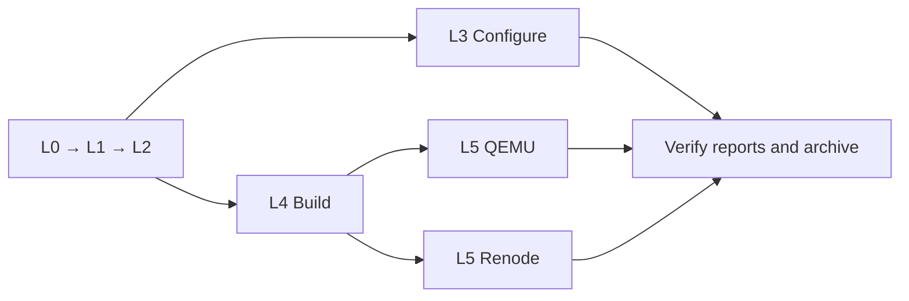

# Local L0–L5 verification in Docker

[Documentation](index.md) · [HOWTO](HOWTO.md) · [Русский](../ru/local-docker-testing.md)

Technical procedure for Windows/PowerShell 7 and Docker Desktop Linux containers
(amd64). This verifies the framework, not a user's application. Level definitions:
[spec section 8.1](../TECHNICAL_SPECIFICATION.md); coverage:
[testing](testing.md) and [firmware testing](firmware-testing.md).

## Which approach to use

For a full local Windows run, put **a source snapshot and all build directories
in the same Docker volume**. Use bind mounts only to transfer an archive and
small logs. Moving only results leaves CMake/source reads across the Windows
filesystem boundary and does not reproduce the measured solution.

| Level | Action | What it establishes |
| --- | --- | --- |
| L0 | Verify pinned GCC/CMake, dependencies, QEMU/Renode | Environment, not framework behavior |
| L1 | Reference, messages, schema | Documentation/data consistency |
| L2 | Unit suite and emulator-check script tests | Python tooling logic |
| L3 | Full Configure/Generate matrix | Does not prove compilation |
| L4 | Firmware matrix, artifacts, CRC | Does not prove execution |
| L5 | The same ELFs in QEMU and Renode | Does not prove peripherals or physical boards |

Native Windows Host/TC-44 remains separate. A Linux container cannot replace
Windows encoding, path and native-tool checks.

## Comparison of the two approaches

Measured on 2026-10-02 using the CRC working tree based on main `495595c`
(changes subsequently committed as `8d3fffc`). Same tests, tool versions and
timeouts; L3 and L4 ran concurrently. These are observations on one machine,
not a general benchmark guarantee. Image preparation and snapshot transfer are
excluded from the timings.

| Check | Windows bind mounts: sources + results | Docker volume: sources + results |
| --- | ---: | ---: |
| L3, GCC 13.3.1 / CMake 3.21.7, 251 cases | 659.90 s | 26.93 s |
| L3, GCC 13.3.1 / CMake 3.28.3, 251 cases | 653.10 s | 38.30 s |
| L4, GCC 13.3.1 / CMake 3.21.7 | 916.873 s | 117.074 s |
| L4, GCC 13.3.1 / CMake 3.28.3 | 1034.117 s | 132.569 s |
| L4, GCC 14.2.1 / CMake 3.21.7 | Pair timeout at 1200 s | 94.427 s |
| Full L4, six pairs | Incomplete; not PASS | 654.329 s, 618 builds PASS |

Local evidence (ignored `build/`, not shipped with a clone):
`build/crc-layout-stage/{configure,build}` for the first attempt;
`build/crc-layout-linux/{configure,build,qemu,renode}` for the successful rerun;
`build/crc-layout-linux/full-results.tar.gz` for the complete archive (about
784 MB, 478679 entries). Result: 1506 Configure, 618 builds, 336 QEMU + 612 Renode
PASS. These counts describe that revision; lockfiles and tests define the current set.

The first attempt showed low CPU usage with slow file operations. The third
pair hit the **whole build-pair process limit** in `ci/firmware_matrix.py`
(1200 seconds). The last native profile had completed Configure, but the pair
had not finished. This was not a CRC error or the expected simulator `hang`
timeout. Simulator timeouts did not need changing. Moving the files reduced
runtime without omitting tests.

### Original approach: bind mounts

The original layout, using the variables from step 1:

```powershell
$slowRoot = Join-Path $runRoot 'bind-results'
New-Item -ItemType Directory -Force $slowRoot | Out-Null
docker run --rm --network none --mount "type=bind,source=$repoRoot,target=/workspace,readonly" --mount "type=bind,source=$slowRoot,target=/results" stm32-yml-ci:local python3 /workspace/ci/firmware_matrix.py build --output /results
```

Both directories physically reside on Windows despite their Linux paths inside
the container. This is convenient for short checks, but the full run exceeded
the limit on this machine. This command illustrates the comparison; it is not
a prerequisite for the recommended procedure.

## 1. Environment and images

Run the following from the repository root with Docker Desktop Linux containers,
Git and host Python available. Use fresh names and directories for each run:

```powershell
$runId = Get-Date -Format "yyyyMMdd-HHmmss"
$repoRoot = $PWD.Path
$runRoot = Join-Path $repoRoot "build/local-l0-l5-$runId"
$volume = "stm32-yml-local-$runId"
$exportContainer = "stm32-yml-export-$runId"
New-Item -ItemType Directory -Force $runRoot | Out-Null
```

Image preparation needs network access; tests below use `--network none`.
Pins live in `ci/dependencies.lock.json` and `ci/emulation/versions.lock.json`.
Reuse prepared images when their inputs have not changed. A local tag alone
does not prove freshness: record image IDs and verify L0.

L1/L2 need jsonschema and ruamel.yaml; the base toolchain image does not promise
these packages. Save this as `build/local-checks.Dockerfile`. It defines a local
additional image, without changing the project's main CI images:

```dockerfile
FROM stm32-yml-ci:local
RUN apt-get update && apt-get install -y --no-install-recommends python3-venv && rm -rf /var/lib/apt/lists/*
COPY ci/schema-requirements.txt /tmp/schema-requirements.txt
RUN python3 -m venv /opt/checks && /opt/checks/bin/python -m pip install --no-cache-dir -r /tmp/schema-requirements.txt
```

```powershell
docker build --platform linux/amd64 -f ci/docker/Dockerfile -t stm32-yml-ci:local .
if ($LASTEXITCODE -ne 0) { throw "Toolchain image failed" }
docker build --platform linux/amd64 -f ci/emulation/Dockerfile -t stm32-yml-emulation:local .
if ($LASTEXITCODE -ne 0) { throw "Emulator image failed" }
docker build -f build/local-checks.Dockerfile -t stm32-yml-checks:local .
if ($LASTEXITCODE -ne 0) { throw "Checks image failed" }
docker image inspect stm32-yml-ci:local stm32-yml-emulation:local stm32-yml-checks:local > "$runRoot/image-inspect.json"
```

Direct Python dependencies are pinned in `ci/schema-requirements.txt`; transitive
pip dependencies and Ubuntu packages can change when rebuilding. Record image
IDs, lockfiles and installed Python packages for repeatability.

## 2. Capture the working tree

Save the Python snippet as `build/make-local-snapshot.py`. It includes uncommitted
changes and new non-ignored files; the repository already ignores `build/`.
Deleted files remain absent in the snapshot. Do not edit files during capture.

```python
from pathlib import Path
import hashlib, json, subprocess, sys, tarfile

root = Path.cwd()
output = Path(sys.argv[1])
# This recipe targets a normal checkout, not a linked Git worktree.
if not (root / '.git').is_dir():
    raise SystemExit('Use a normal checkout with a self-contained .git directory')
names = subprocess.check_output([
    'git', 'ls-files', '-z', '--cached', '--others', '--exclude-standard'
]).decode('utf-8').split('\0')
files = sorted({name for name in names if name and (root / name).is_file()})
if any((root / name).is_symlink() for name in files):
    raise SystemExit('Materialize symlinks before using this snapshot recipe')
manifest = {
    'head': subprocess.check_output(['git', 'rev-parse', 'HEAD'], text=True).strip(),
    'status': subprocess.check_output(['git', 'status', '--porcelain'], text=True),
    'files': {name: hashlib.sha256((root / name).read_bytes()).hexdigest() for name in files},
}
with tarfile.open(output / 'source.tar', 'w') as archive:
    for name in files:
        archive.add(root / name, arcname=name, recursive=False)
    archive.add(root / '.git', arcname='.git')
manifest['archive_sha256'] = hashlib.sha256((output / 'source.tar').read_bytes()).hexdigest()
(output / 'source-manifest.json').write_text(json.dumps(manifest, indent=2) + '\n', encoding='utf-8')
```

This recipe requires an ordinary checkout with a `.git` directory and no symlinks.
For a linked worktree/submodules, prepare a self-contained checkout first:
copying a `.git` file would retain references to Windows paths. External SDKs
come from the pinned image's `/opt`, not neighboring user projects.
`git archive HEAD` cannot replace this snapshot because it omits working changes.

## 3. Load the volume and capture logs

```powershell
python build/make-local-snapshot.py "$runRoot"
if ($LASTEXITCODE -ne 0) { throw "Snapshot failed" }
docker volume create $volume
if ($LASTEXITCODE -ne 0) { throw "Volume creation failed" }
$containerArgs = @('run', '--rm', '--network', 'none',
    '--mount', "type=volume,source=$volume,target=/work",
    '--mount', "type=bind,source=$runRoot/source.tar,target=/snapshot.tar,readonly",
    '--workdir', '/work/source')
function Invoke-LocalCheck {
    param([string]$Name, [string]$Image, [string[]]$Command)
    & docker @containerArgs $Image @Command 2>&1 | Tee-Object -FilePath "$runRoot/$Name.log"
    if ($LASTEXITCODE -ne 0) { throw "$Name failed (exit $LASTEXITCODE)" }
}
Invoke-LocalCheck 'snapshot' 'stm32-yml-ci:local' @('python3', '-c', "import tarfile; tarfile.open('/snapshot.tar').extractall('/work/source', filter='data')")
```

The helper stops the sequence on nonzero exit codes. This matters in unattended
PowerShell scripts, which do not always stop after a native-command error.
The archive mount is read-only; sources reside at `/work/source` and results
at `/work/results` inside the volume. `.git` supplies real version/dirty metadata;
no commits are created inside the container.

## 4. L0–L2

```powershell
Invoke-LocalCheck 'L0-tools' 'stm32-yml-ci:local' @()
Invoke-LocalCheck 'L0-emulators' 'stm32-yml-emulation:local' @()
```

```powershell
Invoke-LocalCheck 'L1-reference' 'stm32-yml-checks:local' @('/opt/checks/bin/python', 'ci/check_reference.py')
Invoke-LocalCheck 'L1-messages' 'stm32-yml-checks:local' @('/opt/checks/bin/python', 'ci/check_messages.py')
Invoke-LocalCheck 'L1-schema' 'stm32-yml-checks:local' @('/opt/checks/bin/python', 'ci/check_schema.py')
Invoke-LocalCheck 'L2-unit' 'stm32-yml-checks:local' @('/opt/checks/bin/python', '-m', 'unittest', 'discover', '-s', 'tests', '-p', 'test_*.py')
Invoke-LocalCheck 'L2-emulation' 'stm32-yml-checks:local' @('/opt/checks/bin/python', '-m', 'unittest', 'discover', '-s', 'ci/emulation', '-p', 'test_*.py')
```

Record Python packages through the same helper:

```powershell
Invoke-LocalCheck 'python-packages' 'stm32-yml-checks:local' @('/opt/checks/bin/python', '-m', 'pip', 'freeze')
```

If the technical specification changed, also run the embedded-tech-spec strict
validator according to [maintenance](maintenance.md). Its code is not bundled
in the project image; `check_reference.py` does not substitute for it.

## 5. L3–L5

Straightforward sequential procedure, with the complete matrix:

```powershell
Invoke-LocalCheck 'L3-configure' 'stm32-yml-ci:local' @('python3', 'ci/run_configure_tests.py', '--output', '/work/results/configure')
Invoke-LocalCheck 'L4-build' 'stm32-yml-ci:local' @('python3', 'ci/firmware_matrix.py', 'build', '--output', '/work/results/build')
Invoke-LocalCheck 'L5-qemu' 'stm32-yml-emulation:local' @('python3', 'ci/firmware_matrix.py', 'run', '--build', '/work/results/build', '--output', '/work/results/qemu')
Invoke-LocalCheck 'L5-renode' 'stm32-yml-emulation:local' @('python3', 'ci/firmware_matrix.py', 'run', '--emulator', 'renode', '--build', '/work/results/build', '--output', '/work/results/renode')
```

The matrix selects all lockfile pairs. Do not pass `--gcc-version` for full
acceptance. L5 reads a successful build manifest and uses those same ELFs;
never substitute a partial set or edit report status to bypass validation.
Renode defaults to batch mode: one process per tool pair, clearing state between
cases. Both simulators run in the separate emulator image.

## Fastest tested execution order

Use the same volume with these independent processes:



After L2, run the L3 and L4 commands in separate terminals with **identical**
`$volume`, `$runRoot`, `$containerArgs` and `Invoke-LocalCheck` definitions.
Do not recreate or re-extract the snapshot. Once L4 passes, similarly run QEMU
and Renode concurrently, each using its own result directory. Wait for every
process before export/cleanup. Prefer sequential execution with limited RAM
or other machine load; the main measured gain came from the volume itself.
Never run two commands against the same output directory.

## 6. Acceptance criteria

| Level | Evidence |
| --- | --- |
| L0–L2 | Exit code 0, command logs, unit counts/skips/errors |
| L3 | `/work/results/configure/summary.json`: every expected pair, returncode 0; CTest logs |
| L4 | `build/matrix-summary.json`: passed, all pairs; their build-summary.json files |
| L5 | `qemu/matrix-summary.json` and `renode/matrix-summary.json`: passed, all expected pairs/cases |

A matrix initially writes `status: failed` and changes it only on completion:
that intermediate file is not a final verdict. Missing reports, unfinished
processes or absent pairs do not establish PASS. Nonzero guest exits can be
expected in negative tests; runners evaluate the scenario contract, metadata
and timeout rather than a single stdout line.

Compare the snapshot manifest against the current file set and SHA-256 values,
and HEAD against the commit being accepted. Code changes after capture require
rerunning affected levels. Before release, run full acceptance on the final
signed SHA and verify CI for that same SHA, as required by maintenance.
The owner performs commits, push and land.

## 7. Export and cleanup

Archive results inside the container instead of copying hundreds of thousands
of small files to Windows. The export container intentionally omits `--rm` so
the archive can be copied after it exits. Preserve reports on test failure too.

```powershell
docker run --name $exportContainer --network none --mount "type=volume,source=$volume,target=/work,readonly" stm32-yml-ci:local tar -czf /tmp/results.tar.gz -C /work results
if ($LASTEXITCODE -ne 0) { throw "Archive failed; keep the volume" }
docker cp "${exportContainer}:/tmp/results.tar.gz" "$runRoot/results.tar.gz"
if ($LASTEXITCODE -ne 0) { throw "Copy failed; keep container and volume" }
Get-FileHash "$runRoot/results.tar.gz" -Algorithm SHA256 | Format-List | Out-File "$runRoot/results.sha256.txt"
python -c "import gzip,sys; f=gzip.open(sys.argv[1],'rb'); [None for _ in iter(lambda:f.read(1024*1024),b'')]; f.close()" "$runRoot/results.tar.gz"
if ($LASTEXITCODE -ne 0) { throw "Invalid archive; keep container and volume" }
```

Keep the result archive, source.tar, source-manifest.json, image-inspect.json,
L0–L2 logs and Python package list together. Inspect final JSON reports inside
the archive, not just gzip integrity. It includes ELFs and complete logs; extract
small summaries separately if needed. Remove only this run's volume/container,
after all processes finish and exported evidence has been checked.

Only after checking the exported evidence, perform cleanup:

```powershell
docker rm $exportContainer
docker volume rm $volume
```
