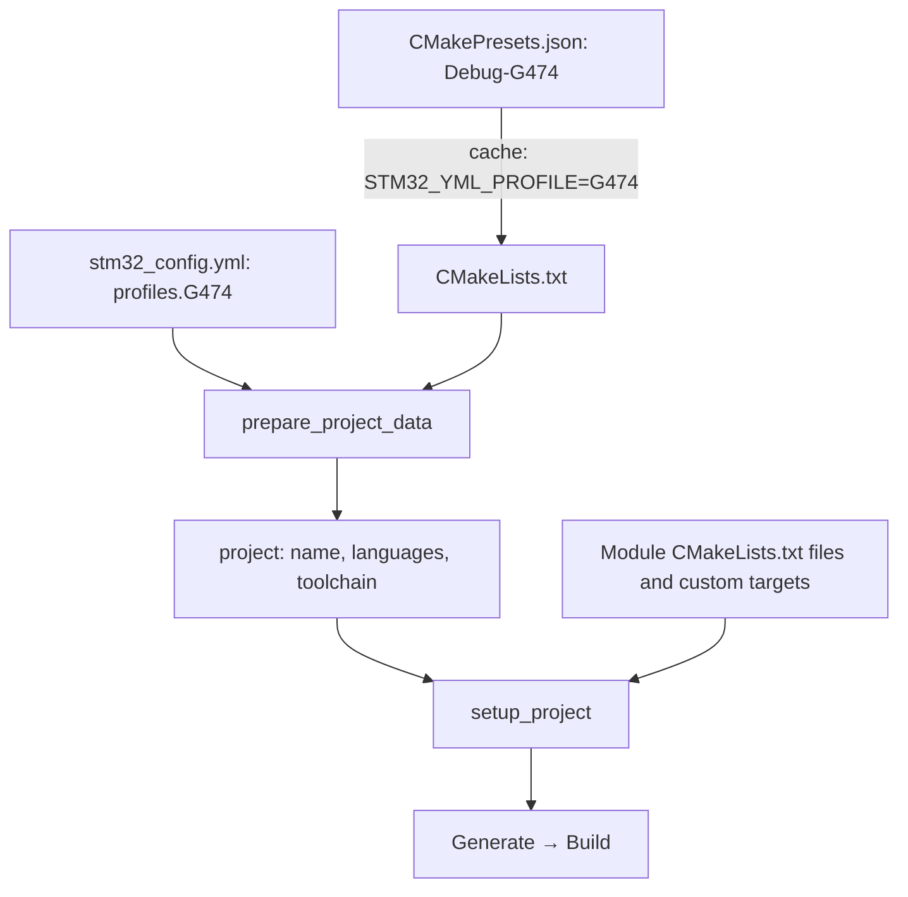

# CMakePresets together with stm32_config.yml

[Documentation](index.md) · [Русский](../ru/presets.md)

Documentation example for 0.10.0, based on an Arduino-backend project.
These three files illustrate integration into an existing firmware project;
they are not a standalone buildable firmware. Supply the toolchain, Arduino Core,
`Arduino/Core/CMakeLists.txt` wrapper, `app/CMakeLists.txt`, application sources
with their own `main()`, and suitable linker scripts. Product-specific settings
are omitted.

| Component | Responsibility |
| --- | --- |
| CMakePresets.json | Generator, build directory, Debug/Release, YAML file and profile selection |
| stm32_config.yml | MCU, backend, sources, libraries, linker script and artifacts |
| CMakeLists.txt | Toolchain before project(), framework integration, custom targets and extensions |
| Module CMakeLists.txt files | Library implementation, source selection and board-specific details |



## Three connected files

### CMakePresets.json

```json
{
  "version": 3,
  "cmakeMinimumRequired": {
    "major": 3,
    "minor": 21,
    "patch": 0
  },
  "configurePresets": [
    {
      "name": "base",
      "hidden": true,
      "generator": "Ninja",
      "binaryDir": "${sourceDir}/build/${presetName}",
      "cacheVariables": {
        "PROJECT_CONFIG_FILE": "${sourceDir}/stm32_config.yml",
        "CMAKE_EXPORT_COMPILE_COMMANDS": true
      }
    },
    {
      "name": "G431",
      "hidden": true,
      "inherits": "base",
      "cacheVariables": {
        "STM32_YML_PROFILE": "G431"
      }
    },
    {
      "name": "Debug-G431",
      "inherits": "G431",
      "cacheVariables": {
        "CMAKE_BUILD_TYPE": "Debug"
      }
    },
    {
      "name": "Release-G431",
      "inherits": "G431",
      "cacheVariables": {
        "CMAKE_BUILD_TYPE": "Release"
      }
    },
    {
      "name": "G474",
      "hidden": true,
      "inherits": "base",
      "cacheVariables": {
        "STM32_YML_PROFILE": "G474"
      }
    },
    {
      "name": "Debug-G474",
      "inherits": "G474",
      "cacheVariables": {
        "CMAKE_BUILD_TYPE": "Debug"
      }
    },
    {
      "name": "Release-G474",
      "inherits": "G474",
      "cacheVariables": {
        "CMAKE_BUILD_TYPE": "Release"
      }
    }
  ],
  "buildPresets": [
    {
      "name": "Debug-G431",
      "configurePreset": "Debug-G431"
    },
    {
      "name": "Release-G431",
      "configurePreset": "Release-G431"
    },
    {
      "name": "Debug-G474",
      "configurePreset": "Debug-G474"
    },
    {
      "name": "Release-G474",
      "configurePreset": "Release-G474"
    }
  ]
}
```

### stm32_config.yml

```yaml
# Excerpt: requires the project's toolchain, wrappers, sources and linker scripts.
project_name: example_board
toolchain_backend: arduino
languages: [C, CXX, ASM]
c_standard: 17
cpp_standard: 17
sources: [app]

profiles:
  G431:
    mcu: STM32G431CB
    linker_script: resources/STM32G431XX_FLASH.ld
    arduino:
      mcu_target: G431
  G474:
    mcu: STM32G474CE
    linker_script: resources/STM32G474XX_FLASH.ld
    arduino:
      mcu_target: G474

arduino:
  core_path: modules/Arduino_Core_STM32
  core_cmake_dir: Arduino/Core
  use_core_main: false

link_libraries: [Arduino::Core, AppSettings]
build_artifacts: [bin, hex, map]
```

### CMakeLists.txt

```cmake
cmake_minimum_required(VERSION 3.21)

set(CMAKE_TOOLCHAIN_FILE
    "${CMAKE_CURRENT_SOURCE_DIR}/cmake/gcc-arm-none-eabi.cmake")
list(APPEND CMAKE_MODULE_PATH
    "${CMAKE_CURRENT_SOURCE_DIR}/modules/stm32-cmake-yml")
include(stm32_yml)

stm32_yml_prepare_project_data(PROJECT_NAME PROJECT_LANGUAGES)
project(${PROJECT_NAME} LANGUAGES ${PROJECT_LANGUAGES})

# Project-owned target referenced by YAML link_libraries.
add_library(AppSettings INTERFACE)
target_compile_definitions(AppSettings INTERFACE APP_PROTOCOL_VERSION=1)

stm32_yml_setup_project(${PROJECT_NAME})

# Optional project-specific targets and CTest registration go here.
```

## Connections to preserve

- `Debug-G474` names a CMake preset; `G474` names a YAML profile. Debug and Release
  presets share the same YAML profile. CMake `inherits` and framework `profiles`
  are independent mechanisms.
- `PROJECT_CONFIG_FILE` selects YAML explicitly; `STM32_YML_PROFILE` selects its
  profile. MCU and linker script remain in YAML, without duplication in presets.
- `CMAKE_BUILD_TYPE` selects the Ninja configuration. Common YAML settings may
  use `$<CONFIG:Debug>` and `$<CONFIG:Release>` expressions.
- Each preset has its own build directory and cache. A preset does not clear an
  existing cache. Clean the corresponding build directory or use a new one when
  changing toolchains.
- Here, `arduino.mcu_target` selects a configuration implemented by the project
  wrapper. The wrapper must support both values and supply the appropriate
  variant, startup, definitions and board flags. An MCU name alone does not
  replace this wrapper contract. Wrappers in 0.10.0 can use `Arduino::Platform`.
- `AppSettings` is created before `setup_project` because YAML references it.
  The included wrapper creates `Arduino::Core`. Custom CMake targets and modules
  remain integral parts of the project; YAML does not replace the CMake language.
- `use_core_main: false` requires an application-owned `main()` and the Arduino
  and hardware initialization needed by that application.

## Usage

From the root of the prepared project:

```sh
cmake --list-presets
cmake --preset Debug-G474
cmake --build --preset Debug-G474
cmake --preset Release-G431
cmake --build --preset Release-G431
```

Select the same Configure Preset in VS Code CMake Tools. Keep local xPack, Python,
GDB and hardware stand paths in the environment or a Git-ignored
`CMakeUserPresets.json`; compiler discovery is defined by the toolchain file.
Do not copy a Windows PATH with `;` separators into a shared Linux preset.

Hardware testing can use additional presets: a cache variable enables a project
CMake module that registers CTest tests, while `testPresets.configurePreset`
selects its build directory. A test preset does not create tests. Firmware
configuration still comes from YAML; stand configuration remains separate.

Preset format version 3 and minimum CMake 3.21 match the requirements for 0.10.0.
This is the CMake JSON format version, not the framework or YAML version.
Presets are not generated from YAML: the developer maintains both files.

Example files: [CMakePresets.json](../../examples/presets/CMakePresets.json), [stm32_config.yml](../../examples/presets/stm32_config.yml), [CMakeLists.txt](../../examples/presets/CMakeLists.txt).

See also: [Arduino](arduino.md), [JSON Schema](schema.md).
