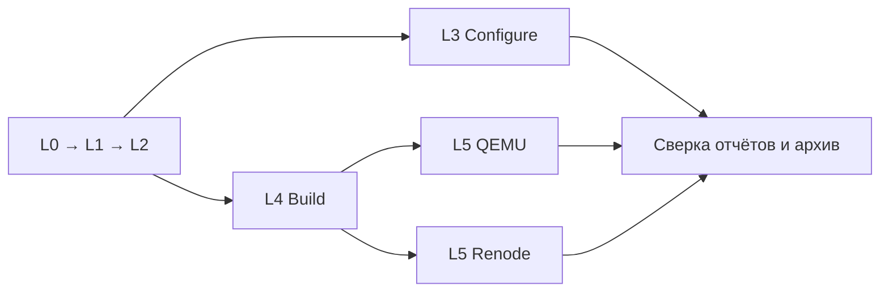

# Локальная проверка L0–L5 в Docker

[Документация](index.md) · [HOWTO](HOWTO.md) · [English](../en/local-docker-testing.md)

Технический порядок для Windows/PowerShell 7 и Docker Desktop с Linux containers
(amd64). Описывает приёмку фреймворка, а не сборку пользовательского приложения.
Определения уровней — [ТЗ, раздел 8.1](../TECHNICAL_SPECIFICATION.md), состав
проверок — [testing](testing.md) и [firmware-testing](firmware-testing.md).

## Что выбирать

Для полного локального прогона на Windows используйте **снимок исходников и
каталоги сборки в одном Docker volume**. Bind mount оставьте для передачи одного
архива и небольших журналов. Перенос только результатов в volume оставляет
чтение CMake-файлов и исходников через Windows и не повторяет найденное решение.

| Уровень | Действие | Граница результата |
| --- | --- | --- |
| L0 | Проверить закреплённые GCC/CMake, зависимости, QEMU/Renode | Окружение, не поведение фреймворка |
| L1 | Reference, каталог сообщений, схема | Согласованность документации и данных |
| L2 | Unit-набор и тесты проверяющего скрипта эмуляторов | Логика Python-инструментов |
| L3 | Полная Configure/Generate-матрица | Не доказывает сборку |
| L4 | Полная матрица сборок, артефакты, CRC | Не доказывает исполнение |
| L5 | Эти же ELF в QEMU и Renode | Не доказывает работу периферии и реальной платы |

Нативный Windows Host/TC-44 остаётся отдельной проверкой. Linux-контейнер
не проверяет Windows-кодировки, пути и запуск Windows-инструментов вместо неё.

## Сравнение двух способов

Измерено 02.10.2026 на рабочем дереве CRC-этапа от main `495595c`
(изменения затем сохранены в `8d3fffc`). Те же тесты, GCC/CMake и таймауты.
L3 и L4 шли параллельно. Это замеры одной машины, не гарантированный benchmark;
в таблице исключены подготовка образов, упаковка и копирование снимка.

| Проверка | Windows bind mount: исходники + результаты | Docker volume: исходники + результаты |
| --- | ---: | ---: |
| L3, GCC 13.3.1 / CMake 3.21.7, 251 сценарий | 659,90 с | 26,93 с |
| L3, GCC 13.3.1 / CMake 3.28.3, 251 сценарий | 653,10 с | 38,30 с |
| L4, GCC 13.3.1 / CMake 3.21.7 | 916,873 с | 117,074 с |
| L4, GCC 13.3.1 / CMake 3.28.3 | 1034,117 с | 132,569 с |
| L4, GCC 14.2.1 / CMake 3.21.7 | Общий таймаут 1200 с | 94,427 с |
| Полная L4, шесть пар | Не завершена; не считать PASS | 654,329 с, 618 сборок PASS |

Исходные локальные свидетельства (игнорируемые `build/`, не часть клона):
`build/crc-layout-stage/{configure,build}` — первый прогон;
`build/crc-layout-linux/{configure,build,qemu,renode}` — завершённый повтор;
`build/crc-layout-linux/full-results.tar.gz` — полный архив (около 784 МБ,
478679 записей). Итог: 1506 Configure, 618 сборок, 336 QEMU + 612 Renode PASS.
Числа относятся к этому состоянию; актуальный состав задают lock-файлы и тесты.

Первый прогон показал низкую загрузку CPU при медленных файловых операциях.
На третьей паре истёк **общий лимит процесса сборочной пары** в
`ci/firmware_matrix.py` (1200 с); журнал последнего native-профиля содержал
успешный Configure, но до завершения пары дело не дошло. Ошибки CRC не было.
Это отличается от ожидаемого таймаута сценария `hang` в симуляторе.
Увеличивать/уменьшать таймауты эмуляторов для исправления дискового доступа
не требуется. Ускорение получено сменой размещения файлов, без пропуска тестов.

### Первый вариант: bind mount

Для понимания исходной схемы (после объявления переменных из шага 1):

```powershell
$slowRoot = Join-Path $runRoot 'bind-results'
New-Item -ItemType Directory -Force $slowRoot | Out-Null
docker run --rm --network none --mount "type=bind,source=$repoRoot,target=/workspace,readonly" --mount "type=bind,source=$slowRoot,target=/results" stm32-yml-ci:local python3 /workspace/ci/firmware_matrix.py build --output /results
```

Оба каталога физически находятся на Windows, несмотря на Linux-пути внутри
контейнера. Этот вариант удобен для коротких проверок; для полного прогона
на этой машине он не уложился в лимит. Команда приведена для сравнения,
её не нужно выполнять перед рекомендуемым запуском.

## 1. Окружение и образы

Команды ниже выполняются из корня репозитория. Нужны Docker Desktop с Linux
containers, Git и Python на хосте. Для каждого прогона — свежие имена и каталоги:

```powershell
$runId = Get-Date -Format "yyyyMMdd-HHmmss"
$repoRoot = $PWD.Path
$runRoot = Join-Path $repoRoot "build/local-l0-l5-$runId"
$volume = "stm32-yml-local-$runId"
$exportContainer = "stm32-yml-export-$runId"
New-Item -ItemType Directory -Force $runRoot | Out-Null
```

Сборка образов требует сети; сами тесты ниже выполняются с `--network none`.
Закрепления: `ci/dependencies.lock.json`, `ci/emulation/versions.lock.json`.
Не пересобирайте готовые образы без изменения их входов; локальный тег сам по
себе не доказывает актуальность. Сохраняйте image ID и проверяйте L0.

Для L1/L2 нужны jsonschema и ruamel.yaml: базовый образ компиляторов их не
обещает. Сохраните следующий файл как `build/local-checks.Dockerfile`.
Это дополнительный локальный образ, не изменение основных образов CI:

```dockerfile
FROM stm32-yml-ci:local
RUN apt-get update && apt-get install -y --no-install-recommends python3-venv && rm -rf /var/lib/apt/lists/*
COPY ci/schema-requirements.txt /tmp/schema-requirements.txt
RUN python3 -m venv /opt/checks && /opt/checks/bin/python -m pip install --no-cache-dir -r /tmp/schema-requirements.txt
```

```powershell
docker build --platform linux/amd64 -f ci/docker/Dockerfile -t stm32-yml-ci:local .
if ($LASTEXITCODE -ne 0) { throw "Toolchain image failed" }
docker build --platform linux/amd64 -f ci/emulation/Dockerfile -t stm32-yml-emulation:local .
if ($LASTEXITCODE -ne 0) { throw "Emulator image failed" }
docker build -f build/local-checks.Dockerfile -t stm32-yml-checks:local .
if ($LASTEXITCODE -ne 0) { throw "Checks image failed" }
docker image inspect stm32-yml-ci:local stm32-yml-emulation:local stm32-yml-checks:local > "$runRoot/image-inspect.json"
```

Основные Python-пакеты закреплены в `ci/schema-requirements.txt`; транзитивные
зависимости pip и Ubuntu-пакеты могут изменяться при пересборке. Для повторяемого
прогона сохраняйте image ID, lock-файлы и список установленных Python-пакетов.

## 2. Снимок текущего дерева

Сохраните Python-фрагмент в `build/make-local-snapshot.py`. Он включает
незакоммиченные изменения и новые неигнорируемые файлы; `build/` уже игнорируется
репозиторием. Пропущенные удалённые файлы остаются удалёнными и в снимке.
Во время упаковки не редактируйте файлы.

```python
from pathlib import Path
import hashlib, json, subprocess, sys, tarfile

root = Path.cwd()
output = Path(sys.argv[1])
# This recipe targets a normal checkout, not a linked Git worktree.
if not (root / '.git').is_dir():
    raise SystemExit('Use a normal checkout with a self-contained .git directory')
names = subprocess.check_output([
    'git', 'ls-files', '-z', '--cached', '--others', '--exclude-standard'
]).decode('utf-8').split('\0')
files = sorted({name for name in names if name and (root / name).is_file()})
if any((root / name).is_symlink() for name in files):
    raise SystemExit('Materialize symlinks before using this snapshot recipe')
manifest = {
    'head': subprocess.check_output(['git', 'rev-parse', 'HEAD'], text=True).strip(),
    'status': subprocess.check_output(['git', 'status', '--porcelain'], text=True),
    'files': {name: hashlib.sha256((root / name).read_bytes()).hexdigest() for name in files},
}
with tarfile.open(output / 'source.tar', 'w') as archive:
    for name in files:
        archive.add(root / name, arcname=name, recursive=False)
    archive.add(root / '.git', arcname='.git')
manifest['archive_sha256'] = hashlib.sha256((output / 'source.tar').read_bytes()).hexdigest()
(output / 'source-manifest.json').write_text(json.dumps(manifest, indent=2) + '\n', encoding='utf-8')
```

Рецепт предназначен для обычного checkout с каталогом `.git`, без symlink.
Для linked worktree/подмодулей сначала подготовьте самостоятельный checkout:
простое копирование файла `.git` оставит ссылки на пути Windows. Внешние SDK
берутся из закреплённого образа `/opt`, не из соседних пользовательских проектов.
`git archive HEAD` здесь не заменяет снимок: оно потеряет рабочие изменения.

## 3. Загрузка в volume и запись журналов

```powershell
python build/make-local-snapshot.py "$runRoot"
if ($LASTEXITCODE -ne 0) { throw "Snapshot failed" }
docker volume create $volume
if ($LASTEXITCODE -ne 0) { throw "Volume creation failed" }
$containerArgs = @('run', '--rm', '--network', 'none',
    '--mount', "type=volume,source=$volume,target=/work",
    '--mount', "type=bind,source=$runRoot/source.tar,target=/snapshot.tar,readonly",
    '--workdir', '/work/source')
function Invoke-LocalCheck {
    param([string]$Name, [string]$Image, [string[]]$Command)
    & docker @containerArgs $Image @Command 2>&1 | Tee-Object -FilePath "$runRoot/$Name.log"
    if ($LASTEXITCODE -ne 0) { throw "$Name failed (exit $LASTEXITCODE)" }
}
Invoke-LocalCheck 'snapshot' 'stm32-yml-ci:local' @('python3', '-c', "import tarfile; tarfile.open('/snapshot.tar').extractall('/work/source', filter='data')")
```

Функция останавливает последовательность при ненулевом exit code. В
неинтерактивном скрипте это особенно важно: обычный PowerShell не всегда
прерывает выполнение после ошибки внешней команды. Архив подключён read-only;
рабочие исходники — `/work/source`, результаты — `/work/results` внутри volume.
`.git` нужна для реальной версии и dirty-статуса, а не для создания коммитов.

## 4. L0–L2

```powershell
Invoke-LocalCheck 'L0-tools' 'stm32-yml-ci:local' @()
Invoke-LocalCheck 'L0-emulators' 'stm32-yml-emulation:local' @()
```

```powershell
Invoke-LocalCheck 'L1-reference' 'stm32-yml-checks:local' @('/opt/checks/bin/python', 'ci/check_reference.py')
Invoke-LocalCheck 'L1-messages' 'stm32-yml-checks:local' @('/opt/checks/bin/python', 'ci/check_messages.py')
Invoke-LocalCheck 'L1-schema' 'stm32-yml-checks:local' @('/opt/checks/bin/python', 'ci/check_schema.py')
Invoke-LocalCheck 'L2-unit' 'stm32-yml-checks:local' @('/opt/checks/bin/python', '-m', 'unittest', 'discover', '-s', 'tests', '-p', 'test_*.py')
Invoke-LocalCheck 'L2-emulation' 'stm32-yml-checks:local' @('/opt/checks/bin/python', '-m', 'unittest', 'discover', '-s', 'ci/emulation', '-p', 'test_*.py')
```

Список пакетов можно сохранить через ту же функцию:

```powershell
Invoke-LocalCheck 'python-packages' 'stm32-yml-checks:local' @('/opt/checks/bin/python', '-m', 'pip', 'freeze')
```

Если менялось ТЗ, отдельно выполните strict-проверку навыком embedded-tech-spec
по [порядку сопровождения](maintenance.md). Его код не входит в образ проекта;
не объявляйте эту проверку выполненной по результату `check_reference.py`.

## 5. L3–L5

Прямой последовательный вариант (проще повторить; без сокращения матрицы):

```powershell
Invoke-LocalCheck 'L3-configure' 'stm32-yml-ci:local' @('python3', 'ci/run_configure_tests.py', '--output', '/work/results/configure')
Invoke-LocalCheck 'L4-build' 'stm32-yml-ci:local' @('python3', 'ci/firmware_matrix.py', 'build', '--output', '/work/results/build')
Invoke-LocalCheck 'L5-qemu' 'stm32-yml-emulation:local' @('python3', 'ci/firmware_matrix.py', 'run', '--build', '/work/results/build', '--output', '/work/results/qemu')
Invoke-LocalCheck 'L5-renode' 'stm32-yml-emulation:local' @('python3', 'ci/firmware_matrix.py', 'run', '--emulator', 'renode', '--build', '/work/results/build', '--output', '/work/results/renode')
```

Матрица выбирает все пары из lock-файла. Не задавайте `--gcc-version`, если
нужна полная приёмка. L5 читает успешный build manifest и использует те же ELF;
передавать частичный набор или подменять `status` в отчёте нельзя. Renode по
умолчанию работает пакетно: один процесс на пару инструментов с очисткой между
сценариями. QEMU и Renode запускаются из отдельного образа эмуляторов.

## Оптимальный порядок по времени

Проверенный быстрый вариант — тот же volume и следующие независимые процессы:



После L2 запустите команды L3 и L4 в двух терминалах, используя **те же** значения
`$volume`, `$runRoot`, `$containerArgs` и определение `Invoke-LocalCheck`.
Не повторяйте создание/извлечение снимка. После успеха L4 аналогично запустите
QEMU и Renode параллельно, каждый в своём каталоге. Дождитесь всех процессов
до упаковки/очистки. На малом объёме RAM или при нагрузке предпочтителен
последовательный вариант; основной измеренный выигрыш дал именно volume.
Не запускайте две команды с одним каталогом результатов.

## 6. Что считать успешным результатом

| Уровень | Свидетельство |
| --- | --- |
| L0–L2 | Exit code 0, журналы команд; число unit-тестов, skips и errors |
| L3 | `/work/results/configure/summary.json`: все ожидаемые пары, returncode 0; логи CTest |
| L4 | `build/matrix-summary.json`: status passed, все пары; их build-summary.json |
| L5 | `qemu/matrix-summary.json`, `renode/matrix-summary.json`: passed, все пары и сценарии |

Матрица сначала пишет `status: failed` и меняет его только в конце: такой
промежуточный файл не является итоговой ошибкой или успехом. Отсутствие отчёта,
незавершённый процесс или недостающая пара не дают PASS. Ненулевой код гостя
может быть ожидаемым в отрицательном тесте — решение принимает runner по
контракту сценария, метаданным и таймауту, а не по одной строке stdout.

Сверьте manifest снимка с текущим деревом (список файлов и SHA-256), а HEAD —
с коммитом, для которого заявляете результат. Изменения кода после снимка требуют
нового прогона затронутых уровней. Перед выпуском — полный прогон итогового
подписанного SHA и CI для того же SHA по maintenance. Коммиты/push/land — владелец.

## 7. Экспорт и очистка

Не копируйте сотни тысяч мелких файлов на Windows по одному: упакуйте их
внутри контейнера. Контейнер экспорта намеренно создаётся без `--rm`, чтобы
после его завершения забрать архив. При провале тестов также сохраните отчёты.

```powershell
docker run --name $exportContainer --network none --mount "type=volume,source=$volume,target=/work,readonly" stm32-yml-ci:local tar -czf /tmp/results.tar.gz -C /work results
if ($LASTEXITCODE -ne 0) { throw "Archive failed; keep the volume" }
docker cp "${exportContainer}:/tmp/results.tar.gz" "$runRoot/results.tar.gz"
if ($LASTEXITCODE -ne 0) { throw "Copy failed; keep container and volume" }
Get-FileHash "$runRoot/results.tar.gz" -Algorithm SHA256 | Format-List | Out-File "$runRoot/results.sha256.txt"
python -c "import gzip,sys; f=gzip.open(sys.argv[1],'rb'); [None for _ in iter(lambda:f.read(1024*1024),b'')]; f.close()" "$runRoot/results.tar.gz"
if ($LASTEXITCODE -ne 0) { throw "Invalid archive; keep container and volume" }
```

Сохраняйте вместе архив результатов, `source.tar`, `source-manifest.json`,
image-inspect.json, журналы L0–L2 и список Python-пакетов. Проверьте внутри архива
итоговые JSON, а не только целостность gzip. В нём сохранены ELF и полные логи;
краткие отчёты можно извлечь отдельно. Удаляйте только volume/контейнер этого
прогона, после завершения всех процессов и проверки сохранённых материалов.

Только после проверки сохранённых материалов выполните очистку:

```powershell
docker rm $exportContainer
docker volume rm $volume
```
