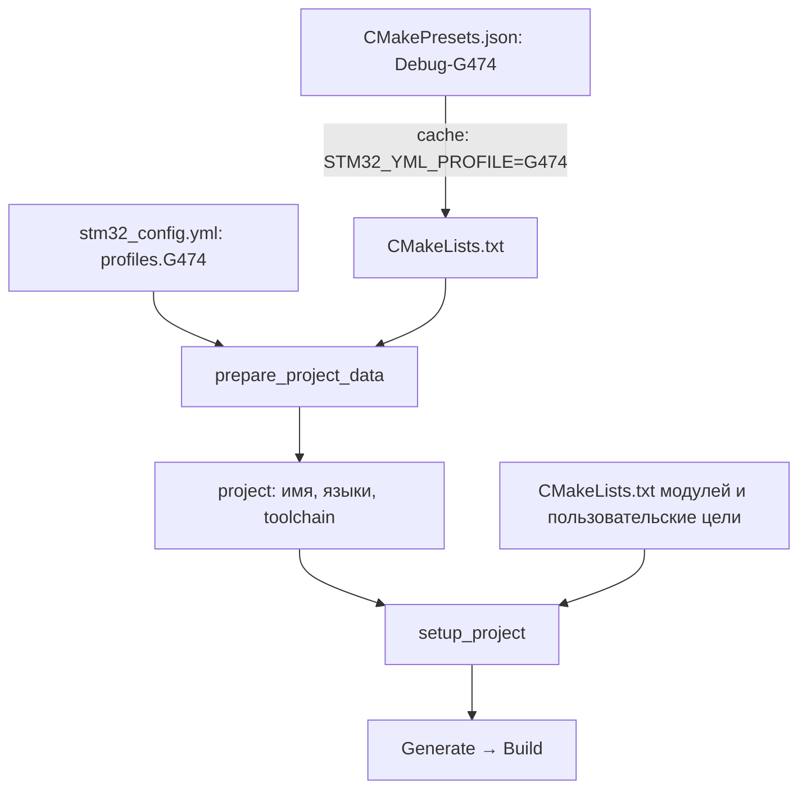

# CMakePresets вместе со stm32_config.yml

[Документация](index.md) · [English](../en/presets.md)

Пример для документации 0.10.0, по мотивам проекта с Arduino backend.
Это схема подключения к существующей прошивке: три файла не составляют
самостоятельный проект для сборки. Нужны toolchain, Arduino Core, обёртка
`Arduino/Core/CMakeLists.txt`, модуль `app/CMakeLists.txt`, исходники с собственной
`main()` и подходящие скрипты компоновщика. Настройки конкретного изделия опущены.

| Компонент | Ответственность |
| --- | --- |
| CMakePresets.json | Генератор, каталог сборки, Debug/Release, выбор YAML и его профиля |
| stm32_config.yml | MCU, backend, исходники, библиотеки, linker script, артефакты |
| CMakeLists.txt | Toolchain до project(), подключение фреймворка, пользовательские цели и расширения |
| CMakeLists.txt модулей | Реализация библиотек, подбор файлов и особенности конкретной платы |



## Три связанных файла

### CMakePresets.json

```json
{
  "version": 3,
  "cmakeMinimumRequired": {
    "major": 3,
    "minor": 21,
    "patch": 0
  },
  "configurePresets": [
    {
      "name": "base",
      "hidden": true,
      "generator": "Ninja",
      "binaryDir": "${sourceDir}/build/${presetName}",
      "cacheVariables": {
        "PROJECT_CONFIG_FILE": "${sourceDir}/stm32_config.yml",
        "CMAKE_EXPORT_COMPILE_COMMANDS": true
      }
    },
    {
      "name": "G431",
      "hidden": true,
      "inherits": "base",
      "cacheVariables": {
        "STM32_YML_PROFILE": "G431"
      }
    },
    {
      "name": "Debug-G431",
      "inherits": "G431",
      "cacheVariables": {
        "CMAKE_BUILD_TYPE": "Debug"
      }
    },
    {
      "name": "Release-G431",
      "inherits": "G431",
      "cacheVariables": {
        "CMAKE_BUILD_TYPE": "Release"
      }
    },
    {
      "name": "G474",
      "hidden": true,
      "inherits": "base",
      "cacheVariables": {
        "STM32_YML_PROFILE": "G474"
      }
    },
    {
      "name": "Debug-G474",
      "inherits": "G474",
      "cacheVariables": {
        "CMAKE_BUILD_TYPE": "Debug"
      }
    },
    {
      "name": "Release-G474",
      "inherits": "G474",
      "cacheVariables": {
        "CMAKE_BUILD_TYPE": "Release"
      }
    }
  ],
  "buildPresets": [
    {
      "name": "Debug-G431",
      "configurePreset": "Debug-G431"
    },
    {
      "name": "Release-G431",
      "configurePreset": "Release-G431"
    },
    {
      "name": "Debug-G474",
      "configurePreset": "Debug-G474"
    },
    {
      "name": "Release-G474",
      "configurePreset": "Release-G474"
    }
  ]
}
```

### stm32_config.yml

```yaml
# Excerpt: requires the project's toolchain, wrappers, sources and linker scripts.
project_name: example_board
toolchain_backend: arduino
languages: [C, CXX, ASM]
c_standard: 17
cpp_standard: 17
sources: [app]

profiles:
  G431:
    mcu: STM32G431CB
    linker_script: resources/STM32G431XX_FLASH.ld
    arduino:
      mcu_target: G431
  G474:
    mcu: STM32G474CE
    linker_script: resources/STM32G474XX_FLASH.ld
    arduino:
      mcu_target: G474

arduino:
  core_path: modules/Arduino_Core_STM32
  core_cmake_dir: Arduino/Core
  use_core_main: false

link_libraries: [Arduino::Core, AppSettings]
build_artifacts: [bin, hex, map]
```

### CMakeLists.txt

```cmake
cmake_minimum_required(VERSION 3.21)

set(CMAKE_TOOLCHAIN_FILE
    "${CMAKE_CURRENT_SOURCE_DIR}/cmake/gcc-arm-none-eabi.cmake")
list(APPEND CMAKE_MODULE_PATH
    "${CMAKE_CURRENT_SOURCE_DIR}/modules/stm32-cmake-yml")
include(stm32_yml)

stm32_yml_prepare_project_data(PROJECT_NAME PROJECT_LANGUAGES)
project(${PROJECT_NAME} LANGUAGES ${PROJECT_LANGUAGES})

# Project-owned target referenced by YAML link_libraries.
add_library(AppSettings INTERFACE)
target_compile_definitions(AppSettings INTERFACE APP_PROTOCOL_VERSION=1)

stm32_yml_setup_project(${PROJECT_NAME})

# Optional project-specific targets and CTest registration go here.
```

## Связи, которые важно сохранить

- `Debug-G474` — имя пресета CMake; `G474` — имя профиля YAML. Один профиль
  используют разные пресеты Debug/Release. Их наследование независимо:
  `inherits` объединяет пресеты CMake, а `profiles` обрабатывает фреймворк.
- `PROJECT_CONFIG_FILE` явно выбирает YAML; `STM32_YML_PROFILE` выбирает в нём
  профиль. MCU и linker script остаются в YAML и не дублируются в пресетах.
- `CMAKE_BUILD_TYPE` управляет конфигурацией Ninja. Для общих настроек YAML
  можно использовать выражения `$<CONFIG:Debug>` и `$<CONFIG:Release>`.
- Каждый пресет имеет свой build-каталог, поэтому кэши профилей не смешиваются.
  Пресет не очищает старый кэш автоматически. При смене toolchain очищайте
  соответствующий каталог сборки или используйте новый.
- `arduino.mcu_target` в этом примере передаёт выбор пользовательской обёртке.
  Обёртка должна поддерживать оба значения и обеспечить нужные variant, startup,
  определения и флаги платы. Это контракт обёртки, а не замена настроек Arduino
  одним именем MCU. Обёртки 0.10.0 могут использовать `Arduino::Platform`.
- `AppSettings` создаётся до `setup_project`, поскольку YAML ссылается на неё.
  `Arduino::Core` создаётся подключаемой обёрткой. Собственные цели и CMake-модули
  остаются полноценной частью проекта; YAML не заменяет язык CMake.
- `use_core_main: false` означает собственную `main()`. Необходимую инициализацию
  Arduino и оборудования обеспечивает приложение.

## Использование

Из корня подготовленного проекта:

```sh
cmake --list-presets
cmake --preset Debug-G474
cmake --build --preset Debug-G474
cmake --preset Release-G431
cmake --build --preset Release-G431
```

Для VS Code выбирается тот же Configure Preset через CMake Tools. Пути к локальному
xPack, Python, GDB и стенду задавайте в окружении или `CMakeUserPresets.json`,
исключённом из Git; способ поиска компилятора определяется toolchain-файлом.
Не переносите Windows PATH с разделителем `;` в общий пресет для Linux.

Аппаратные тесты можно добавить отдельными пресетами: cache-переменная включает
проектный CMake-модуль с регистрацией CTest, а `testPresets.configurePreset`
выбирает его build-каталог. Test preset сам тестов не создаёт. Конфигурация
прошивки по-прежнему выбирается через YAML, параметры стенда остаются отдельно.

Формат пресетов version 3 и минимальный CMake 3.21 согласованы с требованиями
0.10.0. Это версия JSON-формата CMake, не версия фреймворка и не версия YAML.
Генерация пресетов из YAML не требуется: оба файла поддерживаются разработчиком.

Файлы примера: [CMakePresets.json](../../examples/presets/CMakePresets.json), [stm32_config.yml](../../examples/presets/stm32_config.yml), [CMakeLists.txt](../../examples/presets/CMakeLists.txt).

Далее: [Arduino](arduino.md), [JSON Schema](schema.md).
